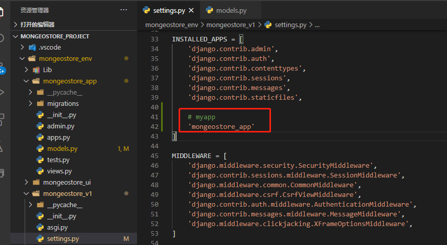

# 系统设计

## 一、Django搭建后端

### 1. 安装Django

```
#创建虚拟环境
virtualenv mongeostore_env

#激活虚拟环境,先切换到目录
cd mongeostore_env

.\Scripts\activate

#安装Django
pip install django
```

### 2. Django中创建项目

- 注意：创建应用必须先进入虚拟环境

```
 django-admin startproject mongeostore_v1
 
 # 补充,最好加个点，不然会在创建一个目录
 django-admin startproject mongeostore_v1 .
  
```


```
项目目录说明：

__init__.py: 说明test1是一个python包。

settings.py: 项目的配置文件。

urls.py: 进行url路由的配置。

wsgi.py:  web服务器和Django交互的入口。

manage.py:  项目的管理文件。
```

###  3. 运行即可

```
python manage.py runserver
```


## 4.创建应用

```
python manage.py startapp mongeostore_app
```

- 在settings.py中添加应用




## 二、Vue搭建前端

- 安装
  - webpack——打包工具
  - Element——前端框架
  - axios

## 1. 创建项目

- 使用Vue-CLI3搭建

```
vue create mongeostore_ui
```


## 2.启动

```
 $ cd mongeostore_ui
 $ npm run serve
```

