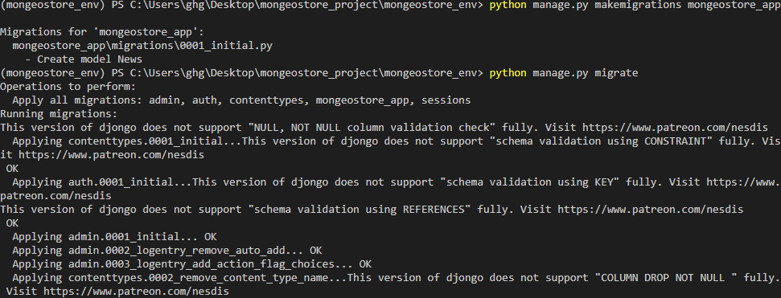
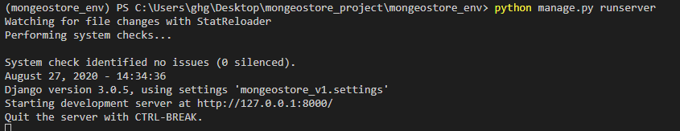
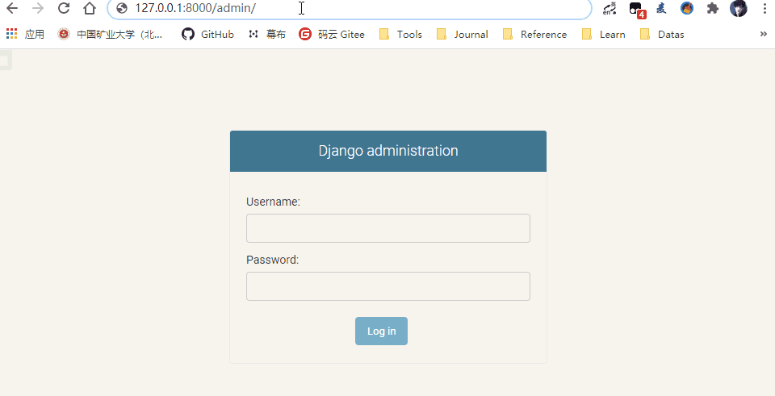

# Django默认数据库切换为MongoDB

[TOC]


- 序列化

## 前言

**记得激活虚拟环境**

```
#激活虚拟环境,先切换到目录
cd mongeostore_env

.\Scripts\activate
```


## 0、借助第三方模块djongo

**借助Djongo，在Django中使用MongoDB数据库**

- Django框架为我们提供了简洁方便的ORM模型供我们对数据库进行各种操作，但是这个“数据库”却并不包括NoSQL的典型——[MongoDB](https://cloud.tencent.com/product/mongodb?from=10680)。

- 随着互联网产业的发展，MongoDB数据库的应用越来越广泛，但是Django默认的ORM模型不支持MongoDB很是让人为难。不少Django初学者也会到处询问，如何才能在Django中使用MongoDB。

- 借助第三方模块——Djongo来在Django中集成MongoDB数据库。

 **安装与配置**

- Djongo的项目官方地址为：https://github.com/nesdis/djongo，通过pip命令直接安装djongo：

```
pip install djongo
```

- 安装完成之后，可以直接在Django中配置MongoDB数据库的信息了。


## 1、数据库设置

系统使用MongoDB数据库，所以将Django默认的数据库更改为MongoDB数据库

默认数据库设置`settings.py`,如图


使用Djongo设置mongodb数据库信息，如下所示:

```python
DATABASES = {
    'default': {
        # 'ENGINE': 'django.db.backends.sqlite3',
        # 'NAME': BASE_DIR / 'db.sqlite3',

        # 使用djongo设置mongodb
        'ENGINE': 'djongo',
        'NAME': 'django_example',
        'CLIENT': {
            'host': '192.168.55.110:27017',
        }
    }
}
```


## 2、定义模型

- Djongo的一大特点是可以无缝地衔接Django的ORM语法，包括模型定义的语法和模型操作的语法。现在，我们就为Django项目定义一些模型。

- 在默认情况下，Django应用的模型在其目录下的models.py文件中定义。models.py文件初始化状态下只有如下一行代码：

```
from django.db import models
```

- 这是Django数据库封装的模型类，我们需要将其修改为Djongo提供的模型类，如下所示：

```
from djongo import models
```

- 按照Django的方式来定义模型了。在这里，我们定义了一个News()模型，用于存储测线：

```python
class News(models.Model):
    title = models.CharField(verbose_name="采集点",max_length=50)
    author = models.CharField(verbose_name="记录人员",max_length=10)
    desc = models.CharField(verbose_name="简介",max_length=100)
    content = models.TextField(verbose_name="描述")
    create_time = models.DateTimeField(auto_now_add=True)
    update_time = models.DateTimeField(auto_now=True)

    def __str__(self):
        return self.title

    class Meta:
        verbose_name = '测线'
        verbose_name_plural = verbose_name
```

## 3、生成模型

定义好模型之后，继续按照Django模型的使用方式，生成数据库迁移，并执行迁移：

```shell
python manage.py makemigrations mongeostore_app
python manage.py migrate
```



Django为新项目创建了我们定义的模型还有一些认证管理相关的表，这是否是真的呢，我们去MongoDB数据库里面查看一下：


MongoDB数据库里面果然生成了一系列的数据表。


## 4.使用Django Admin

借助于Djongo模块，我们可以方便地以Django ORM的方式来使用MongoDB数据库。那么作为Django重量级的admin后台功能，是否能够支持呢？

1.首先，继续在命令行中创建一个超级用户：

```
python manage.py createsuperuser
```


2.将刚刚创建的News()模型添加到admin中，在admin.py中进行设置：

```python
from app.models import News
admin.site.register(News)
```

3.随后，运行测试服务器

```
python manage.py runserver
```



我们顺利地访问了首页，顺利地访问了后台页面、并且顺利地登录了进去：

http://127.0.0.1:8000/admin/




## 5.数据操作

对数据操纵是否方便。我们先在后台界面尝试一下新增数据：


显示新增成功了，我们去MongoDB里面看看是否存在：


参考：

djongo项目官网:https://nesdis.github.io/djongo/

GitHub项目地址:https://github.com/nesdis/djongo/

https://cloud.tencent.com/developer/article/1541782

