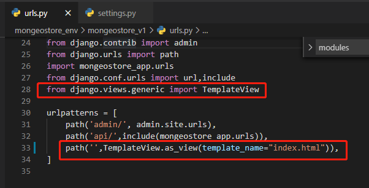
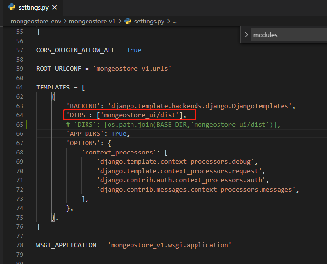
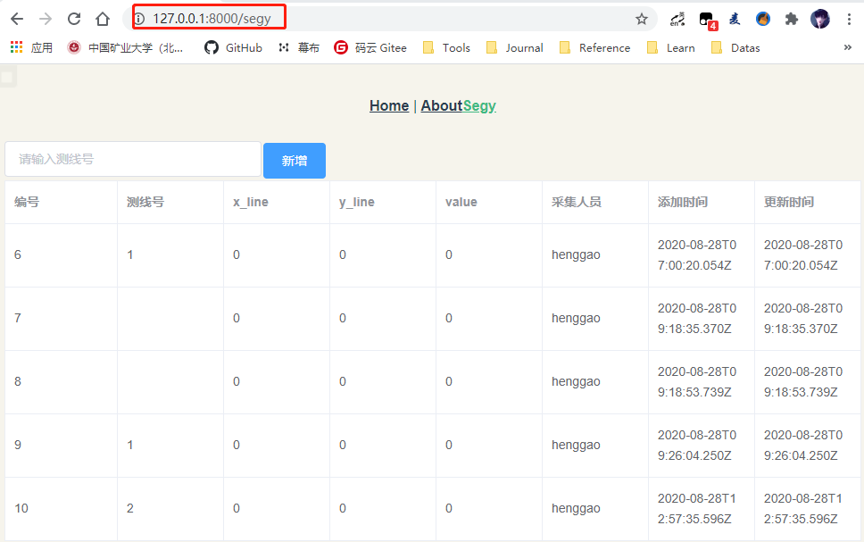

# 整合Django和Vue.js

[TOC]

目前,我们已经分别完成了Django后端和Vue.js前端工程的创建和编写，但实际上它们是运行在各自的服务器上，和我们的要求是不一致的。因此我们须要把Django的TemplateView指向我们刚才生成的前端dist文件即可。


1、 找到mongoestore_v1目录的urls.py，使用通用视图创建最简单的模板控制器，访问 『/』时直接返回 index.html:

```
urlpatterns = [
    path('admin/', admin.site.urls),
    path('api/',include(mongeostore_app.urls)),
    path('',TemplateView.as_view(template_name="index.html")),
]
```



2、 上一步使用了Django的模板系统，所以需要配置一下模板使Django知道从哪里找到index.html。在mongoestore_v1目录的settings.py下：

```
TEMPLATES = [
    {
        'BACKEND': 'django.template.backends.django.DjangoTemplates',
        'DIRS': ['mongeostore_ui/dist'],
        # 'DIRS': [os.path.join(BASE_DIR,'mongeostore_ui/dist')],
        'APP_DIRS': True,
        'OPTIONS': {
            'context_processors': [
                'django.template.context_processors.debug',
                'django.template.context_processors.request',
                'django.contrib.auth.context_processors.auth',
                'django.contrib.messages.context_processors.messages',
            ],
        },
    },
]
```



3、我们还需要配置一下静态文件的搜索路径。同样是project目录的settings.py下：

```
# Add for vuejs
STATICFILES_DIRS = [  # 添加静态文件路径
    os.path.join(BASE_DIR, "mongeostore_ui/dist/static"),
]
```


4、 配置完成，我们在project目录下输入命令`python manage.py runserver`，就能够看到我们的前端页面在浏览器上展现：



**注意服务的端口已经是Django服务的8000而不是node服务的8080了**


##  部署

由于python的跨平台特性，因此理论上只要在服务器上安装好所有的依赖，直接把项目目录拷贝到服务器上即可运行。这里只提一点：**如果为项目配置了nginx作为反向代理，那么要在nginx中配置所有的静态文件path都指向Django项目中配置的静态文件url，在settings.py中可配置url路径：**

```
# Static files (CSS, JavaScript, Images)
# https://docs.djangoproject.com/en/1.11/howto/static-files/

STATIC_URL = '/static/'
```


参考：

https://cloud.tencent.com/developer/article/1005607