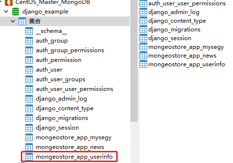
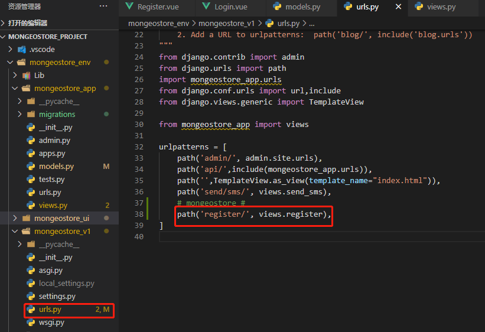

## 后端登录API

[TOC]


## 1、注册信息

### 1、添加注册信息

- model.py

```
class UserInfo(models.Model):
    username = models.CharField(verbose_name='用户名', max_length=32)
    email = models.EmailField(verbose_name='邮箱', max_length=32)
    mobile_phone = models.CharField(verbose_name='手机号', max_length=32)
    password = models.CharField(verbose_name='密码', max_length=32)
```

### 2、生成表

- 让Django迁移项目

```
python manage.py makemigrations

python manage.py migrate
```


数据库查看，已经生成了对应的信息。



### 3、修改urls.py

```
path('register/', views.register),
```




### 4、修改views.py