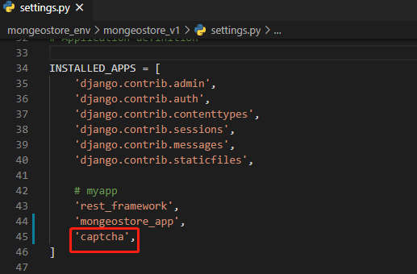

[TOC]

## 一. 图片验证码

- 使用插件 django-simple-captcha
- 开源地址: https://github.com/mbi/django-simple-captcha
- 官方文档: http://django-simple-captcha.readthedocs.io/en/latest/usage.html#installation

## 1、安装captcha

```
pip install django-simple-captcha
```


## 2、注册captcha

在`settings.py`中，将‘captcha’注册到app列表里：



captcha需要在数据库中建立自己的数据表，所以需要执行migrate命令生成数据表：

```
python manage.py migrate
```


## 3、添加url路由

在根目录下的uls.py文件中添加captcha对应url：

```
urlpatterns = [
    path('captcha/', include('captcha.urls'))   # 增加这一行
]
```


## 4、修改forms.py