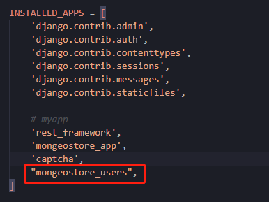

# Mongeostore_users

[TOC]

## 1. 创建Mongeostore_users

对项目进行重建，将用户注册、登录信息放在一个app下。

```
#切换到虚拟目录
cd .\mongeostore_env\

#启动虚拟环境
.\Scripts\activate

#Django中创建项目
django-admin startproject mongeostore_v1

#创建app
python manage.py  startapp mongeostore_users
```

- 在settings.py中添加应用

  


## 2、设计

| 文件名         | 别名         | 作用                                                     |
| -------------- | ------------ | -------------------------------------------------------- |
| models.py      | 创建用户模型 | userInfo(models.Model)<br />userInfo(abstractuser)<br /> |
| serializers.py | 序列化       | 1.完成users模型序列化<br />2.完成注册、登录信息校验      |
| views.py       | 视图         | 模型视图                                                 |
| urlls.py       | 子路由       | 分发访问路径                                             |

- 在mogeostore_users目录下新建
  - serializers.py
  - urls.py


## 3、创建Models

在models.py中创建users