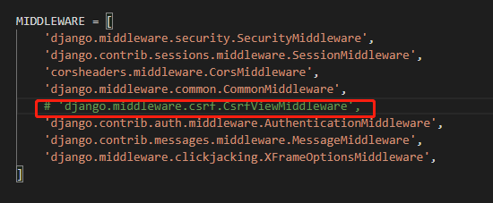
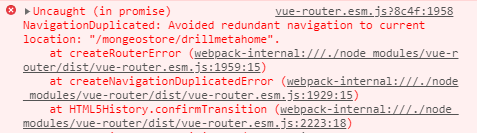

# 报错集合

[TOC]


## 1、运行`npm run server`，报错如下

```
Error from chokidar (C:\): Error: EBUSY: resource busy or locked, lstat 'C:\hiberfil.sys'
Error from chokidar (C:\): Error: EBUSY: resource busy or locked, lstat 'C:\pagefile.sys'
Error from chokidar (C:\): Error: EBUSY: resource busy or locked, lstat 'C:\swapfile.sys'
```

## 2、npm 报错This is probably not a problem with npm. There is likely additional logging output above.

- 上述两种问题都可以用如下方法解决：

```
#1、删除 node_modules、package-lock.json

#2、清理缓存
npm cache clean --force

#3、重新安装
npm i

#4、重新运行就OK了
```

## 3、Django post请求403 (Forbidden)

axios post请求跨域403以及传参问题

```
Forbidden (CSRF cookie not set.)
```


- 刚开始以为是POST发送请求传输JSON数据格式导致的问题，

  - 注：浏览器跨域并不支持application/json的Content-Type，即使后台设置了允许的跨域头部参数，依然会报错。

    参考：https://blog.csdn.net/weixin_41829196/article/details/85986331

- 后来确认没问题，发现是Django在处理post请求时多次出现403错误。

  - 解决方法一

    - 简单暴力，注释掉`setting.py`中的csrf拦截

    - 缺点：导致Django项目完全无法防止csrf攻击。（我采用了这种方法）

      

    

  - 解决方法二

    - 在 `views.py`文件中，使用@csrf_exempt装饰器，避开CsrfViewMiddleware的检测

    - 缺点：导致此次请求无法防止csrf攻击，但是比第一种好很多。

      ```python
      #导入,可以使此次请求忽略csrf校验
      from django.views.decorators.csrf import csrf_exempt
      
      #在处理函数加此装饰器即可
      @csrf_exempt
      def post(request):
           name=request.post['name']
           return HttpResponse('welcome!{}'.format(name))
      ```

      

  - 解决方法三

    - 对使用模版进行开发的MTV模式,在模版文件提交form表单代码中添加csrf ****

      ```html
      <body>
          <h1>尚未登录，请登录：</h1>
          <form action="" method="POST">
              
              用户名：<input type="text" name="username" /><br />
              密码：<input type="password" name="password" /><br />
              <input type="submit" value="登录" name="login"/>
              <a href="/reg/">注册</a>
          </form>
      </body>
      
      ```

      

  - 解决方法四

    - django的csrf安全工作顺序是：先从后台获取csrf_token 并发送给前端，然后前端在进行form表单提交时，把带有名为csrfmiddlewaretoken，值为 csrf_token 的字段一起发送给后端进行校验。
    - 此解决方案便是按照此逻辑，先通过一个接口获取 csrf_token，然后在form表单中一起提交给后端校验

    ```python
    from django.template.context_processors import csrf
    
    def get_csrf(request):
            #生成 csrf 数据，发送给前端
        x = csrf(request)
        csrf_token = x['csrf_token']
        return HttpResponse('{} ; {}'.format(str(re), csrf_token))
    
    ```

    

  - 参考

    - [参考一](https://blog.csdn.net/u010098760/article/details/100920946?utm_medium=distribute.pc_relevant.none-task-blog-BlogCommendFromMachineLearnPai2-1.edu_weight&depth_1-utm_source=distribute.pc_relevant.none-task-blog-BlogCommendFromMachineLearnPai2-1.edu_weight)
    - [参考二](https://blog.csdn.net/weixin_34050519/article/details/93235772?utm_medium=distribute.pc_relevant.none-task-blog-BlogCommendFromMachineLearnPai2-1.edu_weight&depth_1-utm_source=distribute.pc_relevant.none-task-blog-BlogCommendFromMachineLearnPai2-1.edu_weight)

    


## 4、axios 使用post方式传递参数，后端接受不到

- params是添加到url的请求字符串中的，用于get请求。
- data是添加到请求体（body）中的， 用于post请求。
- `get`请求是发送参数，在`params`中定义。而`POST`请求是发送`request body`,需要在`data`中定义
- 解决，引入qs

```
import qs from "qs";
```

```
let postData = qs.stringify({
        "username":this.Register.username,
        "email":this.Register.email,
        "password":this.Register.password,
        "mobile":this.Register.mobile,
        "smscode":this.Register.smscode,
      })
```

```
 const url = `http://127.0.0.1:8000/api/register/`;
 axios
 .post(
 url,
 {
 // params: userInfo,
 data: postData
 },
 {
 headers: { "Content-Type": "application/x-www-form-urlencoded" }
 }
 )
 .then(res => {

});
```

- 这里又遇到一个很奇怪的问题，就是第一个参数传过去是None。我额外添加了一个参数，用来解决None，以后发现根本再来补充。

```
 let postData = qs.stringify({
        first: 1, //用于解决第一个参数为None设置的无用参数，现在我还不知道为什么，但这样可以解决，以后发现根本再来补充
        username: this.Register.username,
        email: this.Register.email,
        password: this.Register.password,
        mobile: this.Register.mobile,
        smscode: this.Register.smscode
      });
```


- 参考：https://segmentfault.com/a/1190000012635783


## 5、element_ui 表单验证 this.$refs[formName].validate()里面的内容不执行

- 在自定义验证里面每一个判断都要有callback(),就是要保证最后执行到的是callback()

参考：

https://segmentfault.com/q/1010000009679079


## 6、400	


## 7、403


## 8、405错误

**原因**

- Apache、IIS、Nginx等绝大多数web服务器，都不允许静态文件响应POST请求，否则会返回“HTTP/1.1 405 Method not allowed”错误。

```
访问用post请求, 当发送的url是一个具体的资源的时候, 网站应该解析的时候把整个url当作了域名解析了.  也就是说并没有传参数给服务端, 而是直接访问服务端的具体资源, 所以要用get请求.
```

1、请求头错误，设置请求头

- 参考关于请求头

  https://juejin.im/post/6844903981291044872	

2、需要引入qs模块(我们在做post请求的时候需要用到)，参考：https://www.cnblogs.com/lalalagq/p/9917072.html

### 关于`Vue-simple-uploader`报错405

尝试一下将配置`testChunck：true`


## 9、500问题missing 1 required positional argument: 'request'

```

```


## 10、Mongoose E11000 duplicate key error index

```
pymongo.errors.DuplicateKeyError: E11000 duplicate key error collection: django_example.mongeostore_app_smscode index: __primary_key__ dup key: { id: null }
```

当我在models.py中指定短信模型的时候，再注册的时候会报这个，意思是mongodb id 重复


## 11、`Plupload`文件大小超过10 MB保存为blob文件 `(Plupload file size more than 10 mb saving as blob file)`

- 每当我尝试上传大于`10mb`的zip文件时，它不会保存为zip文件，它只是保存为blob文件。它需要保存为zip文件。

- 问题在于chunk_size。

  - 只需注释chunk_size列或用0mb'换chunk_size

  ```
  // CHUNK_SIZE： '10MB'
  # 或者
  chunk_size：'0mb'
  ```

  参考：

  http://www.yuanmacha.com/10682860126.html


## 12、后端拿不到post请求数据

- 第一种，前端处理，这样后端可以拿到值

```
import qs from "qs";

let postData = qs.stringify(row); 
```

- 第二种

  - 后端直接拿取`request.POST`或`request.body`

    ```
    all_data = request.POST
    ```

    ```
    body_data = request.body
    data_json = json.loads(body_data)
    ```

    

## 13、关于Element中label样式不起作用（scoped）

- 主要是scoped的问题，有些像 Sass 之类的预处理器无法正确解析 `>>>`。这种情况下你可以使用 `/deep/` 或 `::v-deep` 操作符取而代之——两者都是 `>>>` 的别名，同样可以正常工作。

- 我这里使用 `/deep/` 不起作用， `::v-deep` 操作符可以。

  ```html
  <style scoped>
  ```

  

- [ref1](https://my.oschina.net/u/4370928/blog/3410692)
- [ref2](https://vue-loader.vuejs.org/zh/guide/scoped-css.html#%E5%AD%90%E7%BB%84%E4%BB%B6%E7%9A%84%E6%A0%B9%E5%85%83%E7%B4%A0)


## 14、页面缩小，div发生错乱

- 在网页中，如果一个元素没有设置最小宽度(**min-width**)，这时当浏览器缩小到一定程度时，元素中的布局可能会发生变化。如果想要保持布局不变，可以给该元素（如div)设置最小宽度属性

```
style="min-width:1100px"
```


## 15、解决滚动条很多

- 滚动条多了，影响美观，结合min-width调整

  ```
  style="overflow:hidden"
  ```

  

## 16、冗余导航

- 报错， 重复点击路由会在控制台报




- 解决，只需要在router /index的页面里面 加入

```
const originalPush = VueRouter.prototype.push

VueRouter.prototype.push = function push(location) {
  return originalPush.call(this, location).catch(err => err)
}
```


## 17、`TypeError: __init__() takes 1 positional argument but 2 were given`

- 我这里主要是由于`urls.py`中,设置的问题，注意`views.py`中的方法

  - `views.DeleteSeismicInfo`
  - `SeismicInfoSearch.as_view()`

  

## 18、`[vue/no-unused-vars]'scope' is defined but never used.`

- 使用el-table搜索框时，报错
- 解决
  - 将 slot-scope="scope"改为 `slot-scope="{}"`


## 19. `websocket`报错failed: Invalid frame header

- 不影响使用
- [ref](https://stackoverflow.com/questions/26880943/how-to-debug-invalid-frame-header-websocket-issues-with-rails-websocket-rails)


## 20.  使用`Echarts`是报错：`Cannot read property 'getAttribute' of null`问题，

- v-if与v-show区别
  - 在div中使用了v-if，换为v-show报错消失
  - v-if 是动态添加，当值为false 时，是完全移除该元素，即dom树中不存在该元素。 v-show 仅是隐藏/ 显示，值为false 时，该元素依旧存在于dom树中。


## 21.el-input点击回车会刷新

- 在表单上添加 `@submit.native.prevent`，基础是添加在表单的form上不是添加在输入框上

```vue
<el-form @submit.native.prevent>
  <el-form-item label="密码" prop="pass">
    <el-input type="password" v-model="ruleForm.pass" autocomplete="off"></el-input>
  </el-form-item>
  <el-form-item label="确认密码" prop="checkPass">
    <el-input type="password" v-model="ruleForm.checkPass" autocomplete="off"></el-input>
  </el-form-item>
</el-form>

```

