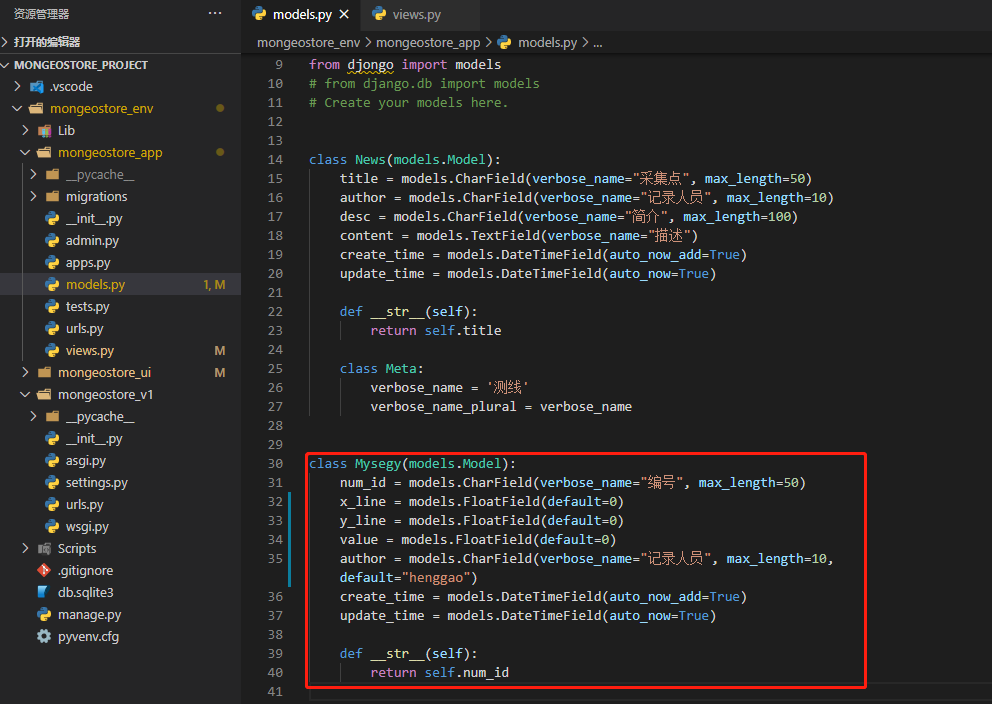
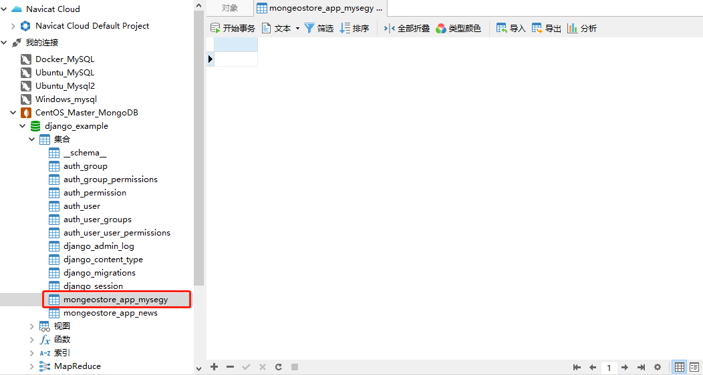

# 后端接口api


1、在mongeostore_app目录下的models.py里写一个model

```python
class Mysegy(models.Model):
    num_id = models.CharField(verbose_name="编号", max_length=50)
    x_line = models.FloatField(default=0)
    y_line = models.FloatField(default=0)
    value = models.FloatField(default=0)
    author = models.CharField(verbose_name="记录人员", max_length=10,default="henggao")
    create_time = models.DateTimeField(auto_now_add=True)
    update_time = models.DateTimeField(auto_now=True)

    def __str__(self):
        return self.num_id

```




2、在mongeostore_app的views里新增两个接口，一个是返回segy数据（通过JsonResponse返回能被前端识别的json格式数据），二是add_segy接受一个get请求，往数据库里添加一条解析的segy数据：

```python
from django.shortcuts import render
from django.views.decorators.http import require_http_methods
from django.core import serializers
from django.http import JsonResponse
import json
from .models import Mysegy
# Create your views here.
@require_http_methods(['GET'])
def add_segy(request):
    response = {}
    try:
        segy = Mysegy(num_id=request.GET.get('num_id'))
        segy.save()
        response['msg'] = 'success'
        response['error_num'] = 0
    except Exception as e:
        response['msg'] = str(e)
        response['error_num'] = 1

    return JsonResponse(response)

@require_http_methods(['GET'])
def show_segys(request):
    response = {}
    try:
        segys = Mysegy.objects.filter()
        response['list'] = json.loads(serializers.serialize("json", segys))
        response['msg'] = 'success'
        response['error_num'] = 0
    except Exception as e:
        response['msg'] = str(e)
        response['error_num'] = 1

    return JsonResponse(response)
```


3、在mongeostore_app目录下，新增一个urls.py,把新增的两接口添加到路由里

```
from django.conf.urls import url,include 
from . import views

urlpatterns = [
    # 主页
    url(r"add_segy$", views.add_segy),
    url(r"show_segys$", views.show_segys),
]
```


4、还要把mongeostore_app下的urls添加到mongeostore_v1下的urls中，才能完成路由：

```python
from django.contrib import admin
from django.urls import path
import mongeostore_app.urls
from django.conf.urls import include

urlpatterns = [
    path('admin/', admin.site.urls),
    path('api/',include(mongeostore_app.urls)),
]

```


5、在项目的根目录，输入命令：

```
python manage.py makemigrations mongeostore_app

python manage.py migrate
```

查询数据库，看到mysegy表已经自动创建了：




6、在根目录输入命令

```
python manage.py runserver
```


7、启动服务，通过postman测试一下我们刚才写的两个接口：

- add_segy

http://127.0.0.1:8000/api/add_segy?num_id=test


- show_segys

  http://127.0.0.1:8000/api/show_segys

  