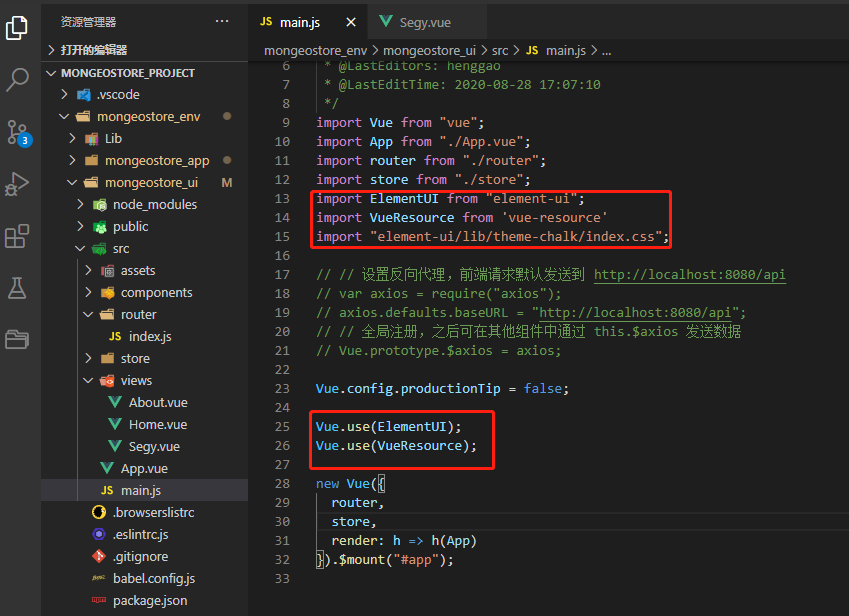
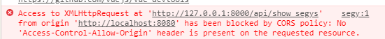
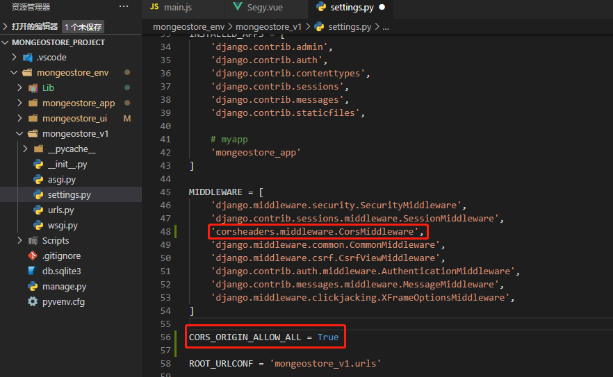

# Vue前端页面

[TOC]

## 前言

- 在样式组件上我们使用了饿了么团队推出的**element-ui**，这是一套专门匹配Vue.js框架的功能样式组件。


## 1.需要的配置

### 安装Element

- 常用的组件
  - [Element](https://element.eleme.io/#/zh-CN)
  - [Vant](https://youzan.github.io/vant-weapp/#/intro)
  - [BootStrap](https://getbootstrap.com/)
  - [Layui](https://www.layui.com/)

```
 npm install element-ui
```


### 安装vue-resource

- 要调用后台、数据，需引入vue-resource，此处可使用npm工具，进行安装，

```
npm install vue-resource
```


### 安装打包工具webpack

- WebPack可以看做是模块打包机：它做的事情是，分析你的项目结构，找到JavaScript模块以及其它的一些浏览器不能直接运行的拓展语言（Scss，TypeScript等），并将其打包为合适的格式以供浏览器使用。

```
npm install webpack
```


### 安装axios

- 使用vue的时候，一般都会使用axios的插件来实现ajax与后端服务器的数据交互。

注意，axios本质上就是javascript的ajax封装，所以会被同源策略限制。

```
npm install axios
```


### 安装SCSS

- SCSS 是 Sass 3 引入新的语法，其语法完全兼容 CSS3，并且继承了 Sass 的强大功能。也就是说，任何标准的 CSS3 样式表都是具有相同语义的有效的 SCSS 文件，[官方解释](http://sass.bootcss.com/docs/scss-for-sass-users/)。

```
npm install sass-loader node-sass --save-dev
```


## 2.导入项目

在main.js中引入Element、VueResource



## 3.编写页面内容Segy.vue

- 在src/views文件夹下新建一个名为Segy.vue的组件，通过调用之前在Django上写好的api，实现添加segy和显示segy数据的功能。

```vue
<!--
 * @Description: henggao_learning
 * @version: v1.0.0
 * @Author: henggao
 * @Date: 2020-08-28 08:36:26
 * @LastEditors: henggao
 * @LastEditTime: 2020-08-28 17:19:32
-->
<template>
  <div class="home">
    <el-row display="margin-top:10px">
      <el-input
        v-model="input"
        placeholder="请输入测线号"
        style="display:inline-table; width: 30%; float:left"
      ></el-input>
      <el-button type="primary" @click="addSegy()" style="float:left; margin: 2px;">新增</el-button>
    </el-row>
    <el-row>
      <el-table :data="segyList" style="width: 100%" border>
        <el-table-column prop="id" label="编号" min-width="100">
          <template slot-scope="scope">{{ scope.row.pk }}</template>
        </el-table-column>
        <el-table-column prop="num_id" label="测线号" min-width="100">
          <template slot-scope="scope">{{ scope.row.fields.num_id }}</template>
        </el-table-column>
        <el-table-column prop="x_line" label="x_line" min-width="100">
          <template slot-scope="scope">{{ scope.row.fields.x_line }}</template>
        </el-table-column>
        <el-table-column prop="y_line" label="y_line" min-width="100">
          <template slot-scope="scope">{{ scope.row.fields.y_line }}</template>
        </el-table-column>
        <el-table-column prop="value" label="value" min-width="100">
          <template slot-scope="scope">{{ scope.row.fields.value }}</template>
        </el-table-column>
        <el-table-column prop="author" label="采集人员" min-width="100">
          <template slot-scope="scope">{{ scope.row.fields.author }}</template>
        </el-table-column>
        <el-table-column prop="creat_time" label="添加时间" min-width="100">
          <template slot-scope="scope">{{ scope.row.fields.create_time }}</template>
        </el-table-column>
        <el-table-column prop="update_time" label="更新时间" min-width="100">
          <template slot-scope="scope">{{ scope.row.fields.update_time }}</template>
        </el-table-column>
      </el-table>
    </el-row>
  </div>
</template>

<script>
export default {
  name: "segy",
  data() {
    return {
      input: "",
      segyList: []
    };
  },
  mounted: function() {
    this.showSegys();
  },
  methods: {
    addSegy() {
      this.$http
        .get("http://127.0.0.1:8000/api/add_segy?num_id=" + this.input)
        .then(response => {
          var res = JSON.parse(response.bodyText);
          if (res.error_num === 0) {
            this.showSegys();
          } else {
            this.$message.error("新增数据失败，请重试");
            console.log(res["msg"]);
          }
        });
    },
    showSegys() {
      this.$http.get("http://127.0.0.1:8000/api/show_segys").then(response => {
        var res = JSON.parse(response.bodyText);
        console.log(res);
        if (res.error_num === 0) {
          this.segyList = res["list"];
        } else {
          this.$message.error("查询数据失败");
          console.log(res["msg"]);
        }
      });
    }
  }
};
</script>

<!-- Add "scoped" attribute to limit CSS to this component only -->
<style scoped>
h1,
h2 {
  font-weight: normal;
}

ul {
  list-style-type: none;
  padding: 0;
}

li {
  display: inline-block;
  margin: 0 10px;
}

a {
  color: #42b983;
}
</style>


```

## 4.运行前端程序

切换到前端目录mongeostore_ui，运行程序，查看浏览器

```
npm run serve
```

- 如果发现列表抓取不到数据，可能是出现了跨域问题，打开浏览器console确认

  

- 这时候我们须要在Django层注入header，用Django的第三方包`django-cors-headers`来解决跨域问题：

```
 pip install django-cors-headers
```

- **settings.py 修改：**

  

```
'corsheaders.middleware.CorsMiddleware',

CORS_ORIGIN_ALLOW_ALL = True
```

 

- 后端接口记得启动

  ```
  #激活虚拟环境,先切换到目录
  cd mongeostore_env
  
  .\Scripts\activate
  
  python manage.py runserver
  ```

  

- **在前端工程目录下，输入**`npm run serve`**启动node自带的服务器，浏览器会自动打开， 我们能看到页面：**


- **新增数据，新增的信息会实时反映到页面的列表中，这得益于Vue.js的数据双向绑定特性。**

- 在前端工程目录下，输入`npm run build`，如果项目没有错误的话，就能够看到所有的组件、css、图片等都被webpack自动打包到dist目录下了：

```
npm run build
```


## 5、自定义Vue.config.js

- vue-cli2与vue-cli3创建目录结构有区别

- vue cli3创建的项目，已经干掉了原有的webpack配置，取而代之的是，vue.config.js。vue.config.js是一个可选的配置文件，需要自己创建！如果项目的根目录中存在这个文件，那么它会被 `@vue/cli-service` 自动加载。

- vue.config.js参考配置

    - [配置一](https://blog.csdn.net/xy19950125/article/details/93747932?utm_medium=distribute.pc_relevant.none-task-blog-BlogCommendFromMachineLearnPai2-2.nonecase&depth_1-utm_source=distribute.pc_relevant.none-task-blog-BlogCommendFromMachineLearnPai2-2.nonecase)
    - [配置二](https://www.cnblogs.com/code-duck/p/13377871.html)
    - [配置三](https://cloud.tencent.com/developer/article/1494479)
    - vue.config.js

    ```js
    
    const path = require('path')
    module.exports = {
      publicPath: '/',
    	// 输出文件目录
      outputDir: 'dist',
      assetsDir: 'static',
      lintOnSave: false,
      chainWebpack: (config) => {
        config.resolve.symlinks(true) //热更新
      },
      configureWebpack: (config) => {
        if (process.env.NODE_ENV === 'production') {
          // 为生产环境修改配置...
          config.mode = 'production'
          // 将每个依赖包打包成单独的js文件
          let optimization = {
            runtimeChunk: 'single',
            splitChunks: {
              chunks: 'all',
              maxInitialRequests: Infinity,
              minSize: 20000,
              cacheGroups: {
                vendor: {
                  test: /[\\/]node_modules[\\/]/,
                  name(module) {
                    const packageName = module.context.match(/[\\/]node_modules[\\/](.*?)([\\/]|$)/)[1]
                    return `npm.${packageName.replace('@', '')}`
                  }
                }
              }
            }
          }
          Object.assign(config, {
            optimization
          })
        } else {
          // 为开发环境修改配置...
          config.mode = 'development'
        }
        Object.assign(config, {
          // 开发生产共同配置
          resolve: {
            extensions: ['.js', '.vue', '.json'],//请求本地json
            alias: {
              '@': path.resolve(__dirname, './src'),
              '@c': path.resolve(__dirname, './src/components'),
              '@p': path.resolve(__dirname, './src/pages')
            } // 别名配置
          }
        })
      },
      // 生产环境是否生成 sourceMap 文件
    	productionSourceMap: true,
      css: {
    		// 是否使用css分离插件 ExtractTextPlugin
    		extract: true,
    		// 开启 CSS source maps?是否在构建样式地图，false将提高构建速度
    		sourceMap: false,
    		// css预设器配置项
    		loaderOptions: {},
    		// 启用 CSS modules for all css / pre-processor files.
    		modules: false
    	},
    	parallel: require('os').cpus().length > 1,
    	// webpack-dev-server 相关配置
    	devServer: {
    		open: process.platform === 'darwin',
    		host: '0.0.0.0',
    		port: 8080,
    		https: false,
        hotOnly: false,
        overlay: {
          warnings: false,
          errors: false
        },
    		proxy: {
          '/api': {
            // 目标 API 地址
            target: process.env.VUE_APP_URL,
            // 如果要代理 websockets
            ws: false,
            changeOrigin: true, // 允许websockets跨域
            pathRewrite: {
              '/api/proxy': ''
            }
          }
        },
        // 代理转发配置，用于调试环境
      disableHostCheck: true,
      }
    }
    ```

    

    

