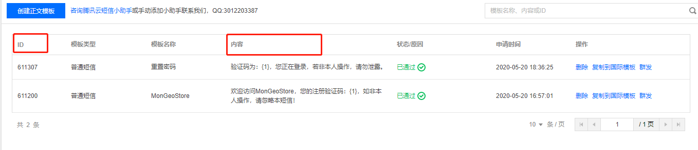
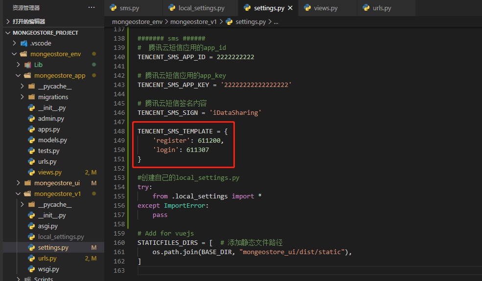
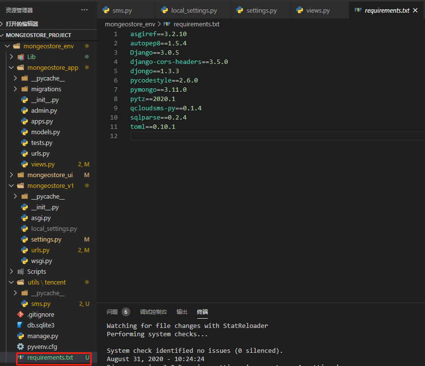
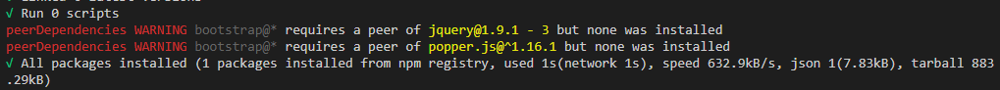
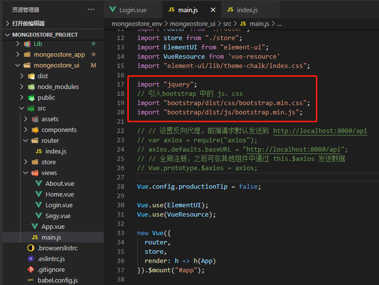
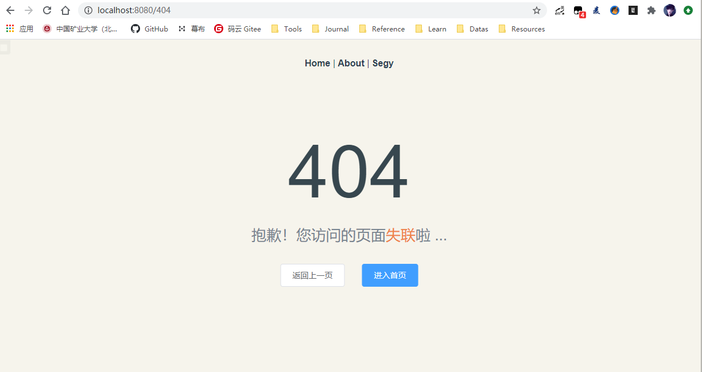

# 注册页面

[TOC]

## 1、短信验证

- 参考目录MonGeoStore_v2/MongoGeoStore_ui/03-腾讯短信


## 2、Python短信验证

- 参考目录MonGeoStore_v2/MongoGeoStore_ui/04-Python短信验证


### 2.1、判断是登录还是注册

判断注册还是登录，验证码内容模板不一样，通过ID字段判断。login还是register判断ID取值。




- 修改views.py

  

```python
def send_sms(request):
    '''发送短信
        ?tpl=login  -> 611307
        ?tpl=register -> 611200

    '''
    tpl = request.GET.get('tpl')
    template_id = settings.TENCENT_SMS_TEMPLATE.get(tpl)
    if not template_id:
        return HttpResponse('模板不存在')

    code = random.randrange(1000, 9999)
    res = send_sms_single('15351818127', template_id, [code, ])
    if res['result'] == 0:
        return HttpResponse('成功')
    else:
        return HttpResponse(res['errmsg'])
```

- settings.py

  在settings.py中设置。也可以在local_settings.py中设置。不过别人只知道你的ID，没有短信密钥，所以为了方便在settings中设置

  

```
TENCENT_SMS_TEMPLATE = {
    'register': 611200,
    'login': 611307
}
```


## 3、获取环境配置内容

```
pip freeze > requirements.txt
```




## 4、BootStrap使用

- Django的ModelForm
  - 自动生成HTML标签

### 4.1、Vue中引用Bootstrap

- **参考**： genghenggao2020_v2/ MonGeoStore_v1/ UI-06-Vue中引用Bootstrap.md

1、首先 使用 `cli` 进行初始化项目，创建好项目。

2、使用npm进行安装

```
cnpm install bootstrap --save
```



提示 jquery 以及 popper.js 找不到

3、安装jquery、popper.js

```
cnpm install --save jquery popper.js
```

### 4.2、配置main.js

- 引入Bootstrap



```
import "jquery";
// 引入bootstrap 中的 js、css
import "bootstrap/dist/css/bootstrap.min.css";
import "bootstrap/dist/js/bootstrap.min.js";
```

### 4.3、配置vue.config.js文件

Vue CLI3.0 中的所有配置都在 vue.config.js 文件，你在这里配置好，脚手架自动使用你的配置覆盖掉默认的配置。 如果你的项目中没有 vue.config.js 文件，请你在 package.json 文件的同级目录新建一个 vue.config.js 文件。文件内具体的配置如下：

#### 1、首先引入 `webpack`

```
const webpack = require("webpack");
```

#### 2、`vue.config.js` 配置

在`vue.config.js` 中的 `module.exports = {}` 添加如下内容：

```
    plugins: [
      new webpack.ProvidePlugin({
        $: "jquery",
        jQuery: "jquery",
        jquery: "jquery",
        "window.jQuery": "jquery",
        Popper: ["popper.js", "default"]
      })
    ],
```

- vue.config.js

  ```js
  const webpack = require('webpack');
  const path = require('path');  //引入path模块（node）
  const resolve = (dir) => path.join(__dirname, dir); //将文件组成绝对路径
  
  module.exports = {
    // 用于引入jquery开始
    configureWebpack: {
      plugins: [
        new webpack.ProvidePlugin({
          $: 'jquery',
          jQuery: 'jquery',
          'window.jQuery': 'jquery',
          Popper: ['popper.js', 'default']
        })
      ]
    },
    // 用于引入jquery结束
    publicPath: '/',
    // 输出文件目录
    outputDir: 'dist',
    assetsDir: 'static',
    lintOnSave: false,// 关闭eslint
    // webpack相关配置
    chainWebpack: (config) => {
      config.resolve.symlinks(true) //热更新
    },
   }
  ```


- 对04Vue前端编写中的vue.config.js进行了修改。解决配置bootstarp无效！后续如果对开发以及生产环境配置可以参考：
  - [配置一](https://blog.csdn.net/xy19950125/article/details/93747932?utm_medium=distribute.pc_relevant.none-task-blog-BlogCommendFromMachineLearnPai2-2.nonecase&depth_1-utm_source=distribute.pc_relevant.none-task-blog-BlogCommendFromMachineLearnPai2-2.nonecase)
  - [配置二](https://www.cnblogs.com/code-duck/p/13377871.html)
  - [配置三](https://cloud.tencent.com/developer/article/1494479)
  - [配置四](https://blog.csdn.net/u014440483/article/details/87267160)


### 4、测试

编写一个页面Login.vue

```vue
<!--
 * @Description: henggao_learning
 * @version: v1.0.0
 * @Author: henggao
 * @Date: 2020-08-31 15:03:39
 * @LastEditors: henggao
 * @LastEditTime: 2020-09-01 09:07:39
-->
<template>
  <div class="page">
    <h1>注册</h1>
    <!-- <Home /> -->
    <!-- BootStrap组件测试 -->
    <button type="button" class="btn btn-primary">Primary</button>
    <button type="button" class="btn btn-secondary">Secondary</button>
    <div>
      <!-- BootStrap-Vue组件测试 -->
      <b-button>Button</b-button>
      <b-button variant="danger">Button</b-button>
      <b-button variant="success">Button</b-button>
      <b-button variant="outline-primary">Button</b-button>
    </div>
  </div>
</template>

<script>
// import Home from "@/views/Home.vue";

export default {
  name: "Login"
  //   components: {
  //     Home
  //   }
};
</script>

<style lang="scss" scoped>

</style>
```


## 5、创建相关页面

### 5.0、设计

- 安装

  - Element

  - SCSS

    ```
    npm install -D sass-loader sass
    ```

  - axios

- 页面设计

  - 注册登录Login
  - 用户中心User
  - 主页Home
  - 404页面


### 5.1、页面路由

#### 1、添加页面

- 在views文件夹中添加相关页面
  - Login.vue
  - Home.vue
  - User.vue
  - 404.vue

#### 2、配置路由

打开router/index.js，添加4个路由，分别对应主页、登录、用户、404页面。

两种添加方法：

- 直接引入，如下面的home。无论有没有访问都加载

- 异步加载（懒加载），如下面的about。访问的时候才加载（推荐）。

- index.js

  ```
  /*
   * @Description: henggao_learning
   * @version: v1.0.0
   * @Author: henggao
   * @Date: 2020-08-26 17:15:17
   * @LastEditors: henggao
   * @LastEditTime: 2020-09-01 10:22:09
   */
  import Vue from "vue";
  import VueRouter from "vue-router";
  import Home from "../views/Home.vue";
  import Segy from "@/views/Segy.vue";
  import Login from "@/views/Login.vue";
  
  Vue.use(VueRouter);
  
  const routes = [
    {
      path: "/",
      name: "Home",
      component: Home
    },
    {
      path: "/about",
      name: "About",
      // route level code-splitting
      // this generates a separate chunk (about.[hash].js) for this route
      // which is lazy-loaded when the route is visited.
      component: () =>
        import(/* webpackChunkName: "about" */ "../views/About.vue")
    },
    {
      path: "/segy",
      name: "Segy",
      component: Segy
      // component: () =>
      // import(/* webpackChunkName: "about" */ "../views/Segy.vue")
    },
    {
      path: "/login",
      name: "Login",
      component: Login
      // component: () =>
      // import(/* webpackChunkName: "about" */ "../views/Segy.vue")
    },
    {
      path: "/404",
      name: "NotFound",
      component: () =>
        import(/* webpackChunkName: "about" */ "../views/404.vue")
    },
  ];
  
  const router = new VueRouter({
    mode: "history",
    base: process.env.BASE_URL,
    routes
  });
  
  export default router;
  
  ```

  

#### 3、安装SCSS

- 我们在初始化项目是已经安装了
- 也可以手动安装

```
npm install -D sass-loader sass
```

- Vue-cli3及以后不需要在vue.configjs配置SCSS了。

- 测试一下404页面

  ```
  <template>
    <div class="site-wrapper site-page--not-found">
      <div class="site-content__wrapper">
        <div class="site-content">
          <h2 class="not-found-title">404</h2>
          <p class="not-found-desc">抱歉！您访问的页面<em>失联</em>啦 ...</p>
          <el-button @click="$router.go(-1)">返回上一页</el-button>
          <el-button type="primary" class="not-found-btn-gohome" @click="$router.push('/')">进入首页</el-button>
        </div>
      </div>
    </div>
  </template>
  
  <script>
    export default {
      name: 'NotFound'
    }
  </script>
  
  <style lang="scss">
    .site-wrapper.site-page--not-found {
      position: absolute;
      top: 60px;
      right: 0;
      bottom: 0;
      left: 0;
      overflow: hidden;
      .site-content__wrapper {
        padding: 0;
        margin: 0;
        background-color: #fff;
      }
      .site-content {
        position: fixed;
        top: 15%;
        left: 50%;
        z-index: 2;
        padding: 30px;
        text-align: center;
        transform: translate(-50%, 0);
      }
      .not-found-title {
        margin: 20px 0 15px;
        font-size: 8em;
        font-weight: 500;
        color: rgb(55, 71, 79);
      }
      .not-found-desc {
        margin: 0 0 30px;
        font-size: 26px;
        text-transform: uppercase;
        color: rgb(118, 131, 143);
        > em {
          font-style: normal;
          color: #ee8145;
        }
      }
      .not-found-btn-gohome {
        margin-left: 30px;
      }
    }
  </style>
  ```

  

#### 4、安装axios

1、安装依赖

```

```

2、编写代码

修改Home.vue

```vue
<template>
  <div class="home">
    
    <HelloWorld msg="Welcome to Your Vue.js App" />
    <el-button type="primary" @click="testAxios()">测试Axios调用</el-button>
  </div>
</template>

<script>
// @ is an alias to /src
import HelloWorld from "@/components/HelloWorld.vue";
import axios from "axios";

export default {
  name: "Home",
  components: {
    HelloWorld
  },
  methods: {
    testAxios() {
      axios.get("http://localhost:8080").then(res => {
        alert(res.data);
      });
    }
  }
};
</script>
```


3、页面测试

打开主页，单击按钮出发HTTP请求，弹出窗口显示页面HTML数据

