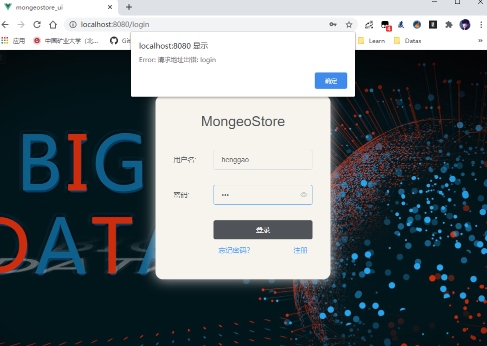

# 封装axios模块

[TOC]

## 0、Axios

- [Axios慕课](https://www.imooc.com/video/19782)
- axios常用的请求方法
  - get：获取数据（）
  - post：提交数据（表单提交+文件上传）
  - put：更新数据（所有数据推送到后端）
  - patch：更新数据（只将修改的数据推送到后端）
  - delete：删除数据
- 并发请求
  - 同时进行多个请求，并统一处理返回值
  - axios.all与asxios.spread
- axios配置（优先级从低到高）
  - axios全局配置
  - axios实例配置
  - axios请求配置
- axios拦截器
  - 在请求或响应被处理前拦截它们


## 1、封装要点

使用axios发起一个请求比较简单，但项目多了，代码变得越来越难以维护。对axios进行二次封装，时的项目各个组件能够复用，容易维护。

- 统一url配置
- 统一api请求

- request（请求）拦截器。例如带上token等，设置请求头。
- reponse（响应）拦截器。例如：同意错误处理，页面重定向。
- 根据需要，饥饿和vuex做全局的loading动画，或者错误处理。
- 将axios封装成vue插件使用。


## 2、文件结构

### 0、路由设置

| URL        | 视图                 | 模板           | 说明 |
| ---------- | -------------------- | -------------- | ---- |
| /index/    | login.views.index    | index.html     | 主页 |
| /login/    | login.views.login    | login.html     | 登录 |
| /register/ | login.views.register | register.html  | 注册 |
| /logout/   | login.views.logout   | 无需专门的页面 | 登出 |

- 重要说明：由于本项目目的是打造一个针对管理系统、应用程序等需求下的可重用的登录/注册app，而不是门户网站、免费博客等无需登录即可访问的网站，所以在url路由、跳转策略和文件结构的设计上都是尽量自成体系。具体访问的策略如下：
  - 未登录人员，不论是访问index还是login和logout，全部跳转到login界面
  - 已登录人员，访问login会自动跳转到index页面
  - 已登录人员，不允许直接访问register页面，需先logout
  - 登出后，自动跳转到login界面

### 1、http目录

- 在src目录下新建一个http文件夹，用来存放http交互api代码，文件结构如下:
  - config.js：axios默认配置，包含基础路径等信息。
  - axios.js：二次封装axios模块，包含拦截器信息。
  - api.js：请求接口汇总模块，聚合所有模块的API。
  - index.js：将axios封装成插件，按插件方式引入。
  - modules：用户管理、菜单管理等子模块API。

```
http
│  api.js
│  axios.js
│  config.js
│  index.js 
└─modules
        config.js
        dept.js
        dict.js
        log.js
        login.js
        loginlog.js
        menu.js
        role.js
        user.js
```

#### config.js

- AXIOS相关配置

```js
import { baseUrl } from '@/utils/global'

export default {
  method: 'get',
  // 基础url前缀
  baseUrl: baseUrl,
  // 请求头信息
  headers: {
    'Content-Type': 'application/json;charset=UTF-8'
  },
  // 参数
  data: {},
  // 设置超时时间
  timeout: 10000,
  // 携带凭证
  withCredentials: true,
  // 返回数据类型
  responseType: 'json'
}
```

#### axios.js

- axios拦截器，可以进行请求拦截和响应拦截，在发送请求和响应请求时执行一些操作。
  - 这里导入类配置文件的信息（如baseURL、headers、withCredentials等设置）到axios对象。
  - 发送请求的时候获取token，如果不存在，说明未登录，就重定向到系统登录界面，否则携带token继续发送请求。
  - 若果需要，可以在这里通过reponse响应拦截器对返回结果进行统一处理在返回。

```js
import axios from 'axios';
import config from './config';
import Cookies from "js-cookie";
import router from '@/router'

export default function $axios(options) {
  return new Promise((resolve, reject) => {
    const instance = axios.create({
      baseURL: config.baseUrl,
      headers: config.headers,
      timeout: config.timeout,
      withCredentials: config.withCredentials
    })
    // request 请求拦截器
    instance.interceptors.request.use(
      config => {
        let token = Cookies.get('token')
        // 发送请求时携带token
        if (token) {
          config.headers.token = token
        } else {
          // 重定向到登录页面
          router.push('/login')
        }
        return config
      },
      error => {
        // 请求发生错误时
        console.log('request:', error)
        // 判断请求超时
        if (error.code === 'ECONNABORTED' && error.message.indexOf('timeout') !== -1) {
          console.log('timeout请求超时')
        }
        // 需要重定向到错误页面
        const errorInfo = error.response
        console.log(errorInfo)
        if (errorInfo) {
          error = errorInfo.data  // 页面那边catch的时候就能拿到详细的错误信息,看最下边的Promise.reject
          const errorStatus = errorInfo.status; // 404 403 500 ...
          router.push({
            path: `/error/${errorStatus}`
          })
        }
        return Promise.reject(error) // 在调用的那边可以拿到(catch)你想返回的错误信息
      }
    )
    
    // response 响应拦截器
    instance.interceptors.response.use(
      response => {
        return response.data
      },
      err => {
        if (err && err.response) {
          switch (err.response.status) {
            case 400:
              err.message = '请求错误'
              break
            case 401:
              err.message = '未授权，请登录'
              break
            case 403:
              err.message = '拒绝访问'
              break
            case 404:
              err.message = `请求地址出错: ${err.response.config.url}`
              break
            case 408:
              err.message = '请求超时'
              break
            case 500:
              err.message = '服务器内部错误'
              break
            case 501:
              err.message = '服务未实现'
              break
            case 502:
              err.message = '网关错误'
              break
            case 503:
              err.message = '服务不可用'
              break
            case 504:
              err.message = '网关超时'
              break
            case 505:
              err.message = 'HTTP版本不受支持'
              break
            default:
          }
        }
        console.error(err)
        return Promise.reject(err) // 返回接口返回的错误信息
      }
    )
    // 请求处理
    instance(options).then(res => {
      resolve(res)
      return false
    }).catch(error => {
      reject(error)
    })
  })
}
```

#### index.js

- 这里吧axios注册为Vue插件使用，并将api模块关在在Vue原型的$api对象上。这样在能获取this引用的地方就可以通过`this.$api.子模块.方法`的方式调用API了。

```js
// 导入所有接口
import api from './api'

const install = Vue => {
    if (install.installed)
        return;

    install.installed = true;

    Object.defineProperties(Vue.prototype, {
        // 注意，此处挂载在 Vue 原型的 $api 对象上
        $api: {
            get() {
                return api
            }
        }
    })
}

export default install
```


#### api.js

- 此模块是一个聚合模块，回合了modules目录下的所有子模块API。

```
/* 
 * 接口统一集成模块
 */
import * as login from './modules/login'
import * as user from './modules/user'
import * as dept from './modules/dept'
import * as role from './modules/role'
import * as menu from './modules/menu'
import * as dict from './modules/dict'
import * as config from './modules/config'
import * as log from './modules/log'
import * as loginlog from './modules/loginlog'


// 默认全部导出
export default {
    login,
    user,
    dept,
    role,
    menu,
    dict,
    config,
    log,
    loginlog
}
```

### 2、modules目录

- moduls目录下的子模块
  - config.js
  - dept.js
  - dict.js
  - log.js
  - login.js
  - loginlog.js
  - menu.js
  - role.js
  - user.js

#### login.js

```js
import axios from '../axios'

/* 
 * 系统登录模块
 */

// 登录
export const login = data => {
    return axios({
        url: 'login',
        method: 'post',
        data
    })
}

// 登出
export const logout = () => {
    return axios({
        url: 'logout',
        method: 'get'
    })
}

```


#### users.js

```js
import axios from '../axios'

/* 
 * 用户管理模块
 */

// 保存
export const save = (data) => {
    return axios({
        url: '/user/save',
        method: 'post',
        data
    })
}
// 删除
export const batchDelete = (data) => {
    return axios({
        url: '/user/delete',
        method: 'post',
        data
    })
}
// 分页查询
export const findPage = (data) => {
    return axios({
        url: '/user/findPage',
        method: 'post',
        data
    })
}
// 查找用户的菜单权限标识集合
export const findPermissions = (params) => {
    return axios({
        url: '/user/findPermissions',
        method: 'get',
        params
    })
}
```

#### config.js

```js
import axios from '../axios'

/* 
 * 系统配置模块
 */

// 保存
export const save = (data) => {
    return axios({
        url: '/config/save',
        method: 'post',
        data
    })
}
// 删除
export const batchDelete = (data) => {
    return axios({
        url: '/config/delete',
        method: 'post',
        data
    })
}
// 分页查询
export const findPage = (data) => {
    return axios({
        url: '/config/findPage',
        method: 'post',
        data
    })
}
```


### 3、utils目录

- 新建utils文件夹，用来设置全局配置
  - global.js：把一些全局的配置、常量和方法放在此文件中

#### global.js

```
/**
 * 全局常量、方法封装模块
 * 通过原型挂载到Vue属性
 * 通过 this.Global 调用
 */

 // 后台管理系统服务器地址
// export const baseUrl = 'http://139.196.87.48:8001'
export const baseUrl = 'http://localhost:8001'
 // 系统数据备份还原服务器地址
// export const backupBaseUrl = 'http://139.196.87.48:8002'
export const backupBaseUrl = 'http://localhost:8002'

export default {
    baseUrl,
    backupBaseUrl
}
```


### 4、mains.js

- 修改main.js,导入API模块，并通过Vue.use(api)进行使用注册，这样就可以使用`this.$api.子模块.方法`的方式进行调用后台接口了。

- 引入global模块，并通过Vue.prototype.global = global语句进行挂载，这样就可以通过`this.global.xx`来获取全局配置了。

```
import api from './http'
import global from '@/utils/global'

Vue.use(api)  // 引入API模块

Vue.prototype.global = global // 挂载全局配置模块
```


### 5、安装js-cookie

axios.js中，会用到Cookie获取token，所以需要把相关依赖安装一下。

```
npm install js-cookie
```


### 6、测试案例

#### 1、登陆页面

- 在登录页面Login.vue中，添加登录按钮，单击处理函数axios调用login接口返回数据。

- 成功返回之后，弹出框，显示token信息，然后将token放入Cookie并跳转到主页。

  - Login.vue

    ```
    <!--
     * @Description: henggao_learning
     * @version: v1.0.0
     * @Author: henggao
     * @Date: 2020-08-31 15:03:39
     * @LastEditors: henggao
     * @LastEditTime: 2020-09-03 09:08:01
    -->
    <template>
      <div id="poster">
        <el-form class="login-container" label-position="left" label-width="80px">
          <h3 class="login_title">MongeoStore</h3>
          <el-form-item prop="username" label="用户名:">
            <el-input type="text" v-model="loginForm.username" auto-complete="off" placeholder="请输入账号"></el-input>
          </el-form-item>
          <el-form-item prop="password" label="密码:">
            <el-input
              type="password"
              v-model="loginForm.password"
              auto-complete="off"
              placeholder="请输入密码"
              show-password
            ></el-input>
          </el-form-item>
          <el-form-item style="width: 100%">
            <el-button
              type="primary"
              style="width: 100%;background: #505458;border: none"
              v-on:click="login"
            >登录</el-button>
            <div class="register">
              <el-link :underline="false" type="primary">忘记密码？</el-link>
              <el-link class="register_id" :underline="false" type="primary" href="/register">注册</el-link>
            </div>
          </el-form-item>
        </el-form>
      </div>
    </template>
    
    <script>
    import Cookies from "js-cookie";
    import router from "@/router";
    export default {
      name: "login",
      data() {
        return {
          loginForm: {
            username: "",
            password: ""
          },
          responseResult: []
        };
      },
      methods: {
        // login() {
        //   var _this = this;
        //   console.log(this.$store.state);
        //   this.$axios
        //     .post("/login", {
        //       username: this.loginForm.username,
        //       password: this.loginForm.password
        //     })
        //     .then(successResponse => {
        //       if (successResponse.data.code === 200) {
        //         _this.$store.commit("login", _this.loginForm);
        //         var path = this.$route.query.redirect;
        //         this.$router.replace({
        //           path: path === "/" || path === undefined ? "/index" : path
        //         });
        //       }
        //     })
        //     // eslint-disable-next-line no-unused-vars
        //     .catch(failResponse => {});
        // }
    
        login() {
          this.$api.login
            .login()
            .then(function(res) {
              alert(res.token);
              Cookies.set("token", res.token); // 放置token到Cookie
              router.push("/"); // 登录成功，跳转到主页
            })
            .catch(function(res) {
              alert(res);
            });
        }
      }
    };
    </script>
    
    <style lang="scss" scoped>
    #poster {
      background: url("../assets/images/background.jpg") no-repeat;
      background-position: center;
      height: 100%;
      width: 100%;
      background-size: cover;
      position: fixed;
    }
    
    .login-container {
      border-radius: 15px;
      background-clip: padding-box;
      margin: 90px auto;
      width: 350px;
      padding: 35px 35px 15px 35px;
      background: #fff;
      border: 1px solid #eaeaea;
      box-shadow: 0 0 25px #cac6c6;
    }
    
    .login_title {
      margin: 0px auto 40px auto;
      text-align: center;
      color: #505458;
    }
    .register {
      position: relative;
      right: 40px;
      // width: 100%;
    }
    .register_id {
      right: -80px;
    }
    </style>
    ```

    

  - 由于这里还没有用户信息，点击确定还不能跳转到主页Home