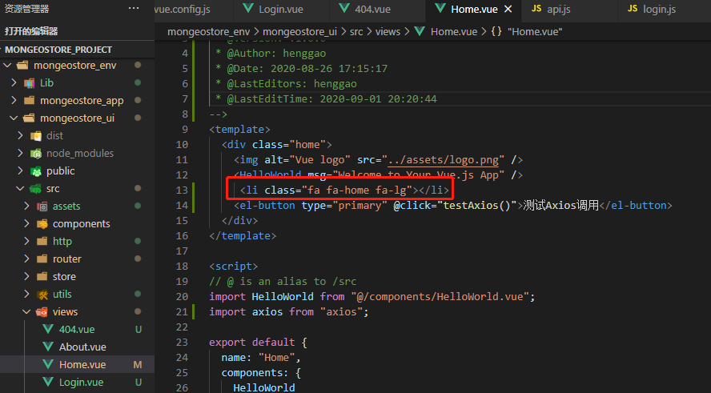
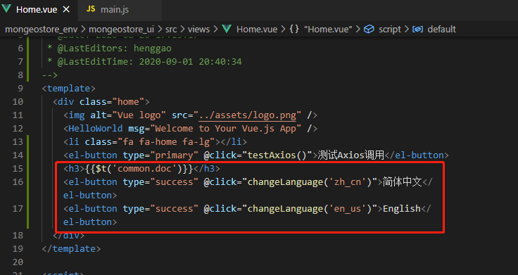
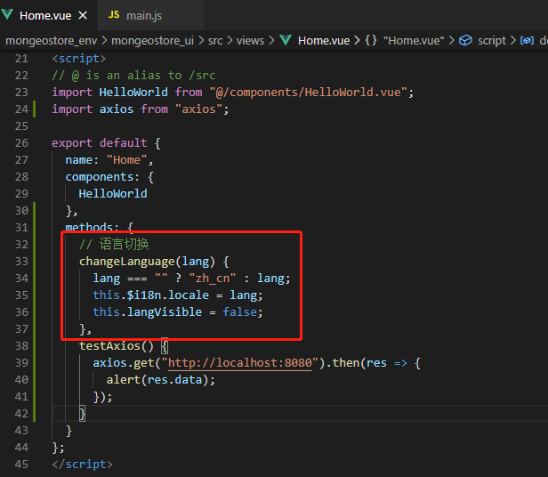

# 丰富页面

[TOC]


## 1、第三方图标库

Element提供的字体图标少之又少，Font Awesome提供了675个可缩放的矢量图标，而卡伊使用CSS对它们进行更改，包括大小、颜色、阴影。

- 安装依赖

  ```
  npm install font-awesome --save-dev
  ```

- font-awesome引入，在项目main.js中引入CSS依赖

  ```
  import 'font-awesome/css/font-awesome.min.css'
  ```

- 页面使用，在Home.vue中加入一个小图标。

  ```
   <li class="fa fa-home fa-lg"></li>
  ```

  

- 页面测试

  

  


## 2、多语言国际化

1、安装国际化组件依赖

```
npm install vue-i18n --save-dev
```

2、添加配置,在src下新建i18n，并创建index.js

```js
import Vue from 'vue'
import VueI18n from 'vue-i18n'

Vue.use(VueI18n)
 
// 注册i18n实例并引入语言文件，文件格式等下解析
const i18n = new VueI18n({
  locale: 'zh_cn',
  messages: {
    'zh_cn': require('@/assets/languages/zh_cn.json'),
    'en_us': require('@/assets/languages/en_us.json')
  }
})

export default i18n
```

3、在assets目录下新建language文件夹，创建两个语言文件`zh_cn.json`、`en_us.json`

- `zh_cn.json`

```json
{
    "common": {
        "home": "首页",
        "login": "登录",
        "logout": "退出登录",
        "doc": "文档",
        "blog": "博客",
        "projectRepo": "项目",
        "myMsg": "我的消息",
        "config": "系统配置",           
        "backup": "备份",
        "restore": "还原",
        "backupRestore": "备份还原",
        "versionName": "版本名称",             
        "exit": "退出"
    },
    "action": {
        "operation": "操作",
        "add": "新增",
        "edit": "编辑",
        "delete": "删除",
        "batchDelete": "批量删除",
        "search": "查询",
        "loading": "拼命加载中",
        "submit": "提交",
        "comfirm": "确定",
        "cancel": "取消",
        "reset": "重置"
        
    }
}
```

- `en_us.json`

```json
{
    "common": {
        "home": "Home",
        "login": "Login",
        "logout": "Logout",
        "doc": "Document",
        "blog": "Blog",
        "projectRepo": "Project",
        "myMsg": "My Message",
        "config": "Config",
        "backup": "Backup",  
        "restore": "Restore",  
        "backupRestore": "Backup Restore",  
        "versionName": "Version",  
        "exit": "Exit"
    },
    "action": {
        "operation": "Operation",
        "add": "Add",
        "edit": "Edit",
        "delete": "Delete",
        "batchDelete": "Batch Delete",
        "search": "Search",
        "loading": "loading",
        "submit": "Submit",
        "comfirm": "Comfirm",
        "cancel": "Cancel",
        "reset": "Reset"
    }
}
```

4、在main.js中引入i18n并注入vue对象中。

```
import i18n from './i18n'
```


5、字符引用，在Home.vue中添加一个国际化字符串和两个按钮做中英文切换。

```
    <h3>{{$t('common.doc')}}</h3>
    <el-button type="success" @click="changeLanguage('zh_cn')">简体中文</el-button>
    <el-button type="success" @click="changeLanguage('en_us')">English</el-button>
```



在方法声明区域添加以下方法，设置国际化语言。

```
  // 语言切换
    changeLanguage(lang) {
      lang === '' ? 'zh_cn' : lang
      this.$i18n.locale = lang
      this.langVisible = false
    },
```



6、页面测试


