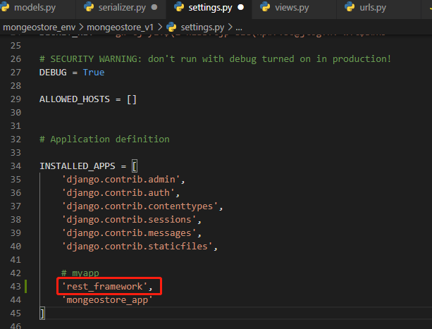
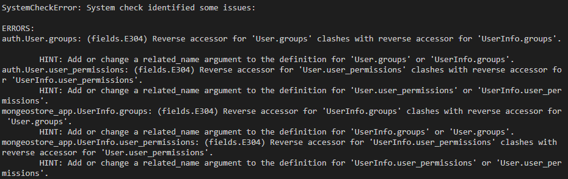
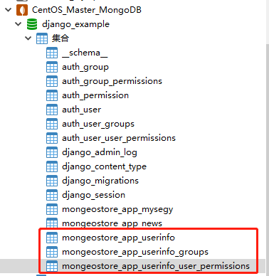
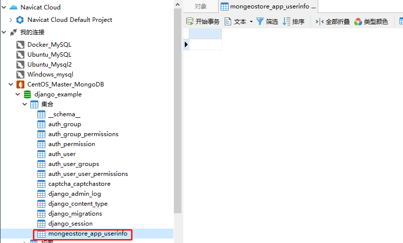

# 后端登录API

[TOC]


## 一、注册信息

### 0、准备

为了方便后端的实现，作为django做后端api服务的一种常用插件，django-rest-framework(DRF)提供了许多好用的特性，所以本文demo中也应用一下，命令行输入命令安装：

```
pip install djangorestframework
```

将DRF配置到django项目中，打开项目中的settings.py文件，添加：




### 1、添加注册信息

在models.py文件写数据类UserInfo

- model.py

```
from _datetime import datetime
from django.contrib.auth.models import AbstractUser
```

```python
######## Mongeostore注册#########
# 用户
# 继承 Django 自带的User
class UserInfo(AbstractUser):
    username = models.CharField(verbose_name='用户名', max_length=32)
    email = models.EmailField(verbose_name='邮箱', max_length=32)
    mobile = models.CharField(verbose_name='手机号', max_length=32)
    password = models.CharField(verbose_name='密码', max_length=32)

    class Meta:
        verbose_name = "用户"
        verbose_name_plural = verbose_name

    def __str__(self):
        return self.username

# 短信验证码


class VerifyCode(models.Model):
    code = models.CharField(max_length=10, verbose_name="验证码")
    mobile = models.CharField(max_length=11, verbose_name="电话号码")
    # 这里不能加 ()， 如果加了的话，就会用编译的时间作为当前时间
    add_time = models.DateTimeField(default=datetime.now, verbose_name="添加时间")

    class Meta:
        verbose_name = "短信验证码"
        verbose_name_plural = verbose_name

    def __str__(self):
        return self.code

```

### 2、序列化

在mongeostore_ui文件夹中创建serializers.py文件，并写对应序列器smsSerializer、RegisterSerializer

- serializers.py

```python
"""
序列化
"""
import re
from datetime import datetime, timedelta

from django.contrib.auth import get_user_model
User = get_user_model()
from rest_framework import serializers
from rest_framework.validators import UniqueValidator

from .models import VerifyCode

class SmsSerializer(serializers.Serializer):
    """
    短信验证码序列化
    """
    mobile = serializers.CharField(max_length=11, min_length=11)

    # 重载内置的方法，自定义验证 model 中的字段
    # 函数名【强制要求】为 validate_(字段名)
    def validate_mobile(self, mobile):
        """
        验证手机号码
        :param mobile:
        :return:
        """
        # 验证手机号码是否合法
        REGEX_MOBILE = "^1[358]\d{9}$|^147\d{8}$|^176\d{8}$"  # 手机号码正则表达式
        if not re.match(REGEX_MOBILE, mobile):
            raise serializers.ValidationError("手机号码不合法")  # 返回数据出错

        # 验证手机是否注册
        if User.objects.filter(mobile=mobile).count() > 0:
            raise serializers.ValidationError("用户已经存在")  # 返回数据出错

        # 验证发送频率
        one_minutes_ago = datetime.now() - timedelta(hours=0, minutes=1, seconds=0)  # 获取一分钟以前的时间
        if VerifyCode.objects.filter(add_time__gt=one_minutes_ago, mobile=mobile).count() > 0:
            raise serializers.ValidationError("验证码发送频繁，请稍后再试")  # 返回数据出错

        # 所有验证通过，返回数据
        return mobile


class RegisterSerializer(serializers.ModelSerializer):
    """
    用户注册序列化
    """
    # error_messages 表示数据出错时的提示字段
    # write_only 设置了之后 save() 序列化时，就不会调用这个数据，且前端不会返回
    code = serializers.CharField(max_length=4, min_length=4, required=True, help_text="短信验证码", error_messages={
        "blank": "验证码不能为空",
        "required": "请输入验证码",
        "max_length": "验证码太长了，最多4位",
        "min_length": "验证码太短了，最少4位",
    }, label="验证码", write_only=True)

    # 验证用户名唯一性
    username = serializers.CharField(label="用户名",
                                     required=True,
                                     allow_blank=False,
                                     validators=[UniqueValidator(queryset=User.objects.all(), message="用户已存在")])

    password = serializers.CharField(
        style={'input_type': 'password'},
        label="登录密码",
        write_only=True
    )

    def create(self, validated_data):
        """
        重载创建方法
        创建时将密码转为密文
        （如果使用了signal，就不需要重载这个）
        :param validated_data:
        :return:
        """
        user = super(RegisterSerializer, self).create(validated_data=validated_data)
        user.set_password(validated_data["password"])  # django 自带的密码密文
        user.save()
        return user

    def validated_code(self, code):
        # 用户前端传过来的值，都会放在 self.initial_data 中
        verify_record = VerifyCode.objects.filter(mobile=self.initial_data["username"]).order_by("-add_time")
        if verify_record:
            last_record = verify_record[0]
            five_minutes_ago = datetime.now() - timedelta(hours=0, minutes=5, seconds=0)  # 获取验证码有效期为5分钟

            if five_minutes_ago > last_record.add_time:
                raise serializers.ValidationError("验证码已过期")  # 抛出序列化异常
            if last_record.code != code:
                raise serializers.ValidationError("验证码错误")  # 抛出序列化异常
        else:
            raise serializers.ValidationError("验证码记录不存在")  # 抛出序列化异常

    def validate(self, attrs):
        """
        validate 函数表示所有参数传递过来的验证
        :param attrs: 前端传递过来的所有参数
        :return: 将参数处理过后，传递给接下来的逻辑
        """
        attrs["mobile"] = attrs["username"]
        del attrs["code"]  # 从 dict 中删除一项
        return attrs

    class Meta:
        model = User
        fields = ("username", "code", "mobile", "password",)


class UserInfoSerializer(serializers.ModelSerializer):
    class Meta:
        model = User
        fields = ("username", "name", "birthday", "gender", "mobile", "email",)

```

### 3、View视图集

在views.py文件中写对应的视图集RegisterView来处理请求：

- views.py

```python
#####   mongeostore 注册 ######
class RegisterView(View):
    """用户注册"""

    def get(self, request):
        """
        提供注册界面
        :param request: 请求对象
        :return: 注册界面
        """
        return render(request, 'register.html', {'register_errmsg': ''})

    def post(self, request):
        """
        实现用户注册
        :param request: 请求对象
        :return: 注册结果
        """
        # 接收前端表单数据,使用Post.get()方法
        username = request.POST.get('user_name')
        password = request.POST.get('pwd')
        password2 = request.POST.get('cpwd')
        mobile = request.POST.get('phone')
        allow = request.POST.get('allow')
        image_code = request.POST.get('image_code')
        # 判断参数是否齐全
        if not all([username, password, password2, mobile, allow, image_code]):
            # all方法,对于列表或元祖内的任意一个元素为false,则返回false,空            列表或空元祖或任意元素不为false,则返回Ture
            # 数据不合法返回错误参赛
            return http.HttpResponseForbidden("缺少必传参数")
        # 判断用户名是否是5-20个字符
        if not re.match(r"^[a-zA-Z0-9_-]{5,20}$", username):
            return http.HttpResponseForbidden("请输入5-20个字符的用户名")
        # 判断密码是否是8 - 20个数字
        if not re.match(r"^[a-zA-Z0-9]{8,20}$", password):
            return http.HttpResponseForbidden("请输入8-20位的密码")
        # 判断两次密码是否一致
        if password != password2:
            return http.HttpResponseForbidden('两次输入的密码不一致')
        # 判断手机号是否合法
        if not re.match(r'^1[3-9]\d{9}$', mobile):
            return http.HttpResponseForbidden('请输入正确的手机号码')
        # 判断是否勾选用户协议
        if allow != "on":
            return http.HttpResponseForbidden('请勾选用户协议')
        # 保存注册数据
        try:
            user = UserInfo.objects.create_user(username=username, password=password, mobile=mobile)
        except DatabaseError:
            return render(request, 'register.html', {'register_errmsg': '注册失败'})

        # 登入用户，实现状态保持
        login(request, user)

        # 响应注册结果
        # return http.HttpResponse('注册成功，重定向到首页')
        # 正常登录时返回首面,从用户中心退出再登录时返回用户中心页面，关键字参数为?next=/login/
        response = redirect('/')  # SESSION_COOKIE_AGE的值为2周
        response.set_cookie('username', user.username, max_age=14 * 24 * 3600)
        return response


class UsernameCountView(View):
    """检测用户名是否重复"""

    def get(self, request, username):
        # 查询数据库中是否有同名的用户，并返回Json数据格式
        count = UserInfo.objects.filter(username=username).count()
        return http.JsonResponse({'error_message': "ok", "code": RETCODE.OK, "count": count, })


class MobileCountView(View):
    """检测手机号码是否重复"""

    def get(self, request, mobile):
        count = UserInfo.objects.filter(mobile=mobile).count()
        return http.JsonResponse({'error_massage': "ok", 'code': RETCODE.OK, "count": count, })


class LoginView(View):
    """用户名登录"""

    def get(self, request):
        """
        提供登录界面
        :param request: 请求对象
        :return: 登录界面
        """
        return render(request, 'index.html', {'account_errmsg': ''})

    def post(self, request):
        """
        实现登录逻辑
        """
        # 接受参数
        username = request.POST.get('username')
        password = request.POST.get('password')
        remembered = request.POST.get('r')
        # 认证登录用户
        user = authenticate(username=username, password=password)
        print(user)
        if user is None:
            return render(request, 'index.html', {'account_errmsg': '用户名或密码错误'})
            # return JsonResponse(data)

        # 实现状态保持
        login(request, user)
        # 设置状态保持的周期
        if remembered != "1":
            request.session.set_expiry(0)
        # 没有记住用户：浏览器会话结束就过期, 默认是两周
        # request.session.set_expiry(0)

        # 响应登录结果
        # return redirect(reverse('contents:index'))
        response = redirect(request.GET.get('next', '/'))
        response.set_cookie('username', user.username, max_age=(14 * 24 * 3600 if remembered else None))
        return response

```


#### 状态码

在`mongeostore_v1/utils`目录下新建`reponse_code.py`

- reponse_code.py

  ```python
  class RETCODE:
      OK                  = "0"
      IMAGECODEERR        = "4001"
      THROTTLINGERR       = "4002"
      NECESSARYPARAMERR   = "4003"
      USERERR             = "4004"
      PWDERR              = "4005"
      CPWDERR             = "4006"
      MOBILEERR           = "4007"
      SMSCODERR           = "4008"
      ALLOWERR            = "4009"
      SESSIONERR          = "4101"
      DBERR               = "5000"
      EMAILERR            = "5001"
      TELERR              = "5002"
      NODATAERR           = "5003"
      NEWPWDERR           = "5004"
      OPENIDERR           = "5005"
      PARAMERR            = "5006"
      STOCKERR            = "5007"
      SERVERERR          ="5008"
  
  
  err_msg = {
      RETCODE.OK                 : u"成功",
      RETCODE.IMAGECODEERR       : u"图形验证码错误",
      RETCODE.THROTTLINGERR      : u"访问过于频繁",
      RETCODE.NECESSARYPARAMERR  : u"缺少必传参数",
      RETCODE.USERERR            : u"用户名错误",
      RETCODE.PWDERR             : u"密码错误",
      RETCODE.CPWDERR            : u"密码不一致",
      RETCODE.MOBILEERR          : u"手机号错误",
      RETCODE.SMSCODERR          : u"短信验证码有误",
      RETCODE.ALLOWERR           : u"未勾选协议",
      RETCODE.SESSIONERR         : u"用户未登录",
      RETCODE.DBERR              : u"数据错误",
      RETCODE.EMAILERR           : u"邮箱错误",
      RETCODE.TELERR             : u"固定电话错误",
      RETCODE.NODATAERR          : u"无数据",
      RETCODE.NEWPWDERR          : u"新密码数据",
      RETCODE.OPENIDERR          : u"无效的openid",
      RETCODE.PARAMERR           : u"参数错误",
      RETCODE.STOCKERR           : u"库存不足",
  
  }
  ```

### 4、Url路由映射

在mongeostore_ui/urls.py文件中写对应的路由映射：

- urls.py

```
    # 注册
    url(r'^register/$', views.RegisterView.as_view(), name='register'),
    url(r'^usernames/(?P<username>[a-zA-Z0-9_-]{5,20})/count/$', views.UsernameCountView.as_view(), ),
    url(r'^mobiles/(?P<mobile>1[3-9]\d{9})/count/$', views.MobileCountView.as_view(), ),
    url(r'^login/$', views.LoginView.as_view()),
```

对于mongoestore_app应用中的内容，DRF通过视图集ViewSet的方式让我们对某一个数据类Model可以进行增删改查，而且不同的操作对应于不同的请求方式，比如查看所有userinfo用get方法，添加一名user用post方法等，让整个后端服务是restful的。


### 附加步骤

在gsetting文件中添加一行配置，使用自定义模型类：

```
AUTH_USER_MODEL = 'user.User'  #  其中user为app名称，User为模型类名称
```

**注意**：先设置`AUTH_USER_MODEL`再去运行迁移建立数据表。一旦已经创立数据库表之后再去修改`AUTH_USER_MODEL`，会困难很多，因为它会影响着外键和多对多关系。这个改动并不能自动完成，需要手动修复（巨坑）。


### 5、运行迁移建立数据表

- 让Django迁移项目

```
python manage.py makemigrations

python manage.py migrate
```


**报错**



**错误原因**

这是由于自己新建的User类与Django自带的User类冲突了。

**解决办法**

- **建议在迁移数据表前设置**

在gsetting文件中添加一行配置，使用自定义模型类：

```
AUTH_USER_MODEL = 'user.User'  #  其中user为app名称，User为模型类名称
```


### 6、数据库查看




## 二、注册页面

修改register.vue

```vue
<template>
  <div id="poster">
    <el-form
      class="login-container"
      label-position="left"
      ref="loginForm"
      :model="user"
      label-width="80px"
    >
      <h3 class="login_title">注册</h3>
      <el-form-item prop="username" label="用户名:">
        <el-input v-model="user.username" placeholder="请输入用户名"></el-input>
      </el-form-item>
      <el-form-item prop="phone" label="手机号:">
        <el-input v-model="user.mobile" placeholder="请输入手机号"></el-input>
      </el-form-item>
      <el-form-item prop="email" label="邮箱:">
        <el-input v-model="user.email" placeholder="请输入邮箱"></el-input>
      </el-form-item>
      <el-form-item prop="password" label="设置密码:">
        <el-input v-model="user.password" show-password placeholder="请输入密码"></el-input>
      </el-form-item>
      <el-form-item prop="password1" label="确认密码:">
        <el-input v-model="user.password2" show-password placeholder="请再次输入密码"></el-input>
      </el-form-item>
      <el-checkbox v-model="checked">同意”用户使用协议“</el-checkbox>
      <el-form-item>
        <el-button
          type="primary"
          style="width: 100%;background: #505458;border: none"
          icon
          @click="doRegister()"
        >注册账号</el-button>
      </el-form-item>
    </el-form>
  </div>
</template>
 
<script>
import axios from "axios";
export default {
  name: "login",
  data() {
    return {
      // 同意用户使用协议
      checked: true,
      user: {
        username: "",
        email: "",
        password: ""
      }
    };
  },
  created() {
    // console.log($);
    // console.log("1111");
  },
  methods: {
    doRegister() {
      if (!this.user.username) {
        this.$message.error("请输入用户名！");
        return;
      } else if (!this.user.email) {
        this.$message.error("请输入邮箱！");
        return;
      } else if (this.user.email != null) {
        var reg = /^[A-Za-z0-9\u4e00-\u9fa5]+@[a-zA-Z0-9_-]+(\.[a-zA-Z0-9_-]+)+$/;
        if (!reg.test(this.user.email)) {
          this.$message.error("请输入有效的邮箱！");
        } else if (!this.user.password) {
          this.$message.error("请输入密码！");
          return;
        } else {
          // this.$router.push({ path: "/" }); //无需向后台提交数据，方便前台调试
          axios
            .post("/register/", {
              name: this.user.username,
              email: this.user.email,
              password: this.user.password
            })
            .then(res => {
              // console.log("输出response.data", res.data);
              // console.log("输出response.data.status", res.data.status);
              if (res.data.status === 200) {
                this.$router.push({ path: "/" });
              } else {
                alert("您输入的用户名已存在！");
              }
            });
        }
      }
    }
  }
};
</script>
 
<!-- Add "scoped" attribute to limit CSS to this component only -->
<style lang="scss" scoped>
#poster {
  background: url("../assets/images/background.jpg") no-repeat;
  background-position: center;
  width: 100%;
  height: 100%;
  background-size: cover;
  position: fixed;
}

.login-container {
  border-radius: 15px;
  background-clip: padding-box;
  margin: 90px auto;
  width: 400px;
  padding: 35px 35px 15px 35px;
  background: #fff;
  border: 1px solid #eaeaea;
  box-shadow: 0 0 25px #cac6c6;
}

.login_title {
  margin: 0px auto 20px auto;
  text-align: center;
  color: #505458;
}
</style>
```


## 三、功能需求分析

### 1、接口设计思路


## 四、具体实现

### 1、Models

```python
# mongeostore #
class UserInfo(models.Model):
    # 使用Djongo的Model、由于官方文档还没有类似Django中的AbstractUser
    username = models.CharField(verbose_name='用户名', max_length=32,unique=True)
    email = models.EmailField(verbose_name='邮箱', max_length=32,unique=True)
    mobile = models.CharField(verbose_name='手机号', max_length=32,unique=True)
    password = models.CharField(verbose_name='密码', max_length=32)

    class Meta:
        verbose_name = "用户信息"
        verbose_name_plural = verbose_name

    def __str__(self):
        return self.username

```


### 2、settings.py

**这个只有AbstractUser的时候才使用**，使用models.Model不需要设置。

```
#settings.py

#重载系统的用户，让UserInfo生效
AUTH_USER_MODEL  = "mongeostore_app.UserInfo"
```

### 3、序列化

```python
from rest_framework import serializers
from .models import UserInfo
## mongeostore序列化 ## 
class UserInfoSerializer(serializers.ModelSerializer):
    class Meta:
        model = UserInfo     #对应的Model中的类
        # fields = ("username", "mobile", "email",)
        fields = "__all__"  #字段，如果是__all__,就是表示列出所有的字段
        # exclude = ('password',)   # 注意：结尾的 '，' 逗号，去掉会序列化失败。exclude 属性设置为从序列化程序中排除的字段列表。 实例化时将看不到  password 字段，及password 不被序列化，
        # fields = ('username','password','email')  # 序列化指定字段。
        # exclude = ['password']  # 使用list  形式也是可以的，此时可以不要逗号。同理fields 也支持 list 形式，因为官网 就是 list形式。


        #  本身ModelSerializer  它包含 .create() 和 .update() 的简单默认实现。 所以这里写不写,下面两个方法都行，但是在嵌套序列化 的情况下要重写下面两个方法。
        # def create(self, validated_data):
        #     print("~~~~~~~~~~~~~~")
        #     print(validated_data)
        #     return UserInfo.objects.create(**validated_data)
        #
        #
        # def update(self, instance, validated_data):
        #
        #     instance.name = validated_data.get('name',instance.name)
        #
        #
        #     instance.save()
        #     return instance
```

### 4、Views视图集

```python
## mongeostore ##
# import viewsets 
from rest_framework import viewsets
# import local data
from .serializers import UserInfoSerializer
from .models import  UserInfo
# create a viewset 
class UserInfoViewSet(viewsets.ModelViewSet): 
    # define queryset 
    queryset = UserInfo.objects.all() 
      
    # specify serializer to be used 
    serializer_class = UserInfoSerializer 
```


### 5、Url路由映射

```python
#     ####    mongeostore ###########
# basic URL Configurations 
from django.urls import include, path 
# import routers 
from rest_framework import routers 
  
# import everything from views 
from .views import *
  
# define the router 
router = routers.DefaultRouter() 
  
# define the router path and viewset to be used 
router.register(r'userinfo', UserInfoViewSet) 
  
# specify URL Path for rest_framework 
urlpatterns = [ 
    path('', include(router.urls)), 
    path('api-auth/', include('rest_framework.urls')) 
] 
```


### 6、迁移建立数据表

```
python manage.py makemigrations

python manage.py migrate

python manage.py runserver
```


### 7、查看数据库




## 8、浏览器查看

http://127.0.0.1:8000/api/userinfo/


参考：

https://www.geeksforgeeks.org/modelserializer-in-serializers-django-rest-framework/