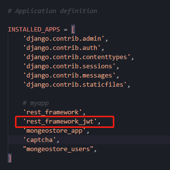
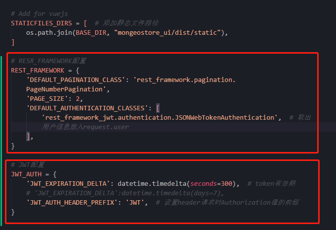
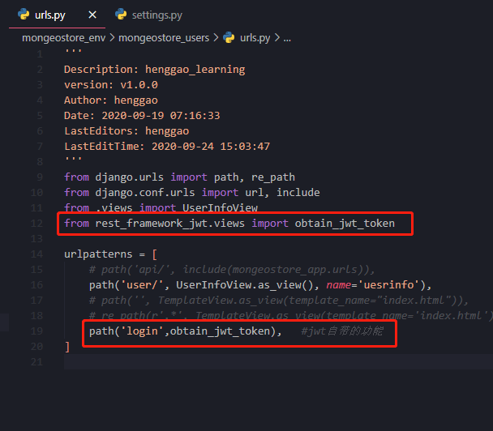
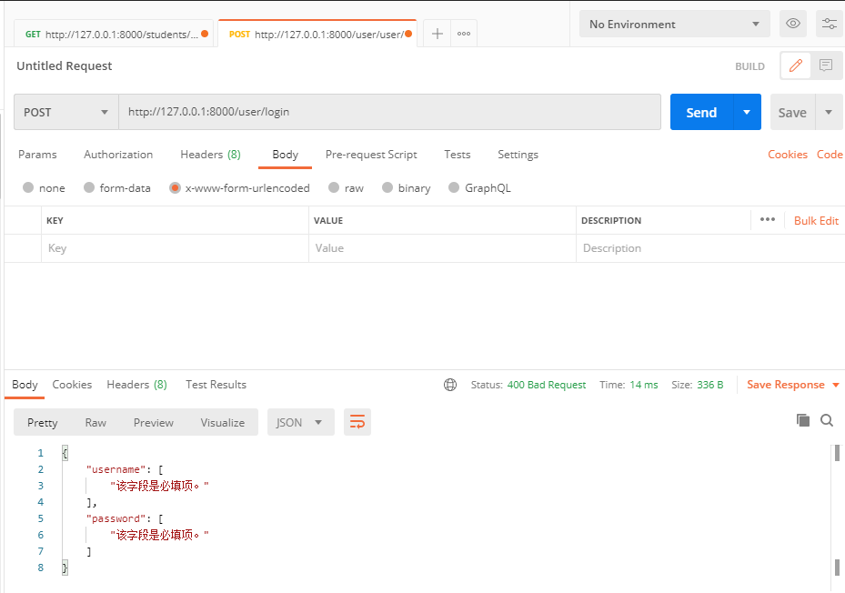

# jwt认证

[TOC]


## 1. 前言

- [简单了解一下jwt](https://www.ruanyifeng.com/blog/2018/07/json_web_token-tutorial.html)


## 2. 安装

```
pip3 install djangorestframework-jwt
```


## 3. 配置

- app中注册，在settings.py添加

  ```
  # Application definition
  
  INSTALLED_APPS = [
      'django.contrib.admin',
      'django.contrib.auth',
      'django.contrib.contenttypes',
      'django.contrib.sessions',
      'django.contrib.messages',
      'django.contrib.staticfiles',
  
      # myapp
      'rest_framework',
      'rest_framework_jwt',
      'mongeostore_app',
      'captcha',
      "mongeostore_users",
  ]
  ```

  
  
  ```python
  # RESR_FRAMEWORK配置
  REST_FRAMEWORK = {
      'DEFAULT_PAGINATION_CLASS': 'rest_framework.pagination.PageNumberPagination',
      'PAGE_SIZE': 2,
      'DEFAULT_AUTHENTICATION_CLASSES': [
          'rest_framework_jwt.authentication.JSONWebTokenAuthentication',  # 取出用户信息放入request.user
      ],
  }
  
  # JWT配置
  JWT_AUTH = {
      'JWT_EXPIRATION_DELTA': datetime.timedelta(seconds=300),  # token有效期
      # 'JWT_EXPIRATION_DELTA':datetime.timedelta(days=7),
      'JWT_AUTH_HEADER_PREFIX': 'JWT',  # 设置header请求时Authorization值的前缀
  }
  
  ```
  
  

- 添加urls配置

```python
from rest_framework_jwt.views import obtain_jwt_token
 urlpatterns = [
     url(r'^jwt-auth/', obtain_jwt_token),
 ]
```



- postman测试一下

  


参考：https://www.shuzhiduo.com/A/QV5ZvP845y/