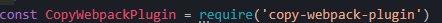
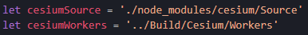
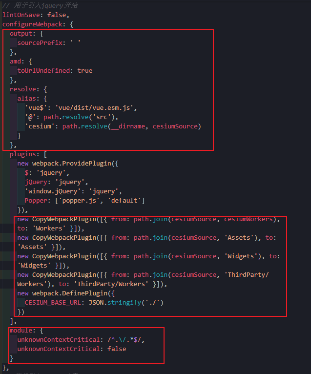
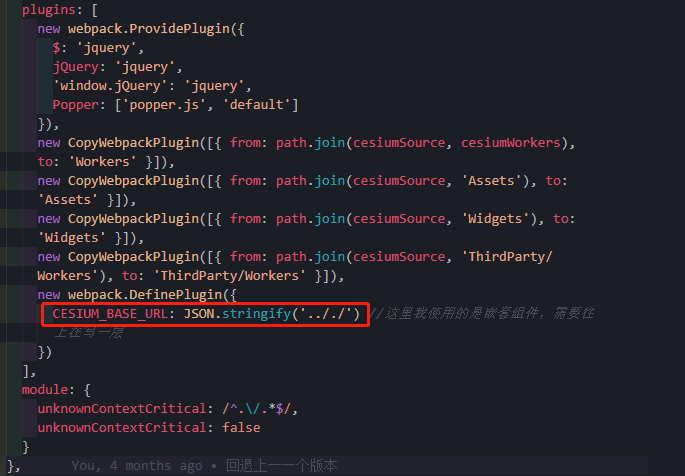
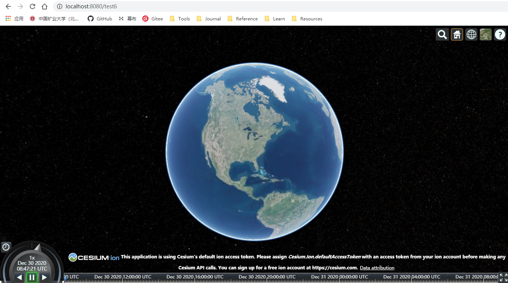

# vue地图可视化 Cesium篇

[TOC]

## 方法一

### 一、cesium 安装

```
npm install cesium --save 
```

### 二、配置文件 vue.config.js

- **说在最前面**：配置完成，一定要重启`npm run serve`，我当时一直汇报`cesium/Widgets/widgets.css`引入问题🤣，重启服务就没了。

- 在项目根目录新增配置文件 vue.config.js,如下（这里我还有其他配置，忽略）

```js
/*
 * @Description: henggao_learning
 * @version: v1.0.0
 * @Author: henggao
 * @Date: 2020-08-29 16:00:58
 * @LastEditors: henggao
 * @LastEditTime: 2020-12-30 16:46:14
 */
const CopyWebpackPlugin = require('copy-webpack-plugin')
const webpack = require('webpack');
const path = require('path');  //引入path模块（node）
// const resolve = (dir) => path.join(__dirname, dir); //将文件组成绝对路径
//导入
let cesiumSource = './node_modules/cesium/Source'
let cesiumWorkers = '../Build/Cesium/Workers'

module.exports = {
  // ico图标设置
  pwa: {
    iconPaths: {
      favicon32: 'favicon.ico',
      favicon16: 'favicon.ico',
      appleTouchIcon: 'favicon.ico',
      maskIcon: 'favicon.ico',
      msTileImage: 'favicon.ico'
    }
  },

  // 跨域配置
  devServer: {
    open: true,
    host: 'localhost',
    port: 8080,
    https: false,
    //以上的ip和端口是我们本机的;下面为需要跨域的
    proxy: {//配置跨域
      '/api': {
        target: 'http://127.0.0.1:8000/api/',//这里后台的地址模拟的;应该填写你们真实的后台接口
        ws: true,
        changOrigin: true,//允许跨域
        pathRewrite: {
          '^/api': ''//请求的时候使用这个api就可以
        }
      }

    }
  },

  // 用于引入jquery开始
  lintOnSave: false,
  configureWebpack: {
    output: {
      sourcePrefix: ' '
    },
    amd: {
      toUrlUndefined: true
    },
    resolve: {
      alias: {
        'vue$': 'vue/dist/vue.esm.js',
        '@': path.resolve('src'),
        'cesium': path.resolve(__dirname, cesiumSource)
      }
    },
    plugins: [
      new webpack.ProvidePlugin({
        $: 'jquery',
        jQuery: 'jquery',
        'window.jQuery': 'jquery',
        Popper: ['popper.js', 'default']
      }),
      new CopyWebpackPlugin([{ from: path.join(cesiumSource, cesiumWorkers), to: 'Workers' }]),
      new CopyWebpackPlugin([{ from: path.join(cesiumSource, 'Assets'), to: 'Assets' }]),
      new CopyWebpackPlugin([{ from: path.join(cesiumSource, 'Widgets'), to: 'Widgets' }]),
      new CopyWebpackPlugin([{ from: path.join(cesiumSource, 'ThirdParty/Workers'), to: 'ThirdParty/Workers' }]),
      new webpack.DefinePlugin({
        CESIUM_BASE_URL: JSON.stringify('./')
      })
    ],
    module: {
      unknownContextCritical: /^.\/.*$/,
      unknownContextCritical: false
    }
  },
  // 用于引入jquery结束
  publicPath: '/',
  // 输出文件目录
  outputDir: 'dist',
  assetsDir: 'static',
  lintOnSave: false,// 关闭eslint
  // webpack相关配置
  chainWebpack: (config) => {
    config.resolve.symlinks(true) //热更新
  },
}
```

- 后添加的配置

  

  

  

  
  
  

- 这里有个小坑💥当我在父组件使用子组件写好的cesium案例时，会出现静态文件错误。所以这里我修改了，问题消失了。😀

  

- 上述问题解决了，新问题又来了🙈

  - 当我们进行`npm run build`进行打包dist，在后端运行，咦，资源文件没了？😩（后续再解决）

### 三、实例

test6.vue 中输入以下代码

```vue
<template>
  <div id="cesiumContainer">
  </div>
</template>

<script>
  import * as Cesium from 'cesium/Cesium'
  import * as widgets from "cesium/Widgets/widgets.css";

  export default {
    name: 'Cesium',
    mounted(){
      var viewer = new Cesium.Viewer('cesiumContainer');
    }
  }
</script>

<style scoped>
</style>


```

### 四、查看

浏览器运行结果如下



- [ref](https://blog.csdn.net/qq_18188119/article/details/111661792)


### 五、例子二

```vue
<template>
  <!-- <div id="cesiumContainer"></div>
   -->
  <div>
    <div id="cesiumContainer" class="fullSize"></div>
    <div id="loadingOverlay"><h1>Loading...</h1></div>
    <div id="toolbar">
      <div id="zoomButtons"></div>
    </div>
  </div>
</template>

<script>
import * as Cesium from "cesium/Cesium";
import * as widgets from "cesium/Widgets/widgets.css";

export default {
  name: "Cesium",
  mounted() {
    // var viewer = new Cesium.Viewer('cesiumContainer');
    var viewer = new Cesium.Viewer("cesiumContainer", {
      shouldAnimate: true,
    });

    var scene = viewer.scene;
    scene.debugShowFramesPerSecond = true;

    Cesium.Math.setRandomNumberSeed(315);

    var modelMatrix = Cesium.Transforms.eastNorthUpToFixedFrame(
      Cesium.Cartesian3.fromDegrees(-75.59777, 40.03883)
    );
    var emitterInitialLocation = new Cesium.Cartesian3(0.0, 0.0, 100.0);

    var particleCanvas;

    function getImage() {
      if (!Cesium.defined(particleCanvas)) {
        particleCanvas = document.createElement("canvas");
        particleCanvas.width = 20;
        particleCanvas.height = 20;
        var context2D = particleCanvas.getContext("2d");
        context2D.beginPath();
        context2D.arc(8, 8, 8, 0, Cesium.Math.TWO_PI, true);
        context2D.closePath();
        context2D.fillStyle = "rgb(255, 255, 255)";
        context2D.fill();
      }
      return particleCanvas;
    }

    var minimumExplosionSize = 30.0;
    var maximumExplosionSize = 100.0;
    var particlePixelSize = new Cesium.Cartesian2(7.0, 7.0);
    var burstSize = 400.0;
    var lifetime = 10.0;
    var numberOfFireworks = 20.0;

    var emitterModelMatrixScratch = new Cesium.Matrix4();

    function createFirework(offset, color, bursts) {
      var position = Cesium.Cartesian3.add(
        emitterInitialLocation,
        offset,
        new Cesium.Cartesian3()
      );
      var emitterModelMatrix = Cesium.Matrix4.fromTranslation(
        position,
        emitterModelMatrixScratch
      );
      var particleToWorld = Cesium.Matrix4.multiply(
        modelMatrix,
        emitterModelMatrix,
        new Cesium.Matrix4()
      );
      var worldToParticle = Cesium.Matrix4.inverseTransformation(
        particleToWorld,
        particleToWorld
      );

      var size = Cesium.Math.randomBetween(
        minimumExplosionSize,
        maximumExplosionSize
      );
      var particlePositionScratch = new Cesium.Cartesian3();
      var force = function (particle) {
        var position = Cesium.Matrix4.multiplyByPoint(
          worldToParticle,
          particle.position,
          particlePositionScratch
        );
        if (Cesium.Cartesian3.magnitudeSquared(position) >= size * size) {
          Cesium.Cartesian3.clone(Cesium.Cartesian3.ZERO, particle.velocity);
        }
      };

      var normalSize =
        (size - minimumExplosionSize) /
        (maximumExplosionSize - minimumExplosionSize);
      var minLife = 0.3;
      var maxLife = 1.0;
      var life = normalSize * (maxLife - minLife) + minLife;

      scene.primitives.add(
        new Cesium.ParticleSystem({
          image: getImage(),
          startColor: color,
          endColor: color.withAlpha(0.0),
          particleLife: life,
          speed: 100.0,
          imageSize: particlePixelSize,
          emissionRate: 0,
          emitter: new Cesium.SphereEmitter(0.1),
          bursts: bursts,
          lifetime: lifetime,
          updateCallback: force,
          modelMatrix: modelMatrix,
          emitterModelMatrix: emitterModelMatrix,
        })
      );
    }

    var xMin = -100.0;
    var xMax = 100.0;
    var yMin = -80.0;
    var yMax = 100.0;
    var zMin = -50.0;
    var zMax = 50.0;

    var colorOptions = [
      {
        minimumRed: 0.75,
        green: 0.0,
        minimumBlue: 0.8,
        alpha: 1.0,
      },
      {
        red: 0.0,
        minimumGreen: 0.75,
        minimumBlue: 0.8,
        alpha: 1.0,
      },
      {
        red: 0.0,
        green: 0.0,
        minimumBlue: 0.8,
        alpha: 1.0,
      },
      {
        minimumRed: 0.75,
        minimumGreen: 0.75,
        blue: 0.0,
        alpha: 1.0,
      },
    ];

    for (var i = 0; i < numberOfFireworks; ++i) {
      var x = Cesium.Math.randomBetween(xMin, xMax);
      var y = Cesium.Math.randomBetween(yMin, yMax);
      var z = Cesium.Math.randomBetween(zMin, zMax);
      var offset = new Cesium.Cartesian3(x, y, z);
      var color = Cesium.Color.fromRandom(
        colorOptions[i % colorOptions.length]
      );

      var bursts = [];
      for (var j = 0; j < 3; ++j) {
        bursts.push(
          new Cesium.ParticleBurst({
            time: Cesium.Math.nextRandomNumber() * lifetime,
            minimum: burstSize,
            maximum: burstSize,
          })
        );
      }

      createFirework(offset, color, bursts);
    }

    var camera = viewer.scene.camera;
    var cameraOffset = new Cesium.Cartesian3(-300.0, 0.0, 0.0);
    camera.lookAtTransform(modelMatrix, cameraOffset);
    camera.lookAtTransform(Cesium.Matrix4.IDENTITY);

    var toFireworks = Cesium.Cartesian3.subtract(
      emitterInitialLocation,
      cameraOffset,
      new Cesium.Cartesian3()
    );
    Cesium.Cartesian3.normalize(toFireworks, toFireworks);
    var angle =
      Cesium.Math.PI_OVER_TWO -
      Math.acos(Cesium.Cartesian3.dot(toFireworks, Cesium.Cartesian3.UNIT_Z));
    camera.lookUp(angle);
  },
};
</script>

<style scoped>
@import url(https://sandcastle.cesium.com/templates/bucket.css);
</style>
```


### 六、Ceisum中使用天地图

```vue
<template>
  <!-- <div id="cesiumContainer"></div>
   -->
  <div>
    <div id="cesiumContainer" class="fullSize"></div>
    <div id="loadingOverlay"><h1>Loading...</h1></div>
    <div id="toolbar">
      <div id="zoomButtons"></div>
    </div>
  </div>
</template>

<script>
import * as Cesium from "cesium/Cesium";
import * as widgets from "cesium/Widgets/widgets.css";

export default {
  name: "Cesium",
  mounted() {
    // var viewer = new Cesium.Viewer('cesiumContainer');
    var viewer = new Cesium.Viewer("cesiumContainer", {
      imageryProvider: new Cesium.WebMapTileServiceImageryProvider({
        url:
          "http://t0.tianditu.com/vec_w/wmts?service=wmts&request=GetTile&version=1.0.0&LAYER=vec&tileMatrixSet=w&TileMatrix={TileMatrix}&TileRow={TileRow}&TileCol={TileCol}&style=default&format=tiles&tk=ebf64362215c081f8317203220f133eb",
        layer: "tdtBasicLayer",
        style: "default",
        format: "tiles",
        tileMatrixSetID: "GoogleMapsCompatible",
        show: true,
        maximumLevel: 18,
      }),
    });
    //中文地名注记
    viewer.imageryLayers.addImageryProvider(
      new Cesium.WebMapTileServiceImageryProvider({
        url:
          "http://t0.tianditu.com/cia_w/wmts?service=wmts&request=GetTile&version=1.0.0&LAYER=cia&tileMatrixSet=w&TileMatrix={TileMatrix}&TileRow={TileRow}&TileCol={TileCol}&style=default.jpg&tk=d6a72a78a43a2c17294b72ab26354cd6",
        layer: "tdtAnnoLayer",
        style: "default",
        format: "tiles",
        tileMatrixSetID: "GoogleMapsCompatible",
        show: true,
      })
    );
  },
};
</script>

<style scoped>
@import url(https://sandcastle.cesium.com/templates/bucket.css);
</style>

```


## 方法二（简单）

### 一、安装

```
npm install vue-cesium --save
```


### 二、使用

```vue
<template>
  <div class="viewer">
    <vc-viewer>
      <vc-layer-imagery></vc-layer-imagery>
    </vc-viewer>
  </div>
</template>

<script>
import Vue from "vue";
import VueCesium from "vue-cesium";
// VueCesium 默认使用 `https://unpkg.com/cesium/Build/Cesium/Cesium.js`
Vue.use(VueCesium, {
  // cesiumPath 是指引用的Cesium.js路径，如
  // 项目本地的Cesium Build包，vue项目需要将Cesium Build包放static目录：
  // cesiumPath: /static/Cesium/Cesium.js
  // 个人在线Cesium Build包：
  // cesiumPath: 'https://zouyaoji.top/vue-cesium/statics/Cesium/Cesium.js'
  // 个人在线SuperMap Cesium Build包（在官方基础上二次开发出来的）：
  // cesiumPath: 'https://zouyaoji.top/vue-cesium/statics/SuperMapCesium/Cesium.js'
  // 官方在线Cesium Build包，有CDN加速，推荐用这个：
  cesiumPath: "https://unpkg.com/cesium/Build/Cesium/Cesium.js",
  // 指定Cesium.Ion.defaultAccessToken，使用Cesium ion的数据源需要到https://cesium.com/ion/申请一个账户，获取Access Token。不指定的话可能导致 Cesium 在线影像加载不了
  accessToken:
    "你的token",
});
export default {};
</script>

<style>
.viewer {
  width: 100%;
  height: 400px;
}
</style>
```


- [api](https://zouyaoji.top/vue-cesium/#/zh/start/usage)

