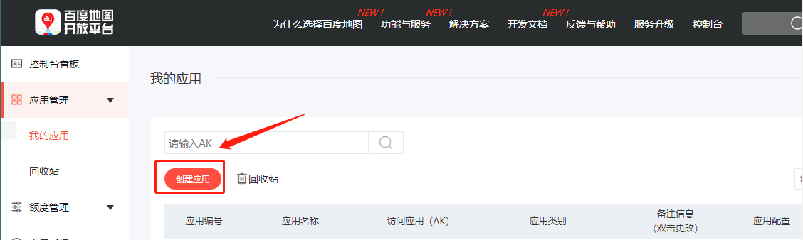
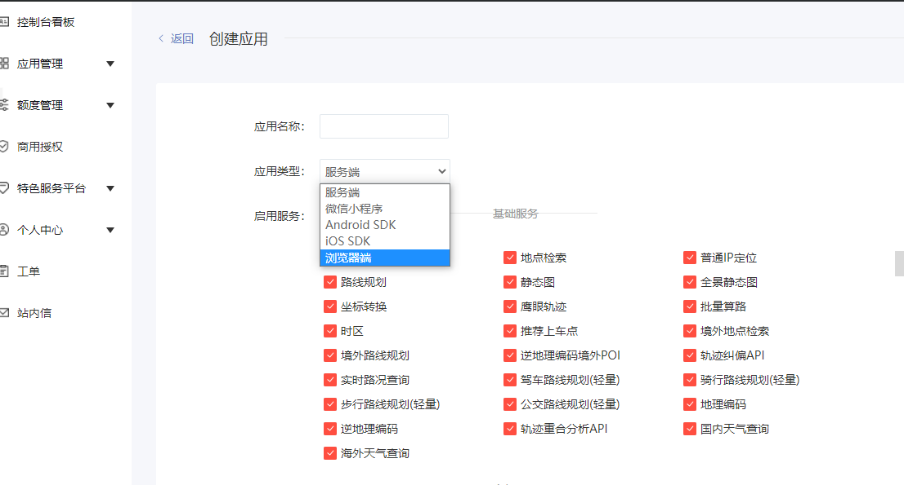
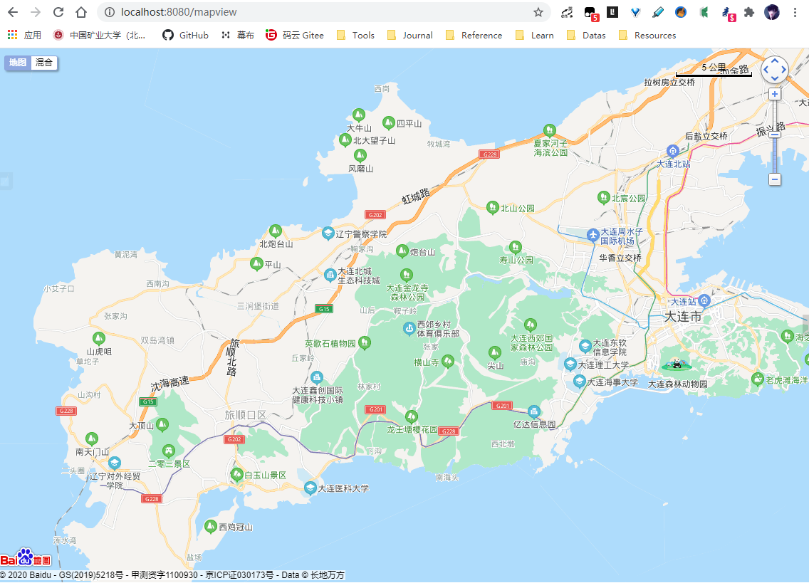
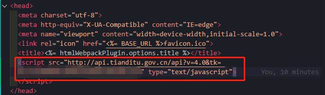
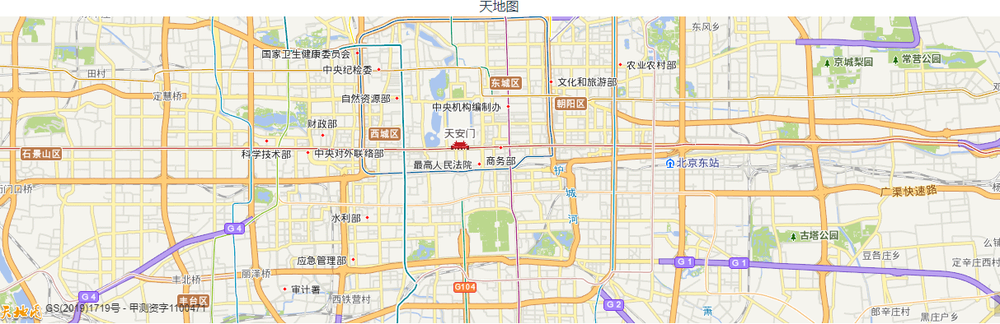

## 1. 百度API使用

[TOC]


### 1.1 申请AK

访问：https://lbsyun.baidu.com/apiconsole/key#/home




选择使用了类型。我这里使用的式浏览器，按提示申请即可。



### 1.2 通过模块化引入的方法

参考：https://github.com/Dafrok/vue-baidu-map

#### 2.1 安装

```
npm i vue-baidu-map --save
```

#### 2.2 初始化

在main.js中添加配置

```js
import Vue from 'vue'
import BaiduMap from 'vue-baidu-map'

Vue.use(BaiduMap, {
  /* Visit http://lbsyun.baidu.com/apiconsole/key for details about app key. */
  ak: 'YOUR_APP_KEY'
})
```

#### 2.3 使用

新建一个MapView.vue，测试。

```vue
<!--
 * @Description: henggao_learning
 * @version: v1.0.0
 * @Author: henggao
 * @Date: 2020-10-06 17:05:32
 * @LastEditors: henggao
 * @LastEditTime: 2020-10-06 18:45:25
-->
<template>
  <div>
    <el-card class="card-back-color card1">
      <div class="baidu-title">
        <h4>百度地图API</h4>
      </div>
      <baidu-map :center="center" :zoom="zoom" @ready="handler" class="map">
        <bm-scale anchor="BMAP_ANCHOR_TOP_RIGHT"></bm-scale>
        <bm-navigation anchor="BMAP_ANCHOR_TOP_RIGHT"></bm-navigation>
        <bm-map-type
          :map-types="['BMAP_NORMAL_MAP', 'BMAP_HYBRID_MAP']"
          anchor="BMAP_ANCHOR_TOP_LEFT"
        ></bm-map-type>
      </baidu-map>
    </el-card>
  </div>
</template>

<script>
export default {
  name: "mapview",
  data() {
    return {
      center: { lng: 0, lat: 0 },
      zoom: 3
    };
  },

  mounted() {
    this.addPoints();
  },
  methods: {
    handler({ BMap, map }) {
      map.enableScrollWheelZoom(true); //开启鼠标滚轮缩放
      console.log(BMap, map);
      this.center.lng = 121.62;
      this.center.lat = 38.92;
      this.zoom = 11.5;
    }
  }
};
</script>

<style>
/* The container of BaiduMap must be set width & height. */
.map {
  width: 100%;
  height: 500px;
}
</style>

```




官方文档功能很全：https://dafrok.github.io/vue-baidu-map/#/zh/start/installation


## 2. 天地图API

### 2.1 申请


### 2.2 使用

#### 2.1.1  在引入script

- public/index.html引入

```js
<script src="http://api.tianditu.gov.cn/api?v=4.0&tk=您的密钥" type="text/javascript"></script>
```




#### 2.1.2 使用

```vue
<template>
  <div>
    <header>天地图</header>
    <div
      id="tMapDiv"
      style="position: absolute; width: 100%; height: 100%"
    ></div>
  </div>
</template>


<script>
export default {
  name: "SpatialIndex",
  data() {
    return {};
  },
  mounted: function () {
    this.loadMap();
  },
  methods: {
    loadMap() {
      var map = new T.Map("tMapDiv");
      map.centerAndZoom(new T.LngLat(116.40769, 39.89945), 12);
    },
  },
};
</script>

<style>
</style>
```

#### 2.1.3 查看

- 浏览器访问

  

  

### 2.3 模板

#### 2.3.1 创建模板

- 在components目录下新建一个TdtMap.vue

  ```vue
  <!--
   * @Description: henggao_learning
   * @version: v1.0.0
   * @Author: henggao
   * @Date: 2020-12-06 10:26:42
   * @LastEditors: henggao
   * @LastEditTime: 2020-12-06 11:30:22
  -->
  <template>
    <div>
      <el-row>
        <el-col :span="24">
          <span
            >当前位置：{{ locatInfo.location }}&nbsp;&nbsp;获取时间：{{
              locatInfo.locatTime
            }}&nbsp;&nbsp;经度：{{ locatInfo.lng }}&nbsp;&nbsp;维度：{{
              locatInfo.lat
            }}</span
          >
          <div id="mapDiv" />
        </el-col>
      </el-row>
    </div>
  </template>
  
  <script>
  import axios from "axios";
  export default {
    name: "TdtMap",
    data() {
      return {
        isMobile: false,
        lddialogwidth: "30%",
        locatInfo: {
          location: "暂无数据",
          locatTime: "暂无数据",
          lng: "暂无数据",
          lat: "暂无数据",
        },
        zoom: 12,
        detailLocation: "",
        locationDialogVisible: false,
        locationNow: false,
      };
    },
    watch: {},
    mounted: function () {
      this.onloadMap();
    },
    methods: {
      //加载天地图
      onloadMap: function () {
        var map;
  
        // 天地图key
        const mapKey = "9c117468801c8405aaddff93da98c1e6";
  
        // 初始化地图对象
        map = new T.Map("mapDiv");
  
        // 设置显示地图的中心点和级别
        map.centerAndZoom(new T.LngLat(116.40969, 38.89945), this.zoom);
  
        // 创建地图类型控件对象
        var _mapType = new T.Control.MapType();
  
        // 添加地图类型控件
        map.addControl(_mapType);
  
        // 创建缩放平移控件对象
        var _zoomControl = new T.Control.Zoom();
  
        // 添加缩放平移控件
        map.addControl(_zoomControl);
  
        // 创建缩放平移控件对象
        _zoomControl.setPosition(T_ANCHOR_TOP_LEFT);
  
        // 创建定位对象lo
        var lo = new T.Geolocation();
  
        // 创建右键菜单对象
        var menu = new T.ContextMenu({
          width: 140,
        });
  
        // 添加右键菜单
        var txtMenuItem = [
          {
            text: "放大",
            callback: () => {
              map.zoomIn();
            },
          },
          {
            text: "缩小",
            callback: () => {
              map.zoomOut();
            },
          },
          {
            text: "放置到最大级",
            callback: () => {
              map.setZoom(18);
            },
          },
          {
            text: "查看全国",
            callback: () => {
              map.setZoom(4);
            },
          },
          {
            text: "获得右键点击处坐标",
            isDisable: false,
            callback: (lnglat) => {
              alert(lnglat.getLng() + "," + lnglat.getLat());
            },
          },
        ];
  
        for (var i = 0; i < txtMenuItem.length; i++) {
          // 添加菜单项
          var item = new T.MenuItem(txtMenuItem[i].text, txtMenuItem[i].callback);
          // item.disable();
          menu.addItem(item);
          if (i === 1 || i === 3) {
            // 添加分割线
            menu.addSeparator();
          }
        }
  
        // 装载菜单
        map.addContextMenu(menu);
  
        // 定位结果回调函数
        function fn(e) {
          // 当前为移动端时
          if (this.getStatus() === 0) {
            map.centerAndZoom(e.lnglat, 15);
            console.log(e);
            // 获取地理位置信息并设置到标注
            getDetailLocation(e.lnglat, e.lnglat);
          }
  
          // 当前为PC端时
          if (this.getStatus() === 1) {
            map.centerAndZoom(e.lnglat, e.level);
            console.log(e);
            // 获取地理位置信息并设置到标注
            getDetailLocation(e.lnglat, e.lnglat);
          }
        }
  
        // 设置标注
        function setMarker(e, d) {
          var marker = new T.Marker(e);
          map.addOverLay(marker);
          var markerInfoWin = new T.InfoWindow("" + d);
          marker.addEventListener("click", function () {
            marker.openInfoWindow(markerInfoWin);
          });
        }
  
        // 暂存this
        const _this = this;
  
        // 通过经纬度获取详细地址
        function getDetailLocation(lnglat_lng, lnglat_lat) {
          axios
            .get("https://api.tianditu.gov.cn/geocoder", {
              params: {
                tk: mapKey,
                type: "geocode",
                postStr:
                  "{'lon':" +
                  lnglat_lng.lng +
                  ",'lat':" +
                  lnglat_lat.lat +
                  ",'ver':1}",
              },
            })
            .then((data) => {
              var addressdata = data.data;
              console.log(addressdata);
              var detaillocation = addressdata.result.formatted_address;
              console.log(detaillocation);
  
              // // 截取地址信息显示
              _this.locatInfo.location = addressdata.result.formatted_address;
              // 获取定位时间
              _this.locatInfo.locatTime = new Date().toLocaleDateString();
              _this.locatInfo.lng = lnglat_lng.lng;
              _this.locatInfo.lat = lnglat_lat.lat;
              console.log(new Date().toLocaleDateString());
              console.log(lnglat_lng.lng);
              console.log(lnglat_lat.lat);
              if (addressdata.msg == "ok" && addressdata.status == 0) {
                // 将位置信息设置到标注
                setMarker(lnglat_lat, detaillocation);
              } else {
                // 错误处理
              }
            })
            .catch((error) => {
              console.log(error);
            });
        }
  
        // 开始定位
        lo.getCurrentPosition(fn);
      },
    },
  };
  </script>
  <style lang="scss" scoped>
  #mapDiv {
    position: absolute;
    z-index: 1;
    width: 100%;
    height: 885px;
  }
  .spanp {
    line-height: 1.5rem;
  }
  </style>
  
  ```

#### 2.3.2 使用模板

- `SpatialIndex.vue`使用

```vue
<template>
  <!-- 使用组件 -->
  <TdtMap />
</template>

<script>
/* 导入组件 */
import TdtMap from "@/components/TdtMap";

export default {
  name: "SpatialIndex",
  components: {
    /* 注册组件 */
    TdtMap,
  },
  data() {
    return {};
  },
  created() {},
  mounted() {},
  watch: {},
  methods: {},
};
</script>

<style scoped>
</style>

```


- 使用参见56数据在天地图上展示

- [ref](https://blog.csdn.net/qq_41912398/article/details/108311876?utm_medium=distribute.pc_relevant.none-task-blog-BlogCommendFromMachineLearnPai2-6.control&depth_1-utm_source=distribute.pc_relevant.none-task-blog-BlogCommendFromMachineLearnPai2-6.control)


## 3. 高德地图API

### 3.1 第一种方式

#### 3.1.1. npm安装(推荐)

```
npm install vue-amap --save
```


#### 3.1.2. 初始化

在main.js中添加配置

```js
import VueAMap from 'vue-amap';
// 高德
Vue.use(VueAMap);
VueAMap.initAMapApiLoader({
  key: "fe5a1d60924e859da081d46619c9f3ae",
  plugin: ['AMap.Autocomplete', 'AMap.PlaceSearch', 'AMap.Scale', 'AMap.OverView', 'AMap.ToolBar', 'AMap.MapType', 'AMap.PolyEditor', 'AMap.CircleEditor'],   //插件
  // v: "1.4.4"  //版本号，默认高德sdk版本为1.4.4，可自行修改
})
// Vue.prototype.VueAMap = VueAMap;
```


#### 3.1.3  使用

```vue
<template>
    <div class="map" id="map">
        <el-amap vid="amapDemo" :center="center" :zoom="zoom" class="amap-demo">
        </el-amap>
    </div>
</template>
<style scoped>
    #map{
		width:500px;
		height:500px;
	}
</style>
<script>
    export default{
		data(){
            return{
                zoom:12,
                center: [121.59996, 31.197646],
            }
		}
	}
</script>
```


- [ref](https://juejin.cn/post/6844904185100681224)


#### 3.1.4 使用AMapUI

需要在public/index.html下引入

```vue
  <script src="https://webapi.amap.com/maps?v=1.4.15&key=fe5a1d60924e859da081d46619c9f3ae"></script>
  <script src="https://webapi.amap.com/ui/1.0/main.js?v=1.0.11"></script>
```


#### 3.1.5 实例

- NationStatisticsMap.vue
- 结合Echarts，查看69小节

```vue
<!--
 * @Description: henggao_learning
 * @version: v1.0.0
 * @Author: henggao
 * @Date: 2020-12-27 09:51:40
 * @LastEditors: henggao
 * @LastEditTime: 2020-12-27 16:24:11
-->
<template>
  <div>
    <div
      id="chart-panel"
      ref="chart"
      style="width: 800px; height: 600px; margin: 0 auto"
    ></div>
    <!-- <remote-script
      src="https://gallerybox.echartsjs.com/dep/echarts/map/js/china.js"
    ></remote-script
    >; -->
  </div>
</template>

<script>
// import $ from "jquery";
import * as echarts from "echarts/lib/echarts";
import china from "echarts/map/js/china.js";
// import china from "@/assets/js/china.js";
// var echarts = require("echarts");
export default {
  name: "SeismicProfile",
  data() {
    return {
      data: "",
      a: "g",
    };
  },
  created() {},
  mounted() {
    // 引入china.json
    this.showDataResource();
  },
  watch: {},
  methods: {
    showDataResource() {
      // 基于准备好的dom，初始化echarts实例
      let myChart = echarts.init(this.$refs.chart);

      $('<div class="back">返 回</div>').appendTo($("#chart-panel"));

      $(".back").css({
        position: "absolute",
        left: "25px",
        top: "25px",
        color: "rgb(179, 239, 255)",
        "font-size": "16px",
        cursor: "pointer",
        "z-index": "100",
      });

      $(".back").click(function () {
        if (parentInfo.length === 1) {
          return;
        }
        parentInfo.pop();
        init(parentInfo[parentInfo.length - 1].code);
      });

      var geoJson = {};

      var parentInfo = [
        {
          cityName: "全国",
          code: 100000,
        },
      ];

      var currentIndex = 0;

      var timeTitle = ["2015", "2016", "2017", "2018", "2019"];
      init(100000);

      function init(adcode) {
        getGeoJson(adcode).then((data) => {
          geoJson = data;
          getMapData();
        });
      }

      //这里我封装了下，直接可以拿过来用
      function getGeoJson(adcode, childAdcode = "") {
        return new Promise((resolve, reject) => {
          function insideFun(adcode, childAdcode) {
            AMapUI.loadUI(["geo/DistrictExplorer"], (DistrictExplorer) => {
              var districtExplorer = new DistrictExplorer();
              districtExplorer.loadAreaNode(adcode, function (error, areaNode) {
                if (error) {
                  console.error(error);
                  reject(error);
                  return;
                }
                let Json = areaNode.getSubFeatures();
                if (Json.length === 0) {
                  let parent =
                    areaNode._data.geoData.parent.properties.acroutes;
                  insideFun(parent[parent.length - 1], adcode);
                  return;
                }

                if (childAdcode) {
                  Json = Json.filter((item) => {
                    return item.properties.adcode == childAdcode;
                  });
                }
                let mapJson = {
                  features: Json,
                };
                resolve(mapJson);
              });
            });
          }
          insideFun(adcode, childAdcode);
        });
      }

      //获取数据
      function getMapData() {
        let mapData = [],
          pointData = [],
          sum = 0;

        geoJson.features.forEach((item) => {
          let value = Math.random() * 3000;
          mapData.push({
            name: item.properties.name,
            value: value,
            cityCode: item.properties.adcode,
          });
          pointData.push({
            name: item.properties.name,
            value: [
              item.properties.center[0],
              item.properties.center[1],
              value,
            ],
            cityCode: item.properties.adcode,
          });
          sum += value;
        });
        mapData = mapData.sort(function (a, b) {
          return b.value - a.value;
        });

        initEchartMap(mapData, sum, pointData);
      }

      //渲染echarts
      function initEchartMap(mapData, sum, pointData) {
        var xData = [],
          yData = [];
        var min = mapData[mapData.length - 1].value;
        var max = mapData[0].value;
        if (mapData.length === 1) {
          min = 0;
        }
        mapData.forEach((c) => {
          xData.unshift(c.name);
          yData.unshift(c.value);
        });
        //这里做个切换，全国的时候才显示南海诸岛  只有当注册的名字为china的时候才会显示南海诸岛
        echarts.registerMap(parentInfo.length === 1 ? "china" : "map", geoJson);
        var option = {
          timeline: {
            data: timeTitle,
            axisType: "category",
            autoPlay: true,
            playInterval: 5000,
            left: "10%",
            right: "10%",
            bottom: "2%",
            width: "80%",
            label: {
              normal: {
                textStyle: {
                  color: "rgb(179, 239, 255)",
                },
              },
              emphasis: {
                textStyle: {
                  color: "#fff",
                },
              },
            },
            currentIndex: currentIndex,
            symbolSize: 10,
            lineStyle: {
              color: "#8df4f4",
            },
            checkpointStyle: {
              borderColor: "#8df4f4",
              color: "#53D9FF",
              borderWidth: 2,
            },
            controlStyle: {
              showNextBtn: true,
              showPrevBtn: true,
              normal: {
                color: "#53D9FF",
                borderColor: "#53D9FF",
              },
              emphasis: {
                color: "rgb(58,115,192)",
                borderColor: "rgb(58,115,192)",
              },
            },
          },
          baseOption: {
            backgroundColor: "#012248",
            title: [
              {
                left: "center",
                top: 10,
                text:
                  parentInfo[parentInfo.length - 1].cityName +
                  "销售额统计图(可点击下钻到县)",
                textStyle: {
                  color: "rgb(179, 239, 255)",
                  fontSize: 16,
                },
              },
              {
                text: "销售总额：" + sum.toFixed(2) + "万",
                left: "center",
                top: "6.5%",
                textStyle: {
                  color: "#FFAC50",
                  fontSize: 26,
                },
              },
            ],
            tooltip: {
              trigger: "axis",
              axisPointer: {
                type: "shadow",
              },
            },
            grid: {
              right: "2%",
              top: "12%",
              bottom: "8%",
              width: "20%",
            },
            toolbox: {
              feature: {
                restore: {
                  show: false,
                },
                dataView: {
                  show: false,
                },
                saveAsImage: {
                  name:
                    parentInfo[parentInfo.length - 1].cityName + "销售额统计图",
                },
                dataZoom: {
                  show: false,
                },
                magicType: {
                  show: false,
                },
              },
              iconStyle: {
                normal: {
                  borderColor: "#1990DA",
                },
              },
              top: 15,
              right: 35,
            },
            geo: {
              map: parentInfo.length === 1 ? "china" : "map",
              zoom: 1.1,
              roam: true,
              left: "10%",
              top: "15%",
              tooltip: {
                trigger: "item",
                formatter: (p) => {
                  let val = p.value[2];
                  if (window.isNaN(val)) {
                    val = 0;
                  }
                  let txtCon =
                    "<div style='text-align:left'>" +
                    p.name +
                    ":<br />销售额：" +
                    val.toFixed(2) +
                    "万</div>";
                  return txtCon;
                },
              },
              label: {
                normal: {
                  show: true,
                  color: "rgb(249, 249, 249)", //省份标签字体颜色
                  formatter: (p) => {
                    switch (p.name) {
                      case "内蒙古自治区":
                        p.name = "内蒙古";
                        break;
                      case "西藏自治区":
                        p.name = "西藏";
                        break;
                      case "新疆维吾尔自治区":
                        p.name = "新疆";
                        break;
                      case "宁夏回族自治区":
                        p.name = "宁夏";
                        break;
                      case "广西壮族自治区":
                        p.name = "广西";
                        break;
                      case "香港特别行政区":
                        p.name = "香港";
                        break;
                      case "澳门特别行政区":
                        p.name = "澳门";
                        break;
                    }
                    return p.name;
                  },
                },
                emphasis: {
                  show: true,
                  color: "#f75a00",
                },
              },
              itemStyle: {
                normal: {
                  areaColor: "#24CFF4",
                  borderColor: "#53D9FF",
                  borderWidth: 1.3,
                  shadowBlur: 15,
                  shadowColor: "rgb(58,115,192)",
                  shadowOffsetX: 7,
                  shadowOffsetY: 6,
                },
                emphasis: {
                  areaColor: "#8dd7fc",
                  borderWidth: 1.6,
                  shadowBlur: 25,
                },
              },
            },
            visualMap: {
              min: min,
              max: max,
              left: "3%",
              bottom: "5%",
              calculable: true,
              seriesIndex: [0],
              inRange: {
                color: ["#24CFF4", "#2E98CA", "#1E62AC"],
              },
              textStyle: {
                color: "#24CFF4",
              },
            },
            xAxis: {
              type: "value",
              scale: true,
              position: "top",
              boundaryGap: false,
              splitLine: {
                show: false,
              },
              axisLine: {
                show: true,
                lineStyle: {
                  color: "#455B77",
                },
              },
              axisTick: {
                show: false,
              },
              axisLabel: {
                margin: 2,
                textStyle: {
                  color: "#c0e6f9",
                },
              },
            },
            yAxis: {
              type: "category",
              nameGap: 16,
              axisLine: {
                show: true,
                lineStyle: {
                  color: "#455B77",
                },
              },
              axisTick: {
                show: false,
              },
              axisLabel: {
                interval: 0,
                textStyle: {
                  color: "#c0e6f9",
                },
              },
              data: xData,
            },
            series: [
              {
                name: timeTitle[currentIndex] + "年销售额度",
                type: "map",
                geoIndex: 0,
                map: parentInfo.length === 1 ? "china" : "map",
                roam: true,
                zoom: 1.3,
                tooltip: {
                  trigger: "item",
                  formatter: (p) => {
                    let val = p.value;
                    if (p.name == "南海诸岛") return;
                    if (window.isNaN(val)) {
                      val = 0;
                    }
                    let txtCon =
                      "<div style='text-align:left'>" +
                      p.name +
                      ":<br />销售额：" +
                      val.toFixed(2) +
                      "万</div>";
                    return txtCon;
                  },
                },
                label: {
                  normal: {
                    show: false,
                  },
                  emphasis: {
                    show: false,
                  },
                },
                data: mapData,
              },
              {
                name: "散点",
                type: "effectScatter",
                coordinateSystem: "geo",
                rippleEffect: {
                  brushType: "fill",
                },
                itemStyle: {
                  normal: {
                    color: "#F4E925",
                    shadowBlur: 10,
                    shadowColor: "#333",
                  },
                },
                data: pointData,

                symbolSize: function (val) {
                  let value = val[2];
                  if (value == max) {
                    return 27;
                  }
                  return 10;
                },
                showEffectOn: "render", //加载完毕显示特效
              },
              {
                type: "bar",
                barGap: "-100%",
                barCategoryGap: "60%",
                itemStyle: {
                  normal: {
                    color: "#11AAFE",
                  },
                  emphasis: {
                    show: false,
                  },
                },
                data: yData,
              },
            ],
          },
        };

        myChart.setOption(option, true);

        //点击前解绑，防止点击事件触发多次
        myChart.off("click");
        myChart.on("click", echartsMapClick);

        //监听时间切换事件
        myChart.off("timelinechanged");
        myChart.on("timelinechanged", (params) => {
          currentIndex = params.currentIndex;
          getMapData();
        });
      }

      //echarts点击事件
      function echartsMapClick(params) {
        if (!params.data) {
          return;
        } else {
          //如果当前是最后一级，那就直接return
          if (parentInfo[parentInfo.length - 1].code == params.data.cityCode) {
            return;
          }
          let data = params.data;
          parentInfo.push({
            cityName: data.name,
            code: data.cityCode,
          });
          init(data.cityCode);
        }
      }
      // 使用刚指定的配置项和数据显示图表。
      // mychart.setOption(option); // 加上true表示不合并配置
    },
  },
};
</script>

<style lang="scss" scoped>
</style>
```


- 浏览器查看

  

  

### 3.2. 第二种方式

#### 3.2.1 通过CDN引入

```
<script src="https://unpkg.com/vue-amap/dist/index.js"><script>
```

#### 3.2.2 vue.config.js中配置（下面我没测试）

```
module.exports = {
    // ...

    configureWebpack(config) {
        // ...

        config.externals = {
            'AMap': 'AMap' // 高德地图配置
        }
    }
}
```


#### 3.2.3 该功能的组件中引入：

```
import AMap from "AMap"
```

