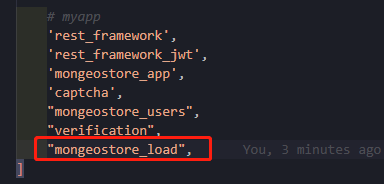
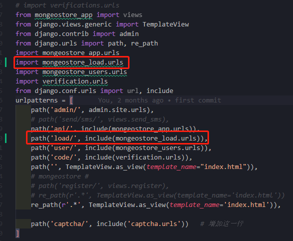

# 大文件上传

[TOC]

## 准备

- 参考：http://blog.gqylpy.com/gqy/16543/

### 1、安装

```shell
npm install vue-simple-uploader --save

# 使用md5 需要安装
npm install --save spark-md5
```

### 2、`main.js`配置

```js
import uploader from 'vue-simple-uploader'
Vue.use(uploader)
```

### 3、`Vue`部分

```vue

```


## 后端

1、创建上传模块

```
python manage.py startapp mongeostore_load
```

2、在`settings.py`中添加应用



3、在根目录`mongeostore_v1`中`urls.py`中设置




4、`models.py`

```

```

5、`serializers.py`

```

```

6、`views.py`

```

```


