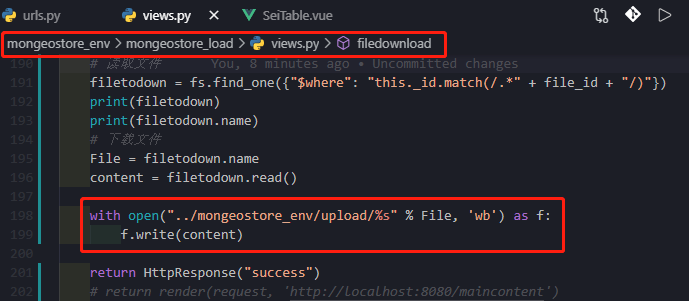
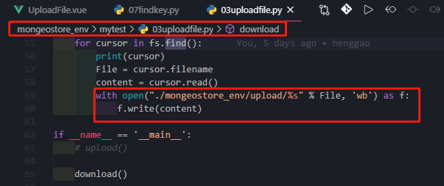
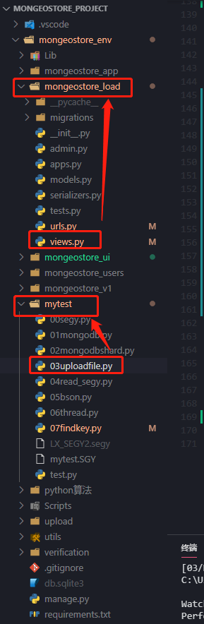

# 文件下载
[TOC]

## 前言

- django提供文件下载时，若果文件较小，解决办法是先将要传送的内容全生成在内存中，然后再一次性传入Response对象中：

- 如果文件非常大时，最简单的办法就是使用静态文件服务器，比如Apache或者Nginx服务器来处理下载。不过有时候，我们需要对用户的权限做一下限定，或者不想向用户暴露文件的真实地址，或者这个大内容是临时生成的(比如临时将多个文件合并而成的)，这时就不能使用静态文件服务器了。

- django文档中提到，可以向`HttpResponse`传递一个迭代器，流式的向客户端传递数据。
- django也提供了`StreamingHttpResponse`类来代替`HttpResponse`对流数据进行处理。
- 不过不管怎么样，使用django来处理大文件下载都不是一个很好的注意，最好的办法是django做权限判断，然后让静态服务器处理下载。
- Apache服务器里需要`mod_xsendfile`模块来实现，而Nginx是通过称为`X-Accel-Redirect`的特性来实现。
- `sendfile`是现代操作系统支持的一种高性能网络IO方式，操作系统内核的`sendfile`调用可以将文件内容直接推送到网卡的`buffer`当中，从而避免了`Web`服务器读写文件的开销，实现了“零拷贝”模式。 “
- [ref](https://www.mscto.com/python/161441.html)

## `HttpResponse`与`StreamingHttpResponse`、`FileResponse`

`HttpResponse`有个很大的弊端，其工作原理是先读取文件，载入内存，然后再输出。如果下载文件很大，该方法会占用很多内存。对于下载大文件，Django更推荐`StreamingHttpResponse`和`FileResponse`方法，这两个方法将下载文件分批(Chunks)写入用户本地磁盘，先不将它们载入服务器内存。


## 文件下载

- `SeiTable.vue`

- 实质是在下载按钮处添加一个a标签

```vue
<!--
 * @Description: henggao_learning
 * @version: v1.0.0
 * @Author: henggao
 * @Date: 2020-10-06 21:09:44
 * @LastEditors: henggao
 * @LastEditTime: 2020-11-03 21:07:42
-->
<template>
  <div class="seismictable" style="overflow: scroll;max-height: 750px;">
    <table class="table table-hover">
      <thead>
        <tr>
          <th scope="col">_id</th>
          <th scope="col">filename</th>
          <th scope="col">contentType</th>
          <th scope="col">length</th>
          <th scope="col">uploadDate</th>
          <th scope="col">publisher</th>
          <th scope="col">aliases</th>
          <th scope="col">metadata</th>
          <th scope="col">md5</th>
          <th scope="col">chunkSize</th>
          <th scope="col">operate</th>
        </tr>
      </thead>
      <tbody id="list"></tbody>
      <!-- <tbody>
        <tr v-for="file in files">
          <td v-text="file._id"></td>
          <td v-text="file.filename"></td>
          <td v-text="file.contentType"></td>
          <td v-text="file.length"></td>
          <td v-text="file.uploadDate"></td>
          <td v-text="file.publisher"></td>
          <td v-text="file.aliases"></td>
          <td v-text="file.metadata"></td>
          <td v-text="file.md5"></td>
          <td v-text="file.chunkSize"></td>
        </tr>
      </tbody> -->
      <!-- <tbody>
        <tr>
          <th scope="row">1</th>
          <td>Mark</td>
          <td>Otto</td>
          <td>@mdo</td>
        </tr>
        <tr>
          <th scope="row">2</th>
          <td>Jacob</td>
          <td>Thornton</td>
          <td>@fat</td>
        </tr>
        <tr>
          <th scope="row">2</th>
          <td>Jacob</td>
          <td>Thornton</td>
          <td>@fat</td>
          <td>{{files.filename}}</td>
        </tr>
        <tr>
          <th scope="row">3</th>
          <td colspan="2">Larry the Bird</td>
          <td>@twitter</td>
        </tr>
      </tbody> -->
    </table>
  </div>
</template>

<script>
import axios from "axios";

export default {
  name: "SeiTable",
  data() {
    return {
      files: [],
      _id: ""
    };
  },
  created() {
    this.showFile();
  },
  mounted() {
    // this.showFile();
  },
  methods: {
    showFile() {
      const url = "http://127.0.0.1:8000/load/fileshow/";
      axios.get(url).then(response => {
        // var res = JSON.parse(response.bodyText);
        console.log(response);
        console.log(response.data.filename);
        var result = response.data.list;
        this.files = result;
        $(response.data.list).each(function(i, values) {
          const url = "http://127.0.0.1:8000/load/filedownload/?_id=";
          $("#list").append(
            "<tr><td>" +
              values._id +
              "</td>" +
              "<td><a href='getBookByname?name='>" +
              values.filename +
              "</ta></td>" +
              "<td>" +
              values.contentType +
              "</td>" +
              "<td>" +
              values.length +
              "</td>" +
              "<td>" +
              values.uploadDate +
              "</td>" +
              "<td>" +
              values.publisher +
              "</td>" +
              "<td>" +
              values.aliases +
              "</td>" +
              "<td>" +
              values.metadata +
              "</td>" +
              "<td>" +
              values.md5 +
              "</td>" +
              "<td>" +
              values.chunkSize +
              "</td>" +
              "<td>" +
              '<button type="button" v-on:click="download" class="btn btn-info">' +
              "<a href=" +
              url +
              values._id +
              ">" +
              "DownLoad" +
              "</button>" +
              "</td></tr>"
          );
        });
        // table
      });
    }
  },
  // download(fileName, data) {
  //   const url = "http://127.0.0.1:8000/load/filedownload/";
  //   if (!data) {
  //     return;
  //   }
  //   axios
  //     .post(url, {
  //       data: postData
  //     })
  //     .then(res => {
  //       console.log("走的res");
  //     })
  //     .catch(err => {
  //       console.log("走的catch");
  //     });
  // }
};
</script>

<style>
.seismictable {
  border: 0;
  padding: 0;
  height: 720px;
}
</style>
```


- `views.py`

```python

@require_http_methods(['GET'])
def filedownload(request):
    """
    docstring
    """
    client = MongoClient("192.168.55.110", 20000)  # 连接MongoDB数据库

    # file_id1 = request.FILES.get("_id", None)
    # file_id2 = request.POST.get("_id")
    file_id = request.GET.get("_id")
    # print(file_id1)
    # print(file_id2)
    print(file_id)
    db = client.segyfile  # 选定数据库，设定数据库名称为segyfile
    fs = GridFS(db, collection='mysegy')  # 连接GridFS集合，名称为mysegy

    # 读取文件
    filetodown = fs.find_one({"$where": "this._id.match(/.*" + file_id + "/)"})
    print(filetodown)
    print(filetodown.name)
    # 下载文件
    File = filetodown.name
    content = filetodown.read()

    with open("../mongeostore_env/upload/%s" % File, 'wb') as f:
        f.write(content)

    return HttpResponse("success")
    # return render(request, 'http://localhost:8080/maincontent')
```


## 注意点

- 注意`fs.find()`与`fs.find_one()`

```
file_sub = fs.find_one(
    {"$where": "this._id.match(/.*o_1em6kn1f71cje1d7r10tjepo18lhk/)"})
```


## 疑问

- 有个问题，就是下载后会跳转到另一个页面

- 这里有个有趣的问题，我还没明白QAQ

  - views.py

  

  - uploadfile.py

  

  - 目录结构如下

  

  