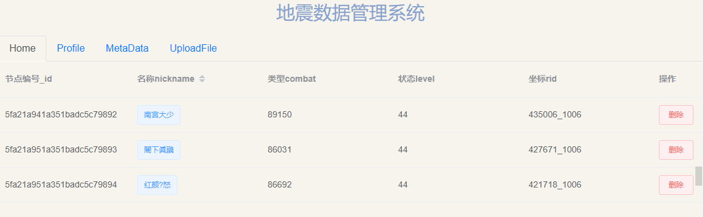

# 生成表格数据

[TOC]

## 一、实例

- `views.py`

```python
from bson.json_util import dumps
@require_http_methods(['GET'])
def ShowData(request):
    """
    docstring
    """
    client = pymongo.MongoClient("192.168.55.110", 20000)
    database = "segyfile"
    db = client[database]
    collection = "data"
    db_coll = db[collection]
    # 查询
    content= {}
    datainfo = []
    for document in db_coll.find():

        print(document)
        print(type(document))
        # print(document.vip)
        # response['_id'] = str(document._id)
        datainfo.append(document)
        content = dumps(datainfo)
        # return HttpResponse(json.dumps(document), content_type="application/json")
        # return json.loads(json_util.dumps(document))
        print(type(content))
    return HttpResponse(content,"application/json")
```

- `Data.vue`

```vue
<!--
 * @Description: henggao_learning
 * @version: v1.0.0
 * @Author: henggao
 * @Date: 2020-11-04 17:05:21
 * @LastEditors: henggao
 * @LastEditTime: 2020-11-05 10:03:23
-->
<template>
  <el-table
    class="tb-edit"
    highlight-current-row
    :data="tableData"
    style="width: 100%"
    max-height="740"
  >
    <template v-for="(col, index) in cols">
      <el-table-column
        v-if="col.nickname === 'normal'"
        :key="index"
        :prop="col.prop"
        :label="col.label"
      ></el-table-column>
      <el-table-column
        v-if="col.nickname === 'sort'"
        :key="col.nickname"
        :prop="col.prop"
        sortable
        :label="col.label"
      >
        <template slot-scope="scope">
          <el-tag type="primary">{{ scope.row.nickname }}</el-tag>
        </template>
      </el-table-column>
    </template>
    <el-table-column fixed="right" label="操作" width="80">
      <template slot-scope="scope">
        <el-button
          @click.native.prevent="deleteRow(scope.$index, tableData)"
          type="danger"
          plain
          size="small"
        >
          删除
        </el-button>
      </template>
    </el-table-column>
  </el-table>
</template>

<script>
import axios from "axios";
export default {
  name: "Data",
  data() {
    return {
      // cols prop属性值都是作为 tableData的属性
      cols: [
        { label: "节点编号_id", prop: "_id.$oid", nickname: "normal" },
        { label: "名称nickname", prop: "nickname", nickname: "sort" },
        { label: "类型combat", prop: "combat", nickname: "normal" },
        { label: "状态level", prop: "level", nickname: "normal" },
        { label: "坐标rid", prop: "rid", nickname: "normal" }
      ],
      tableData: [
        {
          node: "0051",
          name: " 机库顶",
          type: "UWB",
          status: "正常",
          coordinate: "12.21,34.45,34.6"
        },
        {
          node: "0061",
          name: "机库门",
          type: "GPS",
          status: "低电",
          coordinate: "45.41,67.45,78.6"
        },
        {
          node: "0061",
          name: "机库门",
          type: "GPS",
          status: "低电",
          coordinate: "45.41,67.45,78.6"
        }
      ]
    };
  },
  created() {
    this.showData();
  },
  methods: {
    deleteRow(index, rows) {
      rows.splice(index, 1);
    },
    handleCurrentChange(row, event, column) {
      console.log(row, event, column, event.currentTarget);
    },
    handleEdit(index, row) {
      console.log(index, row);
    },
    handleDelete(index, row) {
      console.log(index, row);
    },
    showData() {
      const url = "http://127.0.0.1:8000/load/showdata/";
      axios.get(url).then(response => {
        // var res = JSON.parse(response.bodyText);
        console.log(response);
        console.log(response.data);
        console.log("取到单个数据");
        console.log(typeof response.data);
        // let detailsnew = JSON.parse(JSON.stringify(this.detailslist));
        // var datatset = [];
        // datatset.push(response.data);
        // console.log(typeof datatset);
        // console.log(datatset);
        // datatset = response.data
        // console.log(datatset)
        // console.log(this.tableData)
        // console.log(typeof this.tableData)
        // this.tableData = datatset;
        this.tableData = response.data;
        console.log(this.tableData);
        console.log(typeof this.tableData);
      });
    }
  }
};
</script>
```

运行效果：



- [ref1](https://blog.csdn.net/zhan_lijian/article/details/87686717)
- [ref2](https://element.eleme.cn/#/zh-CN/component/table)


## 二、注意

- 这里涉及数组、json字符串、json对象转换问题


## 三、问题

### 1、问题描述：Object of type ObjectId is not JSON serializable

Object of type ObjectId is not JSON serializable

- 解决：使用dumps转换一下

  ```
  from bson.json_util import dumps
  	content = dumps(datainfo)
  ```

- [ref](https://api.mongodb.com/python/current/api/bson/json_util.html)

- [ref1](https://www.crifan.com/flask_return_mongodb_collection_typerror_object_of_type_objectid_is_not_json_serializable/)
- [ref2](https://blog.csdn.net/weixin_42301462/article/details/81392964)


### 2、问题描述：如何解决VUE数组中{`_ob_`：Observer}的取值问题

下面给出一个解决的方法：

JSON.parse(JSON.stringify(data))


### 四、后续

- 将表格头部字段col使用后端返回值列表生成

- `Data.vue`

  ```js
   showData() {
        const url = "http://127.0.0.1:8000/load/showdata/";
        axios.get(url).then(response => {
          // var res = JSON.parse(response.bodyText);
          console.log(response);
          console.log(response.data);
          console.log("取到单个数据");
          console.log(typeof response.data);
          // let detailsnew = JSON.parse(JSON.stringify(this.detailslist));
          // var datatset = [];
          // datatset.push(response.data);
          // console.log(typeof datatset);
          // console.log(datatset);
          // datatset = response.data
          // console.log(datatset)
          // console.log(this.tableData)
          // console.log(typeof this.tableData)
          // this.tableData = datatset;
          this.tableData = response.data;
          console.log(this.tableData);
          console.log(typeof this.tableData);
          // 获取字段信息
          // this.cols = ""
          let tmp = response.data[0];
          console.log(tmp);
          var listcol = [];
          for (var key in tmp) {
            //  { label: "节点编号_id", prop: "_id.$oid", nickname: "normal" },
            //   console.log(key);
            //   console.log(typeof key);
            // console.log(key[1])
            listcol.push({
              label: key,
              prop: key,
              nickname: "normal"
            });
          }
          // console.log(listcol);
          listcol[0].prop = "_id.$oid"; //_id是一个对象，取值
          listcol[6].nickname = "sort"; //按字段设置排序
          this.cols = listcol;
        });
      }
  ```

  

- 完成生成分页

  ```vue
  <!--
   * @Description: henggao_learning
   * @version: v1.0.0
   * @Author: henggao
   * @Date: 2020-11-04 17:05:21
   * @LastEditors: henggao
   * @LastEditTime: 2020-11-05 17:25:34
  -->
  <template>
    <div class="DataShow">
      <el-table
        class="tb-edit"
        highlight-current-row
        :data="
          tableData.slice((currentPage - 1) * PageSize, currentPage * PageSize)
        "
        style="width: 100%"
        max-height="740"
      >
        <template v-for="(col, index) in cols">
          <el-table-column
            v-if="col.nickname === 'normal'"
            :key="index"
            :prop="col.prop"
            :label="col.label"
          ></el-table-column>
          <el-table-column
            v-if="col.nickname === 'sort'"
            :key="col.nickname"
            :prop="col.prop"
            sortable
            :label="col.label"
          >
            <template slot-scope="scope">
              <el-tag type="primary">{{ scope.row.nickname }}</el-tag>
            </template>
          </el-table-column>
        </template>
        <el-table-column fixed="right" label="操作" width="80">
          <template slot-scope="scope">
            <el-button
              @click.native.prevent="deleteRow(scope.$index, tableData)"
              type="danger"
              plain
              size="small"
            >
              删除
            </el-button>
          </template>
        </el-table-column>
      </el-table>
      <div class="block">
        <el-pagination
          @size-change="handleSizeChange"
          @current-change="handleCurrentChange"
          :current-page="currentPage"
          :page-sizes="pageSizes"
          :page-size="PageSize"
          layout="total, sizes, prev, pager, next, jumper"
          :total="totalCount"
        >
        </el-pagination>
      </div>
    </div>
  </template>
  
  <script>
  import axios from "axios";
  export default {
    name: "Data",
    data() {
      return {
        // cols prop属性值都是作为 tableData的属性
        cols: [
          { label: "节点编号_id", prop: "_id.$oid", nickname: "normal" },
          { label: "名称nickname", prop: "nickname", nickname: "sort" },
          { label: "类型combat", prop: "combat", nickname: "normal" },
          { label: "状态level", prop: "level", nickname: "normal" },
          { label: "坐标rid", prop: "rid", nickname: "normal" }
        ],
        //   表格数据
        tableData: [
          {
            node: "0051",
            name: " 机库顶",
            type: "UWB",
            status: "正常",
            coordinate: "12.21,34.45,34.6"
          },
          {
            node: "0061",
            name: "机库门",
            type: "GPS",
            status: "低电",
            coordinate: "45.41,67.45,78.6"
          },
          {
            node: "0061",
            name: "机库门",
            type: "GPS",
            status: "低电",
            coordinate: "45.41,67.45,78.6"
          }
        ],
        // 分页数据，默认第几页
        currentPage: 1,
        // 总条数，根据接口获取数据长度(注意：这里不能为空)
        totalCount: 400,
        // 个数选择器（可修改）
        pageSizes: [10, 20, 30, 40],
        // 默认每页显示的条数（可修改)
        PageSize: 9
      };
    },
    created() {
      this.showData();
    },
    methods: {
      deleteRow(index, rows) {
        rows.splice(index, 1);
      },
      handleCurrentChange(row, event, column) {
        console.log(row, event, column, event.currentTarget);
      },
      handleEdit(index, row) {
        console.log(index, row);
      },
      handleDelete(index, row) {
        console.log(index, row);
      },
      showData(n1, n2) {
        const url = "http://127.0.0.1:8000/load/showdata/";
        axios
          .get(url, {
            orgCode: 1,
            // 每页显示的条数
            PageSize: n1,
            // 显示第几页
            currentPage: n2
          })
          .then(response => {
            // var res = JSON.parse(response.bodyText);
            console.log(response);
            console.log(response.data);
            console.log("取到单个数据");
            console.log(typeof response.data);
            // let detailsnew = JSON.parse(JSON.stringify(this.detailslist));
            // var datatset = [];
            // datatset.push(response.data);
            // console.log(typeof datatset);
            // console.log(datatset);
            // datatset = response.data
            // console.log(datatset)
            // console.log(this.tableData)
            // console.log(typeof this.tableData)
            // this.tableData = datatset;
            // 将数据赋值给tableData
            this.tableData = response.data;
            // 分页所需信息
            // 将数据的长度赋值给totalCount
            this.totalCount = response.data.length;
  
            console.log(this.tableData);
            console.log(typeof this.tableData);
            // 获取字段信息
            // this.cols = ""
            let tmp = response.data[0];
            console.log(tmp);
            var listcol = [];
            for (var key in tmp) {
              //  { label: "节点编号_id", prop: "_id.$oid", nickname: "normal" },
              //   console.log(key);
              //   console.log(typeof key);
              // console.log(key[1])
              listcol.push({
                label: key,
                prop: key,
                nickname: "normal"
              });
            }
            // console.log(listcol);
            listcol[0].prop = "_id.$oid"; //_id是一个对象，取值
            listcol[6].nickname = "sort"; //按字段设置排序
            this.cols = listcol;
          });
      },
      // 分页
      // 每页显示的条数
      handleSizeChange(val) {
        console.log(`每页 ${val} 条`);
        // 改变每页显示的条数
        this.PageSize = val;
        // 点击每页显示的条数时，显示第一页
        this.showData(val, 1);
        // 注意：在改变每页显示的条数时，要将页码显示到第一页
        this.currentPage = 1;
      },
      // 显示第几页
      handleCurrentChange(val) {
        console.log(`当前页: ${val}`);
        // 改变默认的页数
        this.currentPage = val;
        // 切换页码时，要获取每页显示的条数
        this.showData(this.PageSize, val * this.pageSize);
      }
    }
  };
  </script>
  
  
  <style lang="less" scoped>
  .DataShow {
    height: 720px;
  }
  </style>
  ```

  

- [ref](https://www.jb51.net/article/176395.htm)