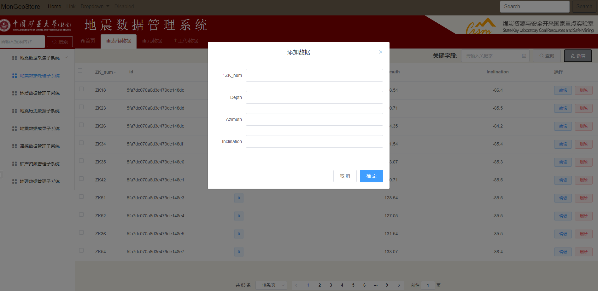
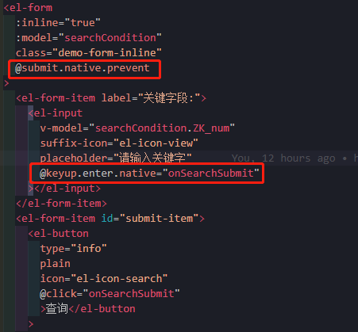

# 添加和查询

[TOC]

## 1、样式设置

### 1、 前端

- `Data.vue`

- template

  ```vue
   <!--搜索头 开始-->
          <section id="search-title">
            <el-form
              :inline="true"
              :model="searchCondition"
              class="demo-form-inline"
            >
              <el-form-item label="关键字段:">
                <el-input
                  v-model="searchCondition.ZK_num"
                  suffix-icon="el-icon-date"
                  placeholder="请输入关键字"
                ></el-input>
              </el-form-item>
              <el-form-item id="submit-item">
                <el-button
                  type="info"
                  plain
                  icon="el-icon-search"
                  @click="onSearchSubmit"
                  >查询</el-button
                >
              </el-form-item>
              <el-form-item id="addNew-item">
                <el-button
                  type="info"
                  plain
                  icon="el-icon-edit"
                  @click="addNewHandler"
                  >新增</el-button
                >
              </el-form-item>
            </el-form>
          </section>
          <!--搜索头 结束-->
  ```

- data(){}

  ```js
  // 搜索对象
        searchCondition: {
          ZK_num: "",
          Depth: "",
          _id: ""
        }
  ```

- methods:{}

  ```js
  // 开始搜索
      onSearchSubmit() {
        // this.initAdminList(1);
        console.log(this.searchCondition.ZK_num);
      },
      // 添加数据
      addNewHandler() {
        this.addNew.visible = true;
      },
  ```


- [ref](https://blog.csdn.net/weixin_42614080/article/details/104216967)


## 一、添加

### 1、 前端

- `Data.vue`

```vue
<!--
 * @Description: henggao_learning
 * @version: v1.0.0
 * @Author: henggao
 * @Date: 2020-11-04 17:05:21
 * @LastEditors: henggao
 * @LastEditTime: 2020-11-13 09:30:11
-->
<template>
  <div class="DataShow">
    <el-container>
      <el-header class="data_search">
        <!--搜索头 开始-->
        <section id="search-title" style="min-width: 500px">
          <el-form
            :inline="true"
            :model="searchCondition"
            class="demo-form-inline"
            @submit.native.prevent
          >
            <el-form-item label="钻孔号:">
              <el-input
                v-model="searchCondition.ZK_num"
                suffix-icon="el-icon-view"
                placeholder="请输入钻孔号"
                @keyup.enter.native="onSearchSubmit"
              ></el-input>
            </el-form-item>
            <el-form-item id="submit-item">
              <el-button
                type="info"
                plain
                icon="el-icon-search"
                @click="onSearchSubmit"
                >查询</el-button
              >
            </el-form-item>
            <el-form-item id="submit-reset">
              <el-button
                type="info"
                plain
                icon="el-icon-refresh"
                @click="showData"
                >重置</el-button
              >
            </el-form-item>
            <el-form-item id="addNew-item">
              <el-button
                type="info"
                plain
                icon="el-icon-edit"
                @click="dialogVisible = true"
                >新增</el-button
              >
            </el-form-item>
          </el-form>
        </section>
        <!--搜索头 结束-->
        <!-- <SearchData /> -->
      </el-header>
      <el-main class="data_content">
        <div class="data_table" style="overflow: hidden">
          <!-- 注意里面max-height字段设置高度  tableData放列表数据 -->
          <el-table
            class="tb-edit"
            highlight-current-row
            :data="
              tableData.slice(
                (currentPage - 1) * PageSize,
                currentPage * PageSize
              )
            "
            style="width: 100%"
            max-height="690px"
            :default-sort="{ prop: 'Depth', order: 'Depth' }"
            @selection-change="handleSelectionChange"
          >
            <!-- 选择框设置 -->
            <el-table-column type="selection" width="55"> </el-table-column>
            <!-- 添加_id字段 -->
            <el-table-column label="_id" prop="_id.$oid"> </el-table-column>
            <!-- 筛选字段 filters,这只是筛选当页的-->
            <el-table-column
              fixed="left"
              label="ZK_num"
              prop="ZK_num"
              width="100"
              :filters="filter_data"
              :filter-method="filterHandler"
            ></el-table-column>
            <!-- 生成关键词 cols存放关键词-->
            <!-- <template v-for="(col, index) in cols"> -->
            <template v-for="col in cols">
              <!-- 设置排序字段 -->
              <el-table-column
                v-if="col.Depth === 'normal'"
                :key="col._id"
                :prop="col.prop"
                :label="col.label"
                align="center"
              >
                <!-- 每一行数据 -->
                <template slot-scope="scope">
                  <div v-if="!scope.row.isEdit">{{ scope.row[col.prop] }}</div>
                  <div v-else>
                    <el-input v-model="scope.row[col.prop]"></el-input>
                  </div>
                </template>
              </el-table-column>
              <el-table-column
                v-if="col.Depth === 'sort'"
                :key="col._id"
                :prop="col.prop"
                sortable
                :label="col.label"
              >
                <template slot-scope="scope">
                  <!-- 生成标签 -->
                  <el-tag type="primary">{{ scope.row.Depth }}</el-tag>
                </template>
              </el-table-column>
            </template>
            <el-table-column fixed="right" label="操作" width="160">
              <template slot-scope="scope">
                <el-button
                  type="primary"
                  plain
                  size="mini"
                  @click="handleEdit(scope.$index, scope.row)"
                  >{{ scope.row.isEdit ? "保存" : "编辑" }}</el-button
                >
                <el-button
                  @click.native.prevent="
                    deleteRow(scope.$index, tableData, scope.row)
                  "
                  type="danger"
                  plain
                  size="mini"
                >
                  删除
                </el-button>
              </template>
            </el-table-column>
          </el-table>
        </div>
        <!-- 分页 -->
        <div class="block" style="overflow: hidden">
          <el-pagination
            @size-change="handleSizeChange"
            @current-change="handleCurrentChange"
            :current-page.sync="currentPage"
            :page-sizes="pageSizes"
            :page-size="PageSize"
            layout="total, sizes, prev, pager, next, jumper"
            :total="totalCount"
          >
          </el-pagination>
        </div>
        <!-- 下面这个用来设置点击添加按钮的弹出框，里面可以进行嵌套表格来展示弹出的表格信息,使用下面的:visible.sync来控制显示与否。里面绑定的是我们新设置的值，填写完成后，将我们这个新值塞到页面中所有的数据当中去  -->
        <!-- 添加用户的对话框 -->
        <el-dialog
          title="添加数据"
          :visible.sync="dialogVisible"
          width="30%"
          @close="addDialogClosed"
        >
          <!-- 内容的主体区域 -->
          <!--去掉:rules="addFormRules" -->
          <el-form
            ref="addFormRef"
            :model="add_to_data"
            :rules="addFormRules"
            label-width="100px"
          >
            <template v-for="(item, key) of addForm">
              <!-- <el-form-item
                v-if="key == '_id'"
                :label="key"
                :prop="key"
                :key="key"
              >
                <el-input v-model="addForm[key]"></el-input>
              </el-form-item> -->
              <el-form-item
                v-if="key !== '_id'"
                :label="key"
                :prop="key"
                :key="key"
              >
                <el-input v-model="add_to_data[key]"></el-input>
              </el-form-item>
              <!-- <el-form-item label="密码" prop="password">
              <el-input v-model="addForm.password"></el-input>
            </el-form-item>
            <el-form-item label="邮箱" prop="email">
              <el-input v-model="addForm.email"></el-input>
            </el-form-item>
            <el-form-item label="手机号" prop="mobile">
              <el-input v-model="addForm.mobile"></el-input>
            </el-form-item> -->
            </template>
          </el-form>
          <!-- 底部区域 -->
          <span slot="footer" class="dialog-footer">
            <el-button @click="dialogVisible = false">取 消</el-button>
            <el-button
              type="primary"
              :disabled="true"
              v-if="!add_button_state"
              @click="addData"
              >确 定</el-button
            >
            <el-button
              type="primary"
              v-else-if="add_button_state"
              @click="addData"
              >确 定</el-button
            >
          </span>
        </el-dialog>
      </el-main>
    </el-container>
  </div>
</template>

<script>
import axios from "axios";
import qs from "qs";
// import SearchData from "@/components/SearchData.vue";
export default {
  name: "Data",
  components: {
    // SearchData
  },
  data() {
    // 校验钻孔号
    let checkZK_num = (rule, value, callback) => {
      const regZK_num = /^ZK[0-9]{1,6}/;
      if (regZK_num.test(value)) {
        // 验证通过，合法
        return callback();
      }
      // 验证不通过，不合法
      callback(new Error("请输入正确的孔号"));
    };
    // // 验证邮箱的校验规则
    // var checkEmail = (rule, value, callback) => {
    //   // 验证邮箱的正则表达式
    //   const regEmail = /^([a-zA-Z0-9_-])+@([a-zA-Z0-9_-])+(\\.[a-zA-Z0-9_-])+/;
    //   if (regEmail.test(value)) {
    //     // 验证通过，合法的邮箱
    //     return callback();
    //   }
    //   // 验证不通过，不合法
    //   callback(new Error("请输入合法的邮箱"));
    // };
    // // 验证手机号的验证规则
    // var checkMobile = (rule, value, callback) => {
    //   // 验证手机号的正则表达式
    //   const regMobile = /^(13[0-9]|14[5|7]|15[0|1|2|3|5|6|7|8|9]|18[0|1|2|3|5|6|7|8|9])\\d{8}$/;
    //   if (regMobile.test(value)) {
    //     // 验证通过，合法的手机号
    //     return callback();
    //   }
    //   // 验证不通过，不合法
    //   callback(new Error("请输入合法的手机号"));
    // };
    return {
      // cols prop属性值都是作为 tableData的属性
      cols: [
        { label: "节点编号_id", prop: "_id.$oid", nickname: "normal" },
        { label: "名称nickname", prop: "nickname", nickname: "sort" },
        { label: "类型combat", prop: "combat", nickname: "normal" },
        { label: "状态level", prop: "level", nickname: "normal" },
        { label: "坐标rid", prop: "rid", nickname: "normal" },
        // { label: "rid", prop: "_id.$oid", ZK_num: "normal" },
        // { label: "ZK_num", prop: "ZK_num", ZK_num: "normal" },
        // { label: "Depth", prop: "Depth", ZK_num: "sort" },
        // { label: "Azimuth", prop: "Azimuth", ZK_num: "normal" },
        // { label: "Inclination", prop: "Inclination", ZK_num: "normal" }
      ],
      //   表格数据
      tableData: [
        {
          node: "0051",
          name: " 机库顶",
          type: "UWB",
          status: "正常",
          coordinate: "12.21,34.45,34.6",
        },
        {
          node: "0061",
          name: "机库门",
          type: "GPS",
          status: "低电",
          coordinate: "45.41,67.45,78.6",
        },
        {
          node: "0061",
          name: "机库门",
          type: "GPS",
          status: "低电",
          coordinate: "45.41,67.45,78.6",
        },
      ],
      // 筛选字段
      filter_data: [
        { text: "ZK1", value: "ZK1" },
        { text: "ZK2", value: "ZK2" },
        { text: "ZK3", value: "ZK3" },
        { text: "ZK4", value: "ZK4" },
      ],
      // 分页数据，默认第几页
      currentPage: 1,
      // 总条数，根据接口获取数据长度(注意：这里不能为空)
      totalCount: 400,
      // 个数选择器（可修改）
      pageSizes: [10, 20, 30, 40],
      // 默认每页显示的条数（可修改)
      PageSize: 10,
      // 控制添加用户对话框的显示与隐藏，默认为隐藏
      dialogVisible: false,
      // 添加对象
      addForm: {
        ZK_num: "",
        _id: "",
        Depth: "",
        Azimuth: "",
        Inclination: "",
      },
      // 添加数据框的字段,用来判断是否为空，确定按钮
      add_to_data: {
        ZK_num: "",
        Depth: "",
        Azimuth: "",
        Inclination: "",
      },
      // 通过add_button_state值判断确定按钮是否激活
      add_button_state: false,
      // // 添加表单的验证规则对象
      addFormRules: {
        ZK_num: [
          { required: true, message: "请输入钻孔号", trigger: "blur" },
          { min: 3, max: 10, message: "数据格式为'ZK1'", trigger: "blur" },
          { validator: checkZK_num, trigger: "blur" },
        ],
        //   username: [
        //     { required: true, message: "请输入用户名", trigger: "blur" },
        //     { min: 3, max: 10, message: "长度在 3 到 10 个字符", trigger: "blur" }
        //   ],
        //   password: [
        //     { required: true, message: "请输入密码", trigger: "blur" },
        //     { min: 3, max: 10, message: "长度在 6 到 15 个字符", trigger: "blur" }
        //   ],
        //   email: [
        //     { required: true, message: "请输入邮箱", trigger: "blur" },
        //     { validator: checkEmail, trigger: "blur" }
        //   ],
        //   mobile: [
        //     { required: true, message: "请输入手机号", trigger: "blur" },
        //     { validator: checkMobile, trigger: "blur" }
        //   ]
      },
      // 搜索对象
      searchCondition: {
        ZK_num: "",
        Depth: "",
        _id: "",
      },
      // 用于判断是否点击过搜索按钮
      flag: false,
    };
  },
  watch: {
    add_to_data: {
      handler(curval, oldval) {
        // console.log(curval);
        if (
          curval.ZK_num != "" &&
          curval.Depth != "" &&
          curval.Azimuth != "" &&
          curval.Inclination != ""
        ) {
          this.add_button_state = true;
        } else {
          this.add_button_state = false;
        }
      },
      deep: true,
    },
  },
  created() {
    this.showData();
  },
  methods: {
    // 展示数据
    showData() {
      const url = "http://127.0.0.1:8000/load/showdata/";
      axios
        .get(url, {
          // orgCode: 1,
          // // 每页显示的条数
          // PageSize: n1,
          // // 显示第几页
          // currentPage: n2
        })
        .then((response) => {
          // var res = JSON.parse(response.bodyText);
          // console.log(response);
          // console.log(response.data);
          // console.log("取到单个数据");
          // console.log(typeof response.data);
          // let detailsnew = JSON.parse(JSON.stringify(this.detailslist));
          // var datatset = [];
          // datatset.push(response.data);
          // console.log(typeof datatset);
          // console.log(datatset);
          // datatset = response.data
          // console.log(datatset)
          // console.log(this.tableData)
          // console.log(typeof this.tableData)
          // this.tableData = datatset;
          // 将数据赋值给tableData
          this.tableData = response.data;
          // this.searchCondition = response.data;
          // 分页所需信息
          // 将数据的长度赋值给totalCount
          this.totalCount = response.data.length; //分页总数
          //渲染表格,根据值
          this.currentChangePage(this.tableData);
          //页面初始化数据需要判断是否检索过
          // console.log(this.tableData);
          // console.log(typeof this.tableData);
          // 获取字段信息
          // this.cols = ""
          let tmp = response.data[0];
          // console.log(tmp);
          var listcol = [];
          for (var key in tmp) {
            //  { label: "节点编号_id", prop: "_id.$oid", nickname: "normal" },
            //   console.log(key);
            //   console.log(typeof key);
            // console.log(key[1])
            listcol.push({
              label: key,
              prop: key,
              Depth: "normal",
            });
          }
          // console.log(listcol);
          // listcol[0].prop = "_id.$oid"; //_id是一个对象，取值
          listcol[0].prop = "_id"; //_id是一个对象，取值，使用这个为了取值
          listcol.splice(0, 2); //去掉_id、ZK_num字段,自己在页面添加，为了更好的遍历
          // listcol[6].nickname = "sort"; //按字段设置排序
          // console.log(listcol);
          listcol[0].Depth = "sort"; //按字段设置排序
          this.cols = listcol;

          // 添加数据设置字段
          // delete tmp._id; //删除_id字段，
          this.addForm = tmp;
          // this.addForm = JSON.parse(tmp_addForm) //数组转json
          // console.log(this.addForm); //Object
          // console.log(typeof this.addForm);
          // 生成一个筛选字段ZKX，赋值给filter_data
          let tem_list = [];
          for (let i = 0; i < 55; i++) {
            // const element = array[i];
            let ZK = "ZK";
            let ZKX = ZK + i;
            // {text:"ZKX",value;"ZKX"}
            let json_data = { text: ZKX, value: ZKX };
            tem_list.push(json_data);
          }
          // console.log(tem_list);
          this.filter_data = tem_list;
        });
    },

    // 选择框
    handleSelectionChange(val) {
      this.multipleSelection = val;
    },
    // 排序
    filterHandler(value, row, column) {
      const property = column["property"];
      return row[property] === value;
    },

    // 点击按钮，添加数据
    addData() {
      // this.addForm.visible = true;
      // 发送添加数据的网络请求
      const url = "http://127.0.0.1:8000/load/add_data/";
      let tmp_data = this.add_to_data;
      console.log(tmp_data); //这个取得值是undefined，但可以成功发送到后端
      axios.post(url, { tmp_data }).then((res) => {
        console.log("Success");
      });

      // 隐藏添加用户的对话框
      this.dialogVisible = false;
      // 重新获取用户列表数据
      // this.showData();
      //通过flag判断,刷新数据
      if (!this.flag) {
        this.showData();
      } else {
        this.onSearchSubmit();
      }
    },
    // 监听添加用户对话框的关闭事件
    addDialogClosed() {
      this.$refs.addFormRef.resetFields();
    },
    // 编辑（修改）按钮
    handleEdit(index, row) {
      // console.log(index, row);
      // 动态设置数据并通过这个数据判断显示方式
      if (row.isEdit) {
        // 点击保存的
        this.$delete(row, "isEdit");
        // console.log("开始delete");
        // console.log(index, row); //把row发送给后端
        // console.log(row["_id"]["$oid"]); //把row发送给后端
        // row["id"] = row["_id"]["$oid"];
        // row["help_param"] = "help_param"; //用于解决后端smscode参数为3019"}多了"}问题
        // let postData = qs.stringify(row); // w为了解决后端拿不到数据问题
        // postData["_id"] = row["_id"]["$oid"];
        // console.log(typeof postData);
        // console.log(row["id"]);
        let json_data = JSON.stringify(row);

        const url = "http://127.0.0.1:8000/load/editdata/";
        axios
          .post(
            url,
            {
              // data: JSON.stringify(row) //data用于post请求
              json_data,
            },
            {
              headers: { "Content-Type": "application/x-www-form-urlencoded" },
            }
            // console.log(postData)
          )
          .then((res) => {
            console.log("编辑成功");
          });
      } else {
        // 点击编辑
        this.$set(row, "isEdit", true);
        // console.log("开始set");
        // console.log(index, row);
      }
      // console.log(this.tableData);s
    },
    // 删除按钮
    deleteRow(index, rows, row) {
      rows.splice(index, 1);
      let json_data = JSON.stringify(row);
      console.log(json_data);
      const url = "http://127.0.0.1:8000/load/deletedata/";
      axios
        .post(
          url,
          { json_data },
          {
            headers: { "Content-Type": "application/x-www-form-urlencoded" },
          }
        )
        .then((res) => {
          console.log("删除成功");
        });
      // 重新获取用户列表数据
      // this.showData();
      //通过flag判断,刷新数据
      if (!this.flag) {
        this.showData();
      } else {
        this.onSearchSubmit();
      }
    },
    // 开始搜索
    onSearchSubmit() {
      // this.initAdminList(1);
      if (this.searchCondition.ZK_num == "") {
        this.$message.warning("查询条件不能为空！");
        return;
      }
      console.log(this.searchCondition.ZK_num);
      let ZK_num_data = this.searchCondition.ZK_num;
      const url = "http://127.0.0.1:8000/load/querydata/";
      axios
        .post(url, {
          ZK_num_data,
        })
        .then((response) => {
          if (response.data) {
            this.tableData = response.data; //返回查询的数据
            console.log(response.data);
            // console.log(this.tableData);
            // 总共数据
            var count = Object.keys(response.data).length;
            // console.log(count)
            this.totalCount = count;
            // tmp_count = (count%10+1)*10
            let countarr = [];
            for (let i = 0; i < (count % 10) + 1; i++) {
              const tencount = (i + 1) * 10;
              countarr.push(tencount);
            }
            // 个数选择器（可修改）
            // console.log(countarr);
            this.pageSizes = countarr; //有个小意外，这个地方设置了，变不会去了
            this.orgCode = 1;
            // 每页显示的条数
            this.PageSize = 10;
            // 显示第几页
            // this.currentPage = 1;
          } else {
            // alert("输入有误或数据不存在");
            this.$message.warning("输入有误或数据不存在");
            return;
          }
          //页面初始化数据需要判断是否检索过
          this.flag = true;
        });
    },

    handleDelete(index, row) {
      console.log(index, row);
    },
    // 分页
    // 每页显示的条数
    handleSizeChange(val) {
      console.log(`每页 ${val} 条`);
      // 改变每页显示的条数
      this.PageSize = val;
      // 点击每页显示的条数时，显示第一页
      // this.showData(val, 1);
      // 注意：在改变每页显示的条数时，要将页码显示到第一页
      // this.currentPage = 1;
      this.handleCurrentChange(this.currentPage);
    },
    // 监听 pageSize 改变的事件，显示第几页
    handleCurrentChange(val) {
      console.log(`当前页: ${val}`);
      // 改变默认的页数
      this.currentPage = val;
      // 切换页码时，要获取每页显示的条数
      // this.showData(this.PageSize, val * this.pageSize);
      //需要判断是否检索
      // if (!this.flag) {
      //   //tableDataBegin不能写成tableDataEnd，不然在没有进行搜索功能的时候，不能进行分页操作，数据丢失
      //   this.currentChangePage(this.tableDataBegin);
      // } else {
      //   this.currentChangePage(this.filterTableDataEnd);
      // }
    },
    //组件自带监控当前页码
    currentChangePage(list) {
      let from = (this.currentPage - 1) * this.pageSize;
      let to = this.currentPage * this.pageSize;
      // this.tableData = [];
      for (; from < to; from++) {
        if (list[from]) {
          this.tableData.push(list[from]);
        }
      }
    },
  },
};
</script>

<style>
/* 全局样式 */
</style>
<style lang="scss" scoped>
/* 本地样式 */
// 设置真个数据内容的大小
.DataShow {
  height: 775px;
}
// 设置搜索框的大小
.data_search {
  height: 45px !important;
}
// 设置表格数据大小，表格+分页
.data_content {
  height: 730px !important;
  overflow: auto;
}
// 设置表格数据大小
.data_table {
  height: 690px !important;
  overflow: auto;
}
// 搜索设置
#search-title {
  padding-top: 2px;
  height: 45px;
  float: right;
}
// 设置搜索关键字段字体
.demo-form-inline ::v-deep .el-form-item__label {
  font-size: 18px !important;
  color: rgb(73, 76, 80);
  font-family: "Arial Narrow";
  font-weight: bold;
}
// 设置表格数据滚动条,这里还是留着比较好
</style>
```


- label字段注意，[ref](https://blog.csdn.net/chuxuan0215/article/details/103008747)

     ```vue
     <template v-for="(item, key) of addForm">
         <el-form-item :label="key" :prop="key" :key="key">
         <el-input v-model="addForm[key]"></el-input>
         </el-form-item>
      </template>
     ```
     
     
     
- 有意思的小插曲

  -  `console.log(tmp_data);` //这个取得值是undefined，但可以成功发送到后端。
     -  这里使用了watch，而data里定义为空，所以实时监测的数据undefined。
  -  从最后一个数据删除时，该条数据还在页面端显示，其实已经删除。
     - 这里稍微调整一下删除的位置，见32中具体操作，将if判断语句移动到then()即可。


### 2、后端

- `views.py`

  ```python
  def AddData(request):
      """
      docstring
      """
      if request.method == "POST":
          body_data = request.body
          print(type(body_data))  # <class 'bytes'>
          data_json = json.loads(body_data)
          print(type(data_json))  # <class 'dict'>
          query_data_json = data_json['tmp_data']
          print(type(query_data_json))
          print(query_data_json)
  
          # 连接数据库
          client = pymongo.MongoClient("192.168.55.110", 20000)
          database = "segyfile"
          db = client[database]
          collection = "excel_data"
          db_coll = db[collection]
  
          result = db_coll.insert_one(document=query_data_json)
          print("添加成功 Success")
          # 关闭连接
          # client.close()
  
      return HttpResponse("Delete Success")
  
  ```

  

- [ref1](https://www.codenong.com/j5ecfc54ff265da76e609db31/)

- [ref2](https://blog.csdn.net/weixin_42614080/article/details/104216967)

- 还是图片来的直观，放一下到现在的成果吧



- 默认的添加数据都在最后一页

### 3、完善了一下添加框判断

- 添加了watch监听，判断添加信息

  - template中添加

    ```vue
  <!-- 底部区域 -->
              <span slot="footer" class="dialog-footer">
                <el-button @click="dialogVisible = false">取 消</el-button>
                <el-button
                  type="primary"
                  :disabled="true"
                  v-if="!add_button_state"
                  @click="addData"
                  >确 定</el-button
                >
              <el-button
                  type="primary"
                v-else-if="add_button_state"
                  @click="addData"
                  >确 定</el-button
                >
              </span>
    ```
    
    
    
    
    
  - data(){}中添加
  
    ```js
    // 添加数据框的字段,用来判断是否为空，确定按钮
          add_to_data: {
            ZK_num: "",
            Depth: "",
            Azimuth: "",
            Inclination: "",
          },
          // 通过add_button_state值判断确定按钮是否激活
          add_button_state: false,
    ```
  
  - watch:{}添加
  
  ```js
   watch: {
      add_to_data: {
        handler(curval, oldval) {
          // console.log(curval);
          if (
            curval.ZK_num != "" &&
            curval.Depth != "" &&
            curval.Azimuth != "" &&
            curval.Inclination != ""
          ) {
            this.add_button_state = true;
          } else {
            this.add_button_state = false;
          }
        },
        deep: true,
      },
    },
  ```
  
  - [ref](https://blog.csdn.net/zhuming3834/article/details/79726929)

- `views.py`,前端发送过来的字符串，对相应的字段数据类型处理

  - 转换类型前：字符串

  ```
  {'ZK_num': 'ZK1', 'Depth': '66', 'Azimuth': '66', 'Inclination': '66'}
  ```

  - 转换类型后：浮点型

    ```
    {'ZK_num': 'ZK1', 'Depth': 66.0, 'Azimuth': 66.0, 'Inclination': 66.0}
    ```

- 在`views.py`中`AddData`方法里添加转换

  ```python
          query_data_json['Depth'] = float(query_data_json['Depth'])
          query_data_json['Azimuth'] = float(query_data_json['Azimuth'])
          query_data_json['Inclination'] = float(query_data_json['Inclination'])
  ```

  


## 二、查询

- 查询的思路类似showData数据展示，先在根据前端字段在后端获取值，展示在页面

### 1、前端

- `Data.vue`

  ```vue
  <template>
    <div class="DataShow">
      <el-container>
        <el-header class="data_search">
          <!--搜索头 开始-->
          <section id="search-title" style="min-width: 500px">
            <el-form
              :inline="true"
              :model="searchCondition"
              class="demo-form-inline"
              @submit.native.prevent
            >
              <el-form-item label="钻孔号:">
                <el-input
                  v-model="searchCondition.ZK_num"
                  suffix-icon="el-icon-view"
                  placeholder="请输入钻孔号"
                  @keyup.enter.native="onSearchSubmit"
                ></el-input>
              </el-form-item>
              <el-form-item id="submit-item">
                <el-button
                  type="info"
                  plain
                  icon="el-icon-search"
                  @click="onSearchSubmit"
                  >查询</el-button
                >
              </el-form-item>
              <el-form-item id="submit-reset">
                <el-button
                  type="info"
                  plain
                  icon="el-icon-refresh"
                  @click="showData"
                  >重置</el-button
                >
              </el-form-item>
              <el-form-item id="addNew-item">
                <el-button
                  type="info"
                  plain
                  icon="el-icon-edit"
                  @click="dialogVisible = true"
                  >新增</el-button
                >
              </el-form-item>
            </el-form>
          </section>
          <!--搜索头 结束-->
          <!-- <SearchData /> -->
        </el-header>
        <el-main class="data_content">
          <div class="data_table" style="overflow: hidden">
            <!-- 注意里面max-height字段设置高度  tableData放列表数据-->
            <el-table
              class="tb-edit"
              highlight-current-row
              :data="
                tableData.slice(
                  (currentPage - 1) * PageSize,
                  currentPage * PageSize
                )
              "
              style="width: 100%"
              max-height="690px"
              :default-sort="{ prop: 'Depth', order: 'Depth' }"
              @selection-change="handleSelectionChange"
            >
              <!-- 选择框设置 -->
              <el-table-column type="selection" width="55"> </el-table-column>
              <!-- 添加_id字段 -->
              <el-table-column label="_id" prop="_id.$oid"> </el-table-column>
              <!-- 筛选字段 filters,这只是筛选当页的-->
              <el-table-column
                fixed="left"
                label="ZK_num"
                prop="ZK_num"
                width="100"
                :filters="filter_data"
                :filter-method="filterHandler"
              ></el-table-column>
              <!-- 生成关键词 cols存放关键词-->
              <!-- <template v-for="(col, index) in cols"> -->
              <template v-for="col in cols">
                <!-- 设置排序字段 -->
                <el-table-column
                  v-if="col.Depth === 'normal'"
                  :key="col._id"
                  :prop="col.prop"
                  :label="col.label"
                  align="center"
                >
                  <!-- 每一行数据 -->
                  <template slot-scope="scope">
                    <div v-if="!scope.row.isEdit">{{ scope.row[col.prop] }}</div>
                    <div v-else>
                      <el-input v-model="scope.row[col.prop]"></el-input>
                    </div>
                  </template>
                </el-table-column>
                <el-table-column
                  v-if="col.Depth === 'sort'"
                  :key="col._id"
                  :prop="col.prop"
                  sortable
                  :label="col.label"
                >
                  <template slot-scope="scope">
                    <!-- 生成标签 -->
                    <el-tag type="primary">{{ scope.row.Depth }}</el-tag>
                  </template>
                </el-table-column>
              </template>
              <el-table-column fixed="right" label="操作" width="160">
                <template slot-scope="scope">
                  <el-button
                    type="primary"
                    plain
                    size="mini"
                    @click="handleEdit(scope.$index, scope.row)"
                    >{{ scope.row.isEdit ? "保存" : "编辑" }}</el-button
                  >
                  <el-button
                    @click.native.prevent="
                      deleteRow(scope.$index, tableData, scope.row)
                    "
                    type="danger"
                    plain
                    size="mini"
                  >
                    删除
                  </el-button>
                </template>
              </el-table-column>
            </el-table>
          </div>
          <!-- 分页 -->
          <div class="block" style="overflow: hidden">
            <el-pagination
              @size-change="handleSizeChange"
              @current-change="handleCurrentChange"
              :current-page.sync="currentPage"
              :page-sizes="pageSizes"
              :page-size="PageSize"
              layout="total, sizes, prev, pager, next, jumper"
              :total="totalCount"
            >
            </el-pagination>
          </div>
          <!-- 下面这个用来设置点击添加按钮的弹出框，里面可以进行嵌套表格来展示弹出的表格信息,使用下面的:visible.sync来控制显示与否。里面绑定的是我们新设置的值，填写完成后，将我们这个新值塞到页面中所有的数据当中去  -->
          <!-- 添加用户的对话框 -->
          <el-dialog
            title="添加数据"
            :visible.sync="dialogVisible"
            width="30%"
            @close="addDialogClosed"
          >
            <!-- 内容的主体区域 -->
            <!--去掉:rules="addFormRules" -->
            <el-form
              ref="addFormRef"
              :model="add_to_data"
              :rules="addFormRules"
              label-width="100px"
            >
              <template v-for="(item, key) of addForm">
                <!-- <el-form-item
                    v-if="key == '_id'"
                    :label="key"
                    :prop="key"
                    :key="key"
                  >
                    <el-input v-model="addForm[key]"></el-input>
                  </el-form-item> -->
                <el-form-item
                  v-if="key !== '_id'"
                  :label="key"
                  :prop="key"
                  :key="key"
                >
                  <el-input v-model="add_to_data[key]"></el-input>
                </el-form-item>
                <!-- <el-form-item label="密码" prop="password">
                  <el-input v-model="addForm.password"></el-input>
                </el-form-item>
                <el-form-item label="邮箱" prop="email">
                  <el-input v-model="addForm.email"></el-input>
                </el-form-item>
                <el-form-item label="手机号" prop="mobile">
                  <el-input v-model="addForm.mobile"></el-input>
                </el-form-item> -->
              </template>
            </el-form>
            <!-- 底部区域 -->
            <span slot="footer" class="dialog-footer">
              <el-button @click="dialogVisible = false">取 消</el-button>
              <el-button type="primary" @click="addData">确 定</el-button>
            </span>
          </el-dialog>
        </el-main>
      </el-container>
    </div>
  </template>
    <script>
  import axios from "axios";
  import qs from "qs";
  // import SearchData from "@/components/SearchData.vue";
  export default {
    name: "Data",
    components: {
      // SearchData
    },
    data() {
      // 校验钻孔号
      var checkZK_num = (rule, value, callback) => {
        const regZK_num = /^ZK+([0-9]){1-7}/;
        if (regZK_num.test(value)) {
          // 验证通过，合法的邮箱
          return callback();
        }
        // 验证不通过，不合法
        callback(new Error("请输入正确的孔号"));
      };
      // // 验证邮箱的校验规则
      // var checkEmail = (rule, value, callback) => {
      //   // 验证邮箱的正则表达式
      //   const regEmail = /^([a-zA-Z0-9_-])+@([a-zA-Z0-9_-])+(\\.[a-zA-Z0-9_-])+/;
      //   if (regEmail.test(value)) {
      //     // 验证通过，合法的邮箱
      //     return callback();
      //   }
      //   // 验证不通过，不合法
      //   callback(new Error("请输入合法的邮箱"));
      // };
      // // 验证手机号的验证规则
      // var checkMobile = (rule, value, callback) => {
      //   // 验证手机号的正则表达式
      //   const regMobile = /^(13[0-9]|14[5|7]|15[0|1|2|3|5|6|7|8|9]|18[0|1|2|3|5|6|7|8|9])\\d{8}$/;
      //   if (regMobile.test(value)) {
      //     // 验证通过，合法的手机号
      //     return callback();
      //   }
      //   // 验证不通过，不合法
      //   callback(new Error("请输入合法的手机号"));
      // };
      return {
        // cols prop属性值都是作为 tableData的属性
        cols: [
          { label: "节点编号_id", prop: "_id.$oid", nickname: "normal" },
          { label: "名称nickname", prop: "nickname", nickname: "sort" },
          { label: "类型combat", prop: "combat", nickname: "normal" },
          { label: "状态level", prop: "level", nickname: "normal" },
          { label: "坐标rid", prop: "rid", nickname: "normal" },
          // { label: "rid", prop: "_id.$oid", ZK_num: "normal" },
          // { label: "ZK_num", prop: "ZK_num", ZK_num: "normal" },
          // { label: "Depth", prop: "Depth", ZK_num: "sort" },
          // { label: "Azimuth", prop: "Azimuth", ZK_num: "normal" },
          // { label: "Inclination", prop: "Inclination", ZK_num: "normal" }
        ],
        //   表格数据
        tableData: [
          {
            node: "0051",
            name: " 机库顶",
            type: "UWB",
            status: "正常",
            coordinate: "12.21,34.45,34.6",
          },
          {
            node: "0061",
            name: "机库门",
            type: "GPS",
            status: "低电",
            coordinate: "45.41,67.45,78.6",
          },
          {
            node: "0061",
            name: "机库门",
            type: "GPS",
            status: "低电",
            coordinate: "45.41,67.45,78.6",
          },
        ],
        // 筛选字段
        filter_data: [
          { text: "ZK1", value: "ZK1" },
          { text: "ZK2", value: "ZK2" },
          { text: "ZK3", value: "ZK3" },
          { text: "ZK4", value: "ZK4" },
        ],
        // 分页数据，默认第几页
        currentPage: 1,
        // 总条数，根据接口获取数据长度(注意：这里不能为空)
        totalCount: 400,
        // 个数选择器（可修改）
        pageSizes: [10, 20, 30, 40],
        // 默认每页显示的条数（可修改)
        PageSize: 10,
        // 控制添加用户对话框的显示与隐藏，默认为隐藏
        dialogVisible: false,
        // 添加对象
        addForm: {
          ZK_num: "",
          _id: "",
          Depth: "",
          Azimuth: "",
          Inclination: "",
        },
        add_to_data: {},
        // // 添加表单的验证规则对象
        addFormRules: {
          ZK_num: [
            { required: true, message: "请输入钻孔号", trigger: "blur" },
            { min: 3, max: 10, message: "数据格式为'ZK1'", trigger: "blur" },
          ],
          //   username: [
          //     { required: true, message: "请输入用户名", trigger: "blur" },
          //     { min: 3, max: 10, message: "长度在 3 到 10 个字符", trigger: "blur" }
          //   ],
          //   password: [
          //     { required: true, message: "请输入密码", trigger: "blur" },
          //     { min: 3, max: 10, message: "长度在 6 到 15 个字符", trigger: "blur" }
          //   ],
          //   email: [
          //     { required: true, message: "请输入邮箱", trigger: "blur" },
          //     { validator: checkEmail, trigger: "blur" }
          //   ],
          //   mobile: [
          //     { required: true, message: "请输入手机号", trigger: "blur" },
          //     { validator: checkMobile, trigger: "blur" }
          //   ]
        },
        // 搜索对象
        searchCondition: {
          ZK_num: "",
          Depth: "",
          _id: "",
        },
        // 用于判断是否点击过搜索按钮
        flag: false,
      };
    },
    created() {
      this.showData();
    },
    methods: {
      // 展示数据
      showData() {
        const url = "http://127.0.0.1:8000/load/showdata/";
        axios
          .get(url, {
            // orgCode: 1,
            // // 每页显示的条数
            // PageSize: n1,
            // // 显示第几页
            // currentPage: n2
          })
          .then((response) => {
            // var res = JSON.parse(response.bodyText);
            // console.log(response);
            // console.log(response.data);
            // console.log("取到单个数据");
            // console.log(typeof response.data);
            // let detailsnew = JSON.parse(JSON.stringify(this.detailslist));
            // var datatset = [];
            // datatset.push(response.data);
            // console.log(typeof datatset);
            // console.log(datatset);
            // datatset = response.data
            // console.log(datatset)
            // console.log(this.tableData)
            // console.log(typeof this.tableData)
            // this.tableData = datatset;
            // 将数据赋值给tableData
            this.tableData = response.data;
            // this.searchCondition = response.data;
            // 分页所需信息
            // 将数据的长度赋值给totalCount
            this.totalCount = response.data.length; //分页总数
            //渲染表格,根据值
            this.currentChangePage(this.tableData);
            //页面初始化数据需要判断是否检索过
            // console.log(this.tableData);
            // console.log(typeof this.tableData);
            // 获取字段信息
            // this.cols = ""
            let tmp = response.data[0];
            // console.log(tmp);
            var listcol = [];
            for (var key in tmp) {
              //  { label: "节点编号_id", prop: "_id.$oid", nickname: "normal" },
              //   console.log(key);
              //   console.log(typeof key);
              // console.log(key[1])
              listcol.push({
                label: key,
                prop: key,
                Depth: "normal",
              });
            }
            // console.log(listcol);
            // listcol[0].prop = "_id.$oid"; //_id是一个对象，取值
            listcol[0].prop = "_id"; //_id是一个对象，取值，使用这个为了取值
            listcol.splice(0, 2); //去掉_id、ZK_num字段,自己在页面添加，为了更好的遍历
            // listcol[6].nickname = "sort"; //按字段设置排序
            // console.log(listcol);
            listcol[0].Depth = "sort"; //按字段设置排序
            this.cols = listcol;
            // 添加数据设置字段
            // delete tmp._id; //删除_id字段，
            this.addForm = tmp;
            // this.addForm = JSON.parse(tmp_addForm) //数组转json
            // console.log(this.addForm); //Object
            // console.log(typeof this.addForm);
            // 生成一个筛选字段ZKX，赋值给filter_data
            let tem_list = [];
            for (let i = 0; i < 55; i++) {
              // const element = array[i];
              let ZK = "ZK";
              let ZKX = ZK + i;
              // {text:"ZKX",value;"ZKX"}
              let json_data = { text: ZKX, value: ZKX };
              tem_list.push(json_data);
            }
            // console.log(tem_list);
            this.filter_data = tem_list;
          });
      },
  
      // 选择框
      handleSelectionChange(val) {
        this.multipleSelection = val;
      },
      // 排序
      filterHandler(value, row, column) {
        const property = column["property"];
        return row[property] === value;
      },
  
      // 点击按钮，添加数据
      addData() {
        // this.addForm.visible = true;
        // 发送添加数据的网络请求
        const url = "http://127.0.0.1:8000/load/add_data/";
        let tmp_data = this.add_to_data;
        console.log(tmp_data); //这个取得值是undefined，但可以成功发送到后端
        axios.post(url, { tmp_data }).then((res) => {
          console.log("Success");
        });
  
        // 隐藏添加用户的对话框
        this.dialogVisible = false;
        // 重新获取用户列表数据
        this.showData();
      },
      // 监听添加用户对话框的关闭事件
      addDialogClosed() {
        this.$refs.addFormRef.resetFields();
      },
      // 编辑（修改）按钮
      handleEdit(index, row) {
        // console.log(index, row);
        // 动态设置数据并通过这个数据判断显示方式
        if (row.isEdit) {
          // 点击保存的
          this.$delete(row, "isEdit");
          // console.log("开始delete");
          // console.log(index, row); //把row发送给后端
          // console.log(row["_id"]["$oid"]); //把row发送给后端
          // row["id"] = row["_id"]["$oid"];
          // row["help_param"] = "help_param"; //用于解决后端smscode参数为3019"}多了"}问题
          // let postData = qs.stringify(row); // w为了解决后端拿不到数据问题
          // postData["_id"] = row["_id"]["$oid"];
          // console.log(typeof postData);
          // console.log(row["id"]);
          let json_data = JSON.stringify(row);
  
          const url = "http://127.0.0.1:8000/load/editdata/";
          axios
            .post(
              url,
              {
                // data: JSON.stringify(row) //data用于post请求
                json_data,
              },
              {
                headers: { "Content-Type": "application/x-www-form-urlencoded" },
              }
              // console.log(postData)
            )
            .then((res) => {
              console.log("编辑成功");
            });
        } else {
          // 点击编辑
          this.$set(row, "isEdit", true);
          // console.log("开始set");
          // console.log(index, row);
        }
        // console.log(this.tableData);s
      },
      // 删除按钮
      deleteRow(index, rows, row) {
        rows.splice(index, 1);
        let json_data = JSON.stringify(row);
        console.log(json_data);
        const url = "http://127.0.0.1:8000/load/deletedata/";
        axios
          .post(
            url,
            { json_data },
            {
              headers: { "Content-Type": "application/x-www-form-urlencoded" },
            }
          )
          .then((res) => {
            console.log("删除成功");
          });
        // 重新获取用户列表数据
        this.showData();
      },
      // 开始搜索
      onSearchSubmit() {
        // this.initAdminList(1);
        if (this.searchCondition.ZK_num == "") {
          this.$message.warning("查询条件不能为空！");
          return;
        }
        console.log(this.searchCondition.ZK_num);
        let ZK_num_data = this.searchCondition.ZK_num;
        const url = "http://127.0.0.1:8000/load/querydata/";
        axios
          .post(url, {
            ZK_num_data,
          })
          .then((response) => {
            if (response.data) {
              this.tableData = response.data; //返回查询的数据
              console.log(response.data);
              // console.log(this.tableData);
              // 总共数据
              var count = Object.keys(response.data).length;
              // console.log(count)
              this.totalCount = count;
              // tmp_count = (count%10+1)*10
              let countarr = [];
              for (let i = 0; i < (count % 10) + 1; i++) {
                const tencount = (i + 1) * 10;
                countarr.push(tencount);
              }
              // 个数选择器（可修改）
              // console.log(countarr);
              this.pageSizes = countarr; //有个小意外，这个地方设置了，变不会去了
              this.orgCode = 1;
              // 每页显示的条数
              this.PageSize = 10;
              // 显示第几页
              this.currentPage = 1;
            } else {
              // alert("输入有误或数据不存在");
              this.$message.warning("输入有误或数据不存在");
              return;
            }
            //页面初始化数据需要判断是否检索过
            this.flag = true;
          });
      },
  
      handleDelete(index, row) {
        console.log(index, row);
      },
      // 分页
      // 每页显示的条数
      handleSizeChange(val) {
        console.log(`每页 ${val} 条`);
        // 改变每页显示的条数
        this.PageSize = val;
        // 点击每页显示的条数时，显示第一页
        // this.showData(val, 1);
        // 注意：在改变每页显示的条数时，要将页码显示到第一页
        // this.currentPage = 1;
        this.handleCurrentChange(this.currentPage);
      },
      // 监听 pageSize 改变的事件，显示第几页
      handleCurrentChange(val) {
        console.log(`当前页: ${val}`);
        // 改变默认的页数
        this.currentPage = val;
        // 切换页码时，要获取每页显示的条数
        // this.showData(this.PageSize, val * this.pageSize);
        //需要判断是否检索
        // if (!this.flag) {
        //   //tableDataBegin不能写成tableDataEnd，不然在没有进行搜索功能的时候，不能进行分页操作，数据丢失
        //   this.currentChangePage(this.tableDataBegin);
        // } else {
        //   this.currentChangePage(this.filterTableDataEnd);
        // }
      },
      //组件自带监控当前页码
      currentChangePage(list) {
        let from = (this.currentPage - 1) * this.pageSize;
        let to = this.currentPage * this.pageSize;
        // this.tableData = [];
        for (; from < to; from++) {
          if (list[from]) {
            this.tableData.push(list[from]);
          }
        }
      },
    },
  };
  </script>     
     <style>
  /* 全局样式 */
  </style>
    <style lang="scss" scoped>
  /* 本地样式 */
  // 设置真个数据内容的大小
  .DataShow {
    height: 775px;
  }
  // 设置搜索框的大小
  .data_search {
    height: 45px !important;
  }
  // 设置表格数据大小，表格+分页
  .data_content {
    height: 730px !important;
    overflow: auto;
  }
  // 设置表格数据大小
  .data_table {
    height: 690px !important;
    overflow: auto;
  }
  // 搜索设置
  #search-title {
    padding-top: 2px;
    height: 45px;
    float: right;
  }
  // 设置搜索关键字段字体
  .demo-form-inline ::v-deep .el-form-item__label {
    font-size: 18px !important;
    color: rgb(73, 76, 80);
    font-family: "Arial Narrow";
    font-weight: bold;
  }
  // 设置表格数据滚动条,这里还是留着比较好
  </style>
  ```


### 2、后端

- views.py

  ```python
  def QueryData(request):
      """
      docstring
      """
      if request.method == "POST":
  
          body_data = request.body  # b'{"ZK_num_data":"ZK1"}'
          data_json = json.loads(body_data)
          ZK_num = data_json['ZK_num_data']
  
          # 连接数据库
          client = pymongo.MongoClient("192.168.55.110", 20000)
          database = "segyfile"
          db = client[database]
          collection = "excel_data"
          db_coll = db[collection]
          # 根据字段匹配到后端数据
          datainfo = []
          content = {}
          cursors = db_coll.find({"ZK_num": ZK_num})
          for cursor in cursors:
              datainfo.append(cursor)
              content = dumps(datainfo)
          # print(content)
          client.close()
          return HttpResponse(content, "application/json")
  
  ```


- [ref](https://blog.csdn.net/qq_43271452/article/details/88426148?utm_medium=distribute.pc_relevant.none-task-blog-BlogCommendFromMachineLearnPai2-1.edu_weight&depth_1-utm_source=distribute.pc_relevant.none-task-blog-BlogCommendFromMachineLearnPai2-1.edu_weight)

- 小插曲

  - el-input输入后`enter`后会刷新页面

    ```
    #解决，给el-form加上 @submit.native.prevent
    ```

    

  - 在查询到的页面添加数据会自动返回到所有数据，可以设置一个flag参数，通过判断其`false`或`true`来判断是`showData()`还是`onSearchSubmit()`

    ```
     //通过flag判断,刷新数据
          if (!this.flag) {
          this.showData();
          } else {
            this.onSearchSubmit();
          }
    ```
  
    

## 备注

- 查询修改前的代码，查询到数据后，分页出现问题。

```vue
<!--
 * @Description: henggao_learning
 * @version: v1.0.0
 * @Author: henggao
 * @Date: 2020-11-04 17:05:21
 * @LastEditors: henggao
 * @LastEditTime: 2020-11-12 20:19:27
-->
<template>
  <div class="DataShow">
    <el-container>
      <el-header class="data_search">
        <!--搜索头 开始-->
        <section id="search-title" style="min-width:500px">
          <el-form
            :inline="true"
            :model="searchCondition"
            class="demo-form-inline"
            @submit.native.prevent
          >
            <el-form-item label="钻孔号:">
              <el-input
                v-model="searchCondition.ZK_num"
                suffix-icon="el-icon-view"
                placeholder="请输入钻孔号"
                @keyup.enter.native="onSearchSubmit"
              ></el-input>
            </el-form-item>
            <el-form-item id="submit-item">
              <el-button
                type="info"
                plain
                icon="el-icon-search"
                @click="onSearchSubmit"
                >查询</el-button
              >
            </el-form-item>
            <el-form-item id="addNew-item">
              <el-button
                type="info"
                plain
                icon="el-icon-edit"
                @click="dialogVisible = true"
                >新增</el-button
              >
            </el-form-item>
          </el-form>
        </section>
        <!--搜索头 结束-->
        <!-- <SearchData /> -->
      </el-header>
      <el-main class="data_content">
        <div class="data_table" style="overflow:hidden">
          <!-- 注意里面max-height字段设置高度  tableData放列表数据-->
          <el-table
            class="tb-edit"
            highlight-current-row
            :data="
              tableData.slice(
                (currentPage - 1) * PageSize,
                currentPage * PageSize
              )
            "
            style="width: 100%"
            max-height="690px"
            :default-sort="{ prop: 'Depth', order: 'Depth' }"
            @selection-change="handleSelectionChange"
          >
            <!-- 选择框设置 -->
            <el-table-column type="selection" width="55"> </el-table-column>
            <!-- 添加_id字段 -->
            <el-table-column label="_id" prop="_id.$oid"> </el-table-column>
            <!-- 筛选字段 filters,这只是筛选当页的-->
            <el-table-column
              fixed="left"
              label="ZK_num"
              prop="ZK_num"
              width="100"
              :filters="filter_data"
              :filter-method="filterHandler"
            ></el-table-column>
            <!-- 生成关键词 cols存放关键词-->
            <!-- <template v-for="(col, index) in cols"> -->
            <template v-for="col in cols">
              <!-- 设置排序字段 -->
              <el-table-column
                v-if="col.Depth === 'normal'"
                :key="col._id"
                :prop="col.prop"
                :label="col.label"
                align="center"
              >
                <!-- 每一行数据 -->
                <template slot-scope="scope">
                  <div v-if="!scope.row.isEdit">{{ scope.row[col.prop] }}</div>
                  <div v-else>
                    <el-input v-model="scope.row[col.prop]"></el-input>
                  </div>
                </template>
              </el-table-column>
              <el-table-column
                v-if="col.Depth === 'sort'"
                :key="col._id"
                :prop="col.prop"
                sortable
                :label="col.label"
              >
                <template slot-scope="scope">
                  <!-- 生成标签 -->
                  <el-tag type="primary">{{ scope.row.Depth }}</el-tag>
                </template>
              </el-table-column>
            </template>
            <el-table-column fixed="right" label="操作" width="160">
              <template slot-scope="scope">
                <el-button
                  type="primary"
                  plain
                  size="mini"
                  @click="handleEdit(scope.$index, scope.row)"
                  >{{ scope.row.isEdit ? "保存" : "编辑" }}</el-button
                >
                <el-button
                  @click.native.prevent="
                    deleteRow(scope.$index, tableData, scope.row)
                  "
                  type="danger"
                  plain
                  size="mini"
                >
                  删除
                </el-button>
              </template>
            </el-table-column>
          </el-table>
        </div>
        <!-- 分页 -->
        <div class="block" style="overflow:hidden">
          <el-pagination
            @size-change="handleSizeChange"
            @current-change="handleCurrentChange"
            :current-page.sync="currentPage"
            :page-sizes="pageSizes"
            :page-size="PageSize"
            layout="total, sizes, prev, pager, next, jumper"
            :total="totalCount"
          >
          </el-pagination>
        </div>
        <!-- 下面这个用来设置点击添加按钮的弹出框，里面可以进行嵌套表格来展示弹出的表格信息,使用下面的:visible.sync来控制显示与否。里面绑定的是我们新设置的值，填写完成后，将我们这个新值塞到页面中所有的数据当中去  -->
        <!-- 添加用户的对话框 -->
        <el-dialog
          title="添加数据"
          :visible.sync="dialogVisible"
          width="30%"
          @close="addDialogClosed"
        >
          <!-- 内容的主体区域 -->
          <!--去掉:rules="addFormRules" -->
          <el-form
            ref="addFormRef"
            :model="add_to_data"
            :rules="addFormRules"
            label-width="100px"
          >
            <template v-for="(item, key) of addForm">
              <!-- <el-form-item
                v-if="key == '_id'"
                :label="key"
                :prop="key"
                :key="key"
              >
                <el-input v-model="addForm[key]"></el-input>
              </el-form-item> -->
              <el-form-item
                v-if="key !== '_id'"
                :label="key"
                :prop="key"
                :key="key"
              >
                <el-input v-model="add_to_data[key]"></el-input>
              </el-form-item>
              <!-- <el-form-item label="密码" prop="password">
              <el-input v-model="addForm.password"></el-input>
            </el-form-item>
            <el-form-item label="邮箱" prop="email">
              <el-input v-model="addForm.email"></el-input>
            </el-form-item>
            <el-form-item label="手机号" prop="mobile">
              <el-input v-model="addForm.mobile"></el-input>
            </el-form-item> -->
            </template>
          </el-form>
          <!-- 底部区域 -->
          <span slot="footer" class="dialog-footer">
            <el-button @click="dialogVisible = false">取 消</el-button>
            <el-button type="primary" @click="addData">确 定</el-button>
          </span>
        </el-dialog>
      </el-main>
    </el-container>
  </div>
</template>

<script>
import axios from "axios";
import qs from "qs";
// import SearchData from "@/components/SearchData.vue";
export default {
  name: "Data",
  components: {
    // SearchData
  },
  data() {
    // 校验钻孔号
    var checkZK_num = (rule, value, callback) => {
      const regZK_num = /^ZK+([0-9]){1-7}/;
      if (regZK_num.test(value)) {
        // 验证通过，合法的邮箱
        return callback();
      }
      // 验证不通过，不合法
      callback(new Error("请输入正确的孔号"));
    };
    // // 验证邮箱的校验规则
    // var checkEmail = (rule, value, callback) => {
    //   // 验证邮箱的正则表达式
    //   const regEmail = /^([a-zA-Z0-9_-])+@([a-zA-Z0-9_-])+(\\.[a-zA-Z0-9_-])+/;
    //   if (regEmail.test(value)) {
    //     // 验证通过，合法的邮箱
    //     return callback();
    //   }
    //   // 验证不通过，不合法
    //   callback(new Error("请输入合法的邮箱"));
    // };
    // // 验证手机号的验证规则
    // var checkMobile = (rule, value, callback) => {
    //   // 验证手机号的正则表达式
    //   const regMobile = /^(13[0-9]|14[5|7]|15[0|1|2|3|5|6|7|8|9]|18[0|1|2|3|5|6|7|8|9])\\d{8}$/;
    //   if (regMobile.test(value)) {
    //     // 验证通过，合法的手机号
    //     return callback();
    //   }
    //   // 验证不通过，不合法
    //   callback(new Error("请输入合法的手机号"));
    // };
    return {
      // cols prop属性值都是作为 tableData的属性
      cols: [
        { label: "节点编号_id", prop: "_id.$oid", nickname: "normal" },
        { label: "名称nickname", prop: "nickname", nickname: "sort" },
        { label: "类型combat", prop: "combat", nickname: "normal" },
        { label: "状态level", prop: "level", nickname: "normal" },
        { label: "坐标rid", prop: "rid", nickname: "normal" }
        // { label: "rid", prop: "_id.$oid", ZK_num: "normal" },
        // { label: "ZK_num", prop: "ZK_num", ZK_num: "normal" },
        // { label: "Depth", prop: "Depth", ZK_num: "sort" },
        // { label: "Azimuth", prop: "Azimuth", ZK_num: "normal" },
        // { label: "Inclination", prop: "Inclination", ZK_num: "normal" }
      ],
      //   表格数据
      tableData: [
        {
          node: "0051",
          name: " 机库顶",
          type: "UWB",
          status: "正常",
          coordinate: "12.21,34.45,34.6"
        },
        {
          node: "0061",
          name: "机库门",
          type: "GPS",
          status: "低电",
          coordinate: "45.41,67.45,78.6"
        },
        {
          node: "0061",
          name: "机库门",
          type: "GPS",
          status: "低电",
          coordinate: "45.41,67.45,78.6"
        }
      ],
      // 筛选字段
      filter_data: [
        { text: "ZK1", value: "ZK1" },
        { text: "ZK2", value: "ZK2" },
        { text: "ZK3", value: "ZK3" },
        { text: "ZK4", value: "ZK4" }
      ],
      // 分页数据，默认第几页
      currentPage: 1,
      // 总条数，根据接口获取数据长度(注意：这里不能为空)
      totalCount: 400,
      // 个数选择器（可修改）
      pageSizes: [10, 20, 30, 40],
      // 默认每页显示的条数（可修改)
      PageSize: 10,
      // 控制添加用户对话框的显示与隐藏，默认为隐藏
      dialogVisible: false,
      // 添加对象
      addForm: {
        ZK_num: "",
        _id: "",
        Depth: "",
        Azimuth: "",
        Inclination: ""
      },
      add_to_data: {},
      // // 添加表单的验证规则对象
      addFormRules: {
        ZK_num: [
          { required: true, message: "请输入钻孔号", trigger: "blur" },
          { min: 3, max: 10, message: "数据格式为'ZK1'", trigger: "blur" }
        ]
        //   username: [
        //     { required: true, message: "请输入用户名", trigger: "blur" },
        //     { min: 3, max: 10, message: "长度在 3 到 10 个字符", trigger: "blur" }
        //   ],
        //   password: [
        //     { required: true, message: "请输入密码", trigger: "blur" },
        //     { min: 3, max: 10, message: "长度在 6 到 15 个字符", trigger: "blur" }
        //   ],
        //   email: [
        //     { required: true, message: "请输入邮箱", trigger: "blur" },
        //     { validator: checkEmail, trigger: "blur" }
        //   ],
        //   mobile: [
        //     { required: true, message: "请输入手机号", trigger: "blur" },
        //     { validator: checkMobile, trigger: "blur" }
        //   ]
      },
      // 搜索对象
      searchCondition: {
        ZK_num: "",
        Depth: "",
        _id: ""
      },
      // 用于判断是否点击过搜索按钮
      flag: false
    };
  },
  created() {
    this.showData();
  },
  methods: {
    // 展示数据
    showData(n1, n2) {
      const url = "http://127.0.0.1:8000/load/showdata/";
      axios
        .get(url, {
          orgCode: 1,
          // 每页显示的条数
          PageSize: n1,
          // 显示第几页
          currentPage: n2
        })
        .then(response => {
          // var res = JSON.parse(response.bodyText);
          // console.log(response);
          // console.log(response.data);
          // console.log("取到单个数据");
          // console.log(typeof response.data);
          // let detailsnew = JSON.parse(JSON.stringify(this.detailslist));
          // var datatset = [];
          // datatset.push(response.data);
          // console.log(typeof datatset);
          // console.log(datatset);
          // datatset = response.data
          // console.log(datatset)
          // console.log(this.tableData)
          // console.log(typeof this.tableData)
          // this.tableData = datatset;
          // 将数据赋值给tableData
          this.tableData = response.data;
          // this.searchCondition = response.data;
          // 分页所需信息
          // 将数据的长度赋值给totalCount
          this.totalCount = response.data.length;
          // console.log(this.tableData);
          // console.log(typeof this.tableData);
          // 获取字段信息
          // this.cols = ""
          let tmp = response.data[0];
          // console.log(tmp);
          var listcol = [];
          for (var key in tmp) {
            //  { label: "节点编号_id", prop: "_id.$oid", nickname: "normal" },
            //   console.log(key);
            //   console.log(typeof key);
            // console.log(key[1])
            listcol.push({
              label: key,
              prop: key,
              Depth: "normal"
            });
          }
          // console.log(listcol);
          // listcol[0].prop = "_id.$oid"; //_id是一个对象，取值
          listcol[0].prop = "_id"; //_id是一个对象，取值，使用这个为了取值
          listcol.splice(0, 2); //去掉_id、ZK_num字段,自己在页面添加，为了更好的遍历
          // listcol[6].nickname = "sort"; //按字段设置排序
          // console.log(listcol);
          listcol[0].Depth = "sort"; //按字段设置排序
          this.cols = listcol;

          // 添加数据设置字段
          // delete tmp._id; //删除_id字段，
          this.addForm = tmp;
          // this.addForm = JSON.parse(tmp_addForm) //数组转json
          // console.log(this.addForm); //Object
          // console.log(typeof this.addForm);
          // 生成一个筛选字段ZKX，赋值给filter_data
          let tem_list = [];
          for (let i = 0; i < 55; i++) {
            // const element = array[i];
            let ZK = "ZK";
            let ZKX = ZK + i;
            // {text:"ZKX",value;"ZKX"}
            let json_data = { text: ZKX, value: ZKX };
            tem_list.push(json_data);
          }
          // console.log(tem_list);
          this.filter_data = tem_list;
        });
    },

    // 选择框
    handleSelectionChange(val) {
      this.multipleSelection = val;
    },
    // 排序
    filterHandler(value, row, column) {
      const property = column["property"];
      return row[property] === value;
    },

    // 点击按钮，添加数据
    addData() {
      // this.addForm.visible = true;
      // 发送添加数据的网络请求
      const url = "http://127.0.0.1:8000/load/add_data/";
      let tmp_data = this.add_to_data;
      console.log(tmp_data); //这个取得值是undefined，但可以成功发送到后端
      axios.post(url, { tmp_data }).then(res => {
        console.log("Success");
      });

      // 隐藏添加用户的对话框
      this.dialogVisible = false;
      // 重新获取用户列表数据
      this.showData();
    },
    // 监听添加用户对话框的关闭事件
    addDialogClosed() {
      this.$refs.addFormRef.resetFields();
    },
    // 编辑（修改）按钮
    handleEdit(index, row) {
      // console.log(index, row);
      // 动态设置数据并通过这个数据判断显示方式
      if (row.isEdit) {
        // 点击保存的
        this.$delete(row, "isEdit");
        // console.log("开始delete");
        // console.log(index, row); //把row发送给后端
        // console.log(row["_id"]["$oid"]); //把row发送给后端
        // row["id"] = row["_id"]["$oid"];
        // row["help_param"] = "help_param"; //用于解决后端smscode参数为3019"}多了"}问题
        // let postData = qs.stringify(row); // w为了解决后端拿不到数据问题
        // postData["_id"] = row["_id"]["$oid"];
        // console.log(typeof postData);
        // console.log(row["id"]);
        let json_data = JSON.stringify(row);

        const url = "http://127.0.0.1:8000/load/editdata/";
        axios
          .post(
            url,
            {
              // data: JSON.stringify(row) //data用于post请求
              json_data
            },
            {
              headers: { "Content-Type": "application/x-www-form-urlencoded" }
            }
            // console.log(postData)
          )
          .then(res => {
            console.log("编辑成功");
          });
      } else {
        // 点击编辑
        this.$set(row, "isEdit", true);
        // console.log("开始set");
        // console.log(index, row);
      }
      // console.log(this.tableData);s
    },
    // 删除按钮
    deleteRow(index, rows, row) {
      rows.splice(index, 1);
      let json_data = JSON.stringify(row);
      console.log(json_data);
      const url = "http://127.0.0.1:8000/load/deletedata/";
      axios
        .post(
          url,
          { json_data },
          {
            headers: { "Content-Type": "application/x-www-form-urlencoded" }
          }
        )
        .then(res => {
          console.log("删除成功");
        });
      // 重新获取用户列表数据
      this.showData();
    },
    // 开始搜索
    onSearchSubmit() {
      // this.initAdminList(1);
      if (this.searchCondition.ZK_num == "") {
        this.$message.warning("查询条件不能为空！");
        return;
      }
      console.log(this.searchCondition.ZK_num);
      let ZK_num_data = this.searchCondition.ZK_num;
      const url = "http://127.0.0.1:8000/load/querydata/";
      axios
        .post(url, {
          ZK_num_data
        })
        .then(response => {
          if (response.data) {
            this.tableData = response.data; //返回查询的数据
            console.log(response.data);
            // console.log(this.tableData);
            // 总共数据
            var count = Object.keys(response.data).length;
            // console.log(count)
            this.totalCount = count;
            // tmp_count = (count%10+1)*10
            let countarr = [];
            for (let i = 0; i < (count % 10) + 1; i++) {
              const tencount = (i + 1) * 10;
              countarr.push(tencount);
            }
            // 个数选择器（可修改）
            // console.log(countarr);
            this.pageSizes = countarr; //有个小意外，这个地方设置了，变不会去了
            this.orgCode = 1;
            // 每页显示的条数
            this.PageSize = 10;
            // 显示第几页
            this.currentPage = 1;
          } else {
            // alert("输入有误或数据不存在");
            this.$message.warning("输入有误或数据不存在");
            return;
          }
          //页面初始化数据需要判断是否检索过
          this.flag = true;
        });
    },

    handleDelete(index, row) {
      console.log(index, row);
    },
    // 分页
    // 每页显示的条数
    handleSizeChange(val) {
      console.log(`每页 ${val} 条`);
      // 改变每页显示的条数
      this.PageSize = val;
      // 点击每页显示的条数时，显示第一页
      this.showData(val, 1);
      // 注意：在改变每页显示的条数时，要将页码显示到第一页
      this.currentPage = 1;
    },
    // 监听 pageSize 改变的事件，显示第几页
    handleCurrentChange(val) {
      console.log(`当前页: ${val}`);
      // 改变默认的页数
      this.currentPage = val;
      // 切换页码时，要获取每页显示的条数
      this.showData(this.PageSize, val * this.pageSize);
    }
  }
};
</script>

<style>
/* 全局样式 */
</style>
<style lang="scss" scoped>
/* 本地样式 */
// 设置真个数据内容的大小
.DataShow {
  height: 775px;
}
// 设置搜索框的大小
.data_search {
  height: 45px !important;
}
// 设置表格数据大小，表格+分页
.data_content {
  height: 730px !important;
  overflow: auto;
}
// 设置表格数据大小
.data_table {
  height: 690px !important;
  overflow: auto;
}
// 搜索设置
#search-title {
  padding-top: 2px;
  height: 45px;
  float: right;
}
// 设置搜索关键字段字体
.demo-form-inline ::v-deep .el-form-item__label {
  font-size: 18px !important;
  color: rgb(73, 76, 80);
  font-family: "Arial Narrow";
  font-weight: bold;
}
// 设置表格数据滚动条,这里还是留着比较好
</style>
```

