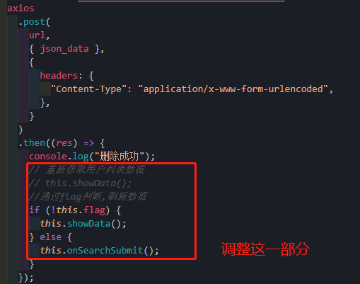

# 添加和删除

[TOC]

## 一、编辑数据

### 1、前端页面实现

- Data.vue

```vue
<!--
 * @Description: henggao_learning
 * @version: v1.0.0
 * @Author: henggao
 * @Date: 2020-11-04 17:05:21
 * @LastEditors: henggao
 * @LastEditTime: 2020-11-10 09:18:42
-->
<template>
  <div class="DataShow">
    <el-container>
      <el-header class="data_search">
        <SearchData />
      </el-header>
      <el-main class="data_content">
        <div class="data_table">
          <!-- 注意里面max-height字段设置高度 -->
          <el-table
            class="tb-edit"
            highlight-current-row
            :data="
              tableData.slice(
                (currentPage - 1) * PageSize,
                currentPage * PageSize
              )
            "
            style="width: 100%"
            max-height="690px"
            :default-sort="{ prop: 'ZK_num', order: 'ZK_num' }"
            @selection-change="handleSelectionChange"
          >
            <!-- 选择框设置 -->
            <el-table-column type="selection" width="55"> </el-table-column>
            <el-table-column label="_id" prop="_id.$oid"> </el-table-column>
            <!-- 筛选字段 -->
            <el-table-column
              fixed="left"
              label="ZK_num"
              prop="ZK_num"
              width="100"
              :filters="[
                { text: 'ZK1', value: 'ZK1' },
                { text: 'ZK2', value: 'ZK2' },
                { text: 'ZK3', value: 'ZK3' },
                { text: 'ZK4', value: 'ZK4' }
              ]"
              :filter-method="filterHandler"
            ></el-table-column>
            <!-- 生成关键词 -->
            <!-- <template v-for="(col, index) in cols"> -->
            <template v-for="col in cols">
              <!-- 设置排序字段 -->
              <el-table-column
                v-if="col.ZK_num === 'normal'"
                :key="col._id"
                :prop="col.prop"
                :label="col.label"
                align="center"
              >
                <!-- 每一行数据 -->
                <template slot-scope="scope">
                  <div v-if="!scope.row.isEdit">{{ scope.row[col.prop] }}</div>
                  <div v-else>
                    <el-input v-model="scope.row[col.prop]"></el-input>
                  </div>
                </template>
              </el-table-column>
              <el-table-column
                v-if="col.ZK_num === 'sort'"
                :key="col._id"
                :prop="col.prop"
                sortable
                :label="col.label"
              >
                <template slot-scope="scope">
                  <!-- 生成标签 -->
                  <el-tag type="primary">{{ scope.row.ZK_num }}</el-tag>
                </template>
              </el-table-column>
            </template>
            <el-table-column fixed="right" label="操作" width="160">
              <template slot-scope="scope">
                <el-button
                  type="primary"
                  plain
                  size="mini"
                  @click="handleEdit(scope.$index, scope.row)"
                  >{{ scope.row.isEdit ? "保存" : "编辑" }}</el-button
                >
                <el-button
                  @click.native.prevent="deleteRow(scope.$index, tableData)"
                  type="danger"
                  plain
                  size="mini"
                >
                  删除
                </el-button>
              </template>
            </el-table-column>
          </el-table>
        </div>
        <!-- 分页 -->
        <div class="block">
          <el-pagination
            @size-change="handleSizeChange"
            @current-change="handleCurrentChange"
            :current-page="currentPage"
            :page-sizes="pageSizes"
            :page-size="PageSize"
            layout="total, sizes, prev, pager, next, jumper"
            :total="totalCount"
          >
          </el-pagination>
        </div>
        <!-- 下面这个用来设置点击添加按钮的弹出框，里面可以进行嵌套表格来展示弹出的表格信息,使用下面的:visible.sync来控制显示与否。里面绑定的是我们新设置的值，填写完成后，将我们这个新值塞到页面中所有的数据当中去  -->
      </el-main>
    </el-container>
  </div>
</template>

<script>
import axios from "axios";
import qs from "qs";
import SearchData from "@/components/SearchData.vue";
export default {
  name: "Data",
  components: { SearchData },
  data() {
    return {
      // cols prop属性值都是作为 tableData的属性
      cols: [
        { label: "节点编号_id", prop: "_id.$oid", nickname: "normal" },
        { label: "名称nickname", prop: "nickname", nickname: "sort" },
        { label: "类型combat", prop: "combat", nickname: "normal" },
        { label: "状态level", prop: "level", nickname: "normal" },
        { label: "坐标rid", prop: "rid", nickname: "normal" }
        // { label: "rid", prop: "_id.$oid", ZK_num: "normal" },
        // { label: "ZK_num", prop: "ZK_num", ZK_num: "normal" },
        // { label: "Depth", prop: "Depth", ZK_num: "sort" },
        // { label: "Azimuth", prop: "Azimuth", ZK_num: "normal" },
        // { label: "Inclination", prop: "Inclination", ZK_num: "normal" }
      ],
      //   表格数据
      tableData: [
        {
          node: "0051",
          name: " 机库顶",
          type: "UWB",
          status: "正常",
          coordinate: "12.21,34.45,34.6"
        },
        {
          node: "0061",
          name: "机库门",
          type: "GPS",
          status: "低电",
          coordinate: "45.41,67.45,78.6"
        },
        {
          node: "0061",
          name: "机库门",
          type: "GPS",
          status: "低电",
          coordinate: "45.41,67.45,78.6"
        }
      ],
      // 分页数据，默认第几页
      currentPage: 1,
      // 总条数，根据接口获取数据长度(注意：这里不能为空)
      totalCount: 400,
      // 个数选择器（可修改）
      pageSizes: [10, 20, 30, 40],
      // 默认每页显示的条数（可修改)
      PageSize: 10,
      // 搜索
      search: ""
    };
  },
  created() {
    this.showData();
  },
  methods: {
    // 选择框
    handleSelectionChange(val) {
      this.multipleSelection = val;
    },
    // 排序
    filterHandler(value, row, column) {
      const property = column["property"];
      return row[property] === value;
    },
    // 编辑（修改）按钮
    handleEdit(index, row) {
      // console.log(index, row);
      // 动态设置数据并通过这个数据判断显示方式
      if (row.isEdit) {
        // 点击保存的
        this.$delete(row, "isEdit");
        // console.log("开始delete");
        // console.log(index, row); //把row发送给后端
        // console.log(row["_id"]["$oid"]); //把row发送给后端
        // row["id"] = row["_id"]["$oid"];
        // row["help_param"] = "help_param"; //用于解决后端smscode参数为3019"}多了"}问题
        // let postData = qs.stringify(row); // w为了解决后端拿不到数据问题
        // postData["_id"] = row["_id"]["$oid"];
        // console.log(typeof postData);
        // console.log(row["id"]);
        let json_data = JSON.stringify(row);

        const url = "http://127.0.0.1:8000/load/editdata/";
        axios
          .post(
            url,
            {
              // data: JSON.stringify(row) //data用于post请求
              json_data
            },
            {
              headers: { "Content-Type": "application/x-www-form-urlencoded" }
            }
            // console.log(postData)
          )
          .then(res => {
            console.log("注册成功");
          });
      } else {
        // 点击编辑
        this.$set(row, "isEdit", true);
        // console.log("开始set");
        // console.log(index, row);
      }
      // console.log(this.tableData);
    },
    // 删除按钮
    deleteRow(index, rows) {
      rows.splice(index, 1);
    },
    handleCurrentChange(row, event, column) {
      console.log(row, event, column, event.currentTarget);
    },
    handleDelete(index, row) {
      console.log(index, row);
    },
    showData(n1, n2) {
      const url = "http://127.0.0.1:8000/load/showdata/";
      axios
        .get(url, {
          orgCode: 1,
          // 每页显示的条数
          PageSize: n1,
          // 显示第几页
          currentPage: n2
        })
        .then(response => {
          // var res = JSON.parse(response.bodyText);
          console.log(response);
          console.log(response.data);
          console.log("取到单个数据");
          console.log(typeof response.data);
          // let detailsnew = JSON.parse(JSON.stringify(this.detailslist));
          // var datatset = [];
          // datatset.push(response.data);
          // console.log(typeof datatset);
          // console.log(datatset);
          // datatset = response.data
          // console.log(datatset)
          // console.log(this.tableData)
          // console.log(typeof this.tableData)
          // this.tableData = datatset;
          // 将数据赋值给tableData
          this.tableData = response.data;
          this.searchCondition = response.data;
          // 分页所需信息
          // 将数据的长度赋值给totalCount
          this.totalCount = response.data.length;

          console.log(this.tableData);
          console.log(typeof this.tableData);
          // 获取字段信息
          // this.cols = ""
          let tmp = response.data[0];
          console.log(tmp);
          var listcol = [];
          for (var key in tmp) {
            //  { label: "节点编号_id", prop: "_id.$oid", nickname: "normal" },
            //   console.log(key);
            //   console.log(typeof key);
            // console.log(key[1])
            listcol.push({
              label: key,
              prop: key,
              ZK_num: "normal"
            });
          }
          // console.log(listcol);
          // listcol[0].prop = "_id.$oid"; //_id是一个对象，取值
          listcol[0].prop = "_id"; //_id是一个对象，取值，使用这个为了取值
          listcol.splice(0, 1); //去掉_id字段,自己在页面添加，为了更好的遍历
          // listcol[6].nickname = "sort"; //按字段设置排序
          console.log(listcol);
          listcol[0].ZK_num = "sort"; //按字段设置排序
          this.cols = listcol;
        });
    },
    // 分页
    // 每页显示的条数
    handleSizeChange(val) {
      console.log(`每页 ${val} 条`);
      // 改变每页显示的条数
      this.PageSize = val;
      // 点击每页显示的条数时，显示第一页
      this.showData(val, 1);
      // 注意：在改变每页显示的条数时，要将页码显示到第一页
      this.currentPage = 1;
    },
    // 显示第几页
    handleCurrentChange(val) {
      console.log(`当前页: ${val}`);
      // 改变默认的页数
      this.currentPage = val;
      // 切换页码时，要获取每页显示的条数
      this.showData(this.PageSize, val * this.pageSize);
    }
  }
};
</script>


<style lang="less" scoped>
// 设置真个数据内容的大小
.DataShow {
  height: 775px;
}
// 设置搜索框的大小
.data_search {
  height: 45px !important;
}
// 设置表格数据大小，表格+分页
.data_content {
  height: 730px !important;
  overflow: auto;
}
// 设置表格数据大小
.data_table {
  height: 690px !important;
  overflow: auto;
}
</style>
```

- [ref1](https://blog.csdn.net/weixin_43160044/article/details/106797358?utm_medium=distribute.pc_relevant_t0.none-task-blog-BlogCommendFromMachineLearnPai2-1.edu_weight&depth_1-utm_source=distribute.pc_relevant_t0.none-task-blog-BlogCommendFromMachineLearnPai2-1.edu_weight)
- [ref2](https://blog.csdn.net/D_claus/article/details/105734896)


### 2、后端实现

- views.py

```python
def EditData(request):
    # 连接数据库
    if request.method == "POST":

        # 1、通过——id拿到前端数据,这样取不到值，用request.body
        # data_id = request.POST.get("_id")
        # print(data_id)
        # s使用request.POST取值
        # all_data = request.POST
        # print(all_data)
        # <QueryDict: {'{"json_data":"{\\"_id\\":{\\"$oid\\":\\"5fa7dc070a6d3e479de148d9\\"},\\"ZK_num\\":\\"ZK1\\",\\"Depth\\":0,\\"Azimuth\\":131.29,\\"Inclination\\":-86.4}"}': ['']}>
        # 使用request.body取值
        body_data = request.body
        # print(body_data)
        # b'{"json_data":"{\\"_id\\":{\\"$oid\\":\\"5fa7dc070a6d3e479de148d9\\"},\\"ZK_num\\":\\"ZK1\\",\\"Depth\\":0,\\"Azimuth\\":131.29,\\"Inclination\\":-86.4}"}'
        data_json = json.loads(body_data)
        # {'json_data': '{"_id":{"$oid":"5fa7dc070a6d3e479de148d9"},"ZK_num":"ZK1","Depth":0,"Azimuth":131.29,"Inclination":-86.4}'}
        # print(data_json)
        # print(data_json.values())
        # print(data_json['json_data']) #{"_id":{"$oid":"5fa7dc070a6d3e479de148d9"},"ZK_num":"ZK1","Depth":"1","Azimuth":131.29,"Inclination":-86.4}
        query_data_json = data_json['json_data']
        # print(type(query_data_json)) #<class 'str'>

        dict_data = json.loads(query_data_json)
        # {'_id': {'$oid': '5fa7dc070a6d3e479de148d9'}, 'ZK_num': 'ZK1', 'Depth': '1', 'Azimuth': 131.29, 'Inclination': -86.4}
        print(dict_data)
        print(type(dict_data))  # <class 'dict'>
        front_query_oid = dict_data['_id']
        print(front_query_oid)  # {'$oid': '5fa7dc070a6d3e479de148d9'}
        print(type(front_query_oid))  # <class 'dict'>
        front_query_id = front_query_oid['$oid']
        print(front_query_id)  # 5fa7dc070a6d3e479de148d9   终于拿到了！！
        print(type(front_query_id))  # <class 'str'>

        client = pymongo.MongoClient("192.168.55.110", 20000)
        database = "segyfile"
        db = client[database]
        collection = "excel_data"
        db_coll = db[collection]
        # 根据_id匹配到后端数据
        cursor = db_coll.find_one(filter={"_id": ObjectId(front_query_id)})
        # {'_id': ObjectId('5fa7dc070a6d3e479de148d9'), 'ZK_num': 'ZK1', 'Depth': 0.0, 'Azimuth': 131.29, 'Inclination': -86.4}
        print(cursor)

        # 删掉_'_id': {'$oid': '5fa7dc070a6d3e479de148d9'}部分
        dict_data.pop('_id')
        # {'ZK_num': 'ZK1', 'Depth': 0, 'Azimuth': 131.29, 'Inclination': -86.4}
        print(dict_data)
        print(type(dict_data))  # <class 'dict'>
        update_data = db_coll.update_one(
            cursor, update={"$set": dict_data})
        print(update_data)
        print(update_data.matched_count)
        print(update_data.modified_count)
    return HttpResponse('success')
```


### 3、注意点

1、前端key选择，参考[阅读](https://juejin.im/post/6844903577215827982)，选取key的值是否会影响后面的数据

2、后端拿不到post请求数据

- 第一种，前端处理，这样后端可以拿到值

```
import qs from "qs";

let postData = qs.stringify(row); 
```

- 第二种

  - 前端向后端传递json数据时，需要使用`JSON.stringify()`将json对象转化为json字符串；

  - 后端直接拿取`request.POST`或`request.body`；

  - `request.body`的数据为bytes类型，要想使用，需要先解码。

    ```
    all_data = request.POST
    ```

    ```
    body_data = request.body
    data_json = json.loads(body_data)
    ```

    - [ref](https://blog.csdn.net/weixin_43182689/article/details/98168092)

  

3、后端注意点

- json数据与字典以及对象之间的转化，参考Python目录下的001json
- 删除前端传过来的_id,保证_id不变，更新其他字段。（避免$oid与ObjectId冲突，产生报错）


## 二、删除表格某行数据

### 1、前言

删除的思路其实和修改的思路差不多，可以参考前面的修改。

### 2、 前端

- Data.vue

  ```vue
  <el-table-column fixed="right" label="操作" width="160">
                <template slot-scope="scope">
                  <el-button
                    type="primary"
                    plain
                    size="mini"
                    @click="handleEdit(scope.$index, scope.row)"
                    >{{ scope.row.isEdit ? "保存" : "编辑" }}</el-button
                  >
                  <el-button
                    @click.native.prevent="
                      deleteRow(scope.$index, tableData, scope.row)
                    "
                    type="danger"
                    plain
                    size="mini"
                  >
                    删除
                  </el-button>
                </template>
              </el-table-column>
  ```

- methods中写方法
  ```js
  // 删除按钮
      deleteRow(index, rows, row) {
        rows.splice(index, 1);
        let json_data = JSON.stringify(row);
        console.log(json_data);
        const url = "http://127.0.0.1:8000/load/deletedata/";
        axios
          .post(
            url,
            { json_data },
            {
              headers: { "Content-Type": "application/x-www-form-urlencoded" }
            }
          )
          .then(res => {
            console.log("删除成功");
          });
      },
  ```

  

### 3 、后端

- views.py

```python
# 删除数据


def DeleteData(request):
    """
    Delete data
    """
    if request.method == "POST":
        body_data = request.body
        print(body_data)
        data_json = json.loads(body_data)
        query_data_json = data_json['json_data']
        dict_data = json.loads(query_data_json)
        front_query_oid = dict_data['_id']
        front_query_id = front_query_oid['$oid']
        print(front_query_id)

        # 连接数据库
        client = pymongo.MongoClient("192.168.55.110", 20000)
        database = "segyfile"
        db = client[database]
        collection = "excel_data"
        db_coll = db[collection]

        db_coll.remove({"_id": ObjectId(front_query_id)})
        print("Delete Success")
        # 关闭连接
        client.close()

    return HttpResponse("Delete Success")

```


- [ref](http://mazhaoyang.cn/index.php/Home/ArticleList/ArticleArticle/aid/187/sid/53.html)

- 小插曲
  - 删除数据后，数据仍然会停留在页面，实际数据已经删除

    - 可使用`current-page.sync`解决，这个问题还没有解决。需要点俩次才可以删除？

    - 对于两次点击才可以删除的解决，有点尴尬，将if判断语句移动到then()即可

      ```js
       const url = "http://127.0.0.1:8000/load/deletedata/";
                axios
                  .post(
                    url,
                    { json_data },
                    {
                      headers: {
                        "Content-Type": "application/x-www-form-urlencoded",
                      },
                    }
                  )
                  .then((res) => {
                    console.log("删除成功");
                    // 重新获取用户列表数据
                    // this.showData();
                    //通过flag判断,刷新数据
                    if (!this.flag) {
                      this.showData();
                    } else {
                      this.onSearchSubmit();
                    }
                  });
      ```

      

      


### 4、优化

- 删除按钮，提供一个确认删除框

  ```js
      // 删除按钮
      deleteRow(index, rows, row) {
        // 添加确认删除框
        this.$confirm("永久删除，是否继续？", "提示", {
          confirmButtonText: "确定",
          cancelButtonText: "取消",
          type: "warning",
        })
          .then(() => {
            // 删除操作
            rows.splice(index, 1);
            let json_data = JSON.stringify(row);
            console.log(json_data);
            const url = "http://127.0.0.1:8000/load/deletedata/";
            axios
              .post(
                url,
                { json_data },
                {
                  headers: {
                    "Content-Type": "application/x-www-form-urlencoded",
                  },
                }
              )
              .then((res) => {
                console.log("删除成功");
                // 重新获取用户列表数据
                // this.showData();
                //通过flag判断,刷新数据
                if (!this.flag) {
                  this.showData();
                } else {
                  this.onSearchSubmit();
                }
              });
          })
          .catch(() => {
            this.$message({
              type: "info",
              message: "取消删除",
            });
          });
      },
  ```

  - 参考：37动态生成侧边栏