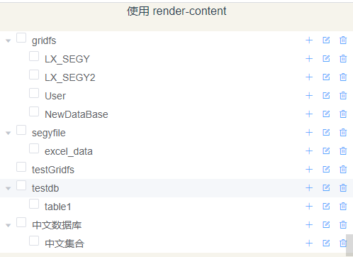
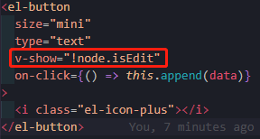

# 侧边栏

[TOC]

## 前言

### 0.1 连接数据库

- 动态生成侧边栏，完成数据库、集合以及内容的创建。

- 完成数据库检测，测试文件`checkdatabase.py`

  ```python
  '''
  Description: henggao_learning
  version: v1.0.0
  Author: henggao
  Date: 2020-11-13 15:12:07
  LastEditors: henggao
  LastEditTime: 2020-11-13 16:15:02
  '''
  import pymongo
  from pymongo import collation
  from pymongo import collection
  # 连接mongoDB数据库，读取 db 库 table 表中的数据
  client = pymongo.MongoClient("192.168.55.110", 20000)
  # database = "segyfile"
  # db = client[database]
  # collection = "excel_data"
  # db_coll = db[collection]
  # 查询数据库
  database_name = client.list_database_names()
  if '中文数据库' in database_name:
      print('Wow,数据库存在')
  print(database_name) 
  # 查询集合
  database = client['中文数据库']
  collection_name = database.list_collection_names()
  print(collection_name)
  ```

  - [ref](https://www.runoob.com/python3/python-mongodb.html)

### 0.2 集合删选

- 去掉`admin`、`config`数据库

- 去掉`.files`、`.chunks`集合

  - `checkdatabase.py`

  ```python
  '''
  Description: henggao_learning
  version: v1.0.0
  Author: henggao
  Date: 2020-11-13 15:12:07
  LastEditors: henggao
  LastEditTime: 2020-11-16 19:57:48
  '''
  import re
  from re import match
  import pymongo
  from pymongo import collection
  # 连接mongoDB数据库，读取 db 库 table 表中的数据
  client = pymongo.MongoClient("192.168.55.110", 20000)
  # database = "segyfile"
  # db = client[database]
  # collection = "excel_data"
  # db_coll = db[collection]
  # 查询数据库
  databases = client.list_database_names()
  # if '中文数据库' in databases:
  #     print('Wow,数据库存在')
  print(databases)
  # 查询集合
  # database = client['中文数据库']
  # collection_name = database.list_collection_names()
  # print(collection_name)
  # 去掉admin与config数据库
  databases.remove('admin')
  databases.remove('config')
  print(databases)
  print(len(databases))
  database_total = len(databases)  # 获取数据库个数
  
  # print("=========================================")
  list_db = []
  # children = []
  dict_db = {}
  dict_col = {}
  children_id = database_total
  database_id = 0
  for database in databases:
      children = []
      cur_database = client[database]
      collections = cur_database.list_collection_names()
      # 删除.files和.chunks文件
      print("===================当前在的数据库是：" + str(database))
      for collection in collections:
          # print(collection)
          # 删除.chunks集合
          if ('.chunks') in collection:
              collections.remove(collection)
      # print(collections)
  
      for collection in collections:
          # print(collection)
          # 删.files集合
          if ('.files') in collection:
              collections.remove(collection)
      # print(collections)
  
      # 将数据按前端数据要求存放
      for collection in collections:
          children_id += 1
          dict_col = {
              'id': children_id,
              'label': collection
          }
          children.append(dict_col)
      print(children)
      database_id += 1
      dict_db = {
          'id':database_id,
          'label':database,
          'children':children
          }
      list_db.append(dict_db)
  print(list_db)
  
  ```

  

## 一、侧边栏`MenTree`

- 分析一下，哪部分需要动态生成？数据库实现可以绑定好，需要动态生成的是里面的集合，因为我们在实际过程中，会不断地添加数据，即每个集合对应的数据需要在`maincontent`区域中进行增、删、改、查等操作。

### 1.1 前端页面

- `Test3.vue`

  ```vue
  <template>
    <div class="custom-tree-container">
      <div class="block">
        <p>使用 render-content</p>
        <el-tree
          :data="data"
          show-checkbox
          node-key="id"
          default-expand-all
          :expand-on-click-node="false"
          :render-content="renderContent"
        >
        </el-tree>
      </div>
    </div>
  </template>
  
  <script>
  import axios from "axios";
  import qs from "qs";
  let id = 1000;
  
  export default {
    data() {
      const data = [
        {
          id: 1,
          label: "一级 1",
          children: [
            {
              id: 4,
              label: "二级 1-1",
              children: [
                {
                  id: 9,
                  label: "三级 1-1-1",
                },
                {
                  id: 10,
                  label: "三级 1-1-2",
                },
              ],
            },
          ],
        },
        {
          id: 2,
          label: "一级 2",
          children: [
            {
              id: 5,
              label: "二级 2-1",
            },
            {
              id: 6,
              label: "二级 2-2",
            },
          ],
        },
        {
          id: 3,
          label: "一级 3",
          children: [
            {
              id: 7,
              label: "二级 3-1",
            },
            {
              id: 8,
              label: "二级 3-2",
            },
          ],
        },
      ];
      return {
        data: JSON.parse(JSON.stringify(data)),
        // data: JSON.parse(JSON.stringify(data)),
      };
    },
    created() {
      this.showDataBase();
    },
  
    methods: {
      // 读取数据库信息，返回前端页面展示
      showDataBase() {
        let url = "http://127.0.0.1:8000/load/showdatabase/";
        var temp_list = [];
        axios
          .get(url, {})
          .then((res) => {
            console.log(res.data); //打印后端传过来的数据,string
            console.log(typeof res.data); //打印后端传过来的数据
            this.data = res.data
            // var data_json = res.data.parseJSON();
            // var data_json = JSON.parse(JSON.stringify(res.data));
            // console.log(data_json);
            // console.log(typeof data_json);
            // temp_list.push(res.data);
            // var arr = eval(temp_list);
            // var temp_list = eval("(" + res.data + ")");
            // console.log(arr);
            // console.log(typeof arr);
            // var arrParse = JSON.parse(arr)
            // console.log(typeof arrParse);
            // console.log(arrParse);
            // this.data = temp_list //将数据赋值给data
            // console.log(this.data);
            // console.log(typeof this.data);
          })
          .catch();
      },
      append(data) {
        const newChild = { id: id++, label: "testtest", children: [] };
        if (!data.children) {
          this.$set(data, "children", []);
        }
        data.children.push(newChild);
      },
  
      remove(node, data) {
        const parent = node.parent;
        const children = parent.data.children || parent.data;
        const index = children.findIndex((d) => d.id === data.id);
        children.splice(index, 1);
      },
  
      renderContent(h, { node, data, store }) {
        return (
          <span class="custom-tree-node">
            <span>{node.label}</span>
            <span>
              <el-button
                size="mini"
                type="text"
                on-click={() => this.append(data)}
              >
                <i class="el-icon-plus"></i>
              </el-button>
              <el-button
                size="mini"
                type="text"
                on-click={() => this.remove(node, data)}
              >
                <i class="el-icon-minus"></i>
              </el-button>
            </span>
          </span>
        );
      },
    },
  };
  </script>
  
  <style>
  .custom-tree-node {
    flex: 1;
    display: flex;
    align-items: center;
    justify-content: space-between;
    font-size: 14px;
    padding-right: 8px;
  }
  </style>
  ```

  - [ref](https://element.eleme.cn/#/zh-CN/component/tree)

### 1.2 后端

- `views.py`

  ```python
  def ShowDataBase(request):
      """
      获取数据库以及集合，在前端实现展示
      """
      if request.method == "GET":
          # 连接mongoDB数据库
          client = pymongo.MongoClient("192.168.55.110", 20000)
          # 查询数据库
          # ['admin', 'config', 'gridfs', 'segyfile', 'testGridfs', 'testdb', '中文数据库']
          databases = client.list_database_names()
          databases.remove('admin')
          databases.remove('config')
          database_total = len(databases)  # 获取数据库个数
  
          # print("=========================================")
          list_db = []
          # children = []
          dict_db = {}
          dict_col = {}
          children_id = database_total
          database_id = 0
          content = {}
          for database in databases:
              children = []
              cur_database = client[database]
              collections = cur_database.list_collection_names()
              # 删除.files和.chunks文件
              print("===================当前在的数据库是：" + str(database))
              for collection in collections:
                  # print(collection)
                  # 删除.chunks集合
                  if ('.chunks') in collection:
                      collections.remove(collection)
              # print(collections)
  
              for collection in collections:
                  # print(collection)
                  # 删.files集合
                  if ('.files') in collection:
                      collections.remove(collection)
              # print(collections)
  
              # 将数据按前端数据要求存放
              for collection in collections:
                  children_id += 1
                  dict_col = {
                      'id': children_id,
                      'label': collection
                  }
                  children.append(dict_col)
              print(children)
              database_id += 1
              dict_db = {
                  'id': database_id,
                  'label': database,
                  'children': children
              }
              list_db.append(dict_db)
              content = dumps(list_db)    #这个地方要用字符串传到前端去
          print(content)
          print(type(content))
          # print(list_db)
          # print(type(list_db))
          return HttpResponse(content, "application/json")
          # return HttpResponse('success')
  ```


### 1.3 注意点

- 数据在后端一定要和处理好，再返回前端。这里需要将数据存为为json字符串，再传给前端。

- 如果是传递列表，会出现前端数据之间没有逗号分隔，如下图

  


### 1.4 预览




## 二、进一步完善

- 添加按钮优化
- 重命名

### 2.1 数据库和集合的按钮显示

- 要求：数据库只显示添加和删除修改按钮，集合只显示修改和删除按钮

- 刚开始的思路，`<Button>`从属性出发,通过`v-show`根据`isEdit`字段判断，没有成功。

  

  

- 实现：通过添加一个`isEdit`字段进行判断

  ```js
      renderContent(h, { node, data, store }) {
        console.log(data.isEdit);
        if (!data.isEdit) {
          return (
            <span class="custom-tree-node">
              <span>{node.label}</span>
              <span>
                <el-button
                  size="mini"
                  type="text"
                  on-click={() => this.rename(node, data)}
                >
                  <i class="el-icon-edit-outline"></i>
                </el-button>
                <el-button
                  size="mini"
                  type="text"
                  // v-show="node.isEdit"
                  v-show="false"
                  on-click={() => this.remove(node, data)}
                >
                  <i class="el-icon-delete"></i>
                </el-button>
              </span>
            </span>
          );
        } else {
          return (
            <span class="custom-tree-node">
              <span>{node.label}</span>
              <span>
                <el-button
                  size="mini"
                  type="text"
                  v-show="!node.isEdit"
                  on-click={() => this.append(data)}
                >
                  <i class="el-icon-plus"></i>
                </el-button>
                <el-button
                  size="mini"
                  type="text"
                  on-click={() => this.rename(node, data)}
                >
                  <i class="el-icon-edit-outline"></i>
                </el-button>
              </span>
            </span>
          );
        }
      },
  ```

  

### 2.2 编辑修改（重命名）动作

- **说在最前面的：我们不建议对分片集群上的数据库以及集合进行修改。**

- 要求：当点击修改时，图标变换成保存+内容可编辑。
- 实现：通过添加字段进行判断

- [ref](https://blog.csdn.net/qq_45074127/article/details/103106894?utm_medium=distribute.pc_relevant_bbs_down.none-task--2~all~first_rank_v2~rank_v28-8.nonecase&depth_1-utm_source=distribute.pc_relevant_bbs_down.none-task--2~all~first_rank_v2~rank_v28-8.nonecase)
- [ref2](https://segmentfault.com/a/1190000011574698)

- `Test3.vue`

  ```vue
  <template>
    <div class="custom-tree-container">
      <div class="block">
        <p>使用 render-content</p>
        <el-tree
          :data="data"
          show-checkbox
          node-key="id"
          default-expand-all
          :expand-on-click-node="false"
          :render-content="renderContent"
        >
        </el-tree>
      </div>
    </div>
  </template>
  
  <script>
  import axios from "axios";
  import qs from "qs";
  let id = 1000;
  
  export default {
    data() {
      const data = [
        {
          id: 1,
          label: "一级 1",
          children: [
            {
              id: 4,
              label: "二级 1-1",
              children: [
                {
                  id: 9,
                  label: "三级 1-1-1",
                },
                {
                  id: 10,
                  label: "三级 1-1-2",
                },
              ],
            },
          ],
        },
        {
          id: 2,
          label: "一级 2",
          children: [
            {
              id: 5,
              label: "二级 2-1",
            },
            {
              id: 6,
              label: "二级 2-2",
            },
          ],
        },
        {
          id: 3,
          label: "一级 3",
          children: [
            {
              id: 7,
              label: "二级 3-1",
            },
            {
              id: 8,
              label: "二级 3-2",
            },
          ],
        },
      ];
      return {
        data: JSON.parse(JSON.stringify(data)),
        // data: JSON.parse(JSON.stringify(data)),
      };
    },
    created() {
      this.showDataBase();
    },
  
    methods: {
      // 读取数据库信息，返回前端页面展示
      showDataBase() {
        let url = "http://127.0.0.1:8000/load/showdatabase/";
        var temp_list = [];
        axios
          .get(url, {})
          .then((res) => {
            console.log(res.data); //打印后端传过来的数据,string
            // console.log(res.data.length); //打印后端d对象个数
            // console.log(typeof res.data); //打印后端传过来的数据类型
            this.data = res.data;
            // var data_json = res.data.parseJSON();
            // var data_json = JSON.parse(JSON.stringify(res.data));
            // console.log(data_json);
            // console.log(typeof data_json);
            // temp_list.push(res.data);
            // var arr = eval(temp_list);
            // var temp_list = eval("(" + res.data + ")");
            // console.log(arr);
            // console.log(typeof arr);
            // var arrParse = JSON.parse(arr)
            // console.log(typeof arrParse);
            // console.log(arrParse);
            // this.data = temp_list //将数据赋值给data
            // console.log(this.data);
            // console.log(typeof this.data);
          })
          .catch();
      },
  
      append(data) {
        const newChild = { id: id++, label: "NewDataBase", children: [] };
        if (!data.children) {
          this.$set(data, "children", []);
        }
        data.children.push(newChild);
      },
  
      rename(node, data) {
        // const parent = node.parent;
        // const children = parent.data.children || parent.data;
        // const index = children.findIndex((d) => d.id === data.id);
        // children.splice(index, 1);
        console.log(data.isEdit);
        // console.log(data.id <= 2);
        // data.label = "xiaocui";
        let url = "http://127.0.0.1:8000/load/editdatabasename/";
        this.$prompt("请输入新的名称", "重命名", {
          confirmButtonText: "确定",
          cancelButtonText: "取消",
          inputPattern: /^[\u4e00-\u9fa5]{1,}$/, //匹配全中文
          inputErrorMessage: "请输入中文", //不符合正则匹配的提示语句
        })
          .then(({ value }) => {
            //可以在这里发请求，http是我模拟的一个虚假的封装好的axios请求,()可写请求参数
            axios
              .post(url, { value, data })
              .then((data) => {
                this.$message({
                  type: "success",
                  message: "修改成功",
                });
                //请求成功需局部刷新该节点，调用方法,把节点信息node传入
                this.showDataBase();
              })
              //请求失败
              .catch(() => {
                this.$message({
                  type: "info",
                  message: "修改失败",
                });
              });
          })
          .catch(() => {
            this.$message({
              type: "info",
              message: "取消修改",
            });
          });
      },
  
      remove(node, data) {
        const parent = node.parent;
        const children = parent.data.children || parent.data;
        const index = children.findIndex((d) => d.id === data.id);
        children.splice(index, 1);
      },
  
      renderContent(h, { node, data, store }) {
        // console.log(data.isEdit);
        if (!data.isEdit) {
          return (
            <span class="custom-tree-node">
              <span>{node.label}</span>
              <span>
                <el-button
                  size="mini"
                  type="text"
                  on-click={() => this.rename(node, data)}
                >
                  <i class="el-icon-edit-outline"></i>
                </el-button>
                <el-button
                  size="mini"
                  type="text"
                  // v-show="node.isEdit"
                  on-click={() => this.remove(node, data)}
                >
                  <i class="el-icon-delete"></i>
                </el-button>
              </span>
            </span>
          );
        } else {
          return (
            <span class="custom-tree-node">
              <span>{node.label}</span>
              <span>
                <el-button
                  size="mini"
                  type="text"
                  // v-show="!node.isEdit"
                  on-click={() => this.append(data)}
                >
                  <i class="el-icon-plus"></i>
                </el-button>
                <el-button
                  size="mini"
                  type="text"
                  on-click={() => this.rename(node, data)}
                >
                  <i class="el-icon-edit-outline"></i>
                </el-button>
              </span>
            </span>
          );
        }
      },
    },
  };
  </script>
  
  <style>
  .custom-tree-node {
    flex: 1;
    display: flex;
    align-items: center;
    justify-content: space-between;
    font-size: 14px;
    padding-right: 8px;
  }
  </style>
  ```

  - 有点小疑问，在修改后如何设置局部刷新。这里我设置重新调用一次`showDataBase`方法


MongoDB不支持`rename database`，只支持`rename Collection`。修改的实质是将老数据库集合迁移到新数据库，老数据库为空自动删除。所以，**数据量大的时候，尽量不要修改数据库的名称。**这里提供这个功能，只是为了最初在创建数据库时，由于某些原因，错误操作提供一种解决方法。

- `views.py`

```python
def EditDataBase(request):
    """
    docstring
    """
    if request.method == "POST":
        editdatas = request.body
        edit_json = json.loads(editdatas)
        # print(edit_json)
        print(edit_json['value'])
        new_databasename = edit_json['value']  # 新名称
        data = edit_json['data']
        print(data['isEdit'])

        # 连接mongoDB数据库，读取 db 库 table 表中的数据
        client = pymongo.MongoClient("192.168.55.110", 20000)
        if (data['isEdit']):
            check_name = data['label']  # 数据库名称
            # print(check_name)
            # start_time = time.time()
            old_database = client[check_name]  # 获取数据库
            # 新的数据库，下面三行创建一个临时集合，这样创建一个新的数据库
            new_database = client[new_databasename]
            temp_collection = new_database[new_databasename]
            temp_collection.insert_one({})
            collection_list = old_database.list_collection_names()
            for item in collection_list:
                query = {
                    'renameCollection': check_name + '.' + item,
                    'to': new_databasename + '.' + item
                }
                client.admin.command(query)
            # print(time.time() - start_time)
            # 删除临时集合
            temp_collection.drop()
            # 删除原来的数据库
            client.drop_database(old_database)

            # client.admin.command(
            #     'copydb', fromdb=check_name, todb=new_databasename)
        else:
            # 1.判断集合在哪个数据库
            check_database = data['_database']  # 拿到数据库名称
            # print(check_database)
            db = client[check_database]  # 取到数据库
            # 2. 集合的名称
            old_collection_name = data['label']  # 拿到l老的集合名称
            # print(new_collection)
            # print(type(new_collection))
            # 3. 拿到集合，适用复制的方式
            old_collection = db[old_collection_name]  # 取到老的集合
            # new_collection = db[new_databasename]  # 新的集合
            # new_collection_name = old_collection.rename(new_collection) #不支持分片集群的集合修改

            # 使用MongoDB Aggregation运算符$match和$out
            pipeline = [{"$match": {}},
                        {"$out": new_databasename},
                        ]
            old_collection.aggregate(pipeline)

            # 删除原来的集合
            # old_collection.remove({}) #清空文档
            old_collection.drop()  # 删除集合

    return HttpResponse('success')
```

- [ref1](https://www.thinbug.com/q/39788664)
- [ref2](https://blog.csdn.net/Machine_g/article/details/105764504)
- [ref3](https://api.mongodb.com/python/current/examples/copydb.html?highlight=copy)

#### 2.2.2 补充一下，重命名

- 如果数据库和集合已经存在，重命名相同时会进行覆盖，这里补充一下重命名动作判断，是否已经存在名称。这里的`SideTree.vue`即是上文的`Test3.vue`
- 在获取数据库和集合的时候，使用`this.data`来抓取对应的数据。

- `SideTree.vue`

  ```js
      rename(node, data) {
        // const parent = node.parent;
        // const children = parent.data.children || parent.data;
        // const index = children.findIndex((d) => d.id === data.id);
        // children.splice(index, 1);
        // console.log(data.isEdit);
        // console.log(data.id <= 2);
        // data.label = "xiaocui";
        // console.log(node);
        // console.log(data); //当前的data
        // console.log(data["label"]); //当前数据名称
        // console.log(this.data); //数据中的data
        // console.log(this.data.length); //数据中的data
        let db_cols = [];
        if (data["isEdit"]) {
          console.log("数据库");
          // let db_cols = [];
          for (let i = 0; i < this.data.length; i++) {
            const db_data = this.data[i];
            const dbcol = db_data["label"];
            db_cols.push(dbcol);
          }
          // console.log(db_cols);
          // let db_temp = new Set(db_cols);
        } else {
          // console.log("集合");
          // console.log(data["_database"]);
          // 通过this.data拿到集合数据
          // let db_cols = [];
          let databasename = data["_database"];
          for (let i = 0; i < this.data.length; i++) {
            const db_data = this.data[i];
            const dbcol = db_data["label"];
            if (databasename == dbcol) {
              console.log("存在" + databasename);
              console.log(db_data);
              console.log(db_data["children"]);
              let children_col = db_data["children"];
              for (let i = 0; i < children_col.length; i++) {
                const db_data = children_col[i];
                const collection = db_data["label"];
                db_cols.push(collection);
              }
            }
          }
          // console.log(db_cols);
          // let db_temp = new Set(db_cols);
        }
        console.log(db_cols);
        let db_temp = new Set(db_cols);
  
        let url = "http://127.0.0.1:8000/load/editdatabasename/";
        this.$prompt("请输入新的名称", "重命名", {
          confirmButtonText: "确定",
          cancelButtonText: "取消",
          inputPattern: /^[\u4e00-\u9fa5]{1,}$/, //匹配全中文
          inputErrorMessage: "请输入中文", //不符合正则匹配的提示语句
        })
          .then(({ value }) => {
            // 判断重命名的数据库和集合是否已经存在
            if (!db_temp.has(value)) {
              //可以在这里发请求，http是我模拟的一个虚假的封装好的axios请求,()可写请求参数
              axios
                .post(url, { value, data })
                .then((data) => {
                  this.$message({
                    type: "success",
                    message: "修改成功",
                  });
                  //请求成功需局部刷新该节点，调用方法,把节点信息node传入
                  this.showDataBase();
                })
                //请求失败
                .catch(() => {
                  this.$message({
                    type: "info",
                    message: "修改失败",
                  });
                });
            } else {
              this.$message({
                type: "info",
                message: "已存在，请重新输入！",
              });
            }
          })
          .catch(() => {
            this.$message({
              type: "info",
              message: "取消修改",
            });
          });
      },
  
  ```

  


### 小插曲

- 修改集合名称标错如下，意思是不支持分片集群的集合修改

```
pymongo.errors.OperationFailure: You can't rename a sharded collection
```

- 解决方法
  - 使用copy的方法进行操作

- [ref](https://stackoverflow.com/questions/9938136/mongodb-rename-collection-in-sharding)


### 2.3 数据库中集合的删除和添加

#### A. 删除

- 前端删除

- `Test3.vue`中methods

  ```js
  remove(node, data) {
        // 前端页面删除
        const parent = node.parent;
        const children = parent.data.children || parent.data;
        const index = children.findIndex((d) => d.id === data.id);
        children.splice(index, 1);
        // 后端数据删除
        let url = "http://127.0.0.1:8000/load/deletecollection/";
        axios
          .post(url, { data })
          .then((res) => {
            this.$message({
              type: "success",
              message: "删除成功",
            });
          })
          .catch(() => {
            this.$message({
              type: "info",
              message: "删除失败",
            });
          });
      },
  ```

  - 这部分可以添加一个确认按钮。

    ```js
     remove(node, data) {
          this.$confirm("永久删除，是否继续？", "提示", {
            confirmButtonText: "确定",
            cancelButtonText: "取消",
            type: "warning",
          })
            .then(() => {
              // 前端页面删除
              const parent = node.parent;
              const children = parent.data.children || parent.data;
              const index = children.findIndex((d) => d.id === data.id);
              children.splice(index, 1);
              // 后端数据删除
              let url = "http://127.0.0.1:8000/load/deletecollection/";
              axios
                .post(url, { data })
                .then((res) => {
                  this.$message({
                    type: "success",
                    message: "删除成功",
                  });
                })
                .catch(() => {
                  //请求失败
                  this.$message({
                    type: "info",
                    message: "删除失败",
                  });
                });
            })
            .catch(() => {
              this.$message({
                type: "info",
                message: "取消删除",
              });
            });
        },
    ```

    - [ref1](https://blog.csdn.net/qq_33871178/article/details/84972688)
    - [ref2](https://blog.csdn.net/weixin_33889665/article/details/92407256?utm_medium=distribute.pc_relevant.none-task-blog-BlogCommendFromBaidu-3.not_use_machine_learn_pai&depth_1-utm_source=distribute.pc_relevant.none-task-blog-BlogCommendFromBaidu-3.not_use_machine_learn_pai)

- 后端删除

- `views.py`

  ```python
  def DeleteCollection(request):
      """
      delete a mongodb collection
      """
      if request.method == "POST":
          body_data = request.body
          # print(body_data)
          data_json = json.loads(body_data)
          # print(data_json)
          data = data_json['data']
          col_name = data['label']  # 取到集合名称
          data_name = data['_database']  # 取到数据库名称
  
          # 连接mongoDB数据库，读取 db 库 table 表中的数据
          client = pymongo.MongoClient("192.168.55.110", 20000)
          db = client[data_name]  # 连接数据库
          collections = db.list_collection_names()
          if col_name in collections:
              # 删除集合
              db[col_name].drop()
              print('删除成功')
  
          return HttpResponse('success')
  ```


#### B. 添加

- 前端添加

  - 元素是否在数组中用`ES6`的new Set来生成一个Set数据结构的数据，从而调用has方法来判断，有则返回true，没有则false。

- `Test3.vue`

  ```js
      append(data) {
        // 前端添加集合
        // const newChild = { id: id++, label: "NewDataBase", children: [] };
        // if (!data.children) {
        //   this.$set(data, "children", []);
        // }
        // data.children.push(newChild)
        console.log(data.children);
        let collections = [];
        for (let i = 0; i < data.children.length; i++) {
          const col_data = data.children[i];
          const collection = col_data["label"];
          // console.log(collection);
          collections.push(collection);
        }
        console.log(collections);
        // 用es6的new Set来生成一个Set数据结构的数据，从而调用has方法来判断，有则返回true，没有则false
        let temp = new Set(collections);
        this.$prompt("请输入中文名称", "添加数据（请勿重名）", {
          confirmButtonText: "确定",
          cancelButtonText: "取消",
          inputPattern: /^[\u4e00-\u9fa5]{1,}$/, //匹配全中文
          inputErrorMessage: "请输入中文", //不符合正则匹配的提示语句
        })
          .then(({ value }) => {
            //判断是否存在
            if (!temp.has(value)) {
              // 后端数据添加
              const newChild = {
                id: id++,
                label: value,
                isEdit: false,
                _database: data.label,
              };
              data.children.push(newChild);
              console.log(data);
              let url = "http://127.0.0.1:8000/load/addcollection/";
              axios
                .post(url, { newChild })
                .then((res) => {
                  this.$message({
                    type: "success",
                    message: "添加成功",
                  });
                })
                .catch(() => {
                  this.$message({
                    type: "info",
                    message: "添加失败",
                  });
                });
            } else {
              this.$message({
                type: "info",
                message: "已存在，请重新输入！",
              });
            }
          })
          .catch(() => {
            this.$message({
              type: "info",
              message: "取消添加",
            });
          });
      },
  ```

  

- 后端添加

- `views.py`

  ```python
  def AddCollection(request):
      """
      docstring
      """
      if request.method == "POST":
          body_data = request.body
          # print(body_data)
          data_json = json.loads(body_data)
          print(data_json)
          data = data_json['newChild']
          col_name = data['label']  # 取到集合名称
          print(col_name)
          data_name = data['_database']  # 取到数据库名称
  
          # 连接mongoDB数据库，读取 db 库 table 表中的数据
          client = pymongo.MongoClient("192.168.55.110", 20000)
          db = client[data_name]  # 连接数据库
          collections = db.list_collection_names()
          if col_name in collections:
              # 后端再次判断集合是否存在
              print('数据库存在')
              return HttpResponse('集合已经存在')
          else:
              # 创建集合
              db.create_collection(col_name)
              return HttpResponse('success')
  ```

  

### 2.4 鼠标移入移出

注意：由于 `jsfiddle` 不支持 `JSX` 语法，所以`render-content`示例在 `jsfiddle` 中无法运行。所以这里我将Element中`render-content`方式换为了 `scoped slot`。

- `Test3.vue`

  ```vue
  <template>
    <div class="custom-tree-container">
      <div class="block">
        <p>使用 scoped slot</p>
        <el-tree
          :data="data"
          show-checkbox
          node-key="id"
          default-expand-all
          :expand-on-click-node="false"
        >
          <span
            class="custom-tree-node"
            slot-scope="{ node, data }"
            @mouseenter="mouseenter(data)"
            @mouseleave="mouseleave(data)"
          >
            <span>{{ node.label }}</span>
            <span>
              <el-button
                type="text"
                size="mini"
                v-show="data.del"
                v-if="data.isEdit"
                @click="() => append(data)"
              >
                <i class="el-icon-plus"></i>
              </el-button>
              <el-button
                type="text"
                size="mini"
                v-show="data.del"
                v-else-if="!data.isEdit"
                @click="() => remove(node, data)"
              >
                <i class="el-icon-delete"></i>
              </el-button>
              <el-button
                size="mini"
                type="text"
                v-show="data.del"
                @click="() => rename(node, data)"
              >
                <i class="el-icon-edit-outline"></i>
              </el-button>
            </span>
          </span>
        </el-tree>
      </div>
    </div>
  </template>
  
  <script>
  import axios from "axios";
  import qs from "qs";
  let id = 1000;
  
  export default {
    name: "Test3",
    data() {
      const data = [
        {
          id: 1,
          label: "一级 1",
          children: [
            {
              id: 4,
              label: "二级 1-1",
              children: [
                {
                  id: 9,
                  label: "三级 1-1-1",
                },
                {
                  id: 10,
                  label: "三级 1-1-2",
                },
              ],
            },
          ],
        },
        {
          id: 2,
          label: "一级 2",
          children: [
            {
              id: 5,
              label: "二级 2-1",
            },
            {
              id: 6,
              label: "二级 2-2",
            },
          ],
        },
        {
          id: 3,
          label: "一级 3",
          children: [
            {
              id: 7,
              label: "二级 3-1",
            },
            {
              id: 8,
              label: "二级 3-2",
            },
          ],
        },
      ];
      return {
        data: JSON.parse(JSON.stringify(data)),
        // data: JSON.parse(JSON.stringify(data)),
      };
    },
    created() {
      this.showDataBase();
    },
  
    methods: {
      // 读取数据库信息，返回前端页面展示
      showDataBase() {
        let url = "http://127.0.0.1:8000/load/showdatabase/";
        var temp_list = [];
        axios
          .get(url, {})
          .then((res) => {
            // console.log(res.data); //打印后端传过来的数据,string
            // console.log(res.data.length); //打印后端d对象个数
            // console.log(typeof res.data); //打印后端传过来的数据类型
            this.data = res.data;
            // var data_json = res.data.parseJSON();
            // var data_json = JSON.parse(JSON.stringify(res.data));
            // console.log(data_json);
            // console.log(typeof data_json);
            // temp_list.push(res.data);
            // var arr = eval(temp_list);
            // var temp_list = eval("(" + res.data + ")");
            // console.log(arr);
            // console.log(typeof arr);
            // var arrParse = JSON.parse(arr)
            // console.log(typeof arrParse);
            // console.log(arrParse);
            // this.data = temp_list //将数据赋值给data
            // console.log(this.data);
            // console.log(typeof this.data);
          })
          .catch();
      },
  
      append(data) {
        // 前端添加集合
        // const newChild = { id: id++, label: "NewDataBase", children: [] };
        // if (!data.children) {
        //   this.$set(data, "children", []);
        // }
        // data.children.push(newChild)
        // console.log(data.children);
        let collections = [];
        for (let i = 0; i < data.children.length; i++) {
          const col_data = data.children[i];
          const collection = col_data["label"];
          // console.log(collection);
          collections.push(collection);
        }
        // console.log(collections);
        // 用es6的new Set来生成一个Set数据结构的数据，从而调用has方法来判断，有则返回true，没有则false
        let temp = new Set(collections);
        this.$prompt("请输入中文名称", "添加数据（请勿重名）", {
          confirmButtonText: "确定",
          cancelButtonText: "取消",
          inputPattern: /^[\u4e00-\u9fa5]{1,}$/, //匹配全中文
          inputErrorMessage: "请输入中文", //不符合正则匹配的提示语句
        })
          .then(({ value }) => {
            //判断是否存在
            if (!temp.has(value)) {
              // 后端数据添加
              const newChild = {
                id: id++,
                label: value,
                isEdit: false,
                _database: data.label,
              };
              data.children.push(newChild);
              console.log(data);
              let url = "http://127.0.0.1:8000/load/addcollection/";
              axios
                .post(url, { newChild })
                .then((res) => {
                  this.$message({
                    type: "success",
                    message: "添加成功",
                  });
                })
                .catch(() => {
                  this.$message({
                    type: "info",
                    message: "添加失败",
                  });
                });
            } else {
              this.$message({
                type: "info",
                message: "已存在，请重新输入！",
              });
            }
          })
          .catch(() => {
            this.$message({
              type: "info",
              message: "取消添加",
            });
          });
      },
  
      rename(node, data) {
        // const parent = node.parent;
        // const children = parent.data.children || parent.data;
        // const index = children.findIndex((d) => d.id === data.id);
        // children.splice(index, 1);
        // console.log(data.isEdit);
        // console.log(data.id <= 2);
        // data.label = "xiaocui";
        let url = "http://127.0.0.1:8000/load/editdatabasename/";
        this.$prompt("请输入新的名称", "重命名", {
          confirmButtonText: "确定",
          cancelButtonText: "取消",
          inputPattern: /^[\u4e00-\u9fa5]{1,}$/, //匹配全中文
          inputErrorMessage: "请输入中文", //不符合正则匹配的提示语句
        })
          .then(({ value }) => {
            //可以在这里发请求，http是我模拟的一个虚假的封装好的axios请求,()可写请求参数
            axios
              .post(url, { value, data })
              .then((data) => {
                this.$message({
                  type: "success",
                  message: "修改成功",
                });
                //请求成功需局部刷新该节点，调用方法,把节点信息node传入
                this.showDataBase();
              })
              //请求失败
              .catch(() => {
                this.$message({
                  type: "info",
                  message: "修改失败",
                });
              });
          })
          .catch(() => {
            this.$message({
              type: "info",
              message: "取消修改",
            });
          });
      },
  
      remove(node, data) {
        this.$confirm("永久删除，是否继续？", "提示", {
          confirmButtonText: "确定",
          cancelButtonText: "取消",
          type: "warning",
        })
          .then(() => {
            // 前端页面删除
            const parent = node.parent;
            const children = parent.data.children || parent.data;
            const index = children.findIndex((d) => d.id === data.id);
            children.splice(index, 1);
            // 后端数据删除
            let url = "http://127.0.0.1:8000/load/deletecollection/";
            axios
              .post(url, { data })
              .then((res) => {
                this.$message({
                  type: "success",
                  message: "删除成功",
                });
              })
              .catch(() => {
                //请求失败
                this.$message({
                  type: "info",
                  message: "删除失败",
                });
              });
          })
          .catch(() => {
            this.$message({
              type: "info",
              message: "取消删除",
            });
          });
      },
      mouseenter(data) {
        this.$set(data, "del", true);
      },
      mouseleave(data) {
        this.$set(data, "del", false);
      },
  
      // renderContent(h, { node, data, store }) {
      //   // console.log(data.isEdit);
      //   if (!data.isEdit) {
      //     return (
      //       <span class="custom-tree-node">
      //         <span>{node.label}</span>
      //         <span>
      //           <el-button
      //             size="mini"
      //             type="text"
      //             on-click={() => this.rename(node, data)}
      //           >
      //             <i class="el-icon-edit-outline"></i>
      //           </el-button>
      //           <el-button
      //             size="mini"
      //             type="text"
      //             // v-show="node.isEdit"
      //             on-click={() => this.remove(node, data)}
      //           >
      //             <i class="el-icon-delete"></i>
      //           </el-button>
      //         </span>
      //       </span>
      //     );
      //   } else {
      //     return (
      //       <span class="custom-tree-node">
      //         <span>{node.label}</span>
      //         <span>
      //           <el-button
      //             size="mini"
      //             type="text"
      //             // v-show="!node.isEdit"
      //             on-click={() => this.append(data)}
      //           >
      //             <i class="el-icon-plus"></i>
      //           </el-button>
      //           <el-button
      //             size="mini"
      //             type="text"
      //             on-click={() => this.rename(node, data)}
      //           >
      //             <i class="el-icon-edit-outline"></i>
      //           </el-button>
      //         </span>
      //       </span>
      //     );
      //   }
      // },
    },
  };
  </script>
  
  <style>
  .custom-tree-node {
    flex: 1;
    display: flex;
    align-items: center;
    justify-content: space-between;
    font-size: 14px;
    padding-right: 8px;
  }
  </style>
  ```

  

- [ref](https://blog.csdn.net/chuxuan0215/article/details/100667289?utm_medium=distribute.pc_relevant_t0.none-task-blog-BlogCommendFromMachineLearnPai2-1.control&depth_1-utm_source=distribute.pc_relevant_t0.none-task-blog-BlogCommendFromMachineLearnPai2-1.control)