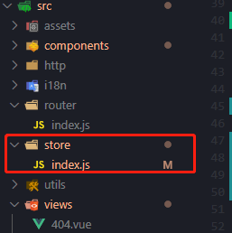
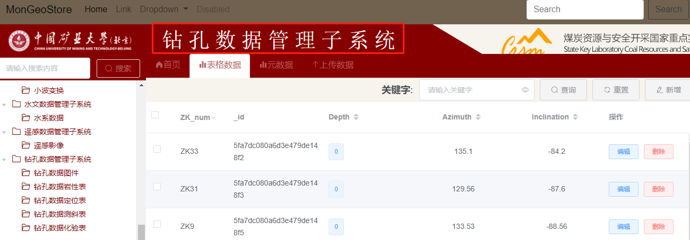
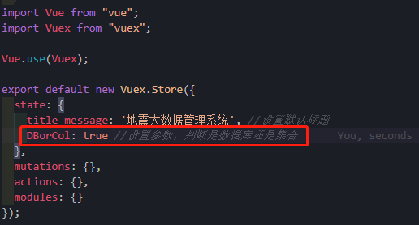
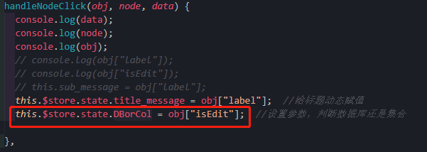
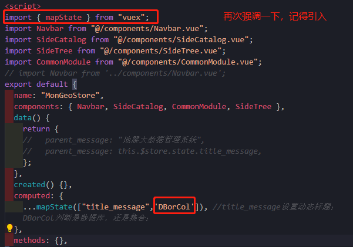
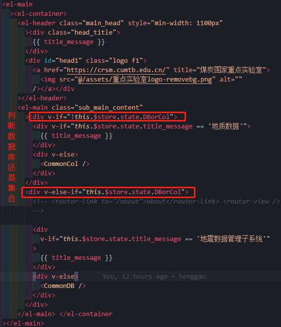

# 侧边栏与右边内容匹配

[TOC]

## 一、目标

- 侧边栏点击，右边内容发生变化。
- 导航的话可以实现
- 这部分主要实现树形结构


## 二、侧边与头部内容绑定

### 2.1 准备

- 这里需要对`Vue`中几个组件之间传值模式有一定的了解。
  - 父传子
  - 子传父
  - 非父子传值（兄弟，隔代），结合`ref1`与`ref2`
- [ref1](https://yimouren.github.io/2018/10/28/vue%E7%88%B6%E5%AD%90%E7%BB%84%E4%BB%B6%E9%97%B4%E4%BC%A0%E5%80%BC%E6%96%B9%E6%B3%95/)
- [ref2](https://juejin.im/post/6844903902932893704)

**总结**

- **小型项目**
  - 推荐使用 `global event bus` (事件总线) ，否则小项目里用 `Vuex` 相对来讲会挺繁琐
- **中大型项目**
  -  推荐使用 `Vuex`

- 阅读一下：[ref](https://www.shangmayuan.com/a/2fb45d8923e249ffaca9fe48.html)


### 2.2 实现标题显示

- 先建一个store文件夹，建立一个`index.js`。这里我事先建好了。



- `index.js`，创建一个`store/index.js`

  ```js
  import Vue from "vue";
  import Vuex from "vuex";
  
  Vue.use(Vuex);
  
  export default new Vuex.Store({
    state: {
      title_message: '地震大数据管理系统' //设置默认标题
    },
    mutations: {},
    actions: {},
    modules: {}
  });
  ```

- `main.js`，引入 `vuex` 并且要在开头调用 `Vue.use(Vuex)`

  ```js
  import Vuex from 'vuex'  // 引入 vuex
  
  Vue.use(Vuex) // 引入
  
  new Vue({
    i18n,
    router,
    store,
    render: h => h(App)
  }).$mount("#app");
  ```

  

- `SideTree.vue` ，组件里进行赋值

  ```js
  this.$store.state.title_message = obj["label"];
  ```

- `MonGeoStore.vue`组件进行使用

  - **在App组件中使用这个数据**
    - 可以使用 `this.$store.state.title_message` 获得这个数据，但是我们一般不用此方法
    - **我们可以使用`mapState`**

  - 在App中导入这个方法

  ```js
  import { mapState } from "vuex";
  ```
- 在计算属性中(computed)使用

  ```js
    computed: {
      ...mapState(["title_message"]),
    },
  ```

- 在页面中使用插值表达式：`{{ title_message }`},直接使用这个数据
  ```js
   {{ title_message }}
  ```

  


### 2.3 实现主要内容显示

- 由于数据库和集合内容展示不一样，需要区分一下。这里使用参数`DBorCol`布尔值进行判断。与上面`title_message`参数赋值一样。

- `store/index.js`

  

- `SideTree.vue`

  

- `MonGeoStore.vue`

  

- 通过`this.$store.state.title_message`、`this.$store.state.DBorCol`这俩个字段就可以进行页面的控制了。

  

- 小插曲

  - 问题描述：集合名称一样时，显示的内容会一样，这里需要做个判断，是哪个数据库中的集合。

  - 解决的方法：在`store/index.js`中设置参数一个`temp_database`存储当前集合属于哪个数据库进行判断。

  - `SideTree.vue`

    ```js
    this.$store.state.temp_database = obj["_database"];
    ```

  - `MonGeoStore.vue`

    ```js
    computed: {
        ...mapState(["title_message", "DBorCol", "temp_database"]), //title_message设置动态标题；DBorCol判断是数据库，还是集合；
      },
    ```

    ```vue
     <div
                    v-if="
                      this.$store.state.temp_database == '地震数据管理子系统' &&
                      this.$store.state.title_message == '地质数据'
                    "
                  >
                    {{ title_message }}
                    {{ temp_database }}
                  </div>
    ```

    

### 2.4 内容编写

- 数据管系统，为了便于管理，在components目录下建立对应的文件夹存放内容。

- components

  - drill
  - geographical
  - geological
  - hydrological
  - remote_sensing
  - seismic

  | 系统               | 英文                                     | 别名         | 子系统 |
  | ------------------ | ---------------------------------------- | ------------ | ------ |
  | 地震数据管理子系统 | Seismic Data Management Subsystem        | `SeiData`    |        |
  | 遥感数据管理子系统 | Remote sensing data management subsystem | `RSData`     |        |
  | 钻孔数据管理子系统 | Drilling data management subsystem       | `DrillData`  |        |
  | 水文数据管理子系统 | Hydrological data management subsystem   | `HydroData`  |        |
  | 地质数据管理子系统 | Geological Data Management Subsystem     | `GeoloData`  |        |
  | 地理数据管理子系统 | Geographical Data Management Subsystem   | `GeograData` |        |

  