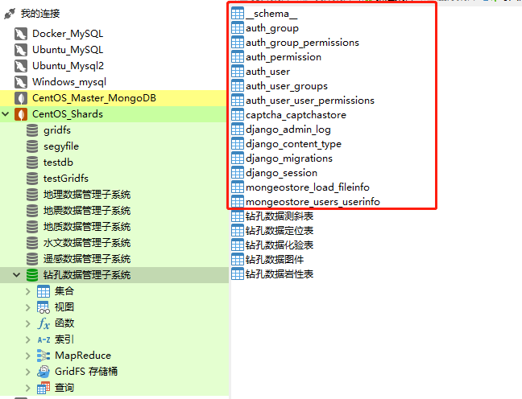

# 不同APP对应不同数据库

[TOC]


## 一、具体步骤

### 1. 编辑settings.py，添加多个数据库

- 将数据库信息写入setting.py中；
- 把数据库放进去进去, 千万不要忘记在你的数据库中创建这个库啊, 不然迁移肯定失败；

```python
DATABASES = {
    'default': {
        # 'ENGINE': 'django.db.backends.sqlite3',
        # 'NAME': BASE_DIR / 'db.sqlite3',

        # 使用djongo设置mongodb
        'ENGINE': 'djongo',
        'NAME': 'django_example',
        'CLIENT': {
            'host': '192.168.55.110:27017',
        }
    },
    'drill': {
        'ENGINE': 'djongo',
        'NAME': '钻孔数据管理子系统',
        'CLIENT': {
            'host': '192.168.55.110:20000',
        }
    },
    'geological': {
        'ENGINE': 'djongo',
        'NAME': '地质数据管理子系统',
        'CLIENT': {
            'host': '192.168.55.110:20000',
        }
    },
    'seismic': {
        'ENGINE': 'djongo',
        'NAME': '地震数据管理子系统',
        'CLIENT': {
            'host': '192.168.55.110:20000',
        }
    },
}

```


### 2. 设置数据库的路由规则方法 

- 编辑settings.py，添加路由

```python
# 数据库路由
DATABASE_ROUTERS = ['mongeostore_v1.database_router.DatabaseAppsRouter']
```

- Project: 建立的django项目名称(project_name) 
- database_router: 定义路由规则`database_router.py` 文件名称, 这个文件名可以自己定义
- DatabaseAppsRouter: 路由规则的类名称，这个类是在`database_router.py` 文件中定义
- 

### 3. 添加数据库路由表

每个APP要连接哪个数据库，需要在做匹配设置，在 `settings.py` 文件中做如下配置：

```python
# 设置APP对应的数据库路由表,不指定则会自动创建到默认（default）的数据库中
DATABASE_APPS_MAPPING = {
    # example:
    # 'app_name':'database_name',
    'mongeostore_app': 'default',
    # 'mongeostore_load': 'drill', #这里由于数据库用到不同的集合，可以在models中具体配置
}
```

以上的mongeostore_app， mongeostore_load是项目中的 APP名，分别指定到 default， drill的数据库。 

*为了使django自己的表也创建到你自己定义的数据库中，你可以指定 : admin, auth, contenttypes, sessions 到设定的数据库中，如果不指定则会自动创建到默认（default）的数据库中.*


### 4. 创建数据库路由规则

- 在项目工程根路径下(与 settings.py 文件一级）创建 `database_router.py` 文件:

```python
from django.conf import settings
 
DATABASE_MAPPING = settings.DATABASE_APPS_MAPPING	# 在setting中定义的路由表
 
 
class DatabaseAppsRouter(object):
    """
    A router to control all database operations on models for different
    databases.
 
    In case an app is not set in settings.DATABASE_APPS_MAPPING, the router
    will fallback to the `default` database.
 
    Settings example:
 
    DATABASE_APPS_MAPPING = {'app1': 'db1', 'app2': 'db2'}
    """
 
    def db_for_read(self, model, **hints):
        """"Point all read operations to the specific database."""
        if model._meta.app_label in DATABASE_MAPPING:
            return DATABASE_MAPPING[model._meta.app_label]
        return None
 
    def db_for_write(self, model, **hints):
        """Point all write operations to the specific database."""
        if model._meta.app_label in DATABASE_MAPPING:
            return DATABASE_MAPPING[model._meta.app_label]
        return None
 
    def allow_relation(self, obj1, obj2, **hints):
        """Allow any relation between apps that use the same database."""
        db_obj1 = DATABASE_MAPPING.get(obj1._meta.app_label)
        db_obj2 = DATABASE_MAPPING.get(obj2._meta.app_label)
        if db_obj1 and db_obj2:
            if db_obj1 == db_obj2:
                return True
            else:
                return False
        return None
 
    def allow_syncdb(self, db, model):
        """Make sure that apps only appear in the related database."""
 
        if db in DATABASE_MAPPING.values():
            return DATABASE_MAPPING.get(model._meta.app_label) == db
        elif model._meta.app_label in DATABASE_MAPPING:
            return False
        return None
 
    def allow_migrate(self, db, app_label, model=None, **hints):
        """
        Make sure the auth app only appears in the 'auth_db'
        database.
        """
        if db in DATABASE_MAPPING.values():
            return DATABASE_MAPPING.get(app_label) == db
        elif app_label in DATABASE_MAPPING:
            return False
        return None
```


### 5. 同步数据库

```shell
python manage.py makemigrations
# 更新drill数据库
python manage.py migrate --database=drill
python manage.py migrate --database=geological
#  更新默认数据库
python manage.py migrate
```

- 这样创建，会默认生成一些文件

  

  

- 以上创建完成后,其它所有的创建、查询、删除等操作就和普通一样操作就可以了,无需再使用类似 `models.User.objects.using(dbname).all(）` 这样的方式来操作。

- 由于我们的一些数据库不需要默认生成的表，我们后续仍然采用`using`的方式。


### 6. 操作数据库

- 查询和创建数据语句如下（不加using为采用default数据库）

```python
models.DrillModel.objects.using('drill').all()   #using('drill')表示使用drill这个数据库        
```


- [ref1](https://blog.csdn.net/weixin_42282496/article/details/80795261)
- [ref2](https://www.cnblogs.com/fu-yong/p/9889423.html)
- [ref3](https://blog.csdn.net/weixin_42134789/article/details/107194373)

- [ref4](https://blog.csdn.net/weixin_30315435/article/details/96323506?utm_medium=distribute.pc_relevant.none-task-blog-BlogCommendFromMachineLearnPai2-2.control&depth_1-utm_source=distribute.pc_relevant.none-task-blog-BlogCommendFromMachineLearnPai2-2.control)

  