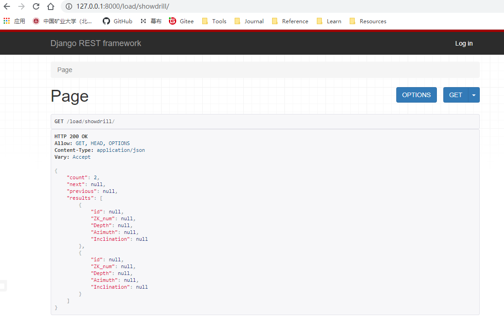

## 二、钻孔数据序列化

### 1、models.py

```python
class DrillModel(models.Model):
    '''
    DrillData
    '''

    ZK_num = models.CharField(max_length=20)
    Depth = models.CharField(max_length=20)
    Azimuth = models.FloatField(max_length=30)
    Inclination = models.FloatField(max_length=30)

    class Meta:
        verbose_name = "钻孔数据"
        verbose_name_plural = verbose_name
        app_label = 'drill'  # 如果指定将在drill对应的数据库下创建数据表
        db_table = '钻孔数据定位表'  # 自定义表名称

    def __str__(self):
        """
        docstring
        """
        return self.ZK_num
```

### 2、serializers.py

```python
class DrillSerializer(serializers.ModelSerializer):
    class Meta:
        model = DrillModel
        fields = "__all__"
```

### 3、views.py

- 对于大数据量，实现分页操作

```python
class MyPagination(PageNumberPagination):
    page_size = 10
    # 每页显示数据的数量
    max_page_size = 50
    # 每页最多可以显示的数据数量
    page_query_param = 'page'
    # 获取页码时用的参数
    page_size_query_param = 'size'
    # 调整每页显示数量的参数名


class PageView(APIView):
    def get(self, request, *args, **kwargs):
        drill_obj = DrillModel.objects.using('drill').all()
        pg = MyPagination()
        page = pg.paginate_queryset(
            queryset=drill_obj, request=request, view=self)
        serializer = DrillSerializer(instance=page, many=True)
        data = pg.get_paginated_response(serializer.data)
        # 自定义的分页类中实例化后使用get_paginated_response方法可以实现显示上下页链接的功能
        return data
```

- `using('drill')需要在settings.py`中设置数据库

### 4、urls.py

```python
path('showdrill/', PageView.as_view(), name="showdrill"),
```


### 5、浏览器访问

http://127.0.0.1:8000/load/showdrill/



