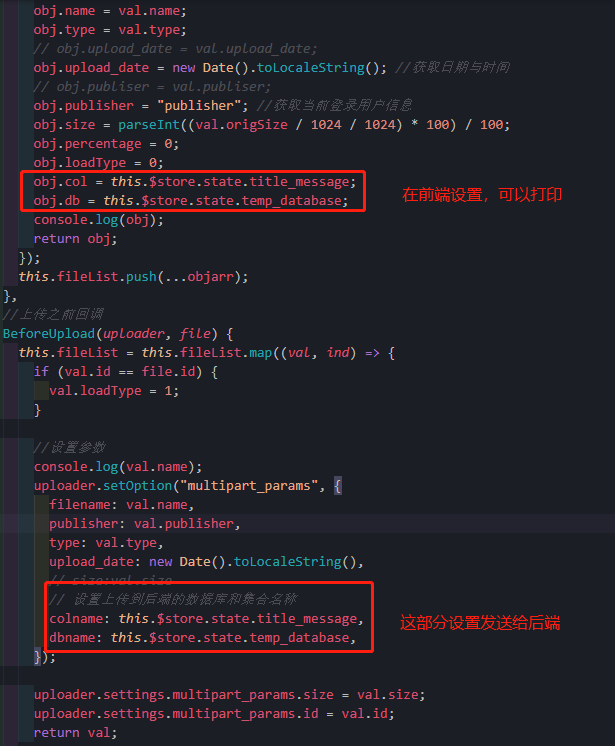

# 1. 不同的集合实现上传Excel

[TOC]

## 一、准备工作

- `views.py`

- 原来指定的集合

  ```python
  class UploadExcel(APIView):
      """
      docstring
      """
  
      def get(self, request):
          """
          docstring
          """
          File = request.FILES.get("file", None)
  
          return HttpResponse(File)
      # @require_http_methods(['POST'])
  
      def post(self, request):
          """
          docstring
          """
          # 从前端拿到数据
          File = request.FILES.get("file", None)
          # 保存到本地
          if not os.path.exists('upload/'):
              os.mkdir('upload/')
          with open("./upload/%s" % File.name, 'wb+') as f:
              for chunk in File.chunks():
                  f.write(chunk)
              f.close()
          # 写入mongodb，data数据库
          client = pymongo.MongoClient("192.168.55.110", 20000)
          database = "segyfile"
          db = client[database]
          collection = "excel_data"
          db_coll = db[collection]
  
          # 读取Excel文件
          data = xlrd.open_workbook("./upload/%s" % File.name)
          table = data.sheets()[1]
          # 读取excel第一行数据作为存入mongodb的字段名
          rowstag = table.row_values(0)
          nrows = table.nrows
          returnData = {}
  
          for i in range(1, nrows):
              # 将字段名和excel数据存储为字典形式，并转换为json格式
              returnData[i] = json.dumps(dict(zip(rowstag, table.row_values(i))))
              # 通过编解码还原数据
              returnData[i] = json.loads(returnData[i])
              print(returnData[i])
              db_coll.insert(returnData[i])
          client.close()
          return HttpResponse("uploadexcel success")
  
  ```

  

- 进行修改，根据点击事件，动态实现Excel数据上传

  - 前端获取到点击事件（目录）的数据库和集合，给后台发送数据库和集合

  - 后端获取数据库和集合，注意Excel中sheets的获取。这是判断sheets与集合名称

    ```python
    # 读取Excel文件
    data = xlrd.open_workbook('./mongeostore_env/upload/data_w.xls')
    # 选择上传的sheet，注意字段
    # print(len(data.sheets())) #返回excel中sheet的数量
    table = data.sheets()[2]
    print(data.sheet_names())  # 拿到EXcel的sheet名称
    list = data.sheet_names()  # 拿到EXcel的sheet名称
    name = '汇总'
    if name in list :
        print("yes")
        print(list.index(name))  #判断元素的位置
    ```


## 二、不同集合实现对应数据上传

- 抽出公共的上传Excel类文件
  - 如果Excel中有多个sheet，判断是否和集合名称对应
  - 如果不存在，默认上传第一个sheets给该集合

- `CommonUploadExcel.vue`

  

  ```vue
  <template>
    <div style="padding-top: 20px">
      <el-row>
        <el-col :span="18"><h4>上传Excel数据（保存json数据格式）</h4></el-col>
        <el-col :span="6"
          ><el-button ref="VideoChose1" id="VideoChose1" size="medium"
            >选择文件</el-button
          >
          <el-button
            ref="VideoChose1"
            type="primary"
            size="medium"
            @click="FileUplodeOn1"
            >开始上传</el-button
          ></el-col
        >
      </el-row>
      <el-card style="margin-top: 20px">
        <el-table :data="fileList" style="width: 100%">
          <el-table-column prop="id" label="文件id"></el-table-column>
          <el-table-column prop="name" label="文件名称"></el-table-column>
          <el-table-column prop="type" label="文件类型"></el-table-column>
          <el-table-column prop="size" label="文件大小" v-slot="{ row }">
            {{ row.size }}MB
          </el-table-column>
          <el-table-column prop="upload_date" label="上传时间"></el-table-column>
          <el-table-column prop="publisher" label="上传人员"></el-table-column>
          <el-table-column label="进度" v-slot="{ row }">
            <el-progress
              :text-inside="true"
              :stroke-width="16"
              :percentage="row.percentage"
            ></el-progress>
          </el-table-column>
          <el-table-column label="取消上传" v-slot="{ row }">
            <el-button
              type="danger"
              icon="el-icon-delete"
              size="mini"
              circle
              @click="removeFile(row.id)"
            ></el-button>
          </el-table-column>
          <el-table-column label="上传状态" v-slot="{ row }">
            <el-link
              :type="
                row.loadType == 0
                  ? 'info'
                  : row.loadType == 1
                  ? 'warning'
                  : row.loadType == 2
                  ? 'success'
                  : 'danger'
              "
              :underline="false"
              >{{
                row.loadType == 0
                  ? "等待上传"
                  : row.loadType == 1
                  ? "正在上传"
                  : row.loadType == 2
                  ? "上传成功"
                  : "上传失败"
              }}</el-link
            >
          </el-table-column>
        </el-table>
      </el-card>
    </div>
  </template>
  
  <script>
  import { mapState } from "vuex";
  import plupload from "plupload";
  import axios from "axios";
  import { stringify } from "qs";
  export default {
    name: "CommonUploadExcel",
    data() {
      return {
        show: false,
        fileList: [],
        fileOptions: {
          browse_button: "VideoChose1",
          // url: "http://127.0.0.1:8000/load/uploadfile/",
          url: "http://127.0.0.1:8000/load/commonuploadexcel/",
          flash_swf_url: "script/Moxie.swf",
          silverlight_xap_url: "script/Moxie.xap",
          // chunk_size: "10mb", //分块大小  ,注销掉或者改chunk_size：'0mb'为解决文件大于10M存为blob问题
          max_retries: 3,
          unique_names: true,
          multi_selection: true,
          views: {
            list: true,
            thumbs: true, // Show thumbs
            active: "thumbs",
          },
          filters: {
            mime_types: [
              //文件格式
              {
                title: "files",
                extensions: "xls,xlsx", //文件格式
              },
            ],
            max_file_size: "10240mb", //最大上传的文件
            prevent_duplicates: true, //不允许选取重复文件
          },
          multipart_params: {
            uuid: "", //参数
            // testparams: "Must can see me",
            // "testparams2": "Must can see me2"
          },
        },
      };
    },
  
    mounted() {
      //实例化一个plupload上传对象
      this.uploader.init();
      //绑定进队列
      this.uploader.bind("FilesAdded", this.FilesAdded);
      //绑定进度
      this.uploader.bind("UploadProgress", this.UploadProgress);
      //上传之前
      this.uploader.bind("BeforeUpload", this.BeforeUpload);
      //上传成功监听
      this.uploader.bind("FileUploaded", this.FileUploaded);
      //获取uuid
      // let url = `http://127.0.0.1:8000/api/uploadinfo/`;
      let url = `http://127.0.0.1:8000/load/commonuploadexcel/`;
  
      axios.get(url).then(({ data }) => {
        this.fileOptions.multipart_params.uuid = data;
      });
    },
    computed: {
      //实例化一个plupload上传对象
      uploader() {
        return new plupload.Uploader(this.fileOptions);
      },
      ...mapState(["title_message", "DBorCol", "temp_database"]), //title_message设置动态标题；DBorCol判断是数据库，还是集合；
    },
    methods: {
      //绑定进队列
      FilesAdded(uploader, files) {
        let objarr = files.map((val, ind) => {
          let obj = {};
          obj.id = val.id;
          obj.name = val.name;
          obj.type = val.type;
          // obj.upload_date = val.upload_date;
          obj.upload_date = new Date().toLocaleString(); //获取日期与时间
          // obj.publiser = val.publiser;
          obj.publisher = "publisher"; //获取当前登录用户信息
          obj.size = parseInt((val.origSize / 1024 / 1024) * 100) / 100;
          obj.percentage = 0;
          obj.loadType = 0;
          obj.col = this.$store.state.title_message;
          obj.db = this.$store.state.temp_database;
          console.log(obj);
          return obj;
        });
        this.fileList.push(...objarr);
      },
      //上传之前回调
      BeforeUpload(uploader, file) {
        this.fileList = this.fileList.map((val, ind) => {
          if (val.id == file.id) {
            val.loadType = 1;
          }
  
          //设置参数
          console.log(val.name);
          uploader.setOption("multipart_params", {
            filename: val.name,
            publisher: val.publisher,
            type: val.type,
            upload_date: new Date().toLocaleString(),
            // size:val.size
            // 设置上传到后端的数据库和集合名称
            colname: this.$store.state.title_message,
            dbname: this.$store.state.temp_database,
          });
  
          uploader.settings.multipart_params.size = val.size;
          uploader.settings.multipart_params.id = val.id;
          return val;
        });
      },
      //上传进度回调
      UploadProgress(uploader, file) {
        this.fileList = this.fileList.map((val, ind) => {
          if (val.id == file.id) {
            val.percentage = file.percent;
          }
          return val;
        });
      },
      // 上传成功回调
      FileUploaded(uploader, file, responseObject) {
        this.fileList = this.fileList.map((val, ind) => {
          if (val.id == file.id) {
            // if (JSON.parse(responseObject.response).status == 0) {
            if (status == 0) {
              val.loadType = 2;
            } else {
              val.loadType = 3;
            }
          }
          return val;
        });
      },
      //取消上传回调
      removeFile(id) {
        this.uploader.removeFile(id);
        this.fileList = this.fileList.filter((val, ind) => {
          if (val.id == id) {
            return false;
          } else {
            return true;
          }
        });
      },
      //开始上传
      FileUplodeOn1() {
        this.uploader.start();
      },
    },
  };
  </script>
  ```

- 将`CommonCol.vue`中的`UploadExcel`换为`CommonUploadExcel`

- `views.py`

  ```python
  class CommonUploadExcel(APIView):
      """
      docstring
      """
  
      def get(self, request):
          """
          docstring
          """
          File = request.FILES.get("file", None)
          # print(request.data)
  
          return HttpResponse(File)
      # @require_http_methods(['POST'])
  
      def post(self, request):
          """
          docstring
          """
          # 从前端拿到数据
          File = request.FILES.get("file", None)
          # print('post')
          # print(request.data)
          # print(request.data['colname'])
          # print(request.data['dbname'])
  
          # 保存到本地
          if not os.path.exists('upload/'):
              os.mkdir('upload/')
          with open("./upload/%s" % File.name, 'wb+') as f:
              for chunk in File.chunks():
                  f.write(chunk)
              f.close()
          # 写入mongodb，data数据库
          client = pymongo.MongoClient("192.168.55.110", 20000)
          # database = "segyfile"
          database = request.data['dbname']  # 从前端拿到数据库名称
          db = client[database]  # 连接数据库
          # collection = "excel_data"
          collection = request.data['colname']  # 从前端拿到数集合名称
          db_coll = db[collection]  # 连接集合
  
          # 读取Excel文件
          data = xlrd.open_workbook("./upload/%s" % File.name)
          list = data.sheet_names()  # 拿到EXcel的sheet名称
          if collection in list:
              print("yes")
              print(list.index(collection))  # 判断元素的位置
              x = list.index(collection)  # 获取集合的位置
          else:
              x = 0  # 不存在设置默认第一个sheet
          print(x)
          table = data.sheets()[x]
          # 读取excel第一行数据作为存入mongodb的字段名
          rowstag = table.row_values(0)
          nrows = table.nrows
          returnData = {}
  
          for i in range(1, nrows):
              # 将字段名和excel数据存储为字典形式，并转换为json格式
              returnData[i] = json.dumps(dict(zip(rowstag, table.row_values(i))))
              # 通过编解码还原数据
              returnData[i] = json.loads(returnData[i])
              print(returnData[i])
              db_coll.insert(returnData[i])
          client.close()
          return HttpResponse("uploadexcel success")
  
  ```

  

- `urls.py`

```python
    path('commonuploadexcel/', CommonUploadExcel.as_view(),
         name="commonuploadexcel"),  # 上传Excel
```


# 2. 不同集合实现上传CSV数据

- `CommonUplaodCSV.vue`类似

- `views.py`

  ```python
  class CommonUploadCSV(APIView):
      """
      docstring
      """
  
      def get(self, request):
          """
          docstring
          """
          File = request.FILES.get("file", None)
  
          return HttpResponse(File)
      # @require_http_methods(['POST'])
  
      def post(self, request):
          """
          docstring
          """
          # 从前端拿到数据
          File = request.FILES.get("file", None)
          # 保存到本地
          if not os.path.exists('upload/'):
              os.mkdir('upload/')
          with open("./upload/%s" % File.name, 'wb+') as f:
              for chunk in File.chunks():
                  f.write(chunk)
              f.close()
          # 写入mongodb，data数据库
          client = pymongo.MongoClient("192.168.55.110", 20000)
          # database = "segyfile"
          database = request.data['dbname']  # 从前端拿到数据库名称
          db = client[database]  # 连接数据库
          # collection = "excel_data"
          collection = request.data['colname']  # 从前端拿到数集合名称
          db_coll = db[collection]  # 连接集合
  
          with open("./upload/%s" % File.name, 'r', encoding='utf-8')as csvfile:
              # 调用csv中的DictReader函数直接获取数据为字典形式
              reader = csv.DictReader(csvfile)
              # 创建一个counts计数一下 看自己一共添加了了多少条数据
              counts = 0
              for each in reader:
                  # 将数据中需要转换类型的数据转换类型。原本全是字符串（string）。
                  each['?rank'] = int(each['?rank'])
                  each['costMoney'] = float(each['costMoney'])
                  each['combat'] = float(each['combat'])
                  each['topHeroesCombat'] = int(each['topHeroesCombat'])
                  # each['表显里程'] = float(each['表显里程'])
                  # each['排量'] = float(each['排量'])
                  # each['过户数量'] = int(each['过户数量'])
                  db_coll.insert(each)
                  # set1.insert_one(each)
                  counts += 1
                  # print('成功添加了'+str(counts)+'条数据 ')
          client.close()
          return HttpResponse("uploadcsv success")
  
  ```

  

- `urls.py`

  ```python
    path('commonuploadcsv/', CommonUploadCSV.as_view(),
           name="commonuploadcsv"),  # 上传CSV
  ```

  

# 3. 不同数据库上传元数据

- `CommonUploadMeta.vue`类似

- 注意一下字段`colname`与前的俩个稍有不同

```python
database = request.data['colname']  # 从前端拿到数据库名称
```

- `views.py`

  ```python
  class CommonUploadMeta(APIView):
  
      def get(self, request, *args, **kwargs):
          """
          docstring
          """
          # print("走的是GET方法")
          response = {}
          queryset = FileInfo.objects.all()
          serializer_class = FileInfoSerializer
          response['code'] = 200
          # response["Access-Control-Allow-Methods"] = "POST"
          return HttpResponse(json.dumps(response), content_type="application/json")
  
      def post(self, request):
          """
          docstring
          """
          # print("走的是POST方法")
          # file = self.request.POST.get('name',None)  # 获取上传的文件，如果没有文件，则默认为None
          File = request.FILES.get("file", None)  # 注意比较
          # print(File)
          # print(File.name)   #同上
          # print(File.chunks)  # 二进制信息
          _id = self.request.POST.get('id')
          filename = self.request.POST.get('filename')
          type = self.request.POST.get('type')
          size = self.request.POST.get('size')
          upload_date = self.request.POST.get('upload_date')
          publisher = self.request.POST.get('publisher')
          # print(filename)
          # print(publisher)
  
          # 保存到本地
          if not os.path.exists('upload/'):
              os.mkdir('upload/')
          with open("./upload/%s" % File.name, 'wb+') as f:
              for chunk in File.chunks():
                  f.write(chunk)
              f.close()
  
          #  上传文件到MongoDB中gridfs
          client = MongoClient("192.168.55.110", 20000)  # 连接MongoDB数据库
  
          # 如果没有数据库，创建数据库
          # db = client.segyfile  # 选定数据库，设定数据库名称为segyfile
          # database = "segyfile"
          # print(request.data)
          database = request.data['colname']  # 从前端拿到数据库名称
          db = client[database]  # 连接数据库
  
          with open("./upload/%s" % File.name, 'rb') as f:
              _id = self.request.POST.get('id')
              filename = self.request.POST.get('filename')
              contentType = self.request.POST.get('type')
              size = self.request.POST.get('size')
              upload_date = self.request.POST.get('upload_date')
              publisher = self.request.POST.get('publisher')
              # print(upload_date)
              dic = {
                  "_id": _id,
                  "filename": filename,
                  "contentType": contentType,
                  "length": size,
                  "uploadDate": upload_date,
                  "publisher": publisher,
                  "aliases": [publisher],  # 别名
                  "metadata": filename,
              }
              data = f.read()
              fs = gridfs.GridFS(db, '元数据')  # 连接GridFS集合，名称为'元数据'
              fs.put(data, **dic)
              f.close()
          client.close()
          return HttpResponse("Successful")
  
  ```

- `urls.py`

  ```python
     path('commonuploadmeta/', CommonUploadMeta.as_view(),
           name="commonuploadmeta"),  # 上传元数据到GridFS
  ```

  