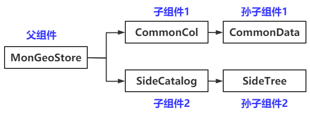
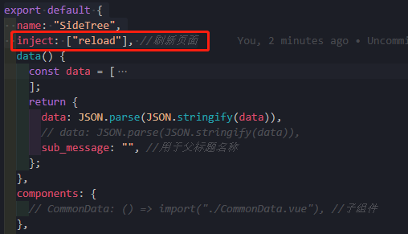
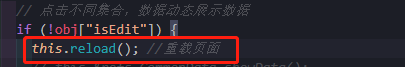
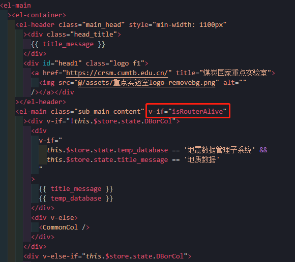
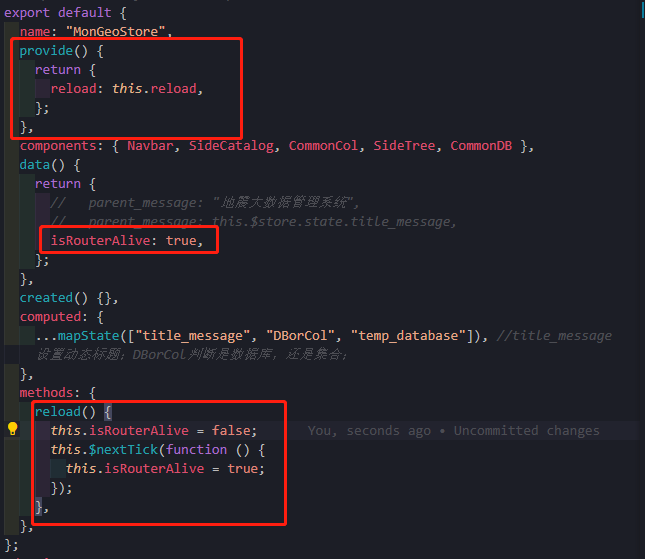
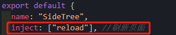
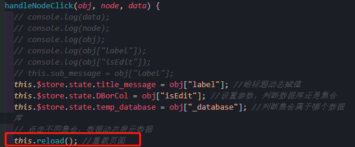

# 页面刷新

[TOC]

## 1、问题描述

当在`SideTree`中进行Collection数据表切换的时候会数据需要手动刷新一下才能显示。

- 

  

## 2、思路

### 2.1 思路一

- 在`SideTree`组件中调用`CommonData.vue`组件中的`showData`方法，达到刷新页面效果。

- `vuex`中组件之间传递数据，能不能组件间传递方法？

- `eventBus`事件车

- 父组件与子组件之间传递，这需要多次传递。需要`vuex`

  

- [ref](https://segmentfault.com/a/1190000022083517)

## 

### 2.2 思路二

- 重新加载页面

- 原`app.vue`备份

  ```vue
  <template>
    <div id="app">
      <!-- <div id="nav">
        <router-link to="/">Home</router-link> |
        <router-link to="/about">About</router-link> |
        <router-link to="/segy">Segy</router-link>
      </div> -->
      <router-view />
    </div>
  </template>
  
  <style lang="less">
  #app {
    font-family: Avenir, Helvetica, Arial, sans-serif;
    -webkit-font-smoothing: antialiased;
    -moz-osx-font-smoothing: grayscale;
    text-align: center;
    color: #2c3e50;
  }
  
  #nav {
    padding: 30px;
  
    a {
      font-weight: bold;
      color: #2c3e50;
  
      &.router-link-exact-active {
        color: #42b983;
      }
    }
  }
  </style>
  
  ```

- 1. 修改后的`app.vue`

  ```vue
  <!--
   * @Description: henggao_learning
   * @version: v1.0.0
   * @Author: henggao
   * @Date: 2020-08-26 17:15:17
   * @LastEditors: henggao
   * @LastEditTime: 2020-11-24 15:08:33
  -->
  <template>
    <div id="app">
      <!-- <div id="nav">
        <router-link to="/">Home</router-link> |
        <router-link to="/about">About</router-link> |
        <router-link to="/segy">Segy</router-link>
      </div> -->
      <!-- <router-view /> -->
      <router-view v-if="isRouterAlive"></router-view>
    </div>
  </template>
  
  <script>
  export default {
    name: "App",
    provide() {
      return {
        reload: this.reload,
      };
    },
    data() {
      return {
        isRouterAlive: true,
      };
    },
    methods: {
      reload() {
        this.isRouterAlive = false;
        this.$nextTick(function () {
          this.isRouterAlive = true;
        });
      },
    },
    components: {},
  };
  </script>
  
  <style lang="less">
  #app {
    font-family: Avenir, Helvetica, Arial, sans-serif;
    -webkit-font-smoothing: antialiased;
    -moz-osx-font-smoothing: grayscale;
    text-align: center;
    color: #2c3e50;
  }
  
  #nav {
    padding: 30px;
  
    a {
      font-weight: bold;
      color: #2c3e50;
  
      &.router-link-exact-active {
        color: #42b983;
      }
    }
  }
  </style>
  
  ```

- 2. 直接在子组件中引用

  

  - `methods:{}`方法中使用

  

  - 可以解决数据加载刷新问题，但是页面每点击一次，都会整个刷新一次。可不可以进一步优化，刷新部分页面。

- 优化一下，将`app.vue`还原，设置`MonGeoStore.vue`,主要是让el-main部分的内容刷新。

- `MonGeoStore.vue`

​	




- 在`SideTree.vue`中使用

  

- methods方法中使用，我这里是在点击树形目录中使用

  

  

- [ref1](https://blog.csdn.net/yufengaotian/article/details/81238792?utm_medium=distribute.pc_relevant.none-task-blog-BlogCommendFromMachineLearnPai2-1.control&depth_1-utm_source=distribute.pc_relevant.none-task-blog-BlogCommendFromMachineLearnPai2-1.control)

- [ref2](https://www.jb51.net/article/151984.htm)
- [ref3](https://segmentfault.com/q/1010000017757328)

