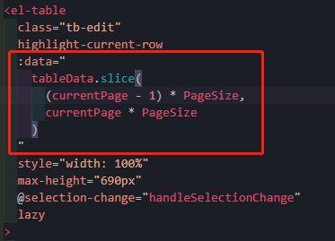
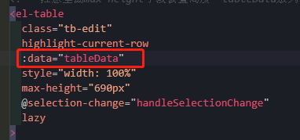

# 钻孔数据管理子系统——测斜表

[TOC]

## 1、前言

- 不同数据库集合定制专门的页面功能需求

  

## 2、分页

### 2.1、前端

- 在`component/drill/Inclination.vue`

  - 基于所有数据，前端进行分割。
  
  

  - 换为，数据在后端分页实现，这里直接使用即可
  
  
  
  
  
  ```vue
  <!--
   * @Description: henggao_learning
   * @version: v1.0.0
   * @Author: henggao
   * @Date: 2020-11-18 21:39:35
   * @LastEditors: henggao
   * @LastEditTime: 2020-11-25 22:58:08
  -->
  <template>
    <div class="DataShow">
      <el-container>
        <el-header class="data_search">
          <!--搜索头 开始-->
          <section id="search-title" style="min-width: 500px">
            <el-form
              :inline="true"
              :model="searchCondition"
              class="demo-form-inline"
              @submit.native.prevent
            >
              <el-form-item label="关键字:">
                <el-input
                  v-model="searchCondition.filter_key"
                  suffix-icon="el-icon-view"
                  placeholder="请输入关键字"
                  @keyup.enter.native="onSearchSubmit"
                ></el-input>
              </el-form-item>
              <el-form-item id="submit-item">
                <el-button
                  type="info"
                  plain
                  icon="el-icon-search"
                  @click="onSearchSubmit"
                  >查询</el-button
                >
              </el-form-item>
              <el-form-item id="submit-reset">
                <el-button
                  type="info"
                  plain
                  icon="el-icon-refresh"
                  @click="resetData"
                  >重置</el-button
                >
              </el-form-item>
              <el-form-item id="addNew-item">
                <el-button
                  type="info"
                  plain
                  icon="el-icon-edit"
                  @click="dialogVisible = true"
                  >新增</el-button
                >
              </el-form-item>
            </el-form>
          </section>
          <!--搜索头 结束-->
          <!-- <SearchData /> -->
        </el-header>
        <el-main class="data_content">
          <div class="data_table" style="overflow: hidden">
            <!-- 注意里面max-height字段设置高度  tableData放列表数据 -->
            <el-table
              class="tb-edit"
              highlight-current-row
              :data="tableData"
              style="width: 100%"
              max-height="690px"
              @selection-change="handleSelectionChange"
              lazy
            >
              <!-- 选择框设置 -->
              <el-table-column type="selection" width="55"> </el-table-column>
              <!-- 添加_id字段 -->
              <el-table-column label="_id" prop="_id"> </el-table-column>
              <!-- 筛选字段 filters,这只是筛选当页的-->
              <!-- <el-table-column
                fixed="left"
                label="ZK_num"
                prop="ZK_num"
                width="100"
                :filters="filter_data"
                :filter-method="filterHandler"
              ></el-table-column> -->
              <!-- 生成关键词 cols存放关键词-->
              <!-- <template v-for="(col, index) in cols"> -->
              <template v-for="col in cols">
                <!-- 设置排序字段 -->
                <el-table-column
                  :key="col._id"
                  :prop="col.prop"
                  sortable
                  :label="col.label"
                  align="center"
                >
                  <!-- 每一行数据 -->
                  <template slot-scope="scope">
                    <div v-if="!scope.row.isEdit">{{ scope.row[col.prop] }}</div>
                    <div v-else>
                      <el-input v-model="scope.row[col.prop]"></el-input>
                    </div>
                  </template>
                </el-table-column>
              </template>
              <el-table-column fixed="right" label="操作" width="160">
                <template slot-scope="scope">
                  <el-button
                    type="primary"
                    plain
                    size="mini"
                    @click="handleEdit(scope.$index, scope.row)"
                    >{{ scope.row.isEdit ? "保存" : "编辑" }}</el-button
                  >
                  <el-button
                    @click.native.prevent="
                      deleteRow(scope.$index, tableData, scope.row)
                    "
                    type="danger"
                    plain
                    size="mini"
                  >
                    删除
                  </el-button>
                </template>
              </el-table-column>
            </el-table>
          </div>
          <!-- 分页 -->
          <div class="block" style="overflow: hidden">
            <el-pagination
              small
              @size-change="handleSizeChange"
              @current-change="handleCurrentChange"
              :current-page.sync="currentPage"
              :page-sizes="pageSizes"
              :page-size="PageSize"
              layout="total, sizes, prev, pager, next, jumper"
              :total="totalCount"
            >
            </el-pagination>
          </div>
          <!-- 下面这个用来设置点击添加按钮的弹出框，里面可以进行嵌套表格来展示弹出的表格信息,使用下面的:visible.sync来控制显示与否。里面绑定的是我们新设置的值，填写完成后，将我们这个新值塞到页面中所有的数据当中去  -->
          <!-- 添加数据的对话框 -->
          <el-dialog
            title="添加数据"
            :visible.sync="dialogVisible"
            width="30%"
            @close="addDialogClosed"
          >
            <!-- 内容的主体区域 -->
            <!--去掉:rules="addFormRules" -->
            <el-form
              ref="addFormRef"
              :model="add_to_data"
              :rules="addFormRules"
              label-width="100px"
            >
              <template v-for="(item, key) of addForm">
                <!-- <el-form-item
                  v-if="key == '_id'"
                  :label="key"
                  :prop="key"
                  :key="key"
                >
                  <el-input v-model="addForm[key]"></el-input>
                </el-form-item> -->
                <el-form-item
                  v-if="key !== '_id'"
                  :label="key"
                  :prop="key"
                  :key="key"
                >
                  <el-input v-model="add_to_data[key]"></el-input>
                </el-form-item>
                <!-- <el-form-item label="密码" prop="password">
                <el-input v-model="addForm.password"></el-input>
              </el-form-item>
              <el-form-item label="邮箱" prop="email">
                <el-input v-model="addForm.email"></el-input>
              </el-form-item>
              <el-form-item label="手机号" prop="mobile">
                <el-input v-model="addForm.mobile"></el-input>
              </el-form-item> -->
              </template>
            </el-form>
            <!-- 底部区域 -->
            <span slot="footer" class="dialog-footer">
              <el-button @click="dialogVisible = false">取 消</el-button>
              <el-button
                type="primary"
                :disabled="true"
                v-if="!add_button_state"
                @click="addData"
                >确 定</el-button
              >
              <el-button
                type="primary"
                v-else-if="add_button_state"
                @click="addData"
                >确 定</el-button
              >
            </span>
          </el-dialog>
        </el-main>
      </el-container>
    </div>
  </template>
  
  <script>
  import axios from "axios";
  import qs from "qs";
  
  // import SearchData from "@/components/SearchData.vue";
  export default {
    name: "InclinationData",
    components: {
      // SearchData
    },
    data() {
      // 校验添加信息
      let checkKey_word = (rule, value, callback) => {
        // const regZK_num = /^ZK[0-9]{1,6}/;
        const regKey_word = /^[A-Za-z0-9\u4e00-\u9fa5]{3,}$/;
        if (regKey_word.test(value)) {
          // 验证通过，合法
          return callback();
        }
        // 验证不通过，不合法
        callback(new Error("请输入正确的信息"));
      };
  
      return {
        // cols prop属性值都是作为 tableData的属性
        cols: [
          { label: "节点编号_id", prop: "_id.$oid", nickname: "normal" },
          { label: "名称nickname", prop: "nickname", nickname: "sort" },
          { label: "类型combat", prop: "combat", nickname: "normal" },
          { label: "状态level", prop: "level", nickname: "normal" },
          { label: "坐标rid", prop: "rid", nickname: "normal" },
        ],
        //   表格数据
        tableData: [
          {
            node: "0051",
            name: " 机库顶",
            type: "UWB",
            status: "正常",
            coordinate: "12.21,34.45,34.6",
          },
          {
            node: "0061",
            name: "机库门",
            type: "GPS",
            status: "低电",
            coordinate: "45.41,67.45,78.6",
          },
          {
            node: "0061",
            name: "机库门",
            type: "GPS",
            status: "低电",
            coordinate: "45.41,67.45,78.6",
          },
        ],
        // 筛选字段
        filter_data: [
          { text: "ZK1", value: "ZK1" },
          { text: "ZK2", value: "ZK2" },
          { text: "ZK3", value: "ZK3" },
          { text: "ZK4", value: "ZK4" },
        ],
        // 分页数据，默认第几页
        currentPage: 1,
        // 总条数，根据接口获取数据长度(注意：这里不能为空)
        totalCount: 400,
        // 个数选择器（可修改）
        pageSizes: [10, 20, 50, 100],
        // 默认每页显示的条数（可修改)
        PageSize: 10,
        // 控制添加用户对话框的显示与隐藏，默认为隐藏
        dialogVisible: false,
        // 添加对象
        addForm: {
          filter_key: "",
          _id: "",
          Depth: "",
          Azimuth: "",
          Inclination: "",
        },
        // 添加数据框的字段,用来判断是否为空，确定按钮
        add_to_data: {
          filter_key: "",
          Depth: "",
          Azimuth: "",
          Inclination: "",
        },
        // 通过add_button_state值判断确定按钮是否激活
        add_button_state: false,
        // // 添加表单的验证规则对象
        addFormRules: {
          filter_key: [
            { required: true, message: "请输入相关信息", trigger: "blur" },
            { min: 3, max: 10, message: "数据格式有误", trigger: "blur" },
            { validator: checkKey_word, trigger: "blur" },
          ],
        },
        // 搜索对象
        searchCondition: {
          filter_key: "",
          Depth: "",
          _id: "",
        },
        // 用于判断是否点击过搜索按钮
        flag: false,
      };
    },
    watch: {
      add_to_data: {
        handler(curval, oldval) {
          // console.log(curval);
          if (curval[0] != "") {
            this.add_button_state = true;
          } else {
            this.add_button_state = false;
          }
        },
        deep: true,
      },
    },
    created() {
      this.showData(this.PageSize, this.currentPage); //展示Collection表格数据
    },
    methods: {
      // 展示数据,将页码及每页显示的条数以参数传递提交给后台
      showData(n1, n2) {
        const url = "http://127.0.0.1:8000/load/drillinclination/";
        axios
          .get(
            url,
            {
              // 设置上传到后端的数据库和集合名称
              // colname: this.$store.state.title_message,
              // dbname: this.$store.state.temp_database,
              params: {
                // 每页显示的条数
                PageSize: n1,
                // 显示第几页
                currentPage: n2,
              },
            }
            // { emulateJSON: true },
            // {
            //   headers: {
            //     "Content-Type": "application/x-www-form-urlencoded;charset=utf-8",
            //   },
            // }
          )
          .then((response) => {
            // var res = JSON.parse(response.bodyText);
            // console.log(response);
            console.log(response.data);
            console.log(response.data.data);
            // console.log(response.data.data.list);
            // console.log("取到单个数据");
            // console.log(typeof response.data);
            // let detailsnew = JSON.parse(JSON.stringify(this.detailslist));
            // var datatset = [];
            // datatset.push(response.data);
            // console.log(typeof datatset);
            // console.log(datatset);
            // datatset = response.data
            // console.log(datatset)
            // console.log(this.tableData)
            // console.log(typeof this.tableData)
            // this.tableData = datatset;
            // 将数据赋值给tableData
            // this.tableData = response.data;
            this.tableData = response.data.data.list;
            // this.tableData = this.$store.state.colData;
            // this.searchCondition = response.data;
            // 分页所需信息
            // 将数据的长度赋值给totalCount
            // this.totalCount = response.data.length; //分页总数
            // this.totalCount = this.tableData.length; //分页总数
            this.totalCount = response.data.data.count; //分页总数
            //渲染表格,根据值
            this.currentChangePage(response.data.data.list);
            //页面初始化数据需要判断是否检索过
            // console.log(this.tableData);
            // console.log(typeof this.tableData);
            // 获取字段信息
            // this.cols = ""
            let tmp = this.tableData[0];
            // console.log(tmp);
            var listcol = [];
            for (var key in tmp) {
              //  { label: "节点编号_id", prop: "_id.$oid", nickname: "normal" },
              //   console.log(key);
              //   console.log(typeof key);
              // console.log(key[1])
              listcol.push({
                label: key,
                prop: key,
                // Depth: "normal",
              });
            }
            // console.log(listcol);
            // listcol[0].prop = "_id.$oid"; //_id是一个对象，取值
            // listcol[0].prop = "_id"; //_id是一个对象，取值，使用这个为了取值
            listcol.splice(0, 1); //去掉_id、ZK_num字段,自己在页面添加，为了更好的遍历
            // console.log(listcol);
            // listcol[6].nickname = "sort"; //按字段设置排序
            // listcol[0].Depth = "sort"; //按字段设置排序
            this.cols = listcol;
  
            // 添加数据设置字段
            // delete tmp._id; //删除_id字段，
            this.addForm = tmp;
            // this.addForm = JSON.parse(tmp_addForm) //数组转json
            // console.log(this.addForm); //Object
            // console.log(typeof this.addForm);
            // 生成一个筛选字段ZKX，赋值给filter_data
            let tem_list = [];
            for (let i = 0; i < 55; i++) {
              // const element = array[i];
              let ZK = "ZK";
              let ZKX = ZK + i;
              // {text:"ZKX",value;"ZKX"}
              let json_data = { text: ZKX, value: ZKX };
              tem_list.push(json_data);
            }
            // console.log(tem_list);
            this.filter_data = tem_list;
          });
      },
  
      // 重置Collection表格数据
      resetData() {
        (this.flag = false), this.showData();
      },
      // 选择框
      handleSelectionChange(val) {
        this.multipleSelection = val;
      },
      // 排序
      filterHandler(value, row, column) {
        const property = column["property"];
        return row[property] === value;
      },
  
      // 点击按钮，添加数据
      addData() {
        // this.addForm.visible = true;
        // 发送添加数据的网络请求
        const url = "http://127.0.0.1:8000/load/commonadd_data/";
        let tmp_data = this.add_to_data;
        console.log(tmp_data); //这个取得值是undefined，但可以成功发送到后端
        axios
          .post(url, {
            tmp_data,
            // 设置上传到后端的数据库和集合名称
            colname: this.$store.state.title_message,
            dbname: this.$store.state.temp_database,
          })
          .then((res) => {
            console.log("Success");
          });
  
        // 隐藏添加用户的对话框
        this.dialogVisible = false;
        // 重新获取用户列表数据
        // this.showData();
        //通过flag判断,刷新数据
        if (!this.flag) {
          this.showData();
        } else {
          this.onSearchSubmit();
        }
      },
      // 监听添加用户对话框的关闭事件
      addDialogClosed() {
        this.$refs.addFormRef.resetFields();
      },
      // 编辑（修改）按钮
      handleEdit(index, row) {
        // console.log(index, row);
        // 动态设置数据并通过这个数据判断显示方式
        if (row.isEdit) {
          // 点击保存的
          this.$delete(row, "isEdit");
          // console.log("开始delete");
          // console.log(index, row); //把row发送给后端
          // console.log(row["_id"]["$oid"]); //把row发送给后端
          // row["id"] = row["_id"]["$oid"];
          // row["help_param"] = "help_param"; //用于解决后端smscode参数为3019"}多了"}问题
          // let postData = qs.stringify(row); // w为了解决后端拿不到数据问题
          // postData["_id"] = row["_id"]["$oid"];
          // console.log(typeof postData);
          // console.log(row["id"]);
          let json_data = JSON.stringify(row);
  
          const url = "http://127.0.0.1:8000/load/commoneditdata/";
          axios
            .post(
              url,
              {
                // data: JSON.stringify(row) //data用于post请求
                json_data,
                // 设置上传到后端的数据库和集合名称
                colname: this.$store.state.title_message,
                dbname: this.$store.state.temp_database,
              },
              {
                headers: { "Content-Type": "application/x-www-form-urlencoded" },
              }
              // console.log(postData)
            )
            .then((res) => {
              console.log("编辑成功");
            });
        } else {
          // 点击编辑
          this.$set(row, "isEdit", true);
          // console.log("开始set");
          // console.log(index, row);
        }
        // console.log(this.tableData);s
      },
      // 删除按钮
      deleteRow(index, rows, row) {
        // 添加确认删除框
        this.$confirm("永久删除，是否继续？", "提示", {
          confirmButtonText: "确定",
          cancelButtonText: "取消",
          type: "warning",
        })
          .then(() => {
            // 删除操作
            rows.splice(index, 1);
            let json_data = JSON.stringify(row);
            console.log(json_data);
            const url = "http://127.0.0.1:8000/load/commondeletedata/";
            axios
              .post(
                url,
                {
                  json_data,
                  // 设置上传到后端的数据库和集合名称
                  colname: this.$store.state.title_message,
                  dbname: this.$store.state.temp_database,
                },
                {
                  headers: {
                    "Content-Type": "application/x-www-form-urlencoded",
                  },
                }
              )
              .then((res) => {
                console.log("删除成功");
                // 重新获取用户列表数据
                // this.showData();
                //通过flag判断,刷新数据
                if (!this.flag) {
                  this.showData();
                } else {
                  this.onSearchSubmit();
                }
              });
          })
          .catch(() => {
            this.$message({
              type: "info",
              message: "取消删除",
            });
          });
      },
      // 开始搜索
      onSearchSubmit(n1, n2) {
        // this.initAdminList(1);
        if (this.searchCondition.filter_key == "") {
          this.$message.warning("查询条件不能为空！");
          return;
        }
        console.log(this.searchCondition.filter_key);
        let filter_key_data = this.searchCondition.filter_key;
        const url = "http://127.0.0.1:8000/load/commonquerydata/";
        axios
          .post(url, {
            // 每页显示的条数
            PageSize: this.pageSize,
            // 显示第几页
            currentPage: this.currentPage,
            filter_key_data,
            // 设置上传到后端的数据库和集合名称
            colname: this.$store.state.title_message,
            dbname: this.$store.state.temp_database,
          })
          .then((response) => {
            if (response.data) {
              this.tableData = response.data; //返回查询的数据
              console.log(response.data);
              // console.log(this.tableData);
              // 总共数据
              var count = Object.keys(response.data).length;
              console.log(count);
              this.totalCount = count;
              // tmp_count = (count%10+1)*10
              // let countarr = [];
              // for (let i = 0; i < (count % 10) + 1; i++) {
              //   const tencount = (i + 1) * 10;
              //   countarr.push(tencount);
              // }
              // // 个数选择器（可修改）
              // // console.log(countarr);
              // this.pageSizes = countarr; //有个小意外，这个地方设置了，变不回去了
              // this.orgCode = 1;
              // // 每页显示的条数
              // this.PageSize = 10;
              // // 显示第几页
              // this.currentPage = 1;
            } else {
              // alert("输入有误或数据不存在");
              this.$message.warning("输入有误或数据不存在");
              return;
            }
            //页面初始化数据需要判断是否检索过
            this.flag = true;
          });
      },
  
      handleDelete(index, row) {
        console.log(index, row);
      },
      // 分页
      // 每页显示的条数
      handleSizeChange(val) {
        console.log(`每页 ${val} 条`);
        // 改变每页显示的条数
        this.PageSize = val;
        // 点击每页显示的条数时，显示第一页
        // this.showData(val, 1);
        if (!this.flag) {
          this.showData(val, 1); // this.pageSize是undefined，使用选定的或默认值
        } else {
          this.onSearchSubmit(val, 1);
        }
        // 注意：在改变每页显示的条数时，要将页码显示到第一页
        this.currentPage = 1;
        // this.handleCurrentChange(this.currentPage);
      },
      // 监听 pageSize 改变的事件，显示第几页
      handleCurrentChange(val) {
        console.log(`当前页: ${val}`);
        // 改变默认的页数
        this.currentPage = val;
        // const url = "http://127.0.0.1:8000/load/drillinclination/";
        // axios
        //   .get(url, {
        //     params: {
        //       // 每页显示的条数
        //       PageSize: this.PageSize,
        //       // 显示第几页
        //       currentPage: val,
        //     },
        //   })
        //   .then((response) => {
        //     this.tableData = response.data.data.list;
        //     console.log(this.tableData);
        //   })
        //   .catch((err) => {
        //     console.log(err);
        //   });
        // 切换页码时，要获取每页显示的条数
        // console.log(this.pageSize);
        // this.showData(this.PageSize, val * this.pageSize);
        if (!this.flag) {
          this.showData(this.PageSize, val); // this.pageSize是undefined，使用选定的或默认值
        } else {
          this.onSearchSubmit(this.pageSize, val);
        }
        //需要判断是否检索
        // if (!this.flag) {
        //   //tableDataBegin不能写成tableDataEnd，不然在没有进行搜索功能的时候，不能进行分页操作，数据丢失
        //   this.currentChangePage(this.tableDataBegin);
        // } else {
        //   this.currentChangePage(this.filterTableDataEnd);
        // }
      },
      //组件自带监控当前页码
      currentChangePage(list) {
        let from = (this.currentPage - 1) * this.pageSize;
        let to = this.currentPage * this.pageSize;
        // this.tableData = [];
        for (; from < to; from++) {
          if (list[from]) {
            this.tableData.push(list[from]);
            console.log("ganshane");
          }
        }
      },
    },
  };
  </script>
  
  <style>
  /* 全局样式 */
  </style>
  <style lang="scss" scoped>
  /* 本地样式 */
  // 设置真个数据内容的大小
  .DataShow {
    height: 775px;
  }
  // 设置搜索框的大小
  .data_search {
    height: 45px !important;
  }
  // 设置表格数据大小，表格+分页
  .data_content {
    height: 730px !important;
    overflow: auto;
  }
  // 设置表格数据大小
  .data_table {
    height: 690px !important;
    overflow: auto;
  }
  // 搜索设置
  #search-title {
    padding-top: 2px;
    height: 45px;
    float: right;
  }
  // 设置搜索关键字段字体
  .demo-form-inline ::v-deep .el-form-item__label {
    font-size: 18px !important;
    color: rgb(73, 76, 80);
    font-family: "Arial Narrow";
    font-weight: bold;
  }
  // 设置表格数据滚动条,这里还是留着比较好
  </style>
  ```
  
  

### 2.2、后端

- `models.py`

  - 要指定自定义主键，只需在其中一个字段上指定`primary_key = True`即可。如果Django看到你有明确设置`Field.primary_key`，它将不会添加自动ID列。

  ```python
  class DrillInclinationModel(models.Model):
      '''
      DrillInclinationData
      '''
      # 要指定自定义主键，只需在其中一个字段上指定primary_key = True即可。如果Django看到你有明确设置Field.primary_key，它将不会添加自动ID列。
      _id = models.CharField(primary_key=True,max_length=50) #需要设置自定义主键
      ZK_num = models.CharField(max_length=20)
      Depth = models.FloatField(max_length=20)
      Azimuth = models.FloatField(max_length=30)
      Inclination = models.FloatField(max_length=30)
  
      class Meta:
          verbose_name = "测斜表"  # 易于理解和表述的对象名称，单数形式:
          verbose_name_plural = verbose_name  # 对象的复数表述名
          app_label = 'drill'  # 如果指定将在drill对应的数据库下创建数据表
          db_table = '测斜表'  # 自定义表名称，即是对应的Collection
  
      def __str__(self):
          """
          docstring
          """
          return self.ZK_num
  ```

  

- `serializers.py`

- ```python
  class DrillInclinationSerializer(serializers.ModelSerializer):
      class Meta:
          model = DrillInclinationModel
          fields = "__all__"
  
  ```

  

- `settings.py`

  - 参考一下40小节的配置

  

- `views.py`

  ```python
  # 自定义分页类，实现分页功能
  # 创建分页类
  class MyPagination(PageNumberPagination):
      page_size = 10  # 每页显示数据的数量
  
      max_page_size = 100   # 每页最多可以显示的数据数量
  
      page_query_param = 'currentPage'  # 获取页码时用的参数,当前页码
  
      page_size_query_param = 'PageSize'  # 调整每页显示数量的参数名，每页数据大小
  
      # 指定返回格式，根据需求返回一个总页数，数据存在results字典里返回
  
      def get_paginated_response(self, data):
          """重写get_paginated_response方法"""
  
          tpl = {
              'count': self.page.paginator.count,  # 总条数
              'links': {
                  'next': self.get_next_link(),  # 下一页
                  'previous': self.get_previous_link()  # 上一页
              }
          }
          tpl.update(data)  # 重新定义模板
          res = {
              'data': tpl,
              'retCode': 0,
              'retMsg': u"成功 | Success"
          }
          # 通过渲染器进行返回
          return Response(res)
  
  
  # 钻孔数据管理子系统---测斜表分页
  
  class DrillInclinationPageView(APIView):
      def get(self, request, *args, **kwargs):
          # 数据获取，使用using('drill')需要在settings.py中配置
          print(request.GET)
  
          page_size = request.GET['PageSize']
          print(page_size)
          drill_obj = DrillInclinationModel.objects.using(
              'drill').all().order_by('_id')  # 一定要排序
          # totalcount = drill_obj.count()  # 总数据数
          # 创建分页对象
          page = MyPagination()
          # 实例化查询，获取分页的数据
          page_chapter = page.paginate_queryset(
              queryset=drill_obj, request=request, view=self)
          # 序列化及结果返回，将分页后返回的数据, 进行序列化
          ser = DrillInclinationSerializer(instance=page_chapter, many=True)
          data = {'list': ser.data}
          # print(ser.data)
          # print(data)
          # data = page.get_paginated_response(ser.data)
          # print(data)
          # 自定义的分页类中实例化后使用get_paginated_response方法可以实现显示上下页链接的功能
          # return data   #使用DRF测试http:/r/127.0.0.1:8000/load/drillinclination/
          # 转换成json格式, ensure_ascii=False 表示显示中文, 默认为True
          # ret = json.dumps(ser.data, ensure_ascii=False)
          # print(ret)
          # return HttpResponse(ret, "application/json")
          return page.get_paginated_response(data)
  ```

  - [ref](https://blog.csdn.net/Fe_cow/article/details/93217759)
  - [ref2](https://www.debugger.wiki/article/html/1578110434523333)
  - [ref3](https://learnku.com/articles/32669)

### 2.3、小插曲

- Django分页警告

  ```
   UnorderedObjectListWarning: Pagination may yield inconsistent results with an unordered object_list:
  ```

- 需要进行排序

  ```python
   drill_obj = DrillInclinationModel.objects.using('drill').all().order_by('_id') ## 一定要排序
  ```

  

## 3、搜索

- 搜索后进行分页

### 3.1 前端

- `InclinationData.vue`

### 3.2 后端

- `views.py`

- 小插曲
  - 如果页码最后一个数据删除后，会短暂报错，但不影响。


## 4、钻孔测斜表功能

### 4.1 前端页面

- `InclinationData.vue`

  ```vue
  <!--
   * @Description: henggao_learning
   * @version: v1.0.0
   * @Author: henggao
   * @Date: 2020-11-18 21:39:35
   * @LastEditors: henggao
   * @LastEditTime: 2020-11-26 21:24:09
  -->
  <template>
    <div class="DataShow">
      <el-container>
        <el-header class="data_search">
          <!--搜索头 开始-->
          <section id="search-title" style="min-width: 500px">
            <el-form
              :inline="true"
              :model="searchCondition"
              class="demo-form-inline"
              @submit.native.prevent
            >
              <el-form-item label="关键字:">
                <el-input
                  v-model="searchCondition.filter_key"
                  suffix-icon="el-icon-view"
                  placeholder="请输入关键字"
                  @keyup.enter.native="onSearchSubmit"
                ></el-input>
              </el-form-item>
              <el-form-item id="submit-item">
                <el-button
                  type="info"
                  plain
                  icon="el-icon-search"
                  @click="onSearchSubmit"
                  >查询</el-button
                >
              </el-form-item>
              <el-form-item id="submit-reset">
                <el-button
                  type="info"
                  plain
                  icon="el-icon-refresh"
                  @click="resetData"
                  >重置</el-button
                >
              </el-form-item>
              <el-form-item id="addNew-item">
                <el-button
                  type="info"
                  plain
                  icon="el-icon-edit"
                  @click="dialogVisible = true"
                  >新增</el-button
                >
              </el-form-item>
            </el-form>
          </section>
          <!--搜索头 结束-->
          <!-- <SearchData /> -->
        </el-header>
        <el-main class="data_content">
          <div class="data_table" style="overflow: hidden">
            <!-- 注意里面max-height字段设置高度  tableData放列表数据 -->
            <el-table
              class="tb-edit"
              highlight-current-row
              :data="tableData"
              style="width: 100%"
              max-height="700px"
              @selection-change="handleSelectionChange"
              lazy
            >
              <!-- 选择框设置 -->
              <el-table-column type="selection" width="55"> </el-table-column>
              <!-- 添加_id字段 -->
              <el-table-column label="_id" prop="_id"> </el-table-column>
              <!-- 筛选字段 filters,这只是筛选当页的-->
              <!-- <el-table-column
                fixed="left"
                label="ZK_num"
                prop="ZK_num"
                width="100"
                :filters="filter_data"
                :filter-method="filterHandler"
              ></el-table-column> -->
              <!-- 生成关键词 cols存放关键词-->
              <!-- <template v-for="(col, index) in cols"> -->
              <template v-for="col in cols">
                <!-- 设置排序字段 -->
                <el-table-column
                  :key="col._id"
                  :prop="col.prop"
                  sortable
                  :label="col.label"
                  align="center"
                >
                  <!-- 每一行数据 -->
                  <template slot-scope="scope">
                    <div v-if="!scope.row.isEdit">{{ scope.row[col.prop] }}</div>
                    <div v-else>
                      <el-input v-model="scope.row[col.prop]"></el-input>
                    </div>
                  </template>
                </el-table-column>
              </template>
              <el-table-column fixed="right" label="操作" width="160">
                <h2>防止按钮消失</h2>
                <!--加入这一行，防止按钮消失-->
                <template slot-scope="scope">
                  <el-button
                    type="primary"
                    plain
                    size="mini"
                    @click="handleEdit(scope.$index, scope.row)"
                    >{{ scope.row.isEdit ? "保存" : "编辑" }}</el-button
                  >
                  <el-button
                    @click.native.prevent="
                      deleteRow(scope.$index, tableData, scope.row)
                    "
                    type="danger"
                    plain
                    size="mini"
                  >
                    删除
                  </el-button>
                </template>
              </el-table-column>
            </el-table>
          </div>
          <!-- 分页 -->
          <div class="block" style="overflow: hidden">
            <el-pagination
              small
              @size-change="handleSizeChange"
              @current-change="handleCurrentChange"
              :current-page.sync="currentPage"
              :page-sizes="pageSizes"
              :page-size="PageSize"
              layout="total, sizes, prev, pager, next, jumper"
              :total="totalCount"
            >
            </el-pagination>
          </div>
          <!-- 下面这个用来设置点击添加按钮的弹出框，里面可以进行嵌套表格来展示弹出的表格信息,使用下面的:visible.sync来控制显示与否。里面绑定的是我们新设置的值，填写完成后，将我们这个新值塞到页面中所有的数据当中去  -->
          <!-- 添加数据的对话框 -->
          <el-dialog
            title="请添加钻孔数据"
            :visible.sync="dialogVisible"
            width="30%"
            @close="addDialogClosed"
          >
            <!-- 内容的主体区域 -->
            <!--去掉:rules="addFormRules" -->
            <el-form
              ref="add_to_data"
              :model="add_to_data"
              :rules="addFormRules"
              label-width="100px"
            >
              <template v-for="(item, key) of addForm">
                <!-- <el-form-item
                  v-if="key == '_id'"
                  :label="key"
                  :prop="key"
                  :key="key"
                >
                  <el-input v-model="addForm[key]"></el-input>
                </el-form-item> -->
                <el-form-item
                  v-if="key !== '_id'"
                  :label="key"
                  :prop="key"
                  :key="key"
                >
                  <el-input v-model="add_to_data[key]"></el-input>
                </el-form-item>
                <!-- <el-form-item label="密码" prop="password">
                <el-input v-model="addForm.password"></el-input>
              </el-form-item>
              <el-form-item label="邮箱" prop="email">
                <el-input v-model="addForm.email"></el-input>
              </el-form-item>
              <el-form-item label="手机号" prop="mobile">
                <el-input v-model="addForm.mobile"></el-input>
              </el-form-item> -->
              </template>
              <!-- 底部区域 -->
              <el-form-item>
                <!-- <span slot="footer" class="dialog-footer"> -->
                <el-button @click="dialogVisible = false">取 消</el-button>
                <el-button
                  type="primary"
                  :disabled="true"
                  v-if="!add_button_state"
                  @click="addData('add_to_data')"
                  >确 定</el-button
                >
                <el-button
                  type="primary"
                  v-else-if="add_button_state"
                  @click="addData('add_to_data')"
                  >确 定</el-button
                >
                <!-- </span> -->
              </el-form-item>
            </el-form>
          </el-dialog>
        </el-main>
      </el-container>
    </div>
  </template>
  
  <script>
  import axios from "axios";
  import qs from "qs";
  
  // import SearchData from "@/components/SearchData.vue";
  export default {
    name: "InclinationData",
    components: {
      // SearchData
    },
    data() {
      // 校验添加信息
      let checkKey_word = (rule, value, callback) => {
        const regKey_word = /^ZK[0-9]{1,6}/;
        // const regKey_word = /^[A-Za-z0-9\u4e00-\u9fa5]{3,}$/;
        if (regKey_word.test(value)) {
          // 验证通过，合法
          return callback();
        }
        // 验证不通过，不合法
        callback(new Error("请输入正确的孔号"));
      };
  
      return {
        // cols prop属性值都是作为 tableData的属性
        cols: [
          { label: "节点编号_id", prop: "_id.$oid", nickname: "normal" },
          { label: "名称nickname", prop: "nickname", nickname: "sort" },
          { label: "类型combat", prop: "combat", nickname: "normal" },
          { label: "状态level", prop: "level", nickname: "normal" },
          { label: "坐标rid", prop: "rid", nickname: "normal" },
        ],
        //   表格数据
        tableData: [
          {
            node: "0051",
            name: " 机库顶",
            type: "UWB",
            status: "正常",
            coordinate: "12.21,34.45,34.6",
          },
          {
            node: "0061",
            name: "机库门",
            type: "GPS",
            status: "低电",
            coordinate: "45.41,67.45,78.6",
          },
          {
            node: "0061",
            name: "机库门",
            type: "GPS",
            status: "低电",
            coordinate: "45.41,67.45,78.6",
          },
        ],
        // 筛选字段
        filter_data: [
          { text: "ZK1", value: "ZK1" },
          { text: "ZK2", value: "ZK2" },
          { text: "ZK3", value: "ZK3" },
          { text: "ZK4", value: "ZK4" },
        ],
        // 分页数据，默认第几页
        currentPage: 1,
        // 总条数，根据接口获取数据长度(注意：这里不能为空)
        totalCount: 400,
        // 个数选择器（可修改）
        pageSizes: [10, 20, 50, 100],
        // 默认每页显示的条数（可修改)
        PageSize: 10,
        // 控制添加用户对话框的显示与隐藏，默认为隐藏
        dialogVisible: false,
        // 添加对象表格的字段名
        addForm: {
          filter_key: "",
          _id: "",
          Depth: "",
          Azimuth: "",
          Inclination: "",
        },
        // 添加数据框的字段,用来判断是否为空，确定按钮
        add_to_data: {
          ZK_num: "",
          Depth: "",
          Azimuth: "",
          Inclination: "",
        },
        // 通过add_button_state值判断确定按钮是否激活
        add_button_state: false,
        // // 添加表单的验证规则对象
        addFormRules: {
          ZK_num: [
            { required: true, message: "请输入钻孔号", trigger: "blur" },
            { min: 3, max: 10, message: "数据格式为'ZK1'", trigger: "blur" },
            { validator: checkKey_word, trigger: "blur" },
          ],
        },
        // 搜索对象
        searchCondition: {
          filter_key: "",
          Depth: "",
          _id: "",
        },
        // 用于判断是否点击过搜索按钮
        flag: false,
      };
    },
    watch: {
      add_to_data: {
        handler(curval, oldval) {
          // console.log(Object.keys(curval)[0]);
          if (
            curval.ZK_num != "" &&
            curval.Depth != "" &&
            curval.Azimuth != "" &&
            curval.Inclination != ""
          ) {
            this.add_button_state = true;
          } else {
            this.add_button_state = false;
          }
        },
        deep: true,
      },
    },
    created() {
      this.showData(this.PageSize, this.currentPage); //展示Collection表格数据
      // this.onSearchSubmit(this.PageSize, this.currentPage); //展示Collection表格数据
    },
    mounted() {},
    methods: {
      // 展示数据,将页码及每页显示的条数以参数传递提交给后台
      showData(n1, n2) {
        const url = "http://127.0.0.1:8000/load/drillinclination/";
        axios
          .get(
            url,
            {
              // 设置上传到后端的数据库和集合名称
              // colname: this.$store.state.title_message,
              // dbname: this.$store.state.temp_database,
              params: {
                // 每页显示的条数
                PageSize: n1,
                // 显示第几页
                currentPage: n2,
              },
            }
            // { emulateJSON: true },
            // {
            //   headers: {
            //     "Content-Type": "application/x-www-form-urlencoded;charset=utf-8",
            //   },
            // }
          )
          .then((response) => {
            // var res = JSON.parse(response.bodyText);
            // console.log(response);
            console.log(response.data);
            console.log(response.data.data);
            // console.log(response.data.data.list);
            // console.log("取到单个数据");
            // console.log(typeof response.data);
            // let detailsnew = JSON.parse(JSON.stringify(this.detailslist));
            // var datatset = [];
            // datatset.push(response.data);
            // console.log(typeof datatset);
            // console.log(datatset);
            // datatset = response.data
            // console.log(datatset)
            // console.log(this.tableData)
            // console.log(typeof this.tableData)
            // this.tableData = datatset;
            // 将数据赋值给tableData
            // this.tableData = response.data;
            this.tableData = response.data.data.list;
            // this.tableData = this.$store.state.colData;
            // this.searchCondition = response.data;
            // 分页所需信息
            // 将数据的长度赋值给totalCount
            // this.totalCount = response.data.length; //分页总数
            // this.totalCount = this.tableData.length; //分页总数
            this.totalCount = response.data.data.count; //分页总数
            //渲染表格,根据值
            // this.currentChangePage(response.data.data.list);
            //页面初始化数据需要判断是否检索过
            // console.log(this.tableData);
            // console.log(typeof this.tableData);
            // 获取字段信息
            // this.cols = ""
            let tmp = this.tableData[0];
            // console.log(tmp);
            var listcol = [];
            for (var key in tmp) {
              //  { label: "节点编号_id", prop: "_id.$oid", nickname: "normal" },
              //   console.log(key);
              //   console.log(typeof key);
              // console.log(key[1])
              listcol.push({
                label: key,
                prop: key,
                // Depth: "normal",
              });
            }
            // console.log(listcol);
            // listcol[0].prop = "_id.$oid"; //_id是一个对象，取值
            // listcol[0].prop = "_id"; //_id是一个对象，取值，使用这个为了取值
            listcol.splice(0, 1); //去掉_id、ZK_num字段,自己在页面添加，为了更好的遍历
            // console.log(listcol);
            // listcol[6].nickname = "sort"; //按字段设置排序
            // listcol[0].Depth = "sort"; //按字段设置排序
            this.cols = listcol;
  
            // 添加数据设置字段
            // delete tmp._id; //删除_id字段，
            this.addForm = tmp;
            // this.addForm = JSON.parse(tmp_addForm) //数组转json
            // console.log(this.addForm); //Object
            // console.log(typeof this.addForm);
            // 生成一个筛选字段ZKX，赋值给filter_data
            let tem_list = [];
            for (let i = 0; i < 55; i++) {
              // const element = array[i];
              let ZK = "ZK";
              let ZKX = ZK + i;
              // {text:"ZKX",value;"ZKX"}
              let json_data = { text: ZKX, value: ZKX };
              tem_list.push(json_data);
            }
            // console.log(tem_list);
            this.filter_data = tem_list;
          });
      },
  
      // 重置Collection表格数据
      resetData() {
        (this.flag = false), this.showData(10, 1);
      },
      // 选择框
      handleSelectionChange(val) {
        this.multipleSelection = val;
      },
      // 排序
      filterHandler(value, row, column) {
        const property = column["property"];
        return row[property] === value;
      },
  
      // 点击按钮，添加数据
      addData(formName) {
        // this.addForm.visible = true;
        // 发送添加数据的网络请求
        console.log(this.add_to_data["ZK_num"]);
        const t = this;
        // console.log(t);
        t.$refs[formName].validate((valid) => {
          if (valid) {
            // alert("submit!");
            // console.log(this.add_to_data);
            const url = "http://127.0.0.1:8000/load/commonadd_data/";
            let tmp_data = this.add_to_data;
            console.log(tmp_data); //这个取得值是undefined，但可以成功发送到后端
            axios
              .post(url, {
                tmp_data,
                // 设置上传到后端的数据库和集合名称
                colname: this.$store.state.title_message,
                dbname: this.$store.state.temp_database,
              })
              .then((res) => {
                console.log("Success");
              });
  
            // 隐藏添加用户的对话框
            this.dialogVisible = false;
            // 重新获取用户列表数据
            // this.showData();
            //通过flag判断,刷新数据
            if (!this.flag) {
              this.showData(this.PageSize, this.currentPage);
            } else {
              this.onSearchSubmit(this.PageSize, this.currentPage);
            }
          } else {
            // console.log("error submit!!");
            this.$message({
              message: "输入数据有误，请重新输入",
              type: "warning",
            });
            return false;
          }
        });
      },
      // 监听添加对话框的关闭事件
      addDialogClosed() {
        this.$refs.add_to_data.resetFields();
      },
      // 编辑（修改）按钮
      handleEdit(index, row) {
        // console.log(index, row);
        // 动态设置数据并通过这个数据判断显示方式
        if (row.isEdit) {
          // 点击保存的
          this.$delete(row, "isEdit");
          // console.log("开始delete");
          // console.log(index, row); //把row发送给后端
          // console.log(row["_id"]["$oid"]); //把row发送给后端
          // row["id"] = row["_id"]["$oid"];
          // row["help_param"] = "help_param"; //用于解决后端smscode参数为3019"}多了"}问题
          // let postData = qs.stringify(row); // w为了解决后端拿不到数据问题
          // postData["_id"] = row["_id"]["$oid"];
          // console.log(typeof postData);
          // console.log(row["id"]);
          let json_data = JSON.stringify(row);
  
          const url = "http://127.0.0.1:8000/load/editinclination/";
          axios
            .post(
              url,
              {
                // data: JSON.stringify(row) //data用于post请求
                json_data,
                // 设置上传到后端的数据库和集合名称
                colname: this.$store.state.title_message,
                dbname: this.$store.state.temp_database,
              },
              {
                headers: { "Content-Type": "application/x-www-form-urlencoded" },
              }
              // console.log(postData)
            )
            .then((res) => {
              console.log("编辑成功");
            });
        } else {
          // 点击编辑
          this.$set(row, "isEdit", true);
          // console.log("开始set");
          // console.log(index, row);
        }
        // console.log(this.tableData);s
      },
      // 删除按钮
      deleteRow(index, rows, row) {
        // 添加确认删除框
        this.$confirm("永久删除，是否继续？", "提示", {
          confirmButtonText: "确定",
          cancelButtonText: "取消",
          type: "warning",
        })
          .then(() => {
            // 删除操作
            rows.splice(index, 1);
            let json_data = JSON.stringify(row);
            console.log(json_data);
            const url = "http://127.0.0.1:8000/load/deleteinclination/";
            axios
              .post(
                url,
                {
                  json_data,
                  // 设置上传到后端的数据库和集合名称
                  colname: this.$store.state.title_message,
                  dbname: this.$store.state.temp_database,
                },
                {
                  headers: {
                    "Content-Type": "application/x-www-form-urlencoded",
                  },
                }
              )
              .then((res) => {
                console.log("删除成功");
                // 重新获取用户列表数据
                // this.showData();
                //通过flag判断,刷新数据
                if (!this.flag) {
                  this.showData(this.PageSize, this.currentPage);
                } else {
                  this.onSearchSubmit(this.PageSize, this.currentPage);
                }
              });
          })
          .catch(() => {
            this.$message({
              type: "info",
              message: "取消删除",
            });
          });
      },
      // 开始搜索
      onSearchSubmit(n1, n2) {
        this.currentPage = n2;
        // this.initAdminList(1);
        if (this.searchCondition.filter_key == "") {
          this.$message.warning("查询条件不能为空！");
          return;
        } else {
          // console.log(this.searchCondition.filter_key);
          // console.log(this.$store.state.temp_database);
          let filter_key_data = this.searchCondition.filter_key;
          const url = "http://127.0.0.1:8000/load/inclinationsearch/";
          axios
            .get(url, {
              params: {
                // 每页显示的条数
                PageSize: n1,
                // 显示第几页
                currentPage: n2,
                // 搜索字段
                ZK_num: filter_key_data,
              },
            })
            .then((response) => {
              if (response.data.data.list) {
                this.tableData = response.data.data.list; //返回查询的数据
  
                this.totalCount = response.data.data.count; //搜索后分页总数;
              } else {
                // alert("输入有误或数据不存在");
                this.$message.warning("输入有误或数据不存在");
                return;
              }
              //页面初始化数据需要判断是否检索过
              this.flag = true;
            });
        }
      },
  
      handleDelete(index, row) {
        console.log(index, row);
      },
      // 分页
      // 每页显示的条数
      handleSizeChange(val) {
        console.log(`每页 ${val} 条`);
        // 改变每页显示的条数
        this.PageSize = val;
        // 点击每页显示的条数时，显示第一页
        // this.showData(val, 1);
        if (!this.flag) {
          this.showData(val, 1); // this.pageSize是undefined，使用选定的或默认值
        } else {
          this.onSearchSubmit(val, 1);
        }
        // 注意：在改变每页显示的条数时，要将页码显示到第一页
        this.currentPage = 1;
        // this.handleCurrentChange(this.currentPage);
      },
      // 监听 pageSize 改变的事件，显示第几页
      handleCurrentChange(val) {
        console.log(`当前页: ${val}`);
        // 改变默认的页数
        this.currentPage = val;
  
        if (!this.flag) {
          this.showData(this.PageSize, val); // this.pageSize是undefined，使用选定的或默认值
        } else {
          this.onSearchSubmit(this.pageSize, val);
        }
      },
      //组件自带监控当前页码
      // currentChangePage(list) {
      //   let from = (this.currentPage - 1) * this.pageSize;
      //   let to = this.currentPage * this.pageSize;
      //   // this.tableData = [];
      //   for (; from < to; from++) {
      //     if (list[from]) {
      //       this.tableData.push(list[from]);
      //       console.log("ganshane");
      //     }
      //   }
      // },
    },
  };
  </script>
  
  <style>
  /* 全局样式 */
  </style>
  <style lang="scss" scoped>
  /* 本地样式 */
  // 设置真个数据内容的大小
  .DataShow {
    height: 775px;
  }
  // 设置搜索框的大小
  .data_search {
    height: 45px !important;
  }
  // 设置表格数据大小，表格+分页
  .data_content {
    height: 730px !important;
    overflow: auto;
  }
  // 设置表格数据大小
  .data_table {
    height: 690px !important;
    overflow: auto;
  }
  // 搜索设置
  #search-title {
    padding-top: 2px;
    height: 45px;
    float: right;
  }
  // 设置搜索关键字段字体
  .demo-form-inline ::v-deep .el-form-item__label {
    font-size: 18px !important;
    color: rgb(73, 76, 80);
    font-family: "Arial Narrow";
    font-weight: bold;
  }
  // 设置表格数据滚动条,这里还是留着比较好
  </style>
  ```

### 4.2 后端接口

- views.py
  - 增

    ```python
    # Collection添加数据
    def CommonAddData(request):
        """
        docstring
        """
        if request.method == "POST":
            body_data = request.body
            # print(type(body_data))  # <class 'bytes'>
            data_json = json.loads(body_data)
            # print(data_json['colname'])
            # print(type(data_json))  # <class 'dict'>
            query_data_json = data_json['tmp_data']
            # print(type(query_data_json))
            # print(query_data_json)
    
            # 由于公用集合，一些数据类型不知，所以这里默认使用字符串
            # 将数据类型转换一下
            # query_data_json['Depth'] = float(query_data_json['Depth'])
            # query_data_json['Azimuth'] = float(query_data_json['Azimuth'])
            # query_data_json['Inclination'] = float(query_data_json['Inclination'])
            # print(query_data_json)
    
            # 连接数据库
            client = pymongo.MongoClient("192.168.55.110", 20000)
            # database = "segyfile"
            database = data_json['dbname']
            db = client[database]
            # collection = "excel_data"
            collection = data_json['colname']
            db_coll = db[collection]
    
            result = db_coll.insert_one(document=query_data_json)
            print("添加成功 Success")
            # 关闭连接
            # client.close()
    
        return HttpResponse("Delete Success")
    
    ```

    

  - 删

    ```python
    # 钻孔数据管理子系统---测斜表Inclination删除
    
    
    def DeleteInclination(request):
        """
        Delete data
        """
        if request.method == "POST":
            body_data = request.body
            # print(body_data)
            data_json = json.loads(body_data)
            query_data_json = data_json['json_data']
            dict_data = json.loads(query_data_json)
            front_query_oid = dict_data['_id']
            # front_query_id = front_query_oid['$oid']
            # print(front_query_id)
            # print(data_json['dbname'])
    
            # 连接数据库
            client = pymongo.MongoClient("192.168.55.110", 20000)
            # database = "segyfile"
            database = data_json['dbname']  # 从前端拿到数据库名称
            db = client[database]
            # collection = "excel_data"
            collection = data_json['colname']  # 从前端拿到数据库名称
            db_coll = db[collection]
    
            db_coll.remove({"_id": ObjectId(front_query_oid)})
            # print("Delete Success")
            # 关闭连接
            client.close()
    
        return HttpResponse("Delete Success")
    
    ```

    

  - 改

    ```python
    # 钻孔数据管理子系统---测斜表Inclination删除
    
    
    def EditInclination(request):
        if request.method == "POST":
    
            body_data = request.body
    
            data_json = json.loads(body_data)
            # print(data_json)
    
            query_data_json = data_json['json_data']
    
            dict_data = json.loads(query_data_json)
    
            front_query_oid = dict_data['_id']
    
            # front_query_id = front_query_oid['$oid']
    
            # 连接数据库
            client = pymongo.MongoClient("192.168.55.110", 20000)
            # print(data_json['colname'])
            # print(data_json['dbname'])
            # database = "segyfile"
            database = data_json['dbname']  # 从前端拿到数据库名称
            db = client[database]
            # collection = "excel_data"
            collection = data_json['colname']  # 从前端拿到集合名称
            db_coll = db[collection]
            # 根据_id匹配到后端数据
            cursor = db_coll.find_one(filter={"_id": ObjectId(front_query_oid)})
            # {'_id': ObjectId('5fa7dc070a6d3e479de148d9'), 'ZK_num': 'ZK1', 'Depth': 0.0, 'Azimuth': 131.29, 'Inclination': -86.4}
            # print(cursor)
    
            # 删掉_'_id': {'$oid': '5fa7dc070a6d3e479de148d9'}部分
            dict_data.pop('_id')
            # {'ZK_num': 'ZK1', 'Depth': 0, 'Azimuth': 131.29, 'Inclination': -86.4}
            # print(dict_data)
            # print(type(dict_data))  # <class 'dict'>
            update_data = db_coll.update_one(
                cursor, update={"$set": dict_data})
            # print(update_data)
            # print(update_data.matched_count)
            # print(update_data.modified_count)
            # 关闭连接
            client.close()
        return HttpResponse('success')
    ```

    

  - 查

    ```python
    
    class InclinationSearchView(APIView):
        def get(self, request, *args, **kwargs):
            # 数据获取，使用using('drill')需要在settings.py中配置
            print(request.GET)
    
            search_key = request.GET['ZK_num']  # 根据ZK_num字段搜索
            # print(page_size)
            drill_obj = DrillInclinationModel.objects.using(
                'drill').filter(ZK_num=search_key).all().order_by('_id')  # 一定要排序
            # totalcount = drill_obj.count()  # 总数据数
            # 创建分页对象
            page = MyPagination()
            search_class = filters.SearchFilter()
            # 需要搜索的字段
            self.search_fields = ['ZK_num']
            # 实例化搜索查询器
            search_query = search_class.filter_queryset(
                request, drill_obj, self)
    
            # 实例化查询，获取分页的数据
            page_chapter = page.paginate_queryset(
                queryset=search_query, request=request, view=self)
            # 序列化及结果返回，将分页后返回的数据, 进行序列化
            ser = DrillInclinationSerializer(instance=page_chapter, many=True)
            data = {'list': ser.data}
            return page.get_paginated_response(data)
    
    ```

    

  