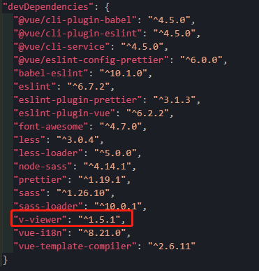

# 图件展示

[TOC]

## 一、v-viewer图片展示

- 使用`viewer.js`,`vue`中可以使用`v-viewer`


### 1.安装v-viewer

```
npm install v-viewer --save-dev
```

- `npm`安装时不成功，我这里使用淘宝`cnpm`安装成功。

```
cnpm install v-viewer --save-dev
```




### 2.在`main.js`中配置下

```js
// 引入查看大图插件
import Viewer from 'v-viewer'
import 'viewerjs/dist/viewer.css'

Vue.use(Viewer)
Viewer.setDefaults({
  Options: { // Options必须，否则会出现默认打开等等不可预知的错误
  	'inline': true, 
  	'button': true, // 显示右上角关闭按钮
  	'navbar': true, // 缩略图导航
  	'title': true, // 是否显示当前图片的标题
  	'toolbar': true, // 显示工具栏
  	'tooltip': true, // 显示缩放百分比
  	'movable': true, // 图片是否可移动
  	'zoomable': true, // 是否可缩放
  	'rotatable': true, // 是否可旋转
  	'scalable': true, // 是否可翻转
  	'transition': true, // 是否使用 CSS3 过度
  	'fullscreen': true, // 播放时是否全屏
  	'keyboard': true, // 是否支持键盘
  	'url': 'data-source' // 设置大图片的 url
  }
})

```


### 3.使用

- 方式1，单张图片template中直接使用

```

```

- 方式二，多张图片

  ```vue
  <template>
     <viewer :images="images">
        <!-- 
         -->
        
      </viewer>
  </template>
  ```

  ```js
  <script>
  	export default {
  		name: 'images',
  		 data() {
      return {
        images: [
          "https://ss0.bdstatic.com/70cFvHSh_Q1YnxGkpoWK1HF6hhy/it/u=3272199364,3404297250&fm=26&gp=0.jpg",
          "https://ss3.bdstatic.com/70cFv8Sh_Q1YnxGkpoWK1HF6hhy/it/u=3267295166,2381808815&fm=26&gp=0.jpg",
          "https://ss0.bdstatic.com/70cFvHSh_Q1YnxGkpoWK1HF6hhy/it/u=3429654663,2972188411&fm=26&gp=0.jpg",
          "https://ss3.bdstatic.com/70cFv8Sh_Q1YnxGkpoWK1HF6hhy/it/u=3597323878,2962972725&fm=26&gp=0.jpg",
        ],
      };
    },
  	}
  </script>
  
  ```

- `Test5.vue`

  ```vue
  <template>
    <div>
      <h1>单张图片</h1>
      <br />
  
      <!--  -->
      
      <br />
      <br />
      <h1>多张图片</h1>
      <br />
      <viewer :images="images">
        <!-- 
         -->
        
      </viewer>
    </div>
  </template>
  
  <script>
  export default {
    name: "Test5",
    data() {
      return {
        images: [
          "https://ss0.bdstatic.com/70cFvHSh_Q1YnxGkpoWK1HF6hhy/it/u=3272199364,3404297250&fm=26&gp=0.jpg",
          "https://ss3.bdstatic.com/70cFv8Sh_Q1YnxGkpoWK1HF6hhy/it/u=3267295166,2381808815&fm=26&gp=0.jpg",
          "https://ss0.bdstatic.com/70cFvHSh_Q1YnxGkpoWK1HF6hhy/it/u=3429654663,2972188411&fm=26&gp=0.jpg",
          "https://ss3.bdstatic.com/70cFv8Sh_Q1YnxGkpoWK1HF6hhy/it/u=3597323878,2962972725&fm=26&gp=0.jpg",
        ],
      };
    },
  };
  </script>
  
  <style>
  </style>
  ```

  


- [ref1](https://www.jianshu.com/p/abf3a1d0afe0)
- [ref2](https://blog.csdn.net/HeiYanMin/article/details/105850280?utm_medium=distribute.pc_relevant.none-task-blog-OPENSEARCH-1.control&depth_1-utm_source=distribute.pc_relevant.none-task-blog-OPENSEARCH-1.control)
- [ref3](https://blog.csdn.net/qq_41619796/article/details/103816141?ops_request_misc=%257B%2522request%255Fid%2522%253A%2522160499888719725222402427%2522%252C%2522scm%2522%253A%252220140713.130102334.pc%255Fblog.%2522%257D&request_id=160499888719725222402427&biz_id=0&utm_medium=distribute.pc_search_result.none-task-blog-2~blog~first_rank_v1~rank_blog_v1-5-103816141.pc_v1_rank_blog_v1&utm_term=%E5%9B%BE%E7%89%87&spm=1018.2118.3001.4450)
- [ref4](https://blog.csdn.net/s18438610353/article/details/103424313)
- [ref5](https://blog.csdn.net/weixin_40137911/article/details/85230904?utm_medium=distribute.pc_relevant.none-task-blog-BlogCommendFromMachineLearnPai2-3.control&depth_1-utm_source=distribute.pc_relevant.none-task-blog-BlogCommendFromMachineLearnPai2-3.control)


## 二、Element自带图片展示

