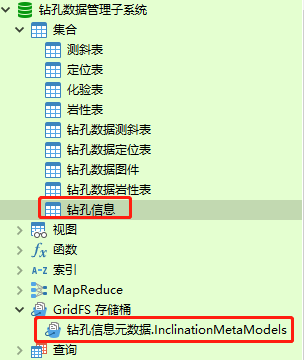
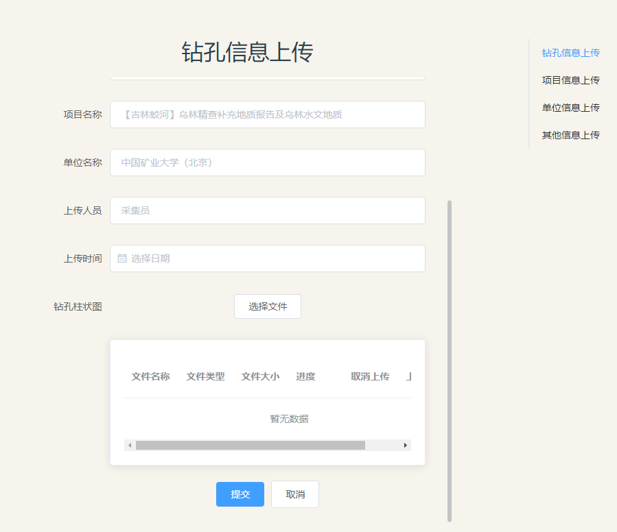

# 钻孔数据表

[TOC]

## 一、钻孔数据表

- 钻孔信息
  - 钻孔数据
  - 钻孔信息
  - 上传信息
- 钻孔信息表
- 钻孔定位表
- 钻孔测斜表
- 钻孔岩性表
- 钻孔化验表


## 二、钻孔信息

### 1、上传钻孔信息

#### 1.1、前端页面

- `DrillMetaUpload.vue` -->钻孔信息上传

  ```vue
  <!--
   * @Description: henggao_learning
   * @version: v1.0.0
   * @Author: henggao
   * @Date: 2020-12-01 08:36:23
   * @LastEditors: henggao
   * @LastEditTime: 2020-12-01 14:24:15
  -->
  <template>
    <el-row :gutter="20">
      <el-col :span="10" :offset="6">
        <el-container style="min-width: 600px; overflow: hidden">
          <el-header><h2>钻孔信息上传</h2></el-header>
          <el-main>
            <el-form
              ref="form"
              :model="form"
              label-width="100px"
              class="drillmetaupload"
            >
              <el-scrollbar style="height: 650px">
                <el-form-item label="钻孔编号">
                  <el-input v-model="form.zk_num" placeholder="ZK1"></el-input>
                </el-form-item>
                <el-form-item label="钻孔类型">
                  <el-input
                    v-model="form.zk_type"
                    placeholder="矿产地质勘查钻孔"
                  ></el-input>
                </el-form-item>
                <el-form-item label="钻孔深度">
                  <el-input
                    v-model="form.final_depth"
                    placeholder="14.9"
                  ></el-input>
                </el-form-item>
                <el-form-item label="终孔时间">
                  <el-date-picker
                    type="date"
                    placeholder="选择日期"
                    v-model="form.final_date"
                    style="width: 100%"
                  ></el-date-picker
                ></el-form-item>
  
                <el-form-item label="项目名称">
                  <el-input
                    v-model="form.project_name"
                    placeholder="【吉林蛟河】乌林精查补充地质报告及乌林水文地质"
                  ></el-input>
                </el-form-item>
                <el-form-item label="单位名称">
                  <el-input
                    v-model="form.company_name"
                    placeholder="中国矿业大学（北京）"
                  ></el-input>
                </el-form-item>
                <el-form-item label="上传人员">
                  <el-input
                    v-model="form.uploader"
                    placeholder="采集员"
                  ></el-input>
                </el-form-item>
                <el-form-item label="上传时间">
                  <el-date-picker
                    type="date"
                    placeholder="选择日期"
                    v-model="form.uploaddate"
                    style="width: 100%"
                  ></el-date-picker
                ></el-form-item>
  
                <el-form-item label="钻孔柱状图">
                  <el-row>
                    <el-button ref="VideoChose" id="VideoChose" size="medium "
                      >选择文件</el-button
                    >
                  </el-row>
                  <el-card style="margin-top: 20px">
                    <el-table :data="fileList" style="width: 100%">
                      <!-- <el-table-column prop="id" label="文件id"></el-table-column> -->
                      <el-table-column
                        prop="name"
                        label="文件名称"
                      ></el-table-column>
                      <el-table-column
                        prop="type"
                        label="文件类型"
                      ></el-table-column>
                      <el-table-column
                        prop="size"
                        label="文件大小"
                        v-slot="{ row }"
                      >
                        {{ row.size }}MB
                      </el-table-column>
                      <el-table-column label="进度" v-slot="{ row }">
                        <el-progress
                          :text-inside="true"
                          :stroke-width="16"
                          :percentage="row.percentage"
                        ></el-progress>
                      </el-table-column>
                      <el-table-column label="取消上传" v-slot="{ row }">
                        <el-button
                          type="danger"
                          icon="el-icon-delete"
                          size="mini"
                          circle
                          @click="removeFile(row.id)"
                        ></el-button>
                      </el-table-column>
                      <el-table-column label="上传状态" v-slot="{ row }">
                        <el-link
                          :type="
                            row.loadType == 0
                              ? 'info'
                              : row.loadType == 1
                              ? 'warning'
                              : row.loadType == 2
                              ? 'success'
                              : 'danger'
                          "
                          :underline="false"
                          >{{
                            row.loadType == 0
                              ? "等待上传"
                              : row.loadType == 1
                              ? "正在上传"
                              : row.loadType == 2
                              ? "上传成功"
                              : "上传失败"
                          }}</el-link
                        >
                      </el-table-column>
                    </el-table>
                  </el-card>
                </el-form-item>
                <el-form-item>
                  <el-button
                    ref="VideoChose"
                    type="primary"
                    size="medium  "
                    @click="onSubmit"
                    >提交</el-button
                  >
                  <el-button>取消</el-button>
                </el-form-item>
              </el-scrollbar>
            </el-form>
          </el-main>
        </el-container>
      </el-col>
    </el-row>
  </template>
  
  <script>
  import plupload from "plupload";
  import axios from "axios";
  import { stringify } from "qs";
  export default {
    name: "DrillMetaUpload",
    data() {
      return {
        form: {
          zk_num: "",
          zk_type: "",
          final_depth: "",
          final_date: "",
          depth: "",
          project_name: "",
          company_name: "",
          uploader: "",
          uploaddate: "",
        },
        show: false,
        fileList: [],
        fileOptions: {
          browse_button: "VideoChose",
          // url: "http://127.0.0.1:8000/load/uploadfile/",
          url: "http://127.0.0.1:8000/load/drillmeta/",
          flash_swf_url: "script/Moxie.swf",
          silverlight_xap_url: "script/Moxie.xap",
          // chunk_size: "10mb", //分块大小  ,注销掉或者改chunk_size：'0mb'为解决文件大于10M存为blob问题
          max_retries: 3,
          unique_names: true,
          multi_selection: false, //是否允许选择多文件
          views: {
            list: true,
            thumbs: true, // Show thumbs
            active: "thumbs",
          },
          filters: {
            mime_types: [
              //文件格式
              {
                title: "files",
                extensions:
                  // "png,jpg,svg,mp4,rmvb,mpg,mxf,avi,mpeg,wmv,flv,mov,ts,docx,doc,pdf,segy,xls,xlsx,csv", //文件格式
                  "png,jpg",
              },
            ],
            max_file_size: "10240mb", //最大上传的文件
            prevent_duplicates: true, //不允许选取重复文件
          },
          multipart_params: {
            uuid: "", //参数
            // testparams: "Must can see me",
            // "testparams2": "Must can see me2"
          },
        },
      };
    },
  
    mounted() {
      //实例化一个plupload上传对象
      this.uploader.init();
      //绑定进队列
      this.uploader.bind("FilesAdded", this.FilesAdded);
      //绑定进度
      this.uploader.bind("UploadProgress", this.UploadProgress);
      //上传之前
      this.uploader.bind("BeforeUpload", this.BeforeUpload);
      //上传成功监听
      this.uploader.bind("FileUploaded", this.FileUploaded);
      //获取uuid
      // let url = `http://127.0.0.1:8000/api/uploadinfo/`;
      let url = `http://127.0.0.1:8000/load/drillmeta/`;
      axios.get(url).then(({ data }) => {
        this.fileOptions.multipart_params.uuid = data;
      });
    },
    computed: {
      //实例化一个plupload上传对象
      uploader() {
        return new plupload.Uploader(this.fileOptions);
      },
    },
    methods: {
      //绑定进队列
      FilesAdded(uploader, files) {
        console.log(this.form);
        let data = this.form;
        if (files[0].name.length > 25) {
          // $.messager.show("提示", "文件名称太长！", "info");
          this.$message({
            type: "error",
            message: "文件名称太长！",
          });
          return;
        }
        if (uploader.files.length > 1) {
          // 最多上传3张图
          // $.messager.show("提示", "只能上传一个文件，请删除多余文件！", "info");
          this.$message({
            type: "error",
            message: "只能上传一个文件,请先删除！",
          });
          uploader.removeFile(files[0]);
          return;
        }
        let objarr = files.map((val, ind) => {
          let obj = {};
          obj.id = val.id;
          obj.name = val.name;
          obj.type = val.type;
          // obj.upload_date = val.upload_date;
          obj.upload_date = new Date().toLocaleString(); //获取日期与时间
          // obj.publiser = val.publiser;
          obj.publisher = "publisher"; //获取当前登录用户信息
          obj.size = parseInt((val.origSize / 1024 / 1024) * 100) / 100;
          obj.percentage = 0;
          obj.loadType = 0;
          console.log(obj);
          return obj;
        });
        this.fileList.push(...objarr);
      },
      //上传之前回调
      BeforeUpload(uploader, file) {
        this.fileList = this.fileList.map((val, ind) => {
          if (val.id == file.id) {
            val.loadType = 1;
          }
  
          //设置参数
          console.log(val.name);
          uploader.setOption("multipart_params", {
            // form: this.form, //设置表单擦不能输
            zk_num: this.form["zk_num"],
            zk_type: this.form["zk_type"],
            final_depth: this.form["final_depth"],
            final_date: this.form["final_date"].getTime(), //时间转为时间戳方便后端解析 对比toLocaleString()
            depth: this.form["depth"],
            project_name: this.form["project_name"],
            company_name: this.form["company_name"],
            uploader: this.form["uploader"],
            uploaddate: this.form["uploaddate"].getTime(),
            filename: val.name,
            publisher: val.publisher,
            type: val.type,
            upload_date: new Date().toLocaleString(),
            // size:val.size
          });
  
          uploader.settings.multipart_params.size = val.size;
          uploader.settings.multipart_params.id = val.id;
          return val;
        });
      },
      //上传进度回调
      UploadProgress(uploader, file) {
        this.fileList = this.fileList.map((val, ind) => {
          if (val.id == file.id) {
            val.percentage = file.percent;
          }
          return val;
        });
      },
      // 上传成功回调
      FileUploaded(uploader, file, responseObject) {
        this.fileList = this.fileList.map((val, ind) => {
          if (val.id == file.id) {
            // if (JSON.parse(responseObject.response).status == 0) {
            if (status == 0) {
              val.loadType = 2;
            } else {
              val.loadType = 3;
            }
          }
          return val;
        });
      },
      //取消上传回调
      removeFile(id) {
        this.uploader.removeFile(id);
        this.fileList = this.fileList.filter((val, ind) => {
          if (val.id == id) {
            return false;
          } else {
            return true;
          }
        });
      },
      //开始上传
      // FileUplodeOn() {
      //   this.uploader.start();
      // },
      onSubmit() {
        this.uploader.start();
      },
    },
  };
  </script>
  
  <style lang="scss">
  .drillmetaupload .el-form-item {
    width: 560px; //这里设置为了和右边滚动条有一定的距离
  }
  .el-scrollbar__wrap {
    overflow-x: hidden; //设置滚动条隐藏
  }
  </style>
  ```

  

#### 1.2、后端

- `models.py`

  ```python
  grid_fs_storage = GridFSStorage(location='', collection='钻孔信息元数据', base_url=''.join(
      ['', '']), database='drill')
  
  
  class DrillMetaModel(models.Model):
      '''钻孔数据管理子系统元数据'''
  
      _id = models.CharField(max_length=255)
      zk_num = models.CharField(max_length=255)
      # type = models.CharField(max_length=255)
      zk_type = models.CharField(max_length=30)
      final_depth = models.CharField(max_length=255)
      final_date = models.DateTimeField()
      upload_date = models.DateTimeField()
      depth = models.CharField(max_length=255)
      project_name = models.CharField(max_length=255)
      company_name = models.CharField(max_length=255)
      uploader = models.CharField(max_length=255)
      # zk_histogram = models.ImageField(upload_to='InclinationMetaModels')
      zk_histogram = models.ImageField(
          upload_to='InclinationMetaModels', storage=grid_fs_storage)
  
      class Meta:
          verbose_name = "钻孔元数据名"
          verbose_name_plural = verbose_name
          # app_label = 'mongeostore_load'  # 如果指定将在drill对应的数据库下创建数据表
          db_table = '钻孔信息'  # 自定义表名称，即是对应的Collection，如何对应GriDFS
  
      def __str__(self) -> str:
          return self.zk_num
  ```

- `serializers.py`

  ```python
  class DrillMetaSerializer(serializers.ModelSerializer):
      '''钻孔数据管理子系统元数据'''
      class Meta:
          model = DrillMetaModel
          fields = "__all__"
  
  ```

- `DrillMetaViewSet.py`

  ```python
  # 钻孔信息上传 DrillMetaInfo.vue
  
  # class DrillMetaViewSet(viewsets.ModelViewSet):
  
  class DrillMetaViewSet(APIView):
  
      def get(self, request, *args, **kwargs):
          queryset = DrillMetaModel.objects.all()
          # queryset = InclinationMetaModel.objects.using('drill').all()
          serializer_class = DrillMetaSerializer
  
          # return HttpResponse(json.dumps(serializer_class), content_type="application/json")
          return HttpResponse(queryset)
  
      def post(self, request):
          """
          docstring
          """
          # print("走的是POST方法")
          # file = self.request.POST.get('name',None)  # 获取上传的文件，如果没有文件，则默认为None
          zk_histogram = request.FILES.get("file", None)  # 注意比较
          # print(File)
          # print(File.name)   #同上
          # print(File.chunks)  # 二进制信息
          print(request.data['upload_date'])  # DRF才有request.data
          print(request.POST)  # Django只有request.POST、request.GET
          _id = self.request.POST.get('id')
          zk_num = request.data['zk_num'],  # 取出来竟是个元组，QAQ
          zk_type = request.data['zk_type'],
          final_depth = request.data['final_depth'],
          final_date = request.data['final_date'],
          depth = request.data['depth'],
          project_name = request.data['project_name'],
          company_name = request.data['company_name'],
          uploader = request.data['uploader'],
          upload_date = request.data['uploaddate'],  # 这个字段前端会冲突，另起
          print(zk_num[0])
          print(final_depth[0])
          print(type(upload_date[0]))
          print(upload_date[0])
          print(final_date[0])
          temp_time1 = int(final_date[0])/1000
          temp_time2 = int(upload_date[0])/1000
          # 转换成localtime
          time_local1 = time.localtime(temp_time1)
          time_local2 = time.localtime(temp_time2)
          # 转换成新的时间格式(2016-05-05 20:28:54)
          dt1 = time.strftime("%Y-%m-%d %H:%M:%S", time_local1)
          dt2 = time.strftime("%Y-%m-%d %H:%M:%S", time_local2)
          # test = DrillMetaModel(zk_num='ZK1')
          # test.save()
          # # DrillMetaModel.objects.create(zk_num="ZK1")
          DrillMetaModel.objects.create(_id=_id,
                                        zk_num=zk_num[0],
                                        zk_type=zk_type[0], final_depth=final_depth[0], final_date=dt1,
                                        depth=depth[0],
                                        project_name=project_name[0], company_name=company_name[0], uploader=uploader[0], 
                                        upload_date=dt2, zk_histogram=zk_histogram)
          # DrillMetaModel.objects.create(zk_type=zk_type[0])
          # DrillMetaModel.objects.create(final_depth=final_depth[0])
          # DrillMetaModel.objects.create(final_date=final_date[0])
          # DrillMetaModel.objects.create(depth=depth[0])
          # DrillMetaModel.objects.create(
          # project_name=project_name[0])
          # DrillMetaModel.objects.create(
          #     company_name=company_name[0])
          # DrillMetaModel.objects.create(uploader=uploader[0])
          # DrillMetaModel.objects.create(upload_date=upload_date[0])
  
          # DrillMetaModel.objects.create(
          #     zk_histogram=request.FILES.get("file", None))
  
          return HttpResponse('success')
  
  ```

- `urls.py`

  ```python
      path('drillmeta/', DrillMetaViewSet.as_view(),
           name='drillmeta'),  # 钻孔数据分页
  ```

  

#### 1.3、展示

- 数据库

  

  

- 页面




#### 小插曲

- [ref](https://blog.csdn.net/xuexiiphone/article/details/53706967)
- 在时间上传时，会遇到格式问题，将时间转换为时间戳在传递给后端，后段解析是，时间戳需要除以1000进行转换。
- [时间转换](https://blog.csdn.net/google19890102/article/details/51355282)


### 2、展示钻孔信息

#### 2.1、前端

- `DrillMetaData.vue`

  - 这个地方主要设计一个路由问题，下一节进行解决。

  

#### 2.2、后端

- 展示数据后端和上传用的同一系列的，只不过用`views.py`方法中的GET方法。在下一节中配合路由动态展示。

- `models.py`
- `serialziers.py`
- `views.py`


#### 小插曲

- 这个地方`ImageField`字段在做序列化的时候返回空值（`ImageField`字段取值max_length=100）,上传图片大小的问题？还没有解决~:crying_cat_face:

- 似乎这个小问题成为意外惊喜了，序列化帮我们过滤掉了这个字段。在表格中展示大量图片难免会造成压力。我将柱状图展示信息提出外，放在另一个表里展示，一个钻孔编号对应钻信息和一张钻孔柱状图。只需要再写一个`views.py`方法即可。:happy:

  

