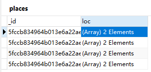
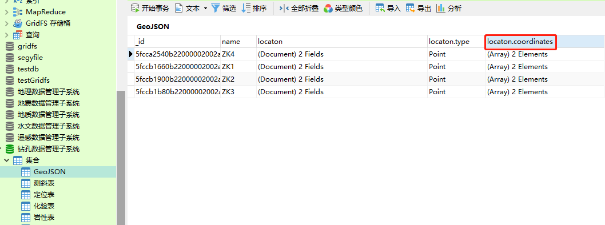
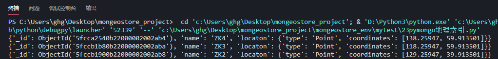
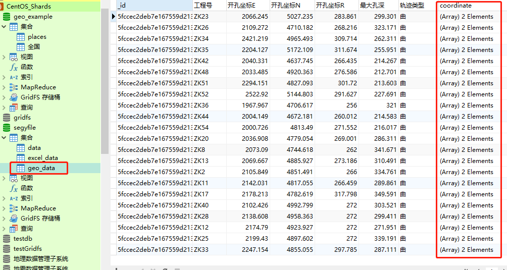

# MongoDB空间查询

[TOC]

## 一、pymongodb空间查询

### 1.例一

- pymongo地理索引.py

```python
'''
Description: henggao_learning
version: v1.0.0
Author: henggao
Date: 2020-12-06 18:30:07
LastEditors: henggao
LastEditTime: 2020-12-06 20:21:18
'''
from bson.son import SON
from pymongo import MongoClient, GEO2D 

# 使用geo_example库
db = MongoClient("192.168.55.110", 20000).geo_example
# 创建索引在places上的loc列
db.places.create_index([("loc", GEO2D)])
# db.places.ensure_index([("loc", GEO2D)])
# 插入坐标数据
result = db.places.insert_many(
    [{"loc": [2, 5]}, {"loc": [30, 5]}, {"loc": [1, 2]}, {"loc": [4, 4]}])

# 查询离［3，6］最近的坐标
for doc in db.places.find({"loc": {"$near": [3, 6]}}).limit(3):
    repr(doc)
    # print(repr(doc))
    print(doc)

# 增加最大距离
query = {"loc": SON([("$near", [3, 6]), ("$maxDistance", 2)])}

# 在（2，2） （5，6）lower-left and upper-right
query = {"loc": {"$geoWithin": {"$box": [[2, 2], [5, 6]]}}}
for doc in db.places.find(query).sort('_id'):
    repr(doc)
    # print(repr(doc))
    print(doc)
# 在半径为6的圆内
query = {"loc": {"$geoWithin": {"$center": [[0, 0], 6]}}}
for doc in db.places.find(query).sort('_id'):
    repr(doc)
    print(doc)


# db.command(SON([('geoNear', 'places'), ('near', [1, 2])]))

```



### 2.例二

注意字段，使用`create_index`创建索引字段（）

```python
client = MongoClient("192.168.55.110", 20000)
db = client['钻孔数据管理子系统']
col = db['GeoJSON']
col.create_index([("coordinates", GEO2D)])

for doc in col.find({"locaton.coordinates": {"$near": [138.25947, 59.913501]}}).limit(3):
    repr(doc)
    # print(repr(doc))
    print(doc)
```




运行查看终端




- VS普通查询的效率

- 外包框的使用

- [ref](https://www.cnblogs.com/oloroso/p/9777141.html)


## 二、定位表存为GeoJSON

- exceltogeostore.py 将Excel中数据存为GeoJSON

```python
import xlrd
import json
import pymongo

# 连接数据库

client = pymongo.MongoClient("192.168.55.110", 20000)
mydb = client['segyfile']
info = mydb['geo_data']
# 读取Excel文件
data = xlrd.open_workbook('./mongeostore_env/upload/01_metadata.xls')
# 选择上传的sheet，注意字段
# print(len(data.sheets())) #返回excel中sheet的数量
table = data.sheets()[0]
print(data.sheet_names())  # 拿到EXcel的sheet名称
list = data.sheet_names()  # 拿到EXcel的sheet名称
name = '定位表'
if name in list:
    print("yes")
    print(list.index(name))  # 判断元素的位置

# 读取excel第一行数据作为存入mongodb的字段名
rowstag = table.row_values(0)
# data1 = table.row_values(1)
# print(data1)
# print(rowstag[2])
nrows = table.nrows
# print(nrows)
returnData = {}


for i in range(1, nrows):
    data_x = table.row_values(i)[3]
    data_y = table.row_values(i)[4]
    coordinate = [data_x, data_y]
    returnData[i] = json.dumps(dict(zip(rowstag, table.row_values(i))))

    # 通过编解码还原数据
    returnData[i] = json.loads(returnData[i])
    returnData[i]['coordinate']=coordinate
    # print(returnData[i])
    info.insert(returnData[i])
```

- 数据表

  


