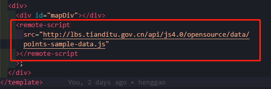
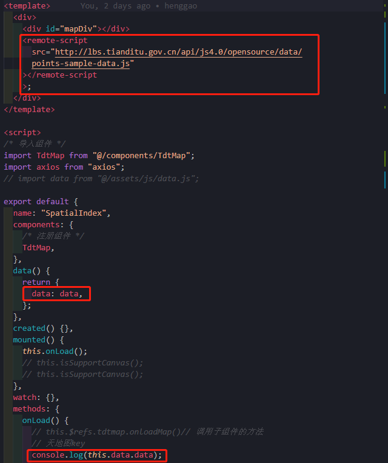
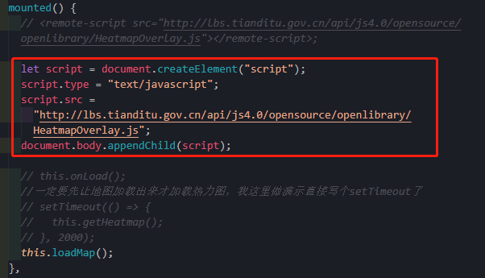

# Vue引入外部js

[TOC]

## 前言

- **需求描述**：从http://lbs.tianditu.gov.cn/api/js4.0/opensource/data/points-sample-data.js中读取js数据

- **想法**
  - 1.使用axios.get从外部读取数据，但读到的数据格式不是我所想要的
  - 2.Vue是否支持从外部引入js文件？答案是可以的！下面是具体实现
  - 

## 1、新建importJS.js

- 新建utils/importJs.js

```js
import Vue from 'vue'
 
Vue.component('remote-script', {
    render: function (createElement) {
        var self = this;
        return createElement('script', {
            attrs: {
                type: 'text/javascript',
                src: this.src
            },
            on: {
                load: function (event) {
                    self.$emit('load', event);
                },
                error: function (event) {
                    self.$emit('error', event);
                },
                readystatechange: function (event) {
                    if (this.readyState == 'complete') {
                        self.$emit('load', event);
                    }
                }
            }
        });
    },
    props: {
        src: {
            type: String,
            required: true
        }
    }
});js
```


## 2、配置main.js

```js
import importJS from "@/utils/importJs"
```


## 3、在vue文件中使用

```js
  <remote-script src="xxx"></remote-script
```



## 4、实例

- 使用外部js中的数据`http://lbs.tianditu.gov.cn/api/js4.0/opensource/data/points-sample-data.js`

  ```js
     <remote-script
        src="http://lbs.tianditu.gov.cn/api/js4.0/opensource/data/points-sample-data.js"
      ></remote-script
      >;
  ```

  

  

- [ref](https://blog.csdn.net/zjl199303/article/details/82585775?utm_medium=distribute.pc_relevant.none-task-blog-baidulandingword-7&spm=1001.2101.3001.4242)

- [ref2](https://blog.csdn.net/weixin_33939843/article/details/91472501?utm_medium=distribute.pc_relevant.none-task-blog-title-6&spm=1001.2101.3001.4242)


## 5、补充

- 在mounted中引入

- 上述方法数据未能成功应用，使用这种方法可以

  

  