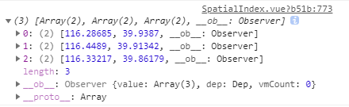

# 天地图中多边形查询

[TOC]

## 一、前端

- 绘制多边形工具，鼠标单击事件，记录坐标

- 数据发送为多维数组的形式

  

- `SpatialIndex.vue`  使用多边形工具，进行数据查询

```vue
<!--
 * @Description: henggao_learning
 * @version: v1.0.0
 * @Author: henggao
 * @Date: 2020-12-06 09:36:35
 * @LastEditors: henggao
 * @LastEditTime: 2020-12-10 16:36:30
-->
<template>
  <div>
    <div id="mapDiv"></div>
    <div>
      <input type="button" @click="openHeatmap()" value="显示热力图" />
      <input type="button" @click="closeHeatmap()" value="关闭热力图" />
      <!-- <input type="button" @Click="openPolygonTool()" value="多边形工具" /> -->
    </div>
    <div>
      <!-- <input type="button" id="button1" onClick="button_zoomIn()" value="放大地图" /> -->
      <!-- <input type="button" id="button2" onClick="zoomOut()" value="缩小地图" /> -->
      <button @click="addHeatmap()">添加热力图</button>
      <button @click="button_zoomIn()">放大</button>
      <button @click="button_zoomOut()">缩小</button>
      <button @click="openPolygonTool()">多边形工具</button>
      <button @click="openCircleTool()">画圆工具</button>
      <button @click="clearOverLays()">清除所有</button>
      <button @click="addMapClick()">注册</button>
      <button @click="removeMapClick()">移除</button>
      <button @click="removeMapClick()">移除</button>
      <button @click="sendPolygon()">发送多边形数据</button>
      <!-- <button @click="closeHeatmap()">关闭热力图</button> -->
    </div>
    <!-- <remote-script
      src="http://lbs.tianditu.gov.cn/api/js4.0/opensource/data/points-sample-data.js"
    ></remote-script> -->
  </div>
</template>

<script>
/* 导入组件 */
import TdtMap from "@/components/TdtMap";
import axios from "axios";
import qs from "qs";
// import data from "@/assets/js/data.js";

export default {
  name: "SpatialIndex",
  components: {
    /* 注册组件 */
    TdtMap,
  },
  data() {
    return {
      // data: data,
      heatmapOverlay: "", //热力图
      map: "", //地图底图
      points: "", //热力图点数据
      isMobile: false,
      lddialogwidth: "30%",
      locatInfo: {
        location: "暂无数据",
        locatTime: "暂无数据",
        lng: "暂无数据",
        lat: "暂无数据",
      },
      zoom: 12,
      detailLocation: "",
      locationDialogVisible: false,
      locationNow: false,
      PolygonList: [], //返回多边形数据
      // PolygonList: {}, //返回多边形数据
    };
  },
  created() {},
  mounted() {
    // <remote-script src="http://lbs.tianditu.gov.cn/api/js4.0/opensource/openlibrary/HeatmapOverlay.js"></remote-script>;

    let script = document.createElement("script");
    script.type = "text/javascript";
    script.src =
      "http://lbs.tianditu.gov.cn/api/js4.0/opensource/openlibrary/HeatmapOverlay.js";
    document.body.appendChild(script);

    // this.onLoad();
    //一定要先让地图加载出来才加载热力图，我这里做演示直接写个setTimeout了
    // setTimeout(() => {
    //   this.getHeatmap();
    // }, 2000);
    this.loadMap();
  },
  watch: {},
  methods: {
    //加载基本地图和导航
    loadMap() {
      var map;
      var zoom = 4;

      // 天地图key
      const mapKey = "9c117468801c8405aaddff93da98c1e6";
      // 初始化地图对象
      map = new T.Map("mapDiv"); //初始化地图对象
      this.map = map;
      // 设置显示地图的中心点和级别
      map.centerAndZoom(new T.LngLat(116.40969, 38.89945), zoom); //中国

      // 创建地图类型控件对象
      var _mapType = new T.Control.MapType();

      // 添加地图类型控件
      map.addControl(_mapType);

      // 创建缩放平移控件对象
      var _zoomControl = new T.Control.Zoom();

      // 添加缩放平移控件
      map.addControl(_zoomControl);

      // 创建缩放平移控件对象
      _zoomControl.setPosition(T_ANCHOR_TOP_LEFT);

      // 创建定位对象lo
      var lo = new T.Geolocation();

      // 创建右键菜单对象
      var menu = new T.ContextMenu({
        width: 140,
      });
      // 添加数据点
      // 添加右键菜单
      var txtMenuItem = [
        {
          text: "放大",
          callback: () => {
            map.zoomIn();
          },
        },
        {
          text: "缩小",
          callback: () => {
            map.zoomOut();
          },
        },
        {
          text: "放置到最大级",
          callback: () => {
            map.setZoom(18);
          },
        },
        {
          text: "查看全国",
          callback: () => {
            map.setZoom(4);
          },
        },
        {
          text: "获得右键点击处坐标",
          isDisable: false,
          callback: (lnglat) => {
            alert(lnglat.getLng() + "," + lnglat.getLat());
          },
        },
      ];

      for (var i = 0; i < txtMenuItem.length; i++) {
        // 添加菜单项
        var item = new T.MenuItem(txtMenuItem[i].text, txtMenuItem[i].callback);
        // item.disable();
        menu.addItem(item);
        if (i === 1 || i === 3) {
          // 添加分割线
          menu.addSeparator();
        }
      }

      // 装载菜单
      map.addContextMenu(menu);

      // 定位结果回调函数
      function fn(e) {
        // 当前为移动端时
        if (this.getStatus() === 0) {
          map.centerAndZoom(e.lnglat, 15);
          console.log(e);
          // 获取地理位置信息并设置到标注
          getDetailLocation(e.lnglat, e.lnglat);
        }

        // 当前为PC端时
        if (this.getStatus() === 1) {
          map.centerAndZoom(e.lnglat, e.level);
          console.log(e);
          // 获取地理位置信息并设置到标注
          getDetailLocation(e.lnglat, e.lnglat);
        }
      }

      // 设置标注
      function setMarker(e, d) {
        var marker = new T.Marker(e);
        map.addOverLay(marker);
        var markerInfoWin = new T.InfoWindow("" + d);
        marker.addEventListener("click", function () {
          marker.openInfoWindow(markerInfoWin);
        });
      }

      // 暂存this
      const _this = this;

      // 通过经纬度获取详细地址
      function getDetailLocation(lnglat_lng, lnglat_lat) {
        axios
          .get("https://api.tianditu.gov.cn/geocoder", {
            params: {
              tk: mapKey,
              type: "geocode",
              postStr:
                "{'lon':" +
                lnglat_lng.lng +
                ",'lat':" +
                lnglat_lat.lat +
                ",'ver':1}",
            },
          })
          .then((data) => {
            var addressdata = data.data;
            // console.log(addressdata);
            var detaillocation = addressdata.result.formatted_address;
            // console.log(detaillocation);

            // // 截取地址信息显示
            _this.locatInfo.location = addressdata.result.formatted_address;
            // 获取定位时间
            _this.locatInfo.locatTime = new Date().toLocaleDateString();
            _this.locatInfo.lng = lnglat_lng.lng;
            _this.locatInfo.lat = lnglat_lat.lat;
            console.log(new Date().toLocaleDateString());
            // console.log(lnglat_lng.lng);
            // console.log(lnglat_lat.lat);
            if (addressdata.msg == "ok" && addressdata.status == 0) {
              // 将位置信息设置到标注
              setMarker(lnglat_lat, detaillocation);
            } else {
              // 错误处理
            }
          })
          .catch((error) => {
            console.log(error);
          });
      }

      // 开始定位
      lo.getCurrentPosition(fn);
    },
    // 添加热力图
    addHeatmap() {
      // 热力图数据
      var heatmapOverlay;
      var data = [
        { name: "海门", value: 9 },
        { name: "鄂尔多斯", value: 12 },
        { name: "招远", value: 12 },
        { name: "舟山", value: 12 },
        { name: "齐齐哈尔", value: 14 },
        { name: "盐城", value: 15 },
        { name: "赤峰", value: 16 },
        { name: "青岛", value: 18 },
        { name: "乳山", value: 18 },
        { name: "金昌", value: 19 },
        { name: "泉州", value: 21 },
        { name: "莱西", value: 21 },
        { name: "日照", value: 21 },
        { name: "胶南", value: 22 },
        { name: "南通", value: 23 },
        { name: "拉萨", value: 24 },
        { name: "云浮", value: 24 },
        { name: "梅州", value: 25 },
        { name: "文登", value: 25 },
        { name: "上海", value: 25 },
        { name: "攀枝花", value: 25 },
        { name: "威海", value: 25 },
        { name: "承德", value: 25 },
        { name: "厦门", value: 26 },
        { name: "汕尾", value: 26 },
        { name: "潮州", value: 26 },
        { name: "丹东", value: 27 },
        { name: "太仓", value: 27 },
        { name: "曲靖", value: 27 },
        { name: "烟台", value: 28 },
        { name: "福州", value: 29 },
        { name: "瓦房店", value: 30 },
        { name: "即墨", value: 30 },
        { name: "抚顺", value: 31 },
        { name: "玉溪", value: 31 },
        { name: "张家口", value: 31 },
        { name: "阳泉", value: 31 },
        { name: "莱州", value: 32 },
        { name: "湖州", value: 32 },
        { name: "汕头", value: 32 },
        { name: "昆山", value: 33 },
        { name: "宁波", value: 33 },
        { name: "湛江", value: 33 },
        { name: "揭阳", value: 34 },
        { name: "荣成", value: 34 },
        { name: "连云港", value: 35 },
        { name: "葫芦岛", value: 35 },
        { name: "常熟", value: 36 },
        { name: "东莞", value: 36 },
        { name: "河源", value: 36 },
        { name: "淮安", value: 36 },
        { name: "泰州", value: 36 },
        { name: "南宁", value: 37 },
        { name: "营口", value: 37 },
        { name: "惠州", value: 37 },
        { name: "江阴", value: 37 },
        { name: "蓬莱", value: 37 },
        { name: "韶关", value: 38 },
        { name: "嘉峪关", value: 38 },
        { name: "广州", value: 38 },
        { name: "延安", value: 38 },
        { name: "太原", value: 39 },
        { name: "清远", value: 39 },
        { name: "中山", value: 39 },
        { name: "昆明", value: 39 },
        { name: "寿光", value: 40 },
        { name: "盘锦", value: 40 },
        { name: "长治", value: 41 },
        { name: "深圳", value: 41 },
        { name: "珠海", value: 42 },
        { name: "宿迁", value: 43 },
        { name: "咸阳", value: 43 },
        { name: "铜川", value: 44 },
        { name: "平度", value: 44 },
        { name: "佛山", value: 44 },
        { name: "海口", value: 44 },
        { name: "江门", value: 45 },
        { name: "章丘", value: 45 },
        { name: "肇庆", value: 46 },
        { name: "大连", value: 47 },
        { name: "临汾", value: 47 },
        { name: "吴江", value: 47 },
        { name: "石嘴山", value: 49 },
        { name: "沈阳", value: 50 },
        { name: "苏州", value: 50 },
        { name: "茂名", value: 50 },
        { name: "嘉兴", value: 51 },
        { name: "长春", value: 51 },
        { name: "胶州", value: 52 },
        { name: "银川", value: 52 },
        { name: "张家港", value: 52 },
        { name: "三门峡", value: 53 },
        { name: "锦州", value: 54 },
        { name: "南昌", value: 54 },
        { name: "柳州", value: 54 },
        { name: "三亚", value: 54 },
        { name: "自贡", value: 56 },
        { name: "吉林", value: 56 },
        { name: "阳江", value: 57 },
        { name: "泸州", value: 57 },
        { name: "西宁", value: 57 },
        { name: "宜宾", value: 58 },
        { name: "呼和浩特", value: 58 },
        { name: "成都", value: 58 },
        { name: "大同", value: 58 },
        { name: "镇江", value: 59 },
        { name: "桂林", value: 59 },
        { name: "张家界", value: 59 },
        { name: "宜兴", value: 59 },
        { name: "北海", value: 60 },
        { name: "西安", value: 61 },
        { name: "金坛", value: 62 },
        { name: "东营", value: 62 },
        { name: "牡丹江", value: 63 },
        { name: "遵义", value: 63 },
        { name: "绍兴", value: 63 },
        { name: "扬州", value: 64 },
        { name: "常州", value: 64 },
        { name: "潍坊", value: 65 },
        { name: "重庆", value: 66 },
        { name: "台州", value: 67 },
        { name: "南京", value: 67 },
        { name: "滨州", value: 70 },
        { name: "贵阳", value: 71 },
        { name: "无锡", value: 71 },
        { name: "本溪", value: 71 },
        { name: "克拉玛依", value: 72 },
        { name: "渭南", value: 72 },
        { name: "马鞍山", value: 72 },
        { name: "宝鸡", value: 72 },
        { name: "焦作", value: 75 },
        { name: "句容", value: 75 },
        { name: "北京", value: 79 },
        { name: "徐州", value: 79 },
        { name: "衡水", value: 80 },
        { name: "包头", value: 80 },
        { name: "绵阳", value: 80 },
        { name: "枣庄", value: 84 },
        { name: "杭州", value: 84 },
        { name: "淄博", value: 85 },
        { name: "鞍山", value: 86 },
        { name: "溧阳", value: 86 },
        { name: "库尔勒", value: 86 },
        { name: "安阳", value: 90 },
        { name: "开封", value: 90 },
        { name: "济南", value: 92 },
        { name: "德阳", value: 93 },
        { name: "温州", value: 95 },
        { name: "九江", value: 96 },
        { name: "邯郸", value: 98 },
        { name: "临安", value: 99 },
        { name: "兰州", value: 99 },
        { name: "沧州", value: 100 },
        { name: "临沂", value: 103 },
        { name: "南充", value: 104 },
        { name: "天津", value: 105 },
        { name: "富阳", value: 106 },
        { name: "泰安", value: 112 },
        { name: "诸暨", value: 112 },
        { name: "郑州", value: 113 },
        { name: "哈尔滨", value: 114 },
        { name: "聊城", value: 116 },
        { name: "芜湖", value: 117 },
        { name: "唐山", value: 119 },
        { name: "平顶山", value: 119 },
        { name: "邢台", value: 119 },
        { name: "德州", value: 120 },
        { name: "济宁", value: 120 },
        { name: "荆州", value: 127 },
        { name: "宜昌", value: 130 },
        { name: "义乌", value: 132 },
        { name: "丽水", value: 133 },
        { name: "洛阳", value: 134 },
        { name: "秦皇岛", value: 136 },
        { name: "株洲", value: 143 },
        { name: "石家庄", value: 147 },
        { name: "莱芜", value: 148 },
        { name: "常德", value: 152 },
        { name: "保定", value: 153 },
        { name: "湘潭", value: 154 },
        { name: "金华", value: 157 },
        { name: "岳阳", value: 169 },
        { name: "长沙", value: 175 },
        { name: "衢州", value: 177 },
        { name: "廊坊", value: 193 },
        { name: "菏泽", value: 194 },
        { name: "合肥", value: 229 },
        { name: "武汉", value: 273 },
        { name: "大庆", value: 279 },
      ];
      // 热力图数据2
      var geoCoordMap = {
        海门: [121.15, 31.89],
        招远: [120.38, 37.35],
        舟山: [122.207216, 29.985295],
        盐城: [120.13, 33.38],
        赤峰: [118.87, 42.28],
        青岛: [120.33, 36.07],
        乳山: [121.52, 36.89],
        金昌: [102.188043, 38.520089],
        泉州: [118.58, 24.93],
        莱西: [120.53, 36.86],
        日照: [119.46, 35.42],
        胶南: [119.97, 35.88],
        南通: [121.05, 32.08],
        拉萨: [91.11, 29.97],
        云浮: [112.02, 22.93],
        梅州: [116.1, 24.55],
        文登: [122.05, 37.2],
        上海: [121.48, 31.22],
        攀枝花: [101.718637, 26.582347],
        威海: [122.1, 37.5],
        承德: [117.93, 40.97],
        厦门: [118.1, 24.46],
        汕尾: [115.375279, 22.786211],
        潮州: [116.63, 23.68],
        丹东: [124.37, 40.13],
        太仓: [121.1, 31.45],
        曲靖: [103.79, 25.51],
        烟台: [121.39, 37.52],
        福州: [119.3, 26.08],
        瓦房店: [121.979603, 39.627114],
        即墨: [120.45, 36.38],
        抚顺: [123.97, 41.97],
        玉溪: [102.52, 24.35],
        张家口: [114.87, 40.82],
        阳泉: [113.57, 37.85],
        莱州: [119.942327, 37.177017],
        湖州: [120.1, 30.86],
        汕头: [116.69, 23.39],
        昆山: [120.95, 31.39],
        宁波: [121.56, 29.86],
        湛江: [110.359377, 21.270708],
        揭阳: [116.35, 23.55],
        荣成: [122.41, 37.16],
        连云港: [119.16, 34.59],
        葫芦岛: [120.836932, 40.711052],
        常熟: [120.74, 31.64],
        东莞: [113.75, 23.04],
        河源: [114.68, 23.73],
        淮安: [119.15, 33.5],
        泰州: [119.9, 32.49],
        南宁: [108.33, 22.84],
        营口: [122.18, 40.65],
        惠州: [114.4, 23.09],
        江阴: [120.26, 31.91],
        蓬莱: [120.75, 37.8],
        韶关: [113.62, 24.84],
        嘉峪关: [98.289152, 39.77313],
        广州: [113.23, 23.16],
        延安: [109.47, 36.6],
        太原: [112.53, 37.87],
        清远: [113.01, 23.7],
        中山: [113.38, 22.52],
        昆明: [102.73, 25.04],
        寿光: [118.73, 36.86],
        盘锦: [122.070714, 41.119997],
        长治: [113.08, 36.18],
        深圳: [114.07, 22.62],
        珠海: [113.52, 22.3],
        宿迁: [118.3, 33.96],
        咸阳: [108.72, 34.36],
        铜川: [109.11, 35.09],
        平度: [119.97, 36.77],
        佛山: [113.11, 23.05],
        海口: [110.35, 20.02],
        江门: [113.06, 22.61],
        章丘: [117.53, 36.72],
        肇庆: [112.44, 23.05],
        大连: [121.62, 38.92],
        临汾: [111.5, 36.08],
        吴江: [120.63, 31.16],
        石嘴山: [106.39, 39.04],
        沈阳: [123.38, 41.8],
        苏州: [120.62, 31.32],
        茂名: [110.88, 21.68],
        嘉兴: [120.76, 30.77],
        长春: [125.35, 43.88],
        胶州: [120.03336, 36.264622],
        银川: [106.27, 38.47],
        张家港: [120.555821, 31.875428],
        三门峡: [111.19, 34.76],
        锦州: [121.15, 41.13],
        南昌: [115.89, 28.68],
        柳州: [109.4, 24.33],
        三亚: [109.511909, 18.252847],
        自贡: [104.778442, 29.33903],
        吉林: [126.57, 43.87],
        阳江: [111.95, 21.85],
        泸州: [105.39, 28.91],
        西宁: [101.74, 36.56],
        宜宾: [104.56, 29.77],
        成都: [104.06, 30.67],
        大同: [113.3, 40.12],
        镇江: [119.44, 32.2],
        桂林: [110.28, 25.29],
        张家界: [110.479191, 29.117096],
        宜兴: [119.82, 31.36],
        北海: [109.12, 21.49],
        西安: [108.95, 34.27],
        金坛: [119.56, 31.74],
        东营: [118.49, 37.46],
        牡丹江: [129.58, 44.6],
        遵义: [106.9, 27.7],
        绍兴: [120.58, 30.01],
        扬州: [119.42, 32.39],
        常州: [119.95, 31.79],
        潍坊: [119.1, 36.62],
        重庆: [106.54, 29.59],
        台州: [121.420757, 28.656386],
        南京: [118.78, 32.04],
        滨州: [118.03, 37.36],
        贵阳: [106.71, 26.57],
        无锡: [120.29, 31.59],
        本溪: [123.73, 41.3],
        渭南: [109.5, 34.52],
        马鞍山: [118.48, 31.56],
        宝鸡: [107.15, 34.38],
        焦作: [113.21, 35.24],
        句容: [119.16, 31.95],
        北京: [116.46, 39.92],
        徐州: [117.2, 34.26],
        衡水: [115.72, 37.72],
        包头: [110, 40.58],
        绵阳: [104.73, 31.48],
        枣庄: [117.57, 34.86],
        杭州: [120.19, 30.26],
        淄博: [118.05, 36.78],
        鞍山: [122.85, 41.12],
        溧阳: [119.48, 31.43],
        库尔勒: [86.06, 41.68],
        安阳: [114.35, 36.1],
        开封: [114.35, 34.79],
        济南: [117, 36.65],
        德阳: [104.37, 31.13],
        温州: [120.65, 28.01],
        九江: [115.97, 29.71],
        邯郸: [114.47, 36.6],
        临安: [119.72, 30.23],
        兰州: [103.73, 36.03],
        沧州: [116.83, 38.33],
        临沂: [118.35, 35.05],
        南充: [106.110698, 30.837793],
        天津: [117.2, 39.13],
        富阳: [119.95, 30.07],
        泰安: [117.13, 36.18],
        诸暨: [120.23, 29.71],
        郑州: [113.65, 34.76],
        哈尔滨: [126.63, 45.75],
        聊城: [115.97, 36.45],
        芜湖: [118.38, 31.33],
        唐山: [118.02, 39.63],
        平顶山: [113.29, 33.75],
        邢台: [114.48, 37.05],
        德州: [116.29, 37.45],
        济宁: [116.59, 35.38],
        荆州: [112.239741, 30.335165],
        宜昌: [111.3, 30.7],
        义乌: [120.06, 29.32],
        丽水: [119.92, 28.45],
        洛阳: [112.44, 34.7],
        秦皇岛: [119.57, 39.95],
        株洲: [113.16, 27.83],
        石家庄: [114.48, 38.03],
        莱芜: [117.67, 36.19],
        常德: [111.69, 29.05],
        保定: [115.48, 38.85],
        湘潭: [112.91, 27.87],
        金华: [119.64, 29.12],
        岳阳: [113.09, 29.37],
        长沙: [113, 28.21],
        衢州: [118.88, 28.97],
        廊坊: [116.7, 39.53],
        菏泽: [115.480656, 35.23375],
        合肥: [117.27, 31.86],
        武汉: [114.31, 30.52],
      };
      if (!this.isSupportCanvas()) {
        alert(
          "热力图目前只支持有canvas支持的浏览器,您所使用的浏览器不能使用热力图功能~"
        );
      }
      var convertData = function (data) {
        var res = [];
        for (var i = 0; i < data.length; i++) {
          var geoCoord = geoCoordMap[data[i].name];
          if (geoCoord) {
            res.push({
              name: data[i].name,
              lat: geoCoord[1],
              lng: geoCoord[0],
              count: data[i].value,
            });
          }
        }
        return res;
      };
      //一定要先让地图加载出来才加载热力图，这里直接写个setTimeout了
      // setTimeout(function () {
      // map.panTo(new T.LngLat(116.64899, 40.12948)); //两秒后移动到北京顺义

      var points = convertData(data);
      this.points = points; //数据注入，提供openHeatmap()方法使用
      // console.log(this.points);
      this.map.clearOverLays(); //使用删除覆盖物功能,添加这里防止出现连续点击造成无法关闭热力图
      heatmapOverlay = new T.HeatmapOverlay({
        radius: 30,
      });
      // console.log(heatmapOverlay);
      this.heatmapOverlay = heatmapOverlay;
      this.map.addOverLay(heatmapOverlay);
      heatmapOverlay.setDataSet({ data: points, max: 300 });
      // this.hide = heatmapOverlay.hide();
      // this.show = heatmapOverlay.show();
      // }, 2000);
    },
    // 热力图显示
    isSupportCanvas() {
      var elem = document.createElement("canvas");
      return !!(elem.getContext && elem.getContext("2d"));
    },

    // 放大
    button_zoomIn() {
      this.map.zoomIn();
      // console.log("放大");
    },

    // 缩小
    button_zoomOut() {
      this.map.zoomOut();
    },

    //是否显示热力图
    openHeatmap() {
      if (!this.heatmapOverlay) {
        console.log("请先添加热力图");
      } else {
        this.heatmapOverlay.show();
        // console.log(points); //注意这里取值不是取this.points和this.heatmapOverlay
        // console.log(heatmapOverlay);
        // this.map.addOverLay(heatmapOverlay);
        // heatmapOverlay.setDataSet({ data: points, max: 300 });
      }
    },

    // 关闭热力图
    closeHeatmap() {
      if (!this.heatmapOverlay) {
        console.log("请先添加热力图");
      } else {
        this.heatmapOverlay.hide();
        // this.map.clearOverLays(); //使用删除覆盖物功能
      }
    },

    // 多边形工具
    openPolygonTool() {
      var handler;
      var config = {
        showLabel: true,
        color: "blue",
        weight: 3,
        opacity: 0.5,
        fillColor: "#FFFFFF",
        fillOpacity: 0.5,
      };

      //创建标注工具对象
      let polygonTool = new T.PolygonTool(this.map, config);
      if (handler) handler.close();
      handler = new T.PolygonTool(this.map);
      handler.open();
      // console.log("多边形");
      // this.removeMapClick();
      this.PolygonList = []; //清空数组中数据
      // this.PolygonList = {}; //清空数组中数据

      this.map.removeEventListener("click", this.MapClick); //消除单击事件
      this.map.addEventListener("click", this.MapClick); //监听地图单击事件，获取坐标
      this.map.addEventListener("dblclick", this.removeMapClick); //监听双击事件，出现双击时，调用removeMapClick()方法，结束单击事件
      // this.map.removeEventListener("dblclick", this.MapClick); //鼠标双击事件
    },
    // 画圆工具
    openCircleTool() {
      var handler;

      if (handler) handler.close();
      handler = new T.CircleTool(this.map, { follow: true });
      handler.open();
    },
    // 清除所有
    clearOverLays() {
      this.map.clearOverLays(); //使用删除覆盖物功能
    },
    addMapClick() {
      this.removeMapClick();
      this.map.addEventListener("click", this.MapClick);
    },
    removeMapClick() {
      this.map.removeEventListener("click", this.MapClick);
      // this.map.removeEventListener("dblclick", this.MapClick); //鼠标双击事件
    },
    MapClick(e) {
      console.log(e.lnglat.getLng() + "," + e.lnglat.getLat());
      var coordnite = [e.lnglat.getLng(), e.lnglat.getLat()];
      console.log(coordnite);
      this.PolygonList.push(coordnite);
      console.log(this.PolygonList);
    },
    sendPolygon() {
      if (this.PolygonList.length == 0) {
        console.log("请先绘制多边形");
      } else {
        console.log(this.PolygonList);
        var data = this.PolygonList;
        let url = "http://127.0.0.1:8000/load/drilllocationview/";
        axios
          .get(url, {
            // headers: { "content-type":
            // params: { data: qs.stringify(data) },
            params: { data: JSON.stringify(data) },
          })
          .then((res) => {
            console.log(res.data);
          })
          .catch((err) => {});
      }
    },
  },
};
</script>

<style ang="scss" scoped>
body,
html {
  width: 100%;
  height: 100%;
  margin: 0;
  font-family: "微软雅黑";
}

#mapDiv {
  height: 600px;
  width: 100%;
}

input,
p {
  margin-top: 10px;
  margin-left: 5px;
  font-size: 14px;
}

.result {
  display: none;
  font-size: 12px;
  border: 1px solid #999999;
  line-height: 27px;
  padding-left: 7px;
}
</style>

```


## 二、后端

### 1.数据转换

- 涉及到数据转换,使用`numpy`进行字符串转换

  ```
  <QueryDict: {'data': ['[[116.28685,39.9387],[116.4489,39.91342],[116.33217,39.86179]]']}>
  [[116.28685,39.9387],[116.4489,39.91342],[116.33217,39.86179]]
  <class 'str'>
  [[116.28685,39.9387],[116.4489,39.91342],[116.33217,39.86179]]
  <class 'numpy.ndarray'>
  [[116.28685,39.9387],[116.4489,39.91342],[116.33217,39.86179]]
  [[116.28685  39.9387 ]
   [116.4489   39.91342]
   [116.33217  39.86179]]
  [116.4489   39.91342]
  <class 'numpy.ndarray'>
  <class 'list'>
  ```

  - [ref](https://www.pythonf.cn/read/46305)
  - [ref](https://blog.csdn.net/On_theway10/article/details/87012889)

### 2.使用pymongo查询

```python
class DrillLocationView(APIView):
    def get(self, request, *args, **kwargs):
        """
        docstring
        """
        # <QueryDict: {'data': ['[[116.28685,39.9387],[116.4489,39.91342],[116.33217,39.86179]]']}>
        # print(request.GET)
        # [[116.28685,39.9387],[116.4489,39.91342],[116.33217,39.86179]]
        # print(request.GET.get('data'))
        listdata = request.GET.get('data')
        # print(type(listdata))  # <class 'str'>
        a1 = np.array(listdata)
        # [[116.28685,39.9387],[116.4489,39.91342],[116.33217,39.86179]]
        # print(a1)
        # print(type(a1))   # <class 'numpy.ndarray'>
        my_list1 = a1.tolist()
        # [[116.28685,39.9387],[116.4489,39.91342],[116.33217,39.86179]]
        # print(type(my_list1))  #<class 'str'>
        # print(my_list1)
        s = "np.array({})".format(my_list1)
        a2 = eval(s)

        # [[116.28685  39.9387 ] [116.4489   39.91342] [116.33217  39.86179]]
        print(a2)
        print(type(a2))  # <class 'numpy.ndarray'>
        test = a2.tolist()
        print(test)
        print(type(test))  # <class 'list'>
        # print(a2[1])  # [116.4489   39.91342]
        # print(type(a2[1]))  # <class 'numpy.ndarray'>
        a3 = test[0]
        test.append(a3)  # 由于 geometry方法需要完成闭环，所以list末尾追加一个首位数据
        print(test)
        # print(type(a3))  # <class 'list'>

        client = MongoClient("192.168.55.110", 20000)  # 连接MongoDB数据库
        db = client['钻孔数据管理子系统']  # 选定数据库，设定数据库名称为segyfile
        col = db['GeoJSON']
        col.create_index([("coordinates", pymongo.GEO2D)])
        # 下面这里需要首位数据一样，完成闭合，我是用GEO2D和GEOSPHERE 都可以查询到数据
        for doc in col.find({"locaton.coordinates": {'$geoWithin':
                                                     {'$geometry':
                                                      {'type': "Polygon",
                                                       'coordinates': [test]
                                                       }}}}):
            repr(doc)
            # print(repr(doc))
            print(doc)

        return HttpResponse('success')
```

- 查询到数据

```
{'_id': ObjectId('5fd1c7fc75630000470000f3'), 'name': 'ZK3', 'locaton': {'type': 'Point', 'coordinates': [116.44947, 39.813501]}}
{'_id': ObjectId('5fd1c81875630000470000f4'), 'name': 'ZK3', 'locaton': {'type': 'Point', 'coordinates': [116.26947, 39.913101]}}
```

- 这样可以查到，需要自己做分页

- pymongo分页

  ```
      l = mongo.db.c_juzi.find().limit(page_size).skip(start).sort([("cntLike",   DESCENDING)])
  ```

  - [ref](https://blog.csdn.net/ronon77/article/details/84914612?utm_medium=distribute.pc_relevant_t0.none-task-blog-BlogCommendFromBaidu-1.control&depth_1-utm_source=distribute.pc_relevant_t0.none-task-blog-BlogCommendFromBaidu-1.control)


### 3.`Djongo`地理空间查询

- `Djongo`一般功能能够使用，这个模块需要付费~:crying_cat_face:

```
from djongo.models.indexes import TwoDSphereIndex
```

- [ref](https://www.djongomapper.com/djongonxt-indexes/)

### 4.`MongoEngine`地理空间查询

- 下一节进行补充

  

### 0.补充

```
db.persons.find({},{name:1,age:1,country:1,_id:0})
```

