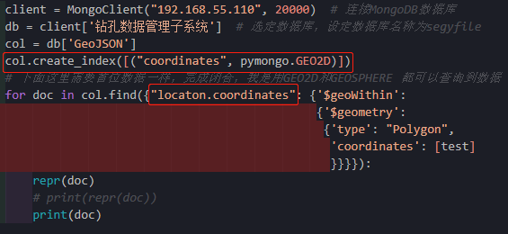
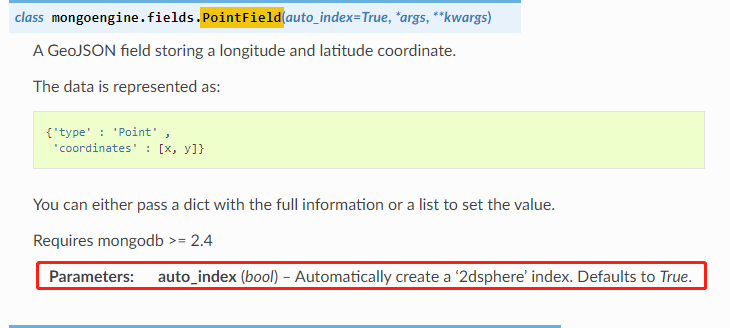
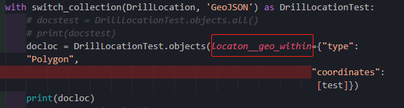

# MongoEngine

[TOC]

## 一、安装

```
python -m pip install mongoengine
```


## 二、实例

### 2.1简单实用

- 这里的Users即是collections名，与pymongo、djongo有所不同

```python
from mongoengine import connect
from mongoengine.document import Document
from mongoengine.fields import IntField, StringField


from mongoengine import *
connect('钻孔数据管理子系统', host='192.168.55.110', port=20000)

class Users(Document):
    name = StringField(required=True, max_length=200)
    age = IntField(required=True)

user1 = Users(
    name='zz',
    age=112
)
user1.save()
print(user1.name)
user1.name = 'zz11'
user1.save()
print(user1.name)

```


### 2.2使用指定数据库

- alias字段指定数据库

```python
from mongoengine import connect
from mongoengine.document import Document
from mongoengine.fields import IntField, StringField


from mongoengine import *
connect(alias='drill_system',db='钻孔数据管理子系统', host='192.168.55.110', port=20000)
connect(alias='rs_system',db='遥感数据管理子系统', host='192.168.55.110', port=20000)


class Users(Document):
    name = StringField(required=True, max_length=200)
    age = IntField(required=True)
    meta = {'db_alias': 'rs_system'}

user1 = Users(
    name='zz',
    age=112
)
user1.save()
print(user1.name)
user1.name = 'zz11'
user1.save()
print(user1.name)

```


### 2.3 切换数据库和集合

- 数据库

  ```
  with switch_db(User, 'archive-user-db') as User:
      User(name='Ross').save()  #  ===》 这时会将数据保存至 'archive-user-db'
  ```

- 集合

  ```
  with switch_collection(Group, 'group2000') as Group:
      Group(name='hello Group 2000 collection!').save()  # 将数据保存至 group2000 集合
  ```

  

- [ref](https://cloud.tencent.com/developer/article/1406578)

- [ref](https://www.cnblogs.com/zhenyauntg/p/13201826.html)


## 三、序列化

- 序列化需要专门的`django-rest-framework-mongoengine`

### 3.1、安装

```
pip install django-rest-framework-mongoengine
```


### 3.2、配置

- settings.py

  ```python
  INSTALLED_APPS = (
      ...
      'rest_framework',
      'rest_framework_mongoengine',
      ...
  )
  ```

  

- 参见[github](https://github.com/umutbozkurt/django-rest-framework-mongoengine)

- 使用参见文档：[API](http://umutbozkurt.github.io/django-rest-framework-mongoengine/)


### 3.3、实例

- models.py

    ```python
    class DrillLocation(Document):
        '''钻孔定位表'''
        name = StringField(required=True)
        locaton = ListField(required=True)
        meta = {'db_alias': 'drill_system'}
    ```

- serializers.py

  ```python
  from rest_framework_mongoengine.serializers import DocumentSerializer
  class DrillLocationSerializer(DocumentSerializer):
    '''钻孔数据管理子系统定位表数据'''
      class Meta:
          model = DrillLocation
          fields = "__all__"
  ```
  
- views.py

    ```python
            with switch_collection(DrillLocation, 'GeoJSON') as DrillLocationTest:
                docstest = DrillLocationTest.objects.all()
                print(docstest)
            ser = DrillLocationSerializer(instance=docstest, many=True)
                print(ser)   
    ```

    

### 四、空间查询

- 这里不同于pymongo，`location__geo_within`中`location`是字段名

- `mongoengine空间索引.py`

  ```python
  from mongoengine import connect
  from mongoengine.document import Document
  from mongoengine.fields import DictField, IntField, PointField, StringField
  from mongoengine import *
  from mongoengine.context_managers import switch_collection, switch_db
  
  connect(alias='drill_system', db='钻孔数据管理子系统',
          host='192.168.55.110', port=20000)
  class GeoTest(Document):
      name = StringField()
      location = PointField()
      meta = {'db_alias': 'drill_system'}
      
  doc = GeoTest.objects(location__geo_within={
                        "type": "Polygon", "coordinates": [[[0, 0], [0, 3], [3, 3], [3, 0],[0,0]]]})
  print(doc)
  ```

  

- 比较一下pymongo与mongoengine

  - pymongo

    

    - 这种方法更符合mongodb原生的查询语句，但分页需要自己做，序列化目前我还没想到解决的方法。
    - 看了mongoengine后，我在想是不是也可以使用xxxmodel.objetcs()这种方式？关键在于集合索引的创建,我是否可以在views.py阶段创建索引？Djongo与mongoengine都是在models中创建索引（集合collection创建索引），考虑到还需序列化，我就没有测试。原理还需要进一步学习！😃

  - mongoengine

    - models.py，在meta中index创建了2dsphere索引，默认PointField字段会自动创建 ‘2dsphere’ 索引

      

    - models.py

      ```python
      # 设置数据库
      connect(alias='drill_system', db='钻孔数据管理子系统',
              host='192.168.55.110', port=20000)
      class DrillLocation(Document):
          '''钻孔定位表'''
          name = StringField(required=True)
          locaton = PointField()
          meta = {'db_alias': 'drill_system',
                  'indexes': [[("locaton.coordinates", "2dsphere"), ("datetime", 1)]]}
      ```

      

    - serializers.py

      ```python
      from rest_framework_mongoengine.serializers import DocumentSerializer
      class DrillLocationSerializer(DocumentSerializer):
          '''钻孔数据管理子系统定位表数据'''
          class Meta:
              model = DrillLocation
              fields = "__all__"
      ```

    - views.py

    

    

    - mongoengine默认自动创建了索引，这样就可以查许到数据对象了，进行分页、序列化。

