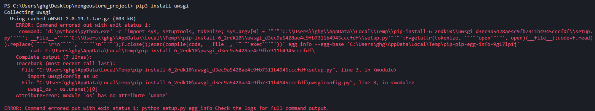
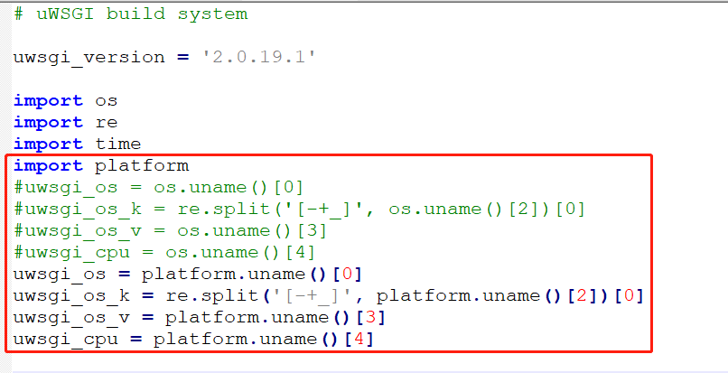

# 系统部署

[TOC]


## 一、Vue+Django+Nginx+uWSGI部署生产环境 前后端分离


- 以为安装成功，结果仍然报错，后来查询资料发现目前**windows尚不支持uwsgi**。
- 无法在Windows上发布Django程序了，不过，还是可以在Windows上测试、练习Django程序的开发的。

### 1、安装uWSGI

```
pip install uwsgi
```

- 报错:AttributeError: module 'os' has no attribute 'uname'

  

- 报错说明：

  是因为uwsgiconfig.py文件中，os.uname()是不支持windows系统的，platform模块是支持任何系统。

- 下载uwsgi离线安装

  **https://pypi.org/project/uWSGI/#files**

- 解压后,进入目录下，修改uwsgiconfig.py文件中的os.uname()为platform.uname()




- 然后再cd进入目录执行：python setup.py install

  ```
  D:\uWSGI>python setup.py install
  ```

- 报错:Exception: you need a C compiler to builduWSGI

```shell
D:\Python3\lib\distutils\dist.py:274: UserWarning: Unknown distribution option: 'descriptions'
  warnings.warn(msg)
running install
using profile: buildconf/default.ini
detected include path: ['/usr/include', '/usr/local/include']
Traceback (most recent call last):
  File "D:\uWSGI\uwsgiconfig.py", line 752, in __init__
    gcc_version_components = gcc_version.split('.')
AttributeError: 'NoneType' object has no attribute 'split'

During handling of the above exception, another exception occurred:

Traceback (most recent call last):
  File "setup.py", line 140, in <module>
    'Programming Language :: Python :: 3.8',
  File "D:\Python3\lib\site-packages\setuptools\__init__.py", line 145, in setup
    return distutils.core.setup(**attrs)
  File "D:\Python3\lib\distutils\core.py", line 148, in setup
    dist.run_commands()
  File "D:\Python3\lib\distutils\dist.py", line 966, in run_commands
    self.run_command(cmd)
  File "D:\Python3\lib\distutils\dist.py", line 985, in run_command
    cmd_obj.run()
  File "setup.py", line 77, in run
    conf = uc.uConf(get_profile())
  File "D:\uWSGI\uwsgiconfig.py", line 760, in __init__
    raise Exception("you need a C compiler to build uWSGI")
Exception: you need a C compiler to build uWSGI
```

- 报错说明：需要安装C语言编译环境

  如果本机上没有C编译环境,需要下载一个编译器


- 接下来没有完成，查看到uWSGI不支持Windows

- 推荐下载：MinGW

  下载地址：https://osdn.net/projects/mingw/downloads/68260/mingw-get-setup.exe/


- [ref](https://www.cnblogs.com/ningy1009/p/12769776.html)

- [ref](https://zhuanlan.zhihu.com/p/25080236)

- [ref](https://juejin.cn/post/6844903619771252749)


- [ref](https://blog.csdn.net/longlong6682/article/details/105376009?utm_medium=distribute.pc_relevant.none-task-blog-baidujs_title-2&spm=1001.2101.3001.4242)


## 二、apache+mod_wsgi


## 三、Docker下部署

- Django常见的两种部署方式：

1. Django + Nginx + uWSGI
2. Django+ Nginx + Gunicorn


- [ref](http://www.ipengtao.com/2018/12/17/deploy-django-docker/#more)


- Django搭建个人博客：[将项目部署到服务器](https://www.dusaiphoto.com/article/71/)


## 四、项目部署

- 