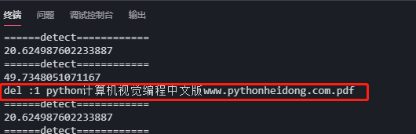

# Python自动清理文件夹中的旧文件

[TOC]

## 1. 前言

- 从数据库下载文件到服务器，监控数据量，大于一定范围自动删除


## 2. 实现

- 使用线程

- `python自动清理.py`

```python
'''
Description: henggao_learning
version: v1.0.0
Author: henggao
Date: 2020-12-18 16:33:01
LastEditors: henggao
LastEditTime: 2020-12-18 16:49:15
'''
# -*- coding: utf-8 -*-

#
# 开线程检测文件夹大小，超过指定大小，则按文件最后修改时间排序并删除一部分旧图片
# 在线程里每隔一段时间检测一次
#

import os
import threading
import time


# 文件按最后修改时间排序
def get_file_list(file_path):
    dir_list = os.listdir(file_path)
    if not dir_list:
        return
    else:
        dir_list = sorted(dir_list, key=lambda x: os.path.getmtime(
            os.path.join(file_path, x)))
        # print(dir_list)
        return dir_list

# 获取文件夹大小


def get_size(file_path):
    totalsize = 0
    for filename in os.listdir(file_path):
        totalsize = totalsize + \
            os.path.getsize(os.path.join(file_path, filename))
    #print(totalsize / 1024 / 1024)
    return totalsize / 1024 / 1024

# 1文件目录   2文件夹最大大小(M)   3超过后要删除的大小(M)


def detect_file_size(file_path, size_Max, size_Del):
    print(get_size(file_path))
    if get_size(file_path) > size_Max:
        fileList = get_file_list(file_path)
        for i in range(len(fileList)):
            if get_size(file_path) > (size_Max - size_Del):
                print("del :%d %s" % (i + 1, fileList[i]))
                os.remove(file_path + fileList[i])


# 检测线程，每个5秒检测一次
def detectPicSize():
    while True:
        print('======detect============')
        # detect_file_size("../pic/", 30, 5)
        detect_file_size("./mongeostore_env/pic/", 30, 5)
        time.sleep(5)


if __name__ == "__main__":

    # 创建检测线程
    detect_thread = threading.Thread(target=detectPicSize)
    detect_thread.start()

```

- 运行测试，向文件夹加入文件

  

  

- [ref](https://www.pythonf.cn/read/82975)