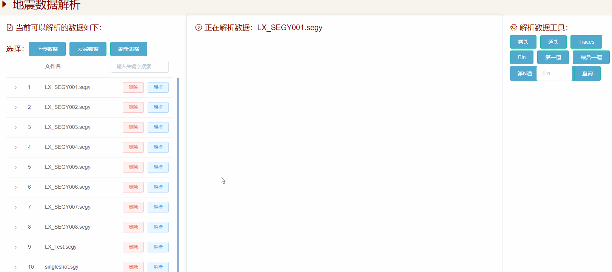

# Django＋Vue实现dwebsocket通信

[TOC]

## 0. 前言

- Django实现websocket大致上有两种方式，一种channels，一种是dwebsocket。channels依赖于redis，twisted等，相比之下使用dwebsocket要更为方便一些


## 1. Django

### 1.1  Python环境下安装

```
pip install dwebsocket
```


### 1.2 配置Django下的setttings.py文件

```
MIDDLEWARE = [
	...
	# 'dwebsocket.middleware.WebSocketMiddleware',# 为所有的URL提供websocket，如果只是单独的视图需要可以不选
]

WEBSOCKET_ACCEPT_ALL = True  # 可以允许每一个单独的视图实用websockets
```


### 1.3 views.py

```python
# 地震数据解析，下载云端数据
# @require_http_methods(['GET'])
@accept_websocket
def AnalysisCloudDown(request):

    if request.is_websocket():  # 如果请求是websocket请求：

        WebSocket = request.websocket
        print(WebSocket)
        i = 0  # 设置发送至前端的次数
        messages = {}

        while True:
            i += 1  # 递增次数 i
            time.sleep(1)  # 休眠1秒

            # 判断是否通过websocket接收到数据
            if WebSocket.has_messages():

                # 存在Websocket客户端发送过来的消息
                client_msg = WebSocket.read().decode()
                print(client_msg)
                # # 从数据库拿到数据
                seismic_obj = SeismicInfo.objects(id=client_msg).first()
                filename = seismic_obj.seismic_filename
                seismic_file = seismic_obj.filedata.read  # 注意这个地方不用加（）
                seismic_filensize = seismic_obj.filedata.length
                content_type = seismic_obj.filedata.content_type
                filename = filename + '.' + content_type
                # 数据写入服务器
                RECORD_SIZE = 1024*40  # 单位是B
                with open("../mongeostore_env/pic/%s" % filename, 'wb') as f:
                    # f.write(seismic_file)
                    # print(f.tell())
                    # print('save success')
                    records = iter(partial(seismic_file, RECORD_SIZE), b'')
                    for r in records:
                        f.write(r)
                        percent = int(f.tell()*100/seismic_filensize)
                        # print(percent)
                        # print(percent)
                        # print(f.tell())
                        # return HttpResponse(percent)

                        # 设置发送前端的数据
                        messages = {
                            # 'time': time.strftime('%Y.%m.%d %H:%M:%S', time.localtime(time.time())),
                            # 'server_msg': 'send %d times!' % i,
                            'client_msg': client_msg,
                            'percent': percent
                        }
                        request.websocket.send(json.dumps(messages))
            # else:
            #     # 设置发送前端的数据
            #     messages = {
            #         'time': time.strftime('%Y.%m.%d %H:%M:%S', time.localtime(time.time())),
            #         'server_msg': 'send %d times!' % i,
            #     }

            #     # 设置发送数据为json格式
            #     request.websocket.send(json.dumps(messages))
    else:
        try:#如果是普通的http方法
            message = request.GET['message']
            return HttpResponse(message)
        except:
            # return render(request,'index.html')
            return HttpResponse('test123')

```


- [ref](https://blog.csdn.net/u012887259/article/details/102804701?utm_medium=distribute.pc_relevant.none-task-blog-baidujs_title-11&spm=1001.2101.3001.4242)

- [ref](https://www.cnblogs.com/polly-ling/p/10173388.html)

- [ref](https://blog.csdn.net/weixin_47073925/article/details/106503752?utm_medium=distribute.pc_relevant.none-task-blog-BlogCommendFromMachineLearnPai2-4.control&depth_1-utm_source=distribute.pc_relevant.none-task-blog-BlogCommendFromMachineLearnPai2-4.control)


## 2. 实例

- 补充一下：WebSocket中onmessage数据一旦发生变化，回去最后一次数据，这里this也会变换，vue中this需要重新定义，我这里使用的`var that = this`
- AnalysisCloudData.vue

```vue
<!--
 * @Description: henggao_learning
 * @version: v1.0.0
 * @Author: henggao
 * @Date: 2020-12-21 17:33:53
 * @LastEditors: henggao
 * @LastEditTime: 2020-12-23 11:16:57
-->
<template>
  <div class="DataShow">
    <div>
      <h2
        style="
          font-size: 30px;
          padding-top: 10px;
          color: #870000;
          min-width: 500px;
          overflow: hidden;
          text-align: left;
        "
      >
        <i class="el-icon-caret-right" /> 地震元数据信息
      </h2>
    </div>
    <el-container>
      <el-header class="data_search">
        <!--搜索头 开始-->
        <section id="search-title" style="min-width: 500px">
          <el-form
            :inline="true"
            :model="searchCondition"
            class="demo-form-inline"
            @submit.native.prevent
          >
            <el-form-item label="关键字:">
              <el-input
                v-model="searchCondition.filter_key"
                suffix-icon="el-icon-view"
                placeholder="请输入关键字"
                @keyup.enter.native="onSearchSubmit"
              ></el-input>
            </el-form-item>
            <el-form-item id="submit-item">
              <el-button
                type="info"
                plain
                icon="el-icon-search"
                @click="onSearchSubmit"
                >查询</el-button
              >
            </el-form-item>
            <el-form-item id="submit-reset">
              <el-button
                type="info"
                plain
                icon="el-icon-refresh"
                @click="resetData"
                >重置</el-button
              >
            </el-form-item>
          </el-form>
        </section>
        <!--搜索头 结束-->
        <!-- <SearchData /> -->
      </el-header>
      <el-main class="data_content">
        <div class="data_table">
          <!-- 注意里面max-height字段设置高度  tableData放列表数据 -->
          <el-table
            class="tb-edit"
            highlight-current-row
            :data="tableData"
            style="width: 100%; overflow: hidden"
            max-height="400px"
            @selection-change="handleSelectionChange"
            lazy
          >
            <!-- 选择框设置 -->
            <el-table-column type="selection" width="50"> </el-table-column>
            <template v-for="col in cols">
              <!-- 设置排序字段 -->
              <el-table-column
                :key="col._id"
                :prop="col.prop"
                sortable
                :label="col.label"
                align="center"
              >
                <!-- 每一行数据 -->
                <template slot-scope="scope">
                  <div v-if="!scope.row.isEdit">{{ scope.row[col.prop] }}</div>
                  <div v-else>
                    <el-input v-model="scope.row[col.prop]"></el-input>
                  </div>
                </template>
              </el-table-column>
            </template>

            <el-table-column label="下载进度" style="text-align: center">
              <h2>防止按钮消失</h2>
              <template slot-scope="scope">
                <!-- {{ scope.row["progressNum"] }} -->
                <!-- <div v-show="progressFlag" class="head-img"> -->
                <el-progress
                  type="circle"
                  :percentage="scope.row['progressNum']"
                ></el-progress>
                <!-- </div> -->
              </template>
            </el-table-column>
            <el-table-column
              label="下载文件"
              class="details"
              width="100"
              style="text-align: center"
            >
              <h2>防止按钮消失</h2>
              <template slot-scope="scope">
                <el-button
                  type="primary"
                  plain
                  size="mini"
                  @click="downloadfile(scope.$index, scope.row, scope.row)"
                  >下载文件</el-button
                >
              </template>
            </el-table-column>
          </el-table>
        </div>
        <!-- 分页 -->
        <div class="block" style="overflow: hidden; text-align: center">
          <el-pagination
            small
            @size-change="handleSizeChange"
            @current-change="handleCurrentChange"
            :current-page.sync="currentPage"
            :page-sizes="pageSizes"
            :page-size="PageSize"
            layout="total, sizes, prev, pager, next, jumper"
            :total="totalCount"
          >
          </el-pagination>
        </div>
        <!-- 下面这个用来设置点击添加按钮的弹出框，里面可以进行嵌套表格来展示弹出的表格信息,使用下面的:visible.sync来控制显示与否。里面绑定的是我们新设置的值，填写完成后，将我们这个新值塞到页面中所有的数据当中去  -->
        <!-- 添加数据的对话框 -->
        <el-dialog
          title="添加数据"
          :visible.sync="dialogVisible"
          width="30%"
          @close="addDialogClosed"
        >
          <!-- 内容的主体区域 -->
          <!--去掉:rules="addFormRules" -->
          <el-form
            ref="addFormRef"
            :model="add_to_data"
            :rules="addFormRules"
            label-width="120px"
          >
            <template v-for="(item, key) of addForm">
              <!-- <el-form-item
                v-if="key == '_id'"
                :label="key"
                :prop="key"
                :key="key"
              >
                <el-input v-model="addForm[key]"></el-input>
              </el-form-item> -->
              <el-form-item
                v-if="key !== 'id' && key !== 'location'"
                :label="key"
                :prop="key"
                :key="key"
              >
                <el-input v-model="add_to_data[key]"></el-input>
              </el-form-item>
            </template>
          </el-form>
        </el-dialog>
      </el-main>
    </el-container>
  </div>
</template>

<script>
import axios from "axios";
import qs from "qs";

// import SearchData from "@/components/SearchData.vue";
export default {
  name: "AnalysisCloudData",
  components: {
    // SearchData
  },
  data() {
    // 校验添加信息
    let checkZk_name = (rule, value, callback) => {
      const regZk_name = /^ZK[0-9]{1,6}/;
      // const regKey_word = /^[A-Za-z0-9\u4e00-\u9fa5]{3,}$/;
      if (regZk_name.test(value)) {
        // 验证通过，合法
        return callback();
      }
      // 验证不通过，不合法
      callback(new Error("请输入正确的孔号"));
    };
    // 校验添加信息
    let checkCoordinate_E = (rule, value, callback) => {
      var re = /^[0-9]+.?[0-9]*/; //判断字符串是否为数字
      if (re.test(value)) {
        // 验证通过，合法
        return callback();
      }
      // 验证不通过，不合法
      callback(new Error("请输入正确的参数"));
    };
    // 校验添加信息
    let checkCoordinate_N = (rule, value, callback) => {
      var re = /^[0-9]+.?[0-9]*/; //判断字符串是否为数字
      if (re.test(value)) {
        // 验证通过，合法
        return callback();
      }
      // 验证不通过，不合法
      callback(new Error("请输入正确的参数"));
    };
    // 校验添加信息
    let checkCoordinate_R = (rule, value, callback) => {
      var re = /^[0-9]+.?[0-9]*/; //判断字符串是否为数字
      if (re.test(value)) {
        // 验证通过，合法
        return callback();
      }
      // 验证不通过，不合法
      callback(new Error("请输入正确的参数"));
    };
    // 校验添加信息
    let checkMax_depth = (rule, value, callback) => {
      var re = /^[0-9]+.?[0-9]*/; //判断字符串是否为数字
      if (re.test(value)) {
        // 验证通过，合法
        return callback();
      }
      // 验证不通过，不合法
      callback(new Error("请输入正确的参数"));
    };
    // 校验添加信息
    let checkLocation = (rule, value, callback) => {
      var re = /^[0-9]+.?[0-9]*/; //判断字符串是否为数字
      if (re.test(value)) {
        // 验证通过，合法
        return callback();
      }
      // 验证不通过，不合法
      callback(new Error("请输入正确的参数"));
    };

    return {
      // cols prop属性值都是作为 tableData的属性
      cols: [
        { label: "节点编号_id", prop: "_id.$oid", nickname: "normal" },
        { label: "名称nickname", prop: "nickname", nickname: "sort" },
        { label: "类型combat", prop: "combat", nickname: "normal" },
        { label: "状态level", prop: "level", nickname: "normal" },
        { label: "坐标rid", prop: "rid", nickname: "normal" },
      ],
      //   表格数据
      tableData: [
        {
          node: "0051",
          name: " 机库顶",
          type: "UWB",
          status: "正常",
          coordinate: "12.21,34.45,34.6",
        },
        {
          node: "0061",
          name: "机库门",
          type: "GPS",
          status: "低电",
          coordinate: "45.41,67.45,78.6",
        },
        {
          node: "0061",
          name: "机库门",
          type: "GPS",
          status: "低电",
          coordinate: "45.41,67.45,78.6",
        },
      ],
      // 筛选字段
      filter_data: [
        { text: "ZK1", value: "ZK1" },
        { text: "ZK2", value: "ZK2" },
        { text: "ZK3", value: "ZK3" },
        { text: "ZK4", value: "ZK4" },
      ],
      // 分页数据，默认第几页
      currentPage: 1,
      // 总条数，根据接口获取数据长度(注意：这里不能为空)
      totalCount: 400,
      // 个数选择器（可修改）
      pageSizes: [10, 20, 50, 100],
      // 默认每页显示的条数（可修改)
      PageSize: 10,
      // 控制添加用户对话框的显示与隐藏，默认为隐藏
      dialogVisible: false,
      // 添加对象表格的字段名
      addForm: {
        zk_name: "",
        coordinate_E: "",
        coordinate_N: "",
        coordinate_R: "",
        max_depth: "",
        track_type: "曲",
        coordinate_lng: "",
        coordinate_lat: "",
        // location: {
        //   type: "Point",
        //   coordinates: [],
        // },
      },
      // 添加数据框的字段,用来判断是否为空，确定按钮
      add_to_data: {
        zk_name: "",
        coordinate_E: "",
        coordinate_N: "",
        coordinate_R: "",
        max_depth: "",
        track_type: "曲",
        coordinate_lng: "",
        coordinate_lat: "",
        // location: {
        //   type: "Point",
        //   coordinates: [],
        // },
      },
      // 通过add_button_state值判断确定按钮是否激活
      add_button_state: false,
      // // 添加表单的验证规则对象
      addFormRules: {
        zk_name: [
          { required: true, message: "请输入钻孔号", trigger: "blur" },
          { min: 3, max: 10, message: "数据格式为'ZK1'", trigger: "blur" },
          { validator: checkZk_name, trigger: "blur" },
        ],
        coordinate_E: [
          { required: true, message: "请输入参数", trigger: "blur" },
          { validator: checkCoordinate_E, trigger: "blur" },
        ],
        coordinate_N: [
          { required: true, message: "请输入参数", trigger: "blur" },
          { validator: checkCoordinate_N, trigger: "blur" },
        ],
        coordinate_R: [
          { required: true, message: "请输入参数", trigger: "blur" },
          { validator: checkCoordinate_R, trigger: "blur" },
        ],
        max_depth: [
          { required: true, message: "请输入参数", trigger: "blur" },
          { validator: checkMax_depth, trigger: "blur" },
        ],
        track_type: [
          { required: true, message: "请输入参数", trigger: "blur" },
        ],
        coordinate_lng: [
          { required: true, message: "请输入参数", trigger: "blur" },
          { validator: checkMax_depth, trigger: "blur" },
        ],
        coordinate_lat: [
          { required: true, message: "请输入参数", trigger: "blur" },
          { validator: checkMax_depth, trigger: "blur" },
        ],
        location: [{ required: true, message: "请输入参数", trigger: "blur" }],
      },
      // 搜索对象
      searchCondition: {
        filter_key: "",
        Depth: "",
        _id: "",
      },
      // 用于判断是否点击过搜索按钮
      flag: false,
      //   下载进度提示
      startTimer: "",
      fresh: false, // 组件加载
      progressFlag: true, //进度条初始值隐藏
      progressNum: 0, //进度条初始值
      //   进度条使用
      ws: null, //websocket通信
    };
  },
  watch: {
    add_to_data: {
      handler(curval, oldval) {
        // console.log(Object.keys(curval)[0]);
        let regZk_name = /^ZK[0-9]{1,6}/;
        let re = /^[0-9]+.?[0-9]*/; //判断字符串是否为数字
        if (
          regZk_name.test(curval.zk_name) &&
          re.test(curval.coordinate_E) &&
          re.test(curval.coordinate_N) &&
          re.test(curval.coordinate_R) &&
          re.test(curval.max_depth) &&
          curval.track_type != "" &&
          re.test(curval.coordinate_lng) &&
          re.test(curval.coordinate_lat)
        ) {
          this.add_button_state = true;
        } else {
          this.add_button_state = false;
        }
      },
      deep: true,
    },
  },
  created() {
    this.showData(this.PageSize, this.currentPage); //展示Collection表格数据
    // this.onSearchSubmit(this.PageSize, this.currentPage); //展示Collection表格数据
  },
  mounted() {},
  methods: {
    // 展示数据,将页码及每页显示的条数以参数传递提交给后台
    showData(n1, n2) {
      const url = "http://127.0.0.1:8000/seismic/seismicinfo/";
      axios
        .get(url, {
          params: {
            // 每页显示的条数
            PageSize: n1,
            // 显示第几页
            currentPage: n2,
          },
        })
        .then((response) => {
          // var res = JSON.parse(response.bodyText);
          // console.log(response);
          //   console.log(response.data);
          //   console.log(response.data.data);

          this.tableData = response.data.data.list;
          //   console.log(response.data.data.list);

          this.totalCount = response.data.data.count; //分页总数

          let tmp = this.tableData[0];
          // console.log(tmp);
          // var listcol = [];

          // cols prop属性值都是作为 tableData的属性
          var newcols = [
            { label: "文件名称", prop: "seismic_filename" },
            { label: "研究区域", prop: "location" },
            // { label: "项目名称", prop: "project_name" },
            // { label: "单位名称", prop: "company_name" },
            // { label: "上传人员", prop: "uploader" },
            // { label: "上传时间", prop: "seismic_upload_date" },
            // { label: "钻孔柱状图", prop: "zk_histogram" },
          ];

          this.cols = newcols;
          let tem_list = [];
          for (let i = 0; i < 55; i++) {
            // const element = array[i];
            let ZK = "ZK";
            let ZKX = ZK + i;
            // {text:"ZKX",value;"ZKX"}
            let json_data = { text: ZKX, value: ZKX };
            tem_list.push(json_data);
          }
          // console.log(tem_list);
          this.filter_data = tem_list;
        });
    },

    // 重置Collection表格数据
    resetData() {
      (this.flag = false), this.showData(10, 1);
    },
    // 选择框
    handleSelectionChange(val) {
      this.multipleSelection = val;
    },
    // 排序
    filterHandler(value, row, column) {
      const property = column["property"];
      return row[property] === value;
    },
    // 监听添加对话框的关闭事件
    addDialogClosed() {
      this.$refs.addFormRef.resetFields();
    },
    // 上传
    uploadSeismicData() {
      this.$router.push({ path: "/mongeostore/seismicupload" });
    },
    // 下载
    downloadfile(index, row, row_data) {
      //   console.log(id);
      this.WebSocketTest(index, row, row_data);
    },
    // 编辑（修改）按钮
    handleEdit(index, row) {
      // console.log(index, row);
      // 动态设置数据并通过这个数据判断显示方式
      if (row.isEdit) {
        // 点击保存的
        this.$delete(row, "isEdit");
        // console.log("开始delete");
        // console.log(index, row); //把row发送给后端
        // console.log(row["_id"]["$oid"]); //把row发送给后端
        // row["id"] = row["_id"]["$oid"];
        // row["help_param"] = "help_param"; //用于解决后端smscode参数为3019"}多了"}问题
        // let postData = qs.stringify(row); // w为了解决后端拿不到数据问题
        // postData["_id"] = row["_id"]["$oid"];
        // console.log(typeof postData);
        // console.log(row["id"]);
        let json_data = JSON.stringify(row);

        const url = "http://127.0.0.1:8000/seismic/editseismicinfo/";
        axios
          .post(
            url,
            {
              // data: JSON.stringify(row) //data用于post请求
              json_data,
              // 设置上传到后端的数据库和集合名称
              colname: this.$store.state.title_message,
              dbname: this.$store.state.temp_database,
            },
            {
              headers: { "Content-Type": "application/x-www-form-urlencoded" },
            }
            // console.log(postData)
          )
          .then((res) => {
            console.log("编辑成功");
            console.log(res.data);
            if (res.data == 412) {
              // 输入有误,后端返回状态码,进行提示
              this.$message.error("输入时间有误,请重新编辑!");
            }
          })
          .catch((err) => {
            console.log("输入有误");
          });
      } else {
        // 点击编辑
        this.$set(row, "isEdit", true);
        // console.log("开始set");
        // console.log(index, row);
      }
      // console.log(this.tableData);s
    },
    // 删除按钮
    deleteRow(index, rows, row) {
      // 添加确认删除框
      this.$confirm("永久删除，是否继续？", "提示", {
        confirmButtonText: "确定",
        cancelButtonText: "取消",
        type: "warning",
      })
        .then(() => {
          // 删除操作
          rows.splice(index, 1);
          let json_data = JSON.stringify(row);
          console.log(json_data);
          const url = "http://127.0.0.1:8000/seismic/deleteseismicinfo/";
          axios
            .post(
              url,
              {
                json_data,
                // 设置上传到后端的数据库和集合名称
                colname: this.$store.state.title_message,
                dbname: this.$store.state.temp_database,
              },
              {
                headers: {
                  "Content-Type": "application/x-www-form-urlencoded",
                },
              }
            )
            .then((res) => {
              console.log("删除成功");
              // 重新获取用户列表数据
              // this.showData();
              //通过flag判断,刷新数据
              if (!this.flag) {
                this.showData(this.PageSize, this.currentPage);
              } else {
                this.onSearchSubmit(this.PageSize, this.currentPage);
              }
            });
        })
        .catch(() => {
          this.$message({
            type: "info",
            message: "取消删除",
          });
        });
    },
    // 开始搜索
    onSearchSubmit(n1, n2) {
      this.currentPage = n2;
      // this.initAdminList(1);
      if (this.searchCondition.filter_key == "") {
        this.$message.warning("查询条件不能为空！");
        return;
      } else {
        // console.log(this.searchCondition.filter_key);
        // console.log(this.$store.state.temp_database);
        let filter_key_data = this.searchCondition.filter_key;
        const url = "http://127.0.0.1:8000/seismic/seismicinfosearch/";
        axios
          .get(url, {
            params: {
              // 每页显示的条数
              PageSize: n1,
              // 显示第几页
              currentPage: n2,
              // 搜索字段
              search_key: filter_key_data,
            },
          })
          .then((response) => {
            if (response.data.data.list) {
              this.tableData = response.data.data.list; //返回查询的数据

              this.totalCount = response.data.data.count; //搜索后分页总数;
            } else {
              // alert("输入有误或数据不存在");
              this.$message.warning("输入有误或数据不存在");
              return;
            }
            //页面初始化数据需要判断是否检索过
            this.flag = true;
          });
      }
    },

    handleDelete(index, row) {
      console.log(index, row);
    },
    // 分页
    // 每页显示的条数
    handleSizeChange(val) {
      console.log(`每页 ${val} 条`);
      // 改变每页显示的条数
      this.PageSize = val;
      // 点击每页显示的条数时，显示第一页
      // this.showData(val, 1);
      if (!this.flag) {
        this.showData(val, 1); // this.pageSize是undefined，使用选定的或默认值
      } else {
        this.onSearchSubmit(val, 1);
      }
      // 注意：在改变每页显示的条数时，要将页码显示到第一页
      this.currentPage = 1;
      // this.handleCurrentChange(this.currentPage);
    },
    // 监听 pageSize 改变的事件，显示第几页
    handleCurrentChange(val) {
      console.log(`当前页: ${val}`);
      // 改变默认的页数
      this.currentPage = val;

      if (!this.flag) {
        this.showData(this.PageSize, val); // this.pageSize是undefined，使用选定的或默认值
      } else {
        this.onSearchSubmit(this.pageSize, val);
      }
    },
    // 进度条
    WebSocketTest(index, row, row_data) {
      if ("WebSocket" in window) {
        // alert("您的浏览器支持 WebSocket!");
        if (this.ws) {
          this.ws.close();
        }

        // 打开一个 web socket
        let ws = new WebSocket(
          "ws://127.0.0.1:8000/seismic/analysisclouddown/"
        );
        // 给后端发数据
        ws.onopen = function () {
          // Web Socket 已连接上，使用 send() 方法发送数据
          //   ws.send("发送数据");
          ws.send(row.id);
          //   alert("数据发送中...");
        };
        // 接收数据
        var that = this;
        ws.onmessage = function (evt) {
          var received_msg = evt.data;
          //   alert("数据已接收...");
          //   alert("数据:" + received_msg);
          var json_data = eval("(" + received_msg + ")");
          console.log(json_data["percent"]);
          //   this.progressNum = json_data["percent"];
          //   temp_data = {};
          //   console.log(index, row);
          this.progressNum = 0 + json_data["percent"];
          row.progressNum = 0 + this.progressNum;
          row = {
            id: row_data.id,
            seismic_filename: row_data.seismic_filename,
            location: row_data.location,
            progressNum: this.progressNum,
          };
          console.log(row);
        //   console.log(this);
        //   console.log(that);
          that.tableData = [row];
          //   return row;
          //   this.$set(this.tableData, index, row);
          //   this.$set(this.tableData,index,temp_data)
          //   this.fresh = false;
          //   this.$nextTick(() => {
          //     this.fresh = true;
          //   });
          //   this.startTimer = setInterval(() => {
          //     this.progressNum++;
          //     if (this.progressNum > 85) {
          //       clearInterval(this.startTimer);
          //     }
          //   }, 100);
          //   console.log(this.progressNum);
          if (json_data["percent"] == 100) {
            console.log("完成");
            ws.close(); //关闭websocket
          }
        };
        // Call onopen directly if socket is already open
        if (ws.readyState == WebSocket.OPEN) ws.onopen();
        // this.ws = ws;
      } else {
        // 浏览器不支持 WebSocket
        alert("您的浏览器不支持 WebSocket!");
      }
    },
  },
};
</script>

<style>
/* 全局样式 */
</style>
<style lang="scss" scoped>
/* 本地样式 */
// 设置真个数据内容的大小
// .DataShow {
//   // height: 775px;
//   // height: 810px;
// }
// 设置搜索框的大小
.data_search {
  height: 45px !important;
}
// 设置表格数据大小，表格+分页
// .data_content {
//   // height: 680px !important;
//   // overflow: auto;
// }
// 设置表格数据大小
.data_table {
  height: 400px !important; //注意这个高度和table中max-height="620px"对应,避免部分内容展示不出来
  //   overflow: auto;
}
// 搜索设置
#search-title {
  padding-top: 2px;
  height: 45px;
  float: right;
}
// 设置搜索关键字段字体
.demo-form-inline ::v-deep .el-form-item__label {
  font-size: 18px !important;
  color: rgb(73, 76, 80);
  font-family: "Arial Narrow";
  font-weight: bold;
}
// 设置表格数据滚动条,这里还是留着比较好
.block {
  padding-top: 15px;
}
// .el-scrollbar__wrap {
//   overflow-x: hidden; //设置滚动条隐藏
// }

::v-deep .el-progress-circle {
  height: 40px !important;
  width: 40px !important;
}
::v-deep .el-progress__text {
  //   width: 5px !important;
  font-size: 1px !important;
}
::v-deep .cell {
  text-align: center;
}
</style>
```

- views.py

  ```python
  # 地震数据解析，下载云端数据
  # @require_http_methods(['GET'])
  @accept_websocket
  def AnalysisCloudDown(request):
  
      if request.is_websocket():  # 如果请求是websocket请求：
  
          WebSocket = request.websocket
          print(WebSocket)
          i = 0  # 设置发送至前端的次数
          messages = {}
  
          while True:
              i += 1  # 递增次数 i
              time.sleep(1)  # 休眠1秒
  
              # 判断是否通过websocket接收到数据
              if WebSocket.has_messages():
  
                  # 存在Websocket客户端发送过来的消息
                  client_msg = WebSocket.read().decode()
                  print(client_msg)
                  # # 从数据库拿到数据
                  seismic_obj = SeismicInfo.objects(id=client_msg).first()
                  filename = seismic_obj.seismic_filename
                  seismic_file = seismic_obj.filedata.read  # 注意这个地方不用加（）
                  seismic_filensize = seismic_obj.filedata.length
                  content_type = seismic_obj.filedata.content_type
                  filename = filename + '.' + content_type
                  # 数据写入服务器
                  RECORD_SIZE = 1024*40  # 单位是B
                  with open("../mongeostore_env/pic/%s" % filename, 'wb') as f:
                      # f.write(seismic_file)
                      # print(f.tell())
                      # print('save success')
                      records = iter(partial(seismic_file, RECORD_SIZE), b'')
                      for r in records:
                          f.write(r)
                          percent = int(f.tell()*100/seismic_filensize)
                          # print(percent)
                          # print(percent)
                          # print(f.tell())
                          # return HttpResponse(percent)
  
                          # 设置发送前端的数据
                          messages = {
                              # 'time': time.strftime('%Y.%m.%d %H:%M:%S', time.localtime(time.time())),
                              # 'server_msg': 'send %d times!' % i,
                              'client_msg': client_msg,
                              'percent': percent
                          }
                          request.websocket.send(json.dumps(messages))
              # else:
              #     # 设置发送前端的数据
              #     messages = {
              #         'time': time.strftime('%Y.%m.%d %H:%M:%S', time.localtime(time.time())),
              #         'server_msg': 'send %d times!' % i,
              #     }
  
              #     # 设置发送数据为json格式
              #     request.websocket.send(json.dumps(messages))
      else:
          try:#如果是普通的http方法
              message = request.GET['message']
              return HttpResponse(message)
          except:
              # return render(request,'index.html')
              return HttpResponse('test123')
  
  ```

  

- 页面展示





