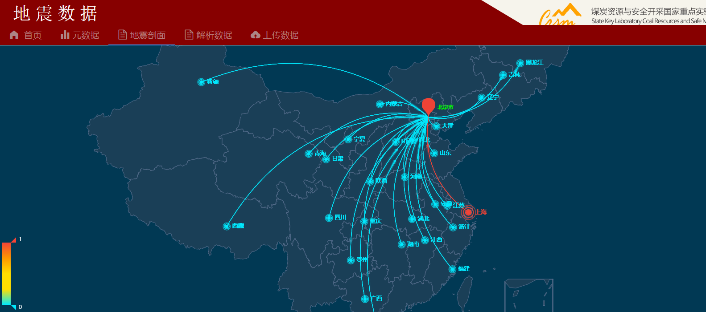
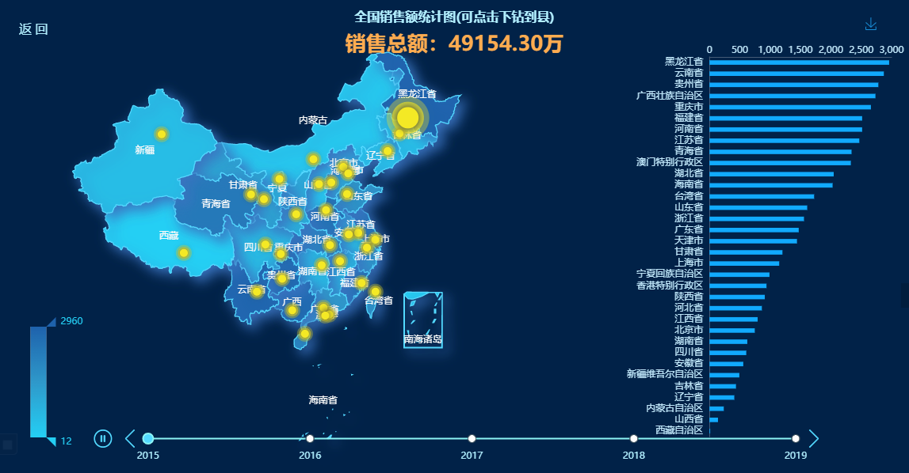

# Echarts

[TOC]

## 0. 前言

- 事先在Vue中安装Echarts


## 1. 引入

- 引入

```
import * as echarts from "echarts/lib/echarts";
import china from "echarts/map/js/china.js";
```


## 2. 实例一

### 2.1 代码

- 完整

```vue
<!--
 * @Description: henggao_learning
 * @version: v1.0.0
 * @Author: henggao
 * @Date: 2020-12-16 15:37:36
 * @LastEditors: henggao
 * @LastEditTime: 2020-12-26 15:04:24
-->
<template>
  <div>
    <div
      id="main"
      ref="chart"
      style="wodth: 800px; height: 600px; margin: 0 auto"
    ></div>
    <!-- <remote-script
      src="https://gallerybox.echartsjs.com/dep/echarts/map/js/china.js"
    ></remote-script
    >; -->
  </div>
</template>

<script>
import * as echarts from "echarts/lib/echarts";
import china from "echarts/map/js/china.js";
// import china from "@/assets/js/china.js";
// var echarts = require("echarts");
export default {
  name: "SeismicProfile",
  data() {
    return {
      data: "",
      a: "g",
    };
  },
  created() {},
  mounted() {
    // 引入china.json
    this.showDataResource();
    // let script = document.createElement("script");
    // script.type = "text/javascript";
    // script.src = "https://gallerybox.echartsjs.com/dep/echarts/map/js/china.js";
    // document.body.appendChild(script);
  },
  watch: {},
  methods: {
    showDataResource() {
      // 基于准备好的dom，初始化echarts实例
      let mychart = echarts.init(this.$refs.chart);
      var chinaGeoCoordMap = {
        黑龙江: [127.9688, 45.368],
        内蒙古: [110.3467, 41.4899],
        吉林: [125.8154, 44.2584],
        北京市: [116.4551, 40.2539],
        辽宁: [123.1238, 42.1216],
        河北: [114.4995, 38.1006],
        天津: [117.4219, 39.4189],
        山西: [112.3352, 37.9413],
        陕西: [109.1162, 34.2004],
        甘肃: [103.5901, 36.3043],
        宁夏: [106.3586, 38.1775],
        青海: [101.4038, 36.8207],
        新疆: [87.9236, 43.5883],
        西藏: [91.11, 29.97],
        四川: [103.9526, 30.7617],
        重庆: [108.384366, 30.439702],
        山东: [117.1582, 36.8701],
        河南: [113.4668, 34.6234],
        江苏: [118.8062, 31.9208],
        安徽: [117.29, 32.0581],
        湖北: [114.3896, 30.6628],
        浙江: [119.5313, 29.8773],
        福建: [119.4543, 25.9222],
        江西: [116.0046, 28.6633],
        湖南: [113.0823, 28.2568],
        贵州: [106.6992, 26.7682],
        云南: [102.9199, 25.4663],
        广东: [113.12244, 23.009505],
        广西: [108.479, 23.1152],
        海南: [110.3893, 19.8516],
        上海: [121.4648, 31.2891],
      };
      var chinaDatas = [
        [
          {
            name: "黑龙江",
            value: 0,
          },
        ],
        [
          {
            name: "内蒙古",
            value: 0,
          },
        ],
        [
          {
            name: "吉林",
            value: 0,
          },
        ],
        [
          {
            name: "辽宁",
            value: 0,
          },
        ],
        [
          {
            name: "河北",
            value: 0,
          },
        ],
        [
          {
            name: "天津",
            value: 0,
          },
        ],
        [
          {
            name: "山西",
            value: 0,
          },
        ],
        [
          {
            name: "陕西",
            value: 0,
          },
        ],
        [
          {
            name: "甘肃",
            value: 0,
          },
        ],
        [
          {
            name: "宁夏",
            value: 0,
          },
        ],
        [
          {
            name: "青海",
            value: 0,
          },
        ],
        [
          {
            name: "新疆",
            value: 0,
          },
        ],
        [
          {
            name: "西藏",
            value: 0,
          },
        ],
        [
          {
            name: "四川",
            value: 0,
          },
        ],
        [
          {
            name: "重庆",
            value: 0,
          },
        ],
        [
          {
            name: "山东",
            value: 0,
          },
        ],
        [
          {
            name: "河南",
            value: 0,
          },
        ],
        [
          {
            name: "江苏",
            value: 0,
          },
        ],
        [
          {
            name: "安徽",
            value: 0,
          },
        ],
        [
          {
            name: "湖北",
            value: 0,
          },
        ],
        [
          {
            name: "浙江",
            value: 0,
          },
        ],
        [
          {
            name: "福建",
            value: 0,
          },
        ],
        [
          {
            name: "江西",
            value: 0,
          },
        ],
        [
          {
            name: "湖南",
            value: 0,
          },
        ],
        [
          {
            name: "贵州",
            value: 0,
          },
        ],
        [
          {
            name: "广西",
            value: 0,
          },
        ],
        [
          {
            name: "海南",
            value: 0,
          },
        ],
        [
          {
            name: "上海",
            value: 1,
          },
        ],
      ];

      var convertData = function (data) {
        var res = [];
        for (var i = 0; i < data.length; i++) {
          var dataItem = data[i];
          var fromCoord = chinaGeoCoordMap[dataItem[0].name];
          var toCoord = [116.4551, 40.2539];
          if (fromCoord && toCoord) {
            res.push([
              {
                coord: fromCoord,
                value: dataItem[0].value,
              },
              {
                coord: toCoord,
              },
            ]);
          }
        }
        return res;
      };
      var series = [];
      [["北京市", chinaDatas]].forEach(function (item, i) {
        console.log(item);
        series.push(
          {
            type: "lines",
            zlevel: 2,
            effect: {
              show: true,
              period: 4, //箭头指向速度，值越小速度越快
              trailLength: 0.02, //特效尾迹长度[0,1]值越大，尾迹越长重
              symbol: "arrow", //箭头图标
              symbolSize: 5, //图标大小
            },
            lineStyle: {
              normal: {
                width: 1, //尾迹线条宽度
                opacity: 1, //尾迹线条透明度
                curveness: 0.3, //尾迹线条曲直度
              },
            },
            data: convertData(item[1]),
          },
          {
            type: "effectScatter",
            coordinateSystem: "geo",
            zlevel: 2,
            rippleEffect: {
              //涟漪特效
              period: 4, //动画时间，值越小速度越快
              brushType: "stroke", //波纹绘制方式 stroke, fill
              scale: 4, //波纹圆环最大限制，值越大波纹越大
            },
            label: {
              normal: {
                show: true,
                position: "right", //显示位置
                offset: [5, 0], //偏移设置
                formatter: function (params) {
                  //圆环显示文字
                  return params.data.name;
                },
                fontSize: 13,
              },
              emphasis: {
                show: true,
              },
            },
            symbol: "circle",
            symbolSize: function (val) {
              return 5 + val[2] * 5; //圆环大小
            },
            itemStyle: {
              normal: {
                show: false,
                color: "#f00",
              },
            },
            data: item[1].map(function (dataItem) {
              return {
                name: dataItem[0].name,
                value: chinaGeoCoordMap[dataItem[0].name].concat([
                  dataItem[0].value,
                ]),
              };
            }),
          },
          //被攻击点
          {
            type: "scatter",
            coordinateSystem: "geo",
            zlevel: 2,
            rippleEffect: {
              period: 4,
              brushType: "stroke",
              scale: 4,
            },
            label: {
              normal: {
                show: true,
                position: "right",
                //offset:[5, 0],
                color: "#0f0",
                formatter: "{b}",
                textStyle: {
                  color: "#0f0",
                },
              },
              emphasis: {
                show: true,
                color: "#f60",
              },
            },
            symbol: "pin",
            symbolSize: 50,
            data: [
              {
                name: item[0],
                value: chinaGeoCoordMap[item[0]].concat([10]),
              },
            ],
          }
        );
      });

      let option = {
        tooltip: {
          trigger: "item",
          backgroundColor: "rgba(166, 200, 76, 0.82)",
          borderColor: "#FFFFCC",
          showDelay: 0,
          hideDelay: 0,
          enterable: true,
          transitionDuration: 0,
          extraCssText: "z-index:100",
          formatter: function (params, ticket, callback) {
            //根据业务自己拓展要显示的内容
            var res = "";
            var name = params.name;
            var value = params.value[params.seriesIndex + 1];
            res =
              "<span style='color:#fff;'>" +
              name +
              "</span><br/>数据：" +
              value;
            return res;
          },
        },
        backgroundColor: "#013954",
        visualMap: {
          //图例值控制
          min: 0,
          max: 1,
          calculable: true,
          show: true,
          color: ["#f44336", "#fc9700", "#ffde00", "#ffde00", "#00eaff"],
          textStyle: {
            color: "#fff",
          },
        },
        geo: {
          map: "china",
          zoom: 1.2,
          label: {
            emphasis: {
              show: false,
            },
          },
          roam: true, //是否允许缩放
          itemStyle: {
            normal: {
              color: "rgba(51, 69, 89, .5)", //地图背景色
              borderColor: "#516a89", //省市边界线00fcff 516a89
              borderWidth: 1,
            },
            emphasis: {
              color: "rgba(37, 43, 61, .5)", //悬浮背景
            },
          },
        },
        series: series,
      };
      // 使用刚指定的配置项和数据显示图表。
      mychart.setOption(option); // 加上true表示不合并配置
    },
  },
};
</script>

<style lang="scss" scoped>
</style>
```


### 2.2 查看




## 3. 例二

### 3.1 代码

- 查看第20小节

```vue
<!--
 * @Description: henggao_learning
 * @version: v1.0.0
 * @Author: henggao
 * @Date: 2020-12-27 09:51:40
 * @LastEditors: henggao
 * @LastEditTime: 2020-12-27 16:28:24
-->
<template>
  <div>
    <div
      id="chart-panel"
      ref="chart"
      style="width: 600px; height: 400px; margin: 0 auto"
    ></div>
    <!-- <remote-script
      src="https://gallerybox.echartsjs.com/dep/echarts/map/js/china.js"
    ></remote-script
    >; -->
  </div>
</template>

<script>
// import $ from "jquery";
import * as echarts from "echarts/lib/echarts";
import china from "echarts/map/js/china.js";
// import china from "@/assets/js/china.js";
// var echarts = require("echarts");
export default {
  name: "SeismicProfile",
  data() {
    return {
      data: "",
      a: "g",
    };
  },
  created() {},
  mounted() {
    // 引入china.json
    this.showDataResource();
  },
  watch: {},
  methods: {
    showDataResource() {
      // 基于准备好的dom，初始化echarts实例
      let myChart = echarts.init(this.$refs.chart);

      $('<div class="back">返 回</div>').appendTo($("#chart-panel"));

      $(".back").css({
        position: "absolute",
        left: "25px",
        top: "25px",
        color: "rgb(179, 239, 255)",
        "font-size": "16px",
        cursor: "pointer",
        "z-index": "100",
      });

      $(".back").click(function () {
        if (parentInfo.length === 1) {
          return;
        }
        parentInfo.pop();
        init(parentInfo[parentInfo.length - 1].code);
      });

      var geoJson = {};

      var parentInfo = [
        {
          cityName: "全国",
          code: 100000,
        },
      ];

      var currentIndex = 0;

      var timeTitle = ["2015", "2016", "2017", "2018", "2019"];
      init(100000);

      function init(adcode) {
        getGeoJson(adcode).then((data) => {
          geoJson = data;
          getMapData();
        });
      }

      //这里我封装了下，直接可以拿过来用
      function getGeoJson(adcode, childAdcode = "") {
        return new Promise((resolve, reject) => {
          function insideFun(adcode, childAdcode) {
            AMapUI.loadUI(["geo/DistrictExplorer"], (DistrictExplorer) => {
              var districtExplorer = new DistrictExplorer();
              districtExplorer.loadAreaNode(adcode, function (error, areaNode) {
                if (error) {
                  console.error(error);
                  reject(error);
                  return;
                }
                let Json = areaNode.getSubFeatures();
                if (Json.length === 0) {
                  let parent =
                    areaNode._data.geoData.parent.properties.acroutes;
                  insideFun(parent[parent.length - 1], adcode);
                  return;
                }

                if (childAdcode) {
                  Json = Json.filter((item) => {
                    return item.properties.adcode == childAdcode;
                  });
                }
                let mapJson = {
                  features: Json,
                };
                resolve(mapJson);
              });
            });
          }
          insideFun(adcode, childAdcode);
        });
      }

      //获取数据
      function getMapData() {
        let mapData = [],
          pointData = [],
          sum = 0;

        geoJson.features.forEach((item) => {
          let value = Math.random() * 3000;
          mapData.push({
            name: item.properties.name,
            value: value,
            cityCode: item.properties.adcode,
          });
          pointData.push({
            name: item.properties.name,
            value: [
              item.properties.center[0],
              item.properties.center[1],
              value,
            ],
            cityCode: item.properties.adcode,
          });
          sum += value;
        });
        mapData = mapData.sort(function (a, b) {
          return b.value - a.value;
        });

        initEchartMap(mapData, sum, pointData);
      }

      //渲染echarts
      function initEchartMap(mapData, sum, pointData) {
        var xData = [],
          yData = [];
        var min = mapData[mapData.length - 1].value;
        var max = mapData[0].value;
        if (mapData.length === 1) {
          min = 0;
        }
        mapData.forEach((c) => {
          xData.unshift(c.name);
          yData.unshift(c.value);
        });
        //这里做个切换，全国的时候才显示南海诸岛  只有当注册的名字为china的时候才会显示南海诸岛
        echarts.registerMap(parentInfo.length === 1 ? "china" : "map", geoJson);
        var option = {
          timeline: {
            data: timeTitle,
            axisType: "category",
            autoPlay: true,
            playInterval: 5000,
            left: "10%",
            right: "10%",
            bottom: "2%",
            width: "80%",
            label: {
              normal: {
                textStyle: {
                  color: "rgb(179, 239, 255)",
                },
              },
              emphasis: {
                textStyle: {
                  color: "#fff",
                },
              },
            },
            currentIndex: currentIndex,
            symbolSize: 10,
            lineStyle: {
              color: "#8df4f4",
            },
            checkpointStyle: {
              borderColor: "#8df4f4",
              color: "#53D9FF",
              borderWidth: 2,
            },
            controlStyle: {
              showNextBtn: true,
              showPrevBtn: true,
              normal: {
                color: "#53D9FF",
                borderColor: "#53D9FF",
              },
              emphasis: {
                color: "rgb(58,115,192)",
                borderColor: "rgb(58,115,192)",
              },
            },
          },
          baseOption: {
            backgroundColor: "#012248",
            title: [
              {
                left: "center",
                top: 10,
                text:
                  parentInfo[parentInfo.length - 1].cityName +
                  "销售额统计图(可点击下钻到县)",
                textStyle: {
                  color: "rgb(179, 239, 255)",
                  fontSize: 16,
                },
              },
              {
                text: "销售总额：" + sum.toFixed(2) + "万",
                left: "center",
                top: "6.5%",
                textStyle: {
                  color: "#FFAC50",
                  fontSize: 26,
                },
              },
            ],
            tooltip: {
              trigger: "axis",
              axisPointer: {
                type: "shadow",
              },
            },
            grid: {
              right: "2%",
              top: "12%",
              bottom: "8%",
              width: "20%",
            },
            toolbox: {
              feature: {
                restore: {
                  show: false,
                },
                dataView: {
                  show: false,
                },
                saveAsImage: {
                  name:
                    parentInfo[parentInfo.length - 1].cityName + "销售额统计图",
                },
                dataZoom: {
                  show: false,
                },
                magicType: {
                  show: false,
                },
              },
              iconStyle: {
                normal: {
                  borderColor: "#1990DA",
                },
              },
              top: 15,
              right: 35,
            },
            geo: {
              map: parentInfo.length === 1 ? "china" : "map",
              zoom: 1.1,
              roam: true,
              left: "10%",
              top: "15%",
              tooltip: {
                trigger: "item",
                formatter: (p) => {
                  let val = p.value[2];
                  if (window.isNaN(val)) {
                    val = 0;
                  }
                  let txtCon =
                    "<div style='text-align:left'>" +
                    p.name +
                    ":<br />销售额：" +
                    val.toFixed(2) +
                    "万</div>";
                  return txtCon;
                },
              },
              label: {
                normal: {
                  show: true,
                  color: "rgb(249, 249, 249)", //省份标签字体颜色
                  formatter: (p) => {
                    switch (p.name) {
                      case "内蒙古自治区":
                        p.name = "内蒙古";
                        break;
                      case "西藏自治区":
                        p.name = "西藏";
                        break;
                      case "新疆维吾尔自治区":
                        p.name = "新疆";
                        break;
                      case "宁夏回族自治区":
                        p.name = "宁夏";
                        break;
                      case "广西壮族自治区":
                        p.name = "广西";
                        break;
                      case "香港特别行政区":
                        p.name = "香港";
                        break;
                      case "澳门特别行政区":
                        p.name = "澳门";
                        break;
                    }
                    return p.name;
                  },
                },
                emphasis: {
                  show: true,
                  color: "#f75a00",
                },
              },
              itemStyle: {
                normal: {
                  areaColor: "#24CFF4",
                  borderColor: "#53D9FF",
                  borderWidth: 1.3,
                  shadowBlur: 15,
                  shadowColor: "rgb(58,115,192)",
                  shadowOffsetX: 7,
                  shadowOffsetY: 6,
                },
                emphasis: {
                  areaColor: "#8dd7fc",
                  borderWidth: 1.6,
                  shadowBlur: 25,
                },
              },
            },
            visualMap: {
              min: min,
              max: max,
              left: "3%",
              bottom: "5%",
              calculable: true,
              seriesIndex: [0],
              inRange: {
                color: ["#24CFF4", "#2E98CA", "#1E62AC"],
              },
              textStyle: {
                color: "#24CFF4",
              },
            },
            xAxis: {
              type: "value",
              scale: true,
              position: "top",
              boundaryGap: false,
              splitLine: {
                show: false,
              },
              axisLine: {
                show: true,
                lineStyle: {
                  color: "#455B77",
                },
              },
              axisTick: {
                show: false,
              },
              axisLabel: {
                margin: 2,
                textStyle: {
                  color: "#c0e6f9",
                },
              },
            },
            yAxis: {
              type: "category",
              nameGap: 16,
              axisLine: {
                show: true,
                lineStyle: {
                  color: "#455B77",
                },
              },
              axisTick: {
                show: false,
              },
              axisLabel: {
                interval: 0,
                textStyle: {
                  color: "#c0e6f9",
                },
              },
              data: xData,
            },
            series: [
              {
                name: timeTitle[currentIndex] + "年销售额度",
                type: "map",
                geoIndex: 0,
                map: parentInfo.length === 1 ? "china" : "map",
                roam: true,
                zoom: 1.3,
                tooltip: {
                  trigger: "item",
                  formatter: (p) => {
                    let val = p.value;
                    if (p.name == "南海诸岛") return;
                    if (window.isNaN(val)) {
                      val = 0;
                    }
                    let txtCon =
                      "<div style='text-align:left'>" +
                      p.name +
                      ":<br />销售额：" +
                      val.toFixed(2) +
                      "万</div>";
                    return txtCon;
                  },
                },
                label: {
                  normal: {
                    show: false,
                  },
                  emphasis: {
                    show: false,
                  },
                },
                data: mapData,
              },
              {
                name: "散点",
                type: "effectScatter",
                coordinateSystem: "geo",
                rippleEffect: {
                  brushType: "fill",
                },
                itemStyle: {
                  normal: {
                    color: "#F4E925",
                    shadowBlur: 10,
                    shadowColor: "#333",
                  },
                },
                data: pointData,

                symbolSize: function (val) {
                  let value = val[2];
                  if (value == max) {
                    return 27;
                  }
                  return 10;
                },
                showEffectOn: "render", //加载完毕显示特效
              },
              {
                type: "bar",
                barGap: "-100%",
                barCategoryGap: "60%",
                itemStyle: {
                  normal: {
                    color: "#11AAFE",
                  },
                  emphasis: {
                    show: false,
                  },
                },
                data: yData,
              },
            ],
          },
        };

        myChart.setOption(option, true);

        //点击前解绑，防止点击事件触发多次
        myChart.off("click");
        myChart.on("click", echartsMapClick);

        //监听时间切换事件
        myChart.off("timelinechanged");
        myChart.on("timelinechanged", (params) => {
          currentIndex = params.currentIndex;
          getMapData();
        });
      }

      //echarts点击事件
      function echartsMapClick(params) {
        if (!params.data) {
          return;
        } else {
          //如果当前是最后一级，那就直接return
          if (parentInfo[parentInfo.length - 1].code == params.data.cityCode) {
            return;
          }
          let data = params.data;
          parentInfo.push({
            cityName: data.name,
            code: data.cityCode,
          });
          init(data.cityCode);
        }
      }
      // 使用刚指定的配置项和数据显示图表。
      // mychart.setOption(option); // 加上true表示不合并配置
    },
  },
};
</script>

<style lang="scss" scoped>
</style>
```

### 3.2 查看



- [来源](https://www.makeapie.com/editor.html?c=x0-uCepnPl)


