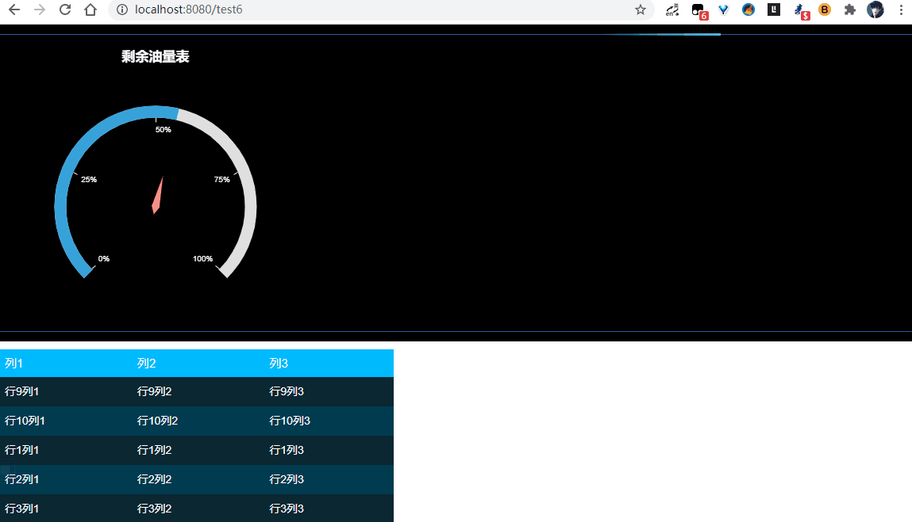

# DataV

[TOC]


## 1. 安装

```
npm install @jiaminghi/data-view
```


## 2. 使用

- 在main.js中引入

```
// 将自动注册所有组件为全局组件
import dataV from '@jiaminghi/data-view'

Vue.use(dataV)
```


## 3.例子

```vue
<!--
 * @Description: henggao_learning
 * @version: v1.0.0
 * @Author: henggao
 * @Date: 2020-11-28 21:01:32
 * @LastEditors: henggao
 * @LastEditTime: 2021-01-04 22:31:41
-->
<template>
  <div class="update-demo" style="background: black; height: 400px">
    <dv-border-box-8 style="top: 10px; height: 380px">
      <dv-charts :option="option" style="width: 400px; height: 400px" />
      <dv-scroll-board :config="config" style="width: 500px; height: 220px" />
    </dv-border-box-8>
  </div>
</template>

<script>
export default {
  name: "UpdateDemo",
  data() {
    return {
      config: {
        header: ["列1", "列2", "列3"],
        data: [
          ["行1列1", "行1列2", "行1列3"],
          ["行2列1", "行2列2", "行2列3"],
          ["行3列1", "行3列2", "行3列3"],
          ["行4列1", "行4列2", "行4列3"],
          ["行5列1", "行5列2", "行5列3"],
          ["行6列1", "行6列2", "行6列3"],
          ["行7列1", "行7列2", "行7列3"],
          ["行8列1", "行8列2", "行8列3"],
          ["行9列1", "行9列2", "行9列3"],
          ["行10列1", "行10列2", "行10列3"],
        ],
      },
      option: {
        title: {
          text: "剩余油量表",
          style: {
            fill: "#fff",
          },
        },
        series: [
          {
            type: "gauge",
            data: [{ name: "itemA", value: 55 }],
            center: ["50%", "55%"],
            axisLabel: {
              formatter: "{value}%",
              style: {
                fill: "#fff",
              },
            },
            axisTick: {
              style: {
                stroke: "#fff",
              },
            },
            animationCurve: "easeInOutBack",
          },
        ],
      },
    };
  },
  methods: {
    // 更新数据的示例方法
    updateHandler() {
      const { config } = this;

      /**
       * 只是这样做是无效
       * config指向的内存地址没有发生变化
       * 组件无法侦知数据变化
       */
      this.config.value = 90;
      this.config.lineDash = [10, 4];

      /**
       * 使用ES6拓展运算符生成新的props对象
       * 组件侦知数据变化 自动刷新状态
       */
      this.config = { ...this.config };
    },
  },
};
</script>

<style lang = 'scss' scoped>
</style>
```


## 4. 查看




