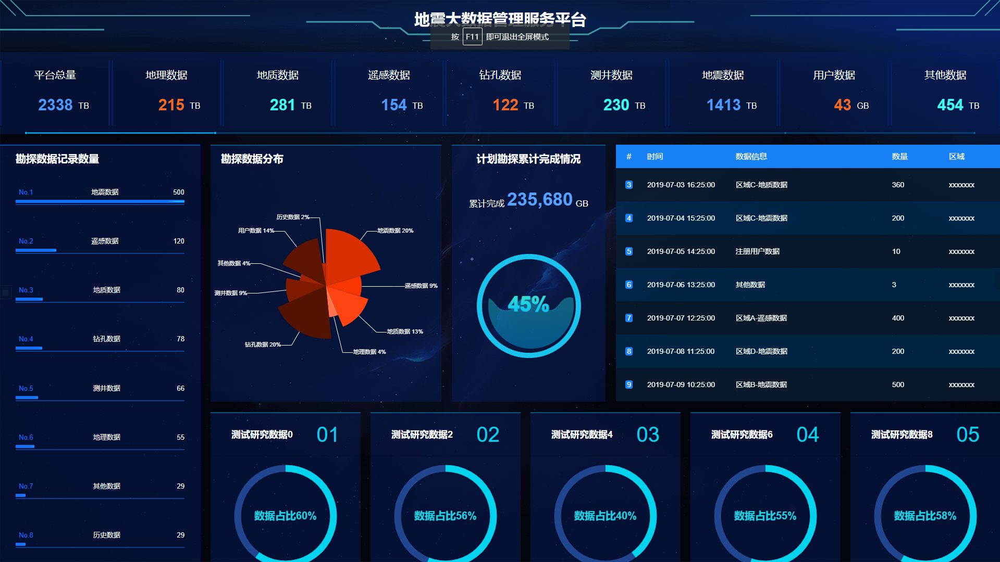

# 地震大数据管理系统

1、配置路由router/index.js

2、使用DataV完成监控界面数据

- 新建components/montoringplatform
  - img
  - cards.vue
  - digitalFlop.vue
  - rankingRoard.vue
  - ScrollBoard.vue
  - topHeader.vue
  - waterLevelChart.vue
  - index.vue

- 使用DataV完成监控界面数据

- [ref](https://github.com/DataV-Team/datav.jiaminghi.com)