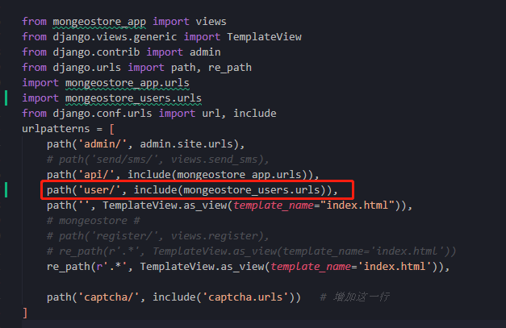

# Mongeostore_users

[TOC]

## 一、创建项目

### 1. 创建Mongeostore_users

对项目进行重建，将用户注册、登录信息放在一个app下。

```
#切换到虚拟目录
cd .\mongeostore_env\

#启动虚拟环境
.\Scripts\activate

#Django中创建项目
django-admin startproject mongeostore_v1

#创建app
python manage.py  startapp mongeostore_users
```

- 在settings.py中添加应用

  


### 2、设计

| 文件名         | 别名         | 作用                                                     |
| -------------- | ------------ | -------------------------------------------------------- |
| models.py      | 创建用户模型 | userInfo(models.Model)<br />userInfo(abstractuser)<br /> |
| serializers.py | 序列化       | 1.完成users模型序列化<br />2.完成注册、登录信息校验      |
| views.py       | 视图         | 模型视图                                                 |
| urlls.py       | 子路由       | 分发访问路径                                             |

- 在mogeostore_users目录下新建
  - serializers.py
  - urls.py


### 3、创建Models

- 在models.py中创建users

```python
# from django.db import models 
# #使用djongo
from djongo import models
# Create your models here.


class UserInfo(models.Model):
        # 使用Djongo的Model、由于官方文档还没有类似Django中的AbstractUser
    username = models.CharField(verbose_name='用户名', max_length=32, unique=True)
    email = models.EmailField(verbose_name='邮箱', max_length=32, unique=True)
    mobile = models.CharField(verbose_name='手机号', max_length=32, unique=True)
    password = models.CharField(verbose_name='密码', max_length=64)

    class Meta:
        verbose_name = "用户信息"
        verbose_name_plural = verbose_name

    def __str__(self):
        return self.username

```


这里就可以做数据迁移了

```
python manage.py makemigrations mongeostore_users
python manage.py migrate
```


### 4、序列化

- 新建serialzier.py(尽量别用serializers.py，防止和restframework中的serializers.py混淆)

```python
from rest_framework import serializers
from .models import UserInfo
## mongeostore序列化 ## 
class UserInfoSerializer(serializers.ModelSerializer):
    class Meta:
        model = UserInfo     #对应的Model中的类
        # fields = ("username", "mobile", "email",)
        fields = "__all__"  #字段，如果是__all__,就是表示列出所有的字段
```


### 5、视图

- 在views.py写视图，这个可以新建一个view目录，用于视图

  ```python
  from django.shortcuts import render
  
  # Create your views here.
  from rest_framework.views import APIView
  from rest_framework.response import Response
  
  class UserInfoView(APIView):
  
      def get(self,request,*args,**kwargs):
          return Response("...")
  
  ```

  


### 6、路由

- 新建mongeostore_usesr目录下新建urls.py,作为子路由。

- 在项目mongeostore_v1/urls下添加

  ```
  path('user/', include(mongeostore_users.urls)),
  ```

  

  

- mongeostore_users/urls.py

```python
from django.urls import path, re_path
from django.conf.urls import url, include
from .views import UserInfoView

urlpatterns = [
    # path('api/', include(mongeostore_app.urls)),
    path('user/', UserInfoView.as_view(), name='uesrinfo')
    # path('', TemplateView.as_view(template_name="index.html")),
    # re_path(r'.*', TemplateView.as_view(template_name='index.html')),
]

```

- 浏览器测试http://127.0.0.1:8000/user/user/

  

  

二、