# 个人博客系统

[TOC]

## 0.前言

- [官网步骤](https://vuepress.vuejs.org/zh/guide/getting-started.html)

- 目录结构

  ```
  //下面没有文件类型后缀的都是文件夹
  //部分内容并不是必须的，想自己定制的话可以参考官方文档。
  
  ├── docs
  │   ├── .vuepress  //存放核心内容的文件夹
  │   │   ├── components  //存放你需要添加的vue组件
  │   │   ├── public  //存放静态文件，如图片等
  │   │   ├── styles  //存放需要定制的样式
  │   │   │   └── palette.styl  //配置页面主题颜色的文件
  │   │   └── config.js   //设定顶部导航栏、侧边导航栏等项目配置的核心文件
  │   ├── pages   //存放markdown文件，用于设置其他页面内容
  │   ├── README.md   //首页展示用的markdown文件
  ├── deploy.sh     //之后用于编写上传、发布脚本的文件
  └── package.json  //之前创建的Node.js项目描述文件
  ```

  

## 1. 开始

1.1 创建并进入一个新目录

```
mkdir genghenggao_blog && cd genghenggao_blog
```


1.2 管理器进行初始化

```
npm init
```

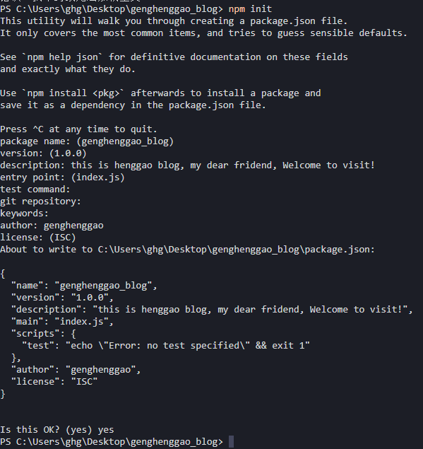

- 这是你的文件夹会创建一个package.json文件


1.3 将 VuePress 安装为本地依赖

- 官方已经不再推荐全局安装 VuePress

```
npm install -D vuepress
```

- 可能会有点小慢:joy:

- 看一下目录

  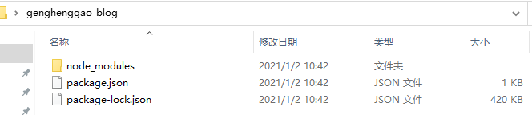

  

1.4 创建你的第一篇文档

- 创建文件夹docs
- 创建文件docs/README.md
- 在README.md输入内容：Hello VuePress


1.5 在 `package.json` 中添加一些 [scripts](https://classic.yarnpkg.com/zh-Hans/docs/package-json#toc-scripts)

```
 "scripts": {
    "docs:dev": "vuepress dev docs",
    "docs:build": "vuepress build docs"
  }
```


1.6 在本地启动服务器

```
npm run docs:dev
```

- 浏览器预览

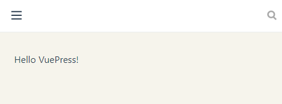


## 2. 基本配置

### 2.1 配置文件

- VuePress 网站必要的配置文件是 `.vuepress/config.js`，它应该导出一个 JavaScript 对象：

```
module.exports = {
  title: 'Hello VuePress',
  description: 'Just playing around'
}
```

- 运行起 dev server，你应该能看到一个页面，它包含一个页头，里面包含一个标题和一个搜索框。VuePress 内置了基于 headers 的搜索 —— 它会自动为所有页面的标题、`h2` 和 `h3` 构建起一个简单的搜索索引。

- 浏览器预览

  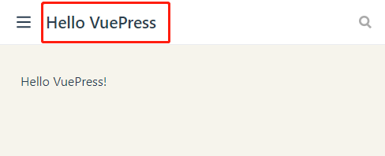


### 2.2 主题配置


### 2.3 应用级别的配置

- 创建一个 `.vuepress/enhanceApp.js` 文件来做一些应用级别的配置，当该文件存在的时候，会被导入到应用内部。

```js
// 使用异步函数也是可以的
export default ({
  Vue, // VuePress 正在使用的 Vue 构造函数
  options, // 附加到根实例的一些选项
  router, // 当前应用的路由实例
  siteData, // 站点元数据
  isServer // 当前应用配置是处于 服务端渲染 或 客户端
}) => {
  // ...做一些其他的应用级别的优化
}
```


## 3. 静态资源

### 3.1 相对路径


### 3.2 公共文件

- 新建docs/.vuepress/public文件夹


### 3.3 基础路径


## 4. 部署

-  使用GitHub pages

### 4.1 创建远程仓库

#### 4.1.1 在Github上新建仓库

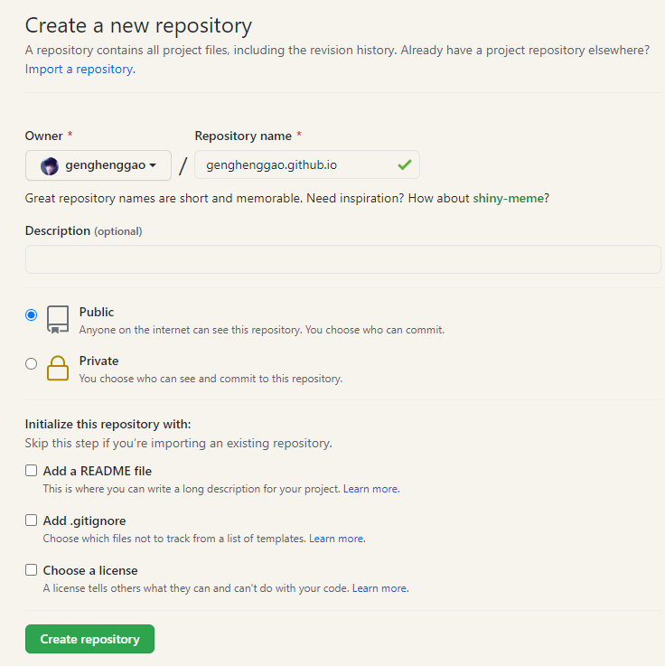

- 仓库名字必须为：你的用户名+.github.io，否则需要另外设置。


### 4.2 配置本地推送至远程仓库的权限

- 这部分我以前推送到GitHub上项目已经创建过，可以参考我的文章Git

  

### 4.3 使用脚本编写打包、上传命令

- docs同级目录下，创建一个 `deploy.sh` 文件

- 如果你打算发布到 `https://<USERNAME>.github.io/`，则可以省略这一步，因为 `base` 默认即是 `"/"`。

  如果你打算发布到 `https://<USERNAME>.github.io/<REPO>/`（也就是说你的仓库在 `https://github.com/<USERNAME>/<REPO>`），则将 `base` 设置为 `"/<REPO>/"`。

```sh
###
 # @Description: henggao_learning
 # @version: v1.0.0
 # @Author: henggao
 # @Date: 2021-01-02 11:16:45
 # @LastEditors: henggao
 # @LastEditTime: 2021-01-02 14:56:20
### 
#!/usr/bin/env sh

# 确保脚本抛出遇到的错误
set -e

# 生成静态文件
npm run docs:build

# 进入生成的文件夹
cd docs/.vuepress/dist

# 如果是发布到自定义域名
# echo 'www.example.com' > CNAME

git init
git add -A
git commit -m 'deploy'

# 如果发布到 https://<USERNAME>.github.io
# git push -f git@github.com:<USERNAME>/<USERNAME>.github.io.git master
git push -f git@github.com:genghenggao/genghenggao.github.io.git master

# 如果发布到 https://<USERNAME>.github.io/<REPO>
# git push -f git@github.com:<USERNAME>/<REPO>.git master:gh-pages

cd -
```


- 修改我们的`package.json`，在里面添加一条执行我们脚本文件的命令

```
"scripts": {
    ......
    "deploy": "start deploy.sh"
},
```

- 这里配置有两种

  ```
  "deploy": "start deploy.sh"
  ```

  ```
  "deploy": "bash deploy.sh"
  ```

- bash就是用来执行文件的命令，如果报错显示没有此命令请安装git-bash使用，或改成"start deploy.sh"（我这里用的是start）

- 之后我们每次执行的时候，只需要运行

  ```
  npm run deploy
  ```

  - 等待，这时会自动弹出Git窗口，让她安静的运行完即可（十几秒左右）
  - 就可完成打包、上传操作，github会为我们自动更新页面代理。一般推送成功后需要等待一两分钟，你再打开`https://你的用户名.github.io`，就可以看到你的文档/博客页面啦。在完成整个项目的结构调整后，只需编辑一丢丢地方，即可实现编辑文档+维护，是不是很方便呢！


### 4.4 开启GitHub Pages功能

- 进入新建库的settings界面

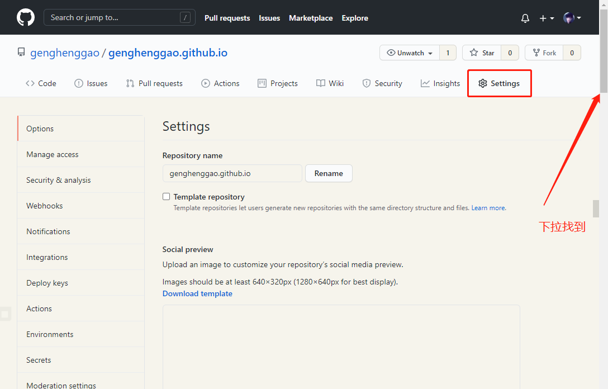

- 往下翻，开启 GitHub Pages 功能，得到一个「预览地址」，我的「预览地址」

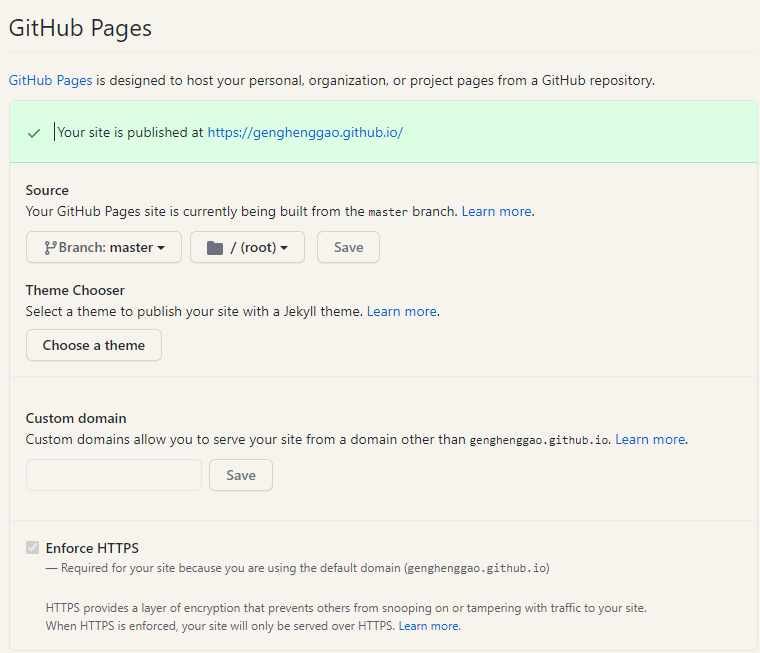


浏览器访问

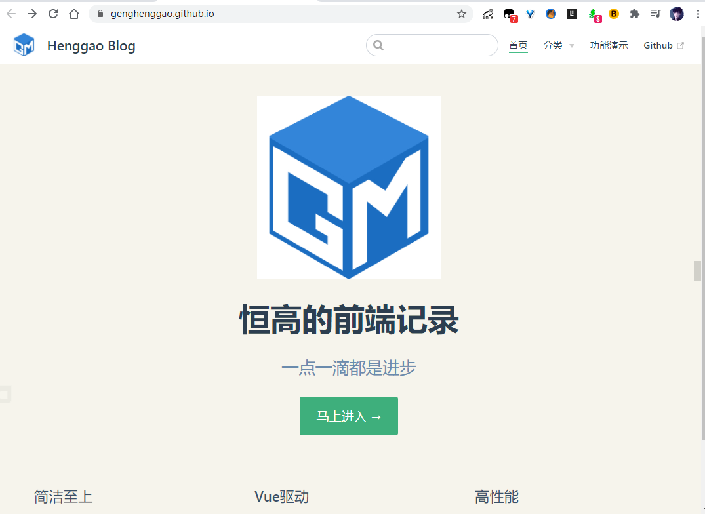


- [ref](https://juejin.cn/post/6844903999129436174)


## 5. 使用Github Actions

- `GitHub Actions`是自动化运维，持续集成服务

### 5.1 添加密钥（可以跳过）

- 在 workflow 文档流里我们可以用 `${{ secrets.GITHUB_TOKEN }}` 做权限认证，是一个默认存在的变量，并不需要我们去添加 `ACCESS_TOKEN` ，当然你也可以自己添加自己的 token 到项目的 secrets 里并使用。

- 将构建成果发到 GitHub 仓库，因此需要 GitHub 密钥。按照[官方文档](https://help.github.com/en/articles/creating-a-personal-access-token-for-the-command-line)，生成一个密钥。然后，将这个密钥储存到当前仓库的`Settings/Secrets`的Value里面。

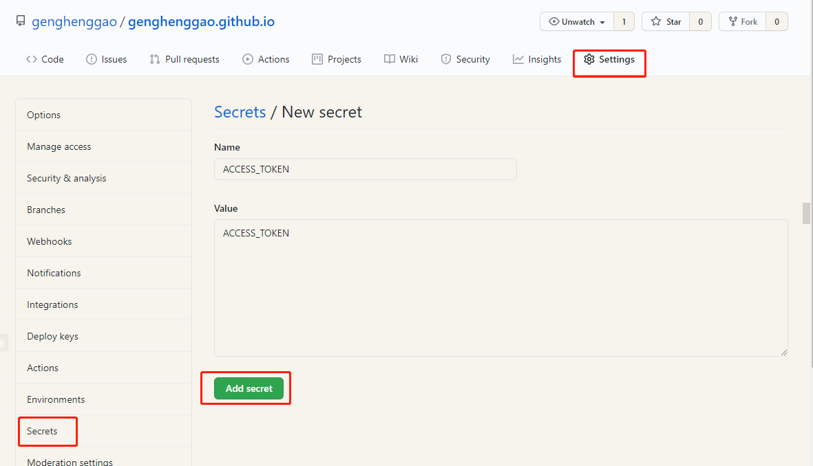

- 会生成一个密钥文件

```
77a8a843c5a576b9484a480bb66e105289cd2fb1
```


### 5.2 设置Actions

- 自己博客的仓库并上传了代码，在仓库的界面就可以看到这个Actions的入口

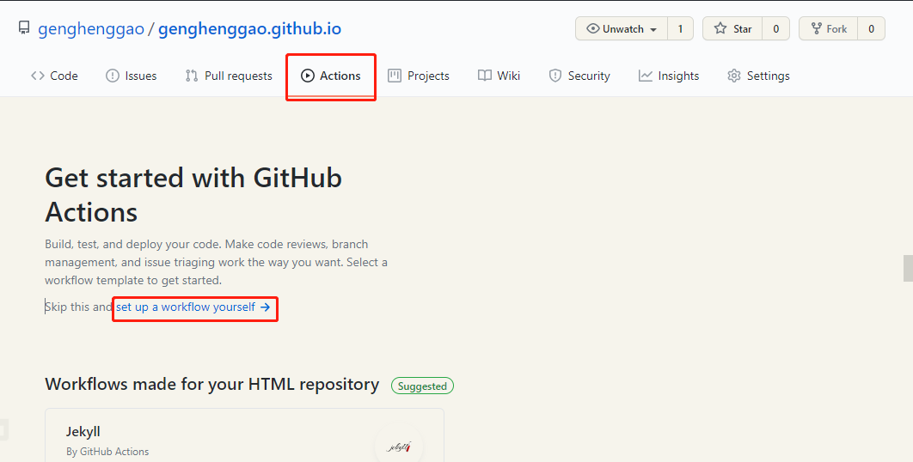

- 点击出现默认配置

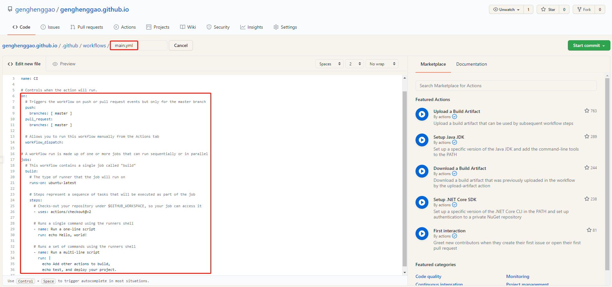

- 输入自己的配置

  - 需要使用别人的部署插件（下面两个用到的比较多，选一个即可）
    - https://github.com/peaceiris/actions-gh-pages/tree/main
    - https://github.com/marketplace/actions/deploy-to-github-pages
    - 我这里选用[peaceiris](https://github.com/peaceiris)/**[actions-gh-pages](https://github.com/peaceiris/actions-gh-pages)**
    - [ref](https://vuepress-theme-reco.recoluan.com/views/other/github-actions.html)

  ```yml
      steps:
        # Checks-out your repository under $GITHUB_WORKSPACE, so your job can access it
        - uses: actions/checkout@v2
  
        - name: Deploy
          uses: peaceiris/actions-gh-pages@v3
          with:
            github_token: ${{ secrets.GITHUB_TOKEN }}
            publish_dir: ./dist
  ```

  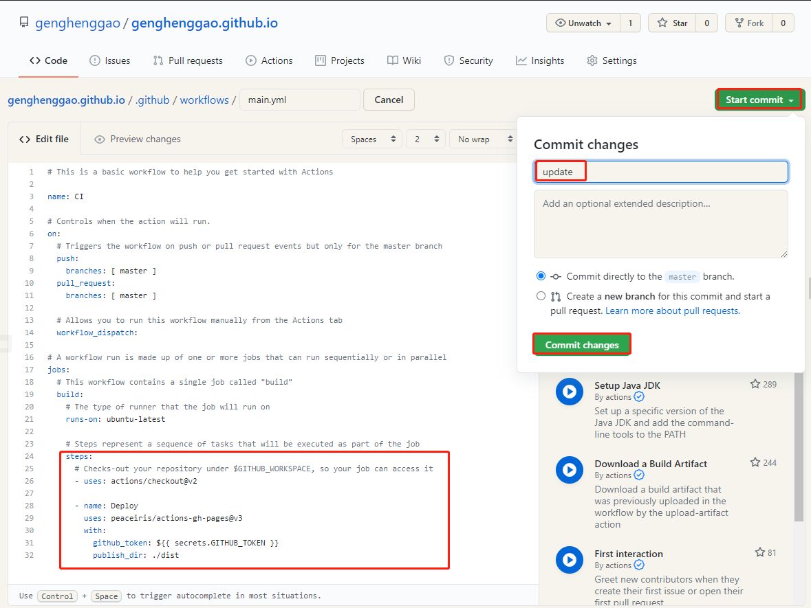

- 会生成一个main.yml文件

  

### 5.3 查看构建是否正常

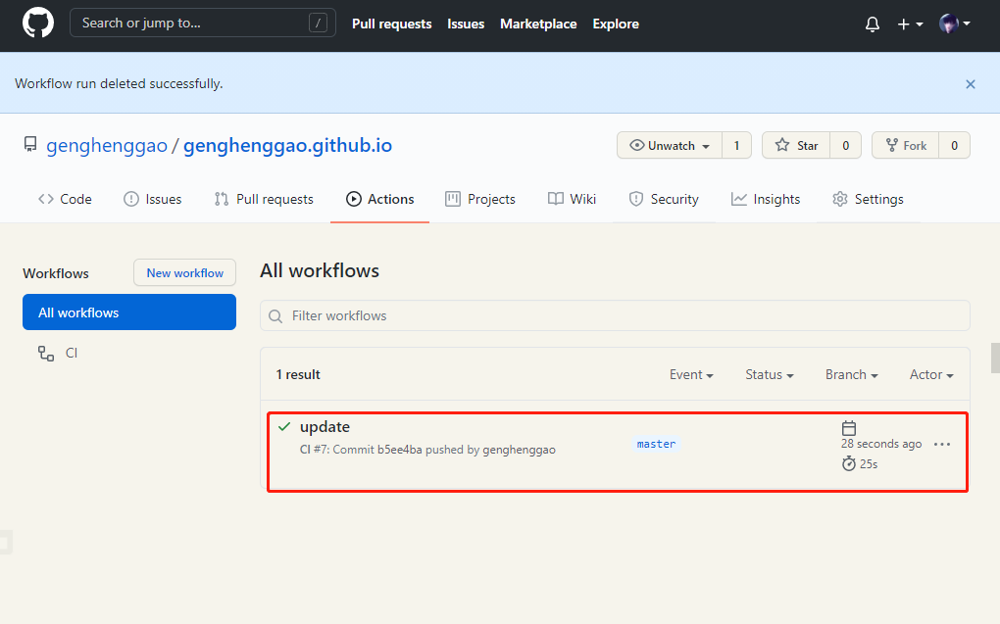


### 5.4 构建成功后 查看地址

- 找到settings -> github pages 切换 source 成 gh-pages branch 点击访问地址，如果出现404，那就稍等几分钟。 如果在不行，那就在本地改下文件，提交下，让github actions重新构建一下。

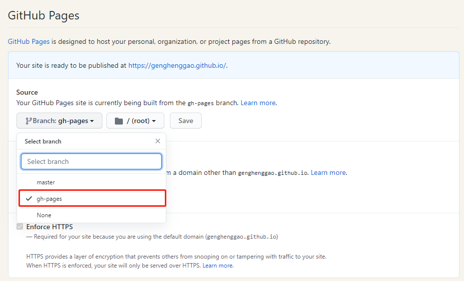


## 相关问题

### 1. 热更新问题

由于项目结构没有[热更新](https://www.webpackjs.com/guides/hot-module-replacement/)，所以每次调整config.js之后，都需要重新npm run dev一次。更新已存在的markdown文件的时候会实时热更新。

### 2. 修改主题颜色

- 新建.vuepress/style/palette.styl，添加内容

```
    // 默认值
    $accentColor = #3eaf7c        //主题颜色
    $textColor = #2c3e50
    $borderColor = #eaecef
    $codeBgColor = #282c34
    $badgeTipColor = #42b983
    $badgeWarningColor = darken(#ffe564, 35%)
    $badgeErrorColor = #DA5961

```

