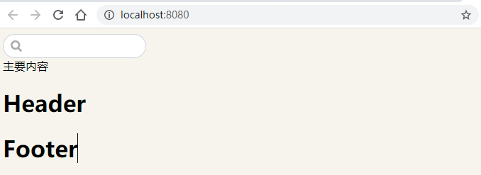

# 主题

[TOC]

## 0.前言

- [参考官网](https://vuepress.vuejs.org/zh/theme/)


## 1. 使用来自依赖的主题

```
module.exports = {
  theme: 'vuepress-theme-xx'
}
```


## 2. 开发主题

- 文档根目录创建一个 `.vuepress/theme` 目录，接着创建一个 `Layout.vue` 文件：

```
.
└─ .vuepress
 └─ theme
     └─ Layout.vue
```


## 3. 目录结构

### 3.1 新建文件

- 按照官方文档，新建相关文件即可
- 建好以下目录后（**注意先不要创建**`package.json` 和 `template` 文件夹），运行一下 `vuepress dev docs` 发现是空白的，说明我们的 `layout.vue` 已经生效了。运行完后创建`package.json` 和 `template` 文件夹，添加相关信息。（💥如果先创建运行会报错）

```
theme
├── global-components
│   └── xxx.vue
├── components
│   └── xxx.vue
├── layouts
│   ├── Layout.vue (必要的)
│   └── 404.vue
├── styles
│   ├── index.styl
│   └── palette.styl
├── templates
│   ├── dev.html
│   └── ssr.html
├── index.js
├── enhanceApp.js
└── package.json
```

- `theme/global-components`: 该目录下的组件都会被自动注册为全局组件。想了解更多，请参考 [@vuepress/plugin-register-components (opens new window)](https://github.com/vuejs/vuepress/tree/master/packages/@vuepress/plugin-register-components)。
- `theme/components`: Vue 组件。
- `theme/layouts`: 布局组件，其中 `Layout.vue` 是必需的。
- `theme/styles`: 全局的样式和调色板。
- `theme/templates`: 修改默认的模板文件。
- `theme/index.js`: 主题文件的入口文件。
- `theme/enhanceApp.js`: 主题水平的客户端增强文件。


### 3.2 添加信息

- 在 `theme/index.js` 中加入：

```
module.exports = {
   // ...
}
```

- 在theme/package.json中加入

  ```
  {
      "main": "layouts/Layout.vue"
  }
  ```

  

### 3.3 开发 layout.vue

- 按照自己想要的布局在 `layout.vue` 中开发了。需要用到的组件都写到 `theme/components` 下，在 `layout.vue` 中引入即可。

- 整体布局分成 `main`、`content`、`footer` 部分。

```
theme
├── components        // Vue 组件
│   ├── Header.vue 
│   └── Footer.vue
```

- Header.vue

```vue
<template>
  <h1>Header</h1>
</template>

<script>
export default {

}
</script>

<style lang='scss' scoped>

</style>
```

- Footer.vue

```vue
<template>
  <h1>Footer</h1>
</template>

<script>
export default {

}
</script>

<style lang='scss' scoped>

</style>
```


- 在 `layout.vue` 正常引入即可：

  ```vue
  <template>
    <div>
      <Header />
      <Content />
      <Footer />
    </div>
  </template>
  
  <script>
  import Header from "../components/Header"
  import Footer from "../components/Footer"
  
  export default {
    components: {
      Header,
      Footer
    }
  };
  </script>
  ```

- 写好后， 运行 `npm run docs:dev` 即可看见你的页面。接下来就像写一个正常的 `vue` 项目一样，开始写你自己的博客主题。


### 3.4 将第三方 UI 集成到主题中

- 以开发顶部导航栏为例，示范安装第三方库 `element-ui` 及使用。

- cd 到 theme 目录下，运行命令安装：`npm i element-ui -S`。

  ```
   cd .\docs\.vuepress\theme\
  ```

- 推荐按需引入，需要安装 `babel-plugin-component`，运行命令安装 :`npm install babel-plugin-component -D`。

- `theme` 目录下新建 `.babelrc` 并修改为：

  ```
  {
    "presets": [["es2015", { "modules": false }]],
    "plugins": [
      [
        "component",
        {
          "libraryName": "element-ui",
          "styleLibraryName": "theme-chalk"
        }
      ]
    ]
  }
  
  ```

  

- 如果你只希望引入部分组件，比如 `Menu` ，那么需要在 `enhanceApp.js` 中写入以下内容：

```js
import {
    Menu,
    Submenu,
    MenuItem,
    MenuItemGroup
  } from 'element-ui';
  import 'element-ui/lib/theme-chalk/index.css';
  export default ({
    Vue, // VuePress 正在使用的 Vue 构造函数
    options, // 附加到根实例的一些选项
    router, // 当前应用的路由实例
    siteData, // 站点元数据
    isServer // 当前应用配置是处于 服务端渲染 或 客户端
  }) => {
    Vue.use(Menu)
    Vue.use(Submenu)
    Vue.use(MenuItem)
    Vue.use(MenuItemGroup)
  }
  
```

- 以上步骤安装好之后，就可以在组件中使用，方法和普通的 `vue` 项目一样。


- 这一部分先放一下，以后慢慢再写😅


### 3.5 使用vuepress 官方插件

#### 3.4.1 安装

- 以开发顶部导航栏为例，示范安装插件 `search` 框及使用。插件的安装在 [官方文档](https://vuepress.vuejs.org/zh/plugin/official/plugin-search.html) 中已经说明的很清楚，这里示范一下。

  ```
   npm install -D @vuepress/plugin-search
  ```

#### 3.4.2 配置

- 在 `.vuepress/config.js` 中：

```
// .vuepress/config.js or themePath/index.js
module.exports = {
  plugins: [
    ['@vuepress/search', {
      searchMaxSuggestions: 10
    }]
  ]
}
```


#### 3.4.3使用

- `search` 插件将自动注入指向搜索组件的 `webpack` 别名 `@SearchBox`，可以直接在 `layout` 组件中使用它：

```vue
<template>
  <div>
    <div class="foo-layout">
      <header>
        <SearchBox />
      </header>
      <main>主要内容</main>
    </div>
    <Header />
    <Content />
    <Footer />
  </div>
</template>

<script>
import Header from "../components/Header";
import Footer from "../components/Footer";
import SearchBox from "@SearchBox";

export default {
  components: {
    Header,
    Footer,
    SearchBox,
  },
};
</script>

```


- 启动

  ```
  npm run docs:dev
  ```

- 预览

  

  


### 3.6 引入Markdown样式

#### 3.6.1 手动引入Markdown样式

- 自定义主题需要手动引入Markdown样式

- 在 `<Content>` 中显示的Markdown文件是没有任何样式的，这需要我们自己写一个Markdown样式，但是这样真的太费力气。我们不如去找一份自己喜欢的样式。于是在 `typora` 上找到一份主题 [`Maize`](http://theme.typora.io/theme/Maize/)，添加到 `style` 文件夹下并引入后效果对比：

  

  


#### 3.6.2页面路由跳转


## 发布主题到npm

发布主题到`npm`:

- 将你的主题推送到 `github` 仓库，这里的主题是指 `.vuepress` 文件夹下所有内容需要推送到 `github`。
- 在 npm 上注册 `https://www.npmjs.com/`，填入信息并验证邮箱。
- 进入要发布的项目根目录 `.vuepress`，初始化为 `npm` 包：

- 进入要发布的项目根目录 `.vuepress`，初始化为 `npm` 包：

```
npm init
复制代码
```

- 依次按提示填入包名、版本、描述、`github` 地址、关键字、license等，你的主题命名可以是 `vuepress-theme-` 开头的，这样别人引用时可以简写成 `vuepress-theme-` 后面的字段。
- 在本地登录你的 `npm` 账号，并输入账号信息：

```
npm login
复制代码
```

- 将你的包发布，成功的话就可以在npm上搜索到你发布的包了~

```
npm publish
复制代码
```

- 这样就可以搜索到我的主题 `vuepress-theme-mount` ：


### 使用自定义主题

- 以 `vuepress-theme-mount` 为例

- 在本地新建文件夹 `vuepress-starter`，包含以下目录结构：


- 在目录下安装包：

```
npm init
npm i vuepress-theme-mount
复制代码
```

- 在config.js中输入：

```
// .vuepress/config.js
module.exports = {
  theme: 'mount'  // or 'vuepress-theme-mount'
}
复制代码
```

- 在 package.json 中加入，并使用命令 `vuepress dev docs` 运行项目，即可打开你的博客。

```
{
  "scripts": {
    "docs:dev": "vuepress dev docs",
    "docs:build": "vuepress build docs"
  }
}
```

- [ref](https://juejin.cn/post/6869565504756023310)