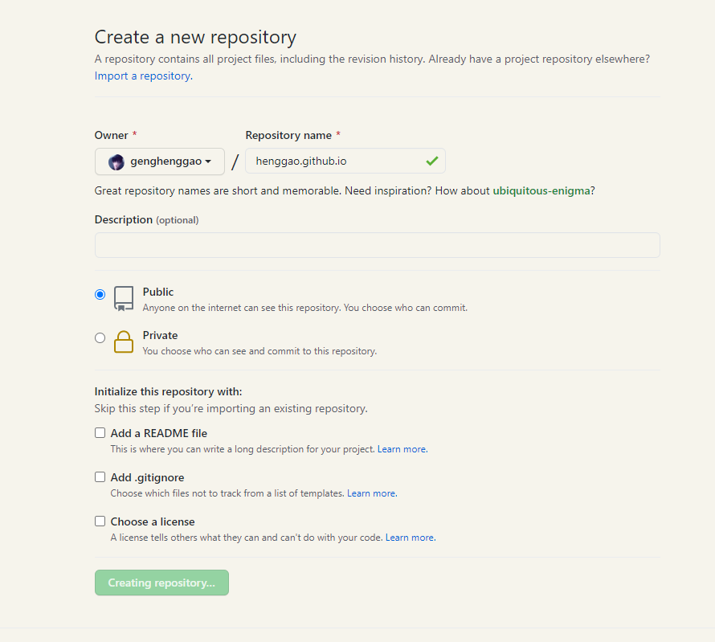
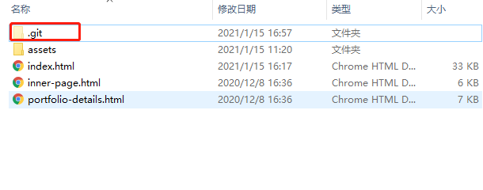
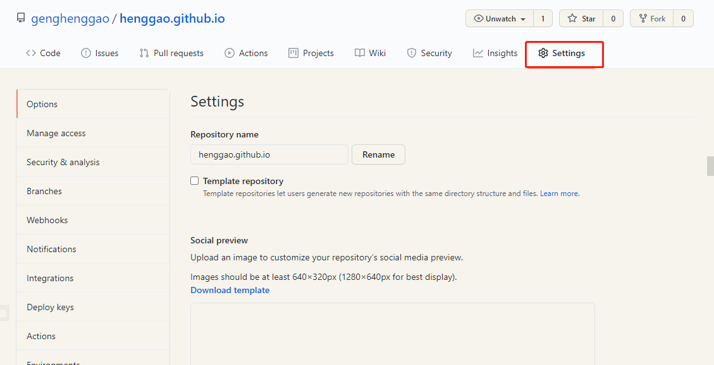
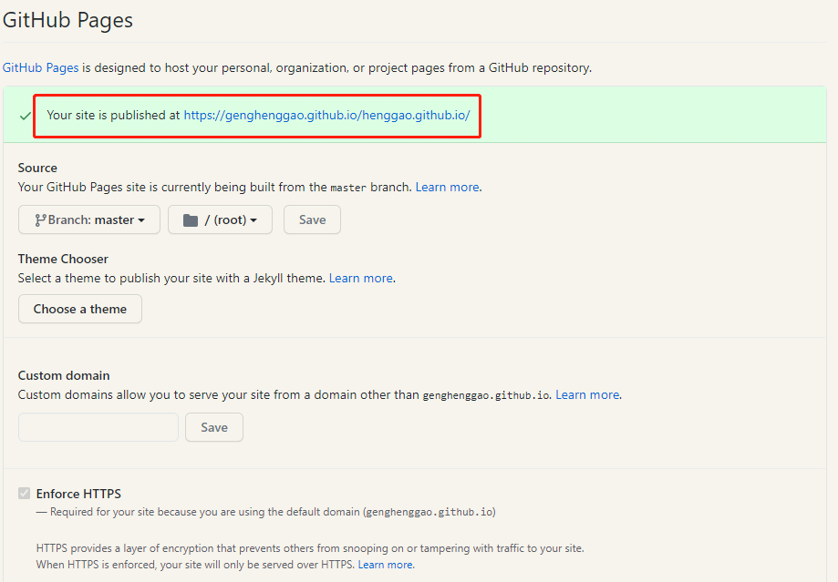

# 个人

[TOC]


## GitHub

-  使用GitHub pages

### 1.创建远程仓库

#### 1.1 在Github上新建仓库



- 仓库名字必须为：你的用户名+.github.io，否则需要另外设置。


#### 1.2 配置本地推送至远程仓库的权限

- 这部分我以前推送到GitHub上项目已经创建过，可以参考我的文章Git


#### 1.3 提交

- 切换到提交目录

```
git init
git add -A
git commit -m 'deploy'

# 如果发布到 https://<USERNAME>.github.io
# git push -f git@github.com:<USERNAME>/<USERNAME>.github.io.git master
git push -f git@github.com:genghenggao/henggao.github.io.git master
```

- 生成以下目录

  

### 2. 开启GitHub Pages功能

- 进入新建库的settings界面



- 往下翻，开启 GitHub Pages 功能，得到一个「预览地址」，我的「预览地址」


- 选择master，点击Save

  

- 访问上述网址即可

- 浏览器访问

- https://genghenggao.github.io/henggao.github.io/

  ```
  https://genghenggao.github.io/henggao.github.io/
  ```
  
  
  
  

- 愉快地编辑你的简历吧🍗

- 编辑完记得提交哦~
- 有时间再去买个域名吧，很便宜的呦~

- [图标](https://github.com/atisawd/boxicons/tree/master/svg/logos)
- https://boxicons.com/


- 嵌入google地图
  - https://blog.csdn.net/duzixi/article/details/74356791