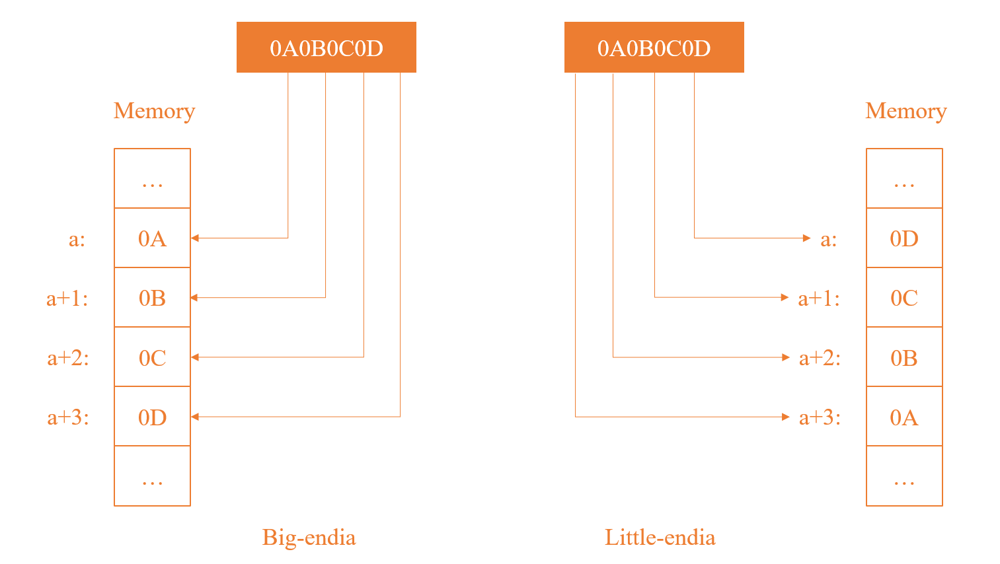
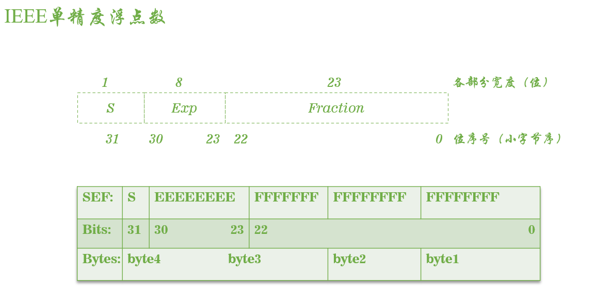
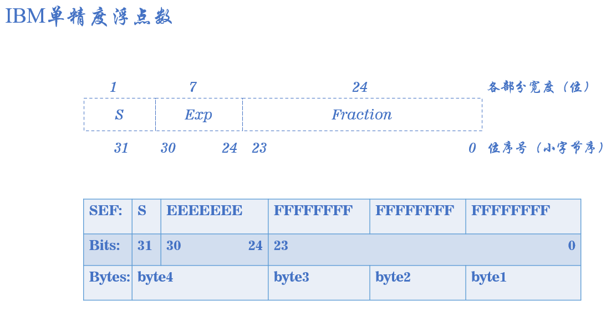

# IEEE和IBM字节

[TOC]

## 1.字节数

- 32位浮点数存储在四个字节中，首先要确定字节序。

- 字节序是指多字节数据在计算机内存中存储或者网络传输中个字节的存放顺序。

- 常见的字节序有：大字节序 和 小字节序。
  - 大字节序：数据的高位字节存放在内存的低地址字节中。

  - 小字节序：数据的低位字节存放在内存的低地址字节中。（我们常用的intel系列是小字节序）。

  - 将`0x0A0B0C0D` 写入到内存中，大小字节序的区别如下图：

     

- IBM和IEEE是二进制码存储浮点数的两种不同格式：

- IBM 和 IEEE 浮点数的结构如下：S 代表符号、E 代表指数部分、F 代表小数部分。

- 浮点数的表示如下：

$$
V=(-1)^S*M*A^{E-B}
$$

$$
M=C+F
$$

- 32位IEEE浮点数：A=2，B=127，C=1

- 32位IBM浮点数：A=16，B=64，C=0

- 参考：
  - [C# 32位浮点数转化（一：IBM 转 IEEE）](https://blog.csdn.net/shuaishifu/article/details/46623339)
  - [C# 32位浮点数转化（二：IEEE 转 IBM）](https://blog.csdn.net/shuaishifu/article/details/46826841)
  - https://www.jianshu.com/p/85df834ba3bd