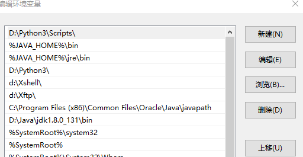

# 问题总结

[TOC]

## pip升级不成功如何重新安装

### 问题

在使用pip 安装第三库时，提示版本太低了，需要升级，然后按照提示进行了升级，没想到升级不成功，反而原有的也被卸载了

### 解决办法一：

1、windows打开命令提示符，输入 `python -m ensurepip`

```
python -m ensurepip
```

2、设置环境变量，python安装目录下的Scripts,这个我早就设置好了，就不需要更改了。



3、Python成功，但是pip失败，使用pip更新命令

```
python -m pip install --upgrade pip
```


### 解决方法二

- 运行如下两行代码即可

```
curl https://bootstrap.pypa.io/get-pip.py -o get-pip.py
python get-pip.py
```

