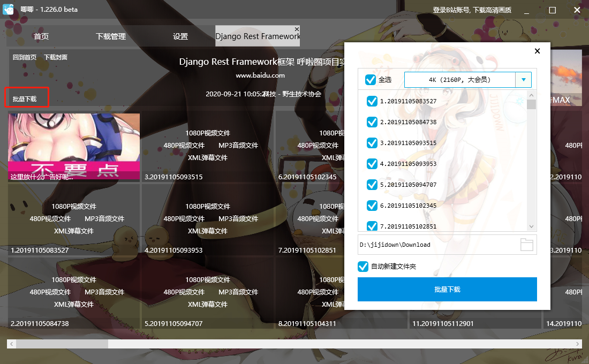
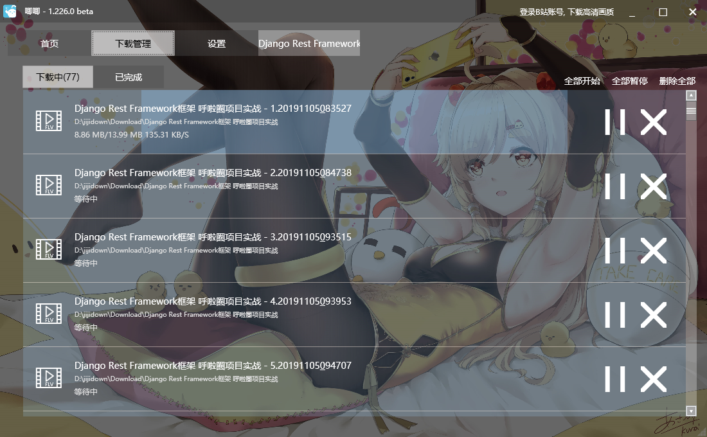

# 批量下载B站学习视频

[TOC]

## 1、使用You-get

- 先说一下缺点
  - 就是速度慢，我测试的是100K左右。
- 再夸一下优点
  - 可以下载的站点很多

### 一、安装依赖

- `Python3`

- `FFmpeg`

  ```
  pip install ffmpeg
  ```

  - ffmpeg为必要依赖，以下载流式视频以及合并分块视频（例如b站会把一个视频分割成很多个小片段，idm每次就只能捕捉到一个小片段），以及YouTube的1080p或更高分辨率.


### 二、安装you-get

执行完上面的操作之后便可以开始安装you-get

- 更新一下pip，不然可能会出现`Fatal error in launcher: Unable to create process using`的错误

  ```
  
  ```

- 安装you-get

  ```
  pip install you-get
  ```

  

### 三、开始下载

新版本的you-get中支持了批量下载，命令如下：

```python
you-get --playlist 网址（此处网址为不带p=x的）
```

默认下载是最清晰的版本。如果您想下载前查看一下下载的内容啊格式啊可用清晰度啊可以利用-i命令，即：

```python
you-get -i 网址
```

之后按照上面的提示输入对应的命令下载对应的版本即可
建议下载的时候添加-o指定一下下载路径，不然会默认下载到user文件夹中，，于是命令变成了：

```python
you-get -o D:\Download\视频\名字 --playlist 网址
```

ctrl+c可以暂停下载，再次提交相同下载请求的时候会默认继续下载。如果要强制重新下载添加-f即可

**PS：有些情况直接使用-l命令会出现下载的文件全部为第一p文件的情况。这时候用循环可以解决问题：**

```c
for /L %i in (1 1 XXXX1XXXX) do @(you-get -o XXXXX2XXXXX https://www.bilibili.com/video/XXXXX3XXXXX?p=%i)
```

其中XXX1XXX是一共要下载到多少p，2是下载地址，3是av号。注意av号后紧跟?p

### 四、不下载直接传进播放器

you-get也可以实现直接将视频传进播放器
你需要把你的播放器的执行文件目录放到path中，随后调用如下命令：

```python
you-get -p 你的播放器名字 地址
-------------例如
you-get -p PotPlayerMini 地址
123
```

随后你的播放器便会打开播放。但是实测有些网站不可，例如b站…

更多的使用方法可以参考官方文本：

[you-get说明](https://github.com/soimort/you-get/wiki/中文说明#getting-started)


参考：

https://blog.csdn.net/u010378992/article/details/105180742?utm_medium=distribute.pc_relevant.none-task-blog-title-1&spm=1001.2101.3001.4242

https://blog.csdn.net/Athus_c/article/details/104448892

https://github.com/soimort/you-get/wiki/%E4%B8%AD%E6%96%87%E8%AF%B4%E6%98%8E

https://www.jianshu.com/p/e323cf85bd3d


## 2、使用唧唧Down（B站下载强烈推荐）

针对B站的下载器。这款软件只有几MB，不需要注册登录，下载下来就能用，速度相当快。

客户端下载：http://client.jijidown.com/


- 第一步，打开软件浏览器复制视频 URL：


- 第二步，回到软件中会自动粘贴 URL，回车点击「批量下载」再选择想要的清晰度就可以批量下载了。



点击下载




下载完成使用 `Potplayer` 打开就可以心无旁骛地学习了，是不是还不错？

