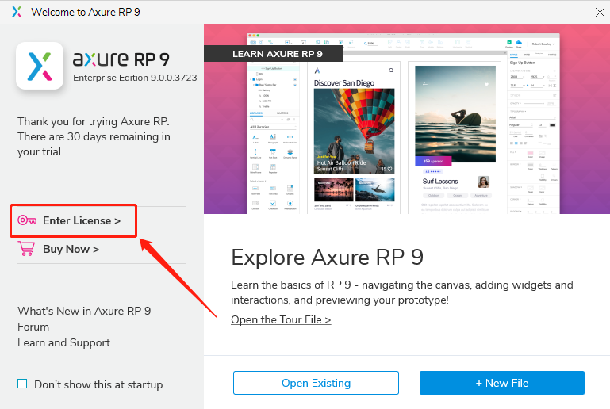
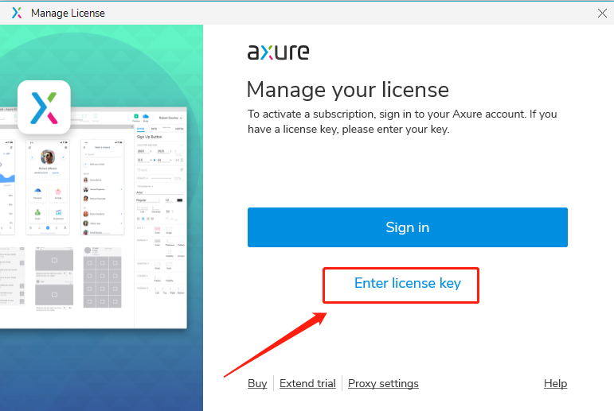
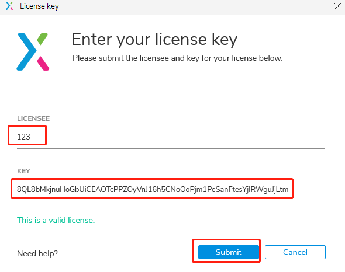
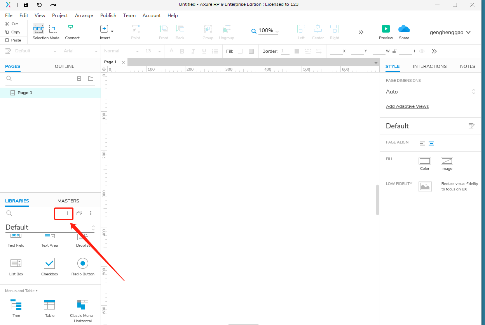
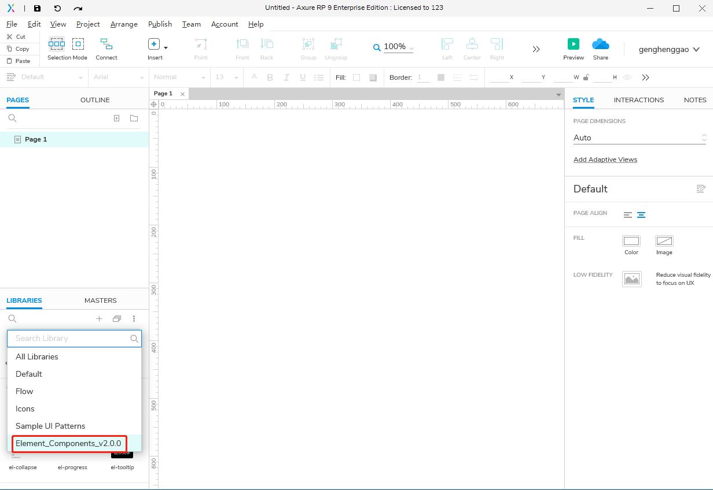

# Axure RP 9 最新版授权与汉化

[TOC]

## 1.  前言

- 最近下载ElementUI资源中Axure Components，需要使用Axure 
- Axure 生成的只是原型，是在产品制定时供大家参考了解项目用的。
- 开发要用的是HTML+CSS+JS代码。

## 2. 下载Axure

- Axure官网下载：https://www.axure.com/

### 2.1 安装

- windows很简单

### 2.2 注册

- 打开Axure，点击enter license按钮：

  

- 接着点击

  

- 网上百度一个授权码，填入验证

  

## 3. Element Axure使用

### 3.1 下载

- ElementUI官网下载：https://element.eleme.cn/#/zh-CN/resource

### 3.2 使用

- 打开Axure，找到添加位置

- 完成效果

  

## 4、Axure汉化

- 我使用英文的，顺便学习一下英语也不错😀

- 汉化参考：https://blog.csdn.net/qq_39720249/article/details/84869984