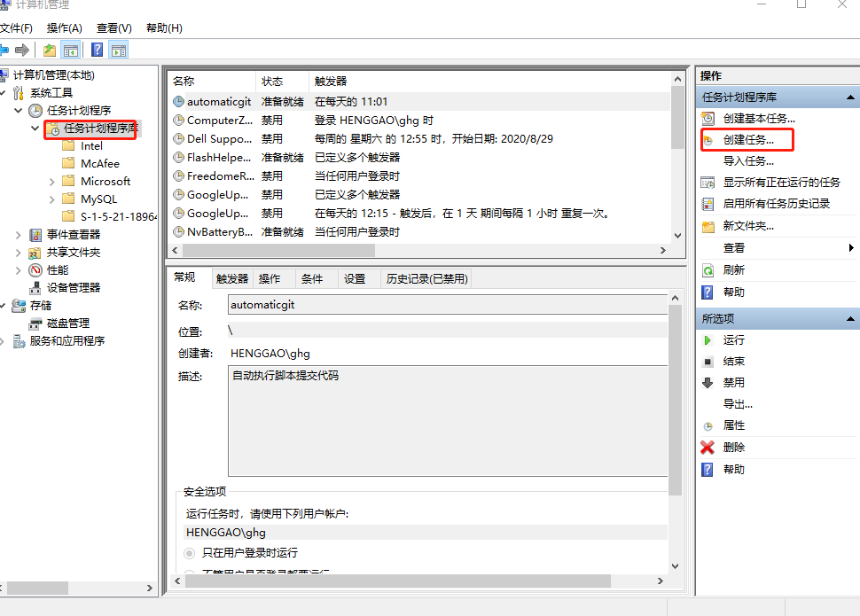

# Bat脚本定时上传Git

[TOC]


## 1.首先在工作目录下面新建bat脚本

```bash
@echo off
@title bat push git server
C:
cd C:\Users\ghg\Desktop\autosave
git add .
git commit -m "henggao"
git push origin master
```


## 2.打开任务计划程序

- 方法一：Windows键+R 调出此窗口，输入`compmgmt.msc` （调用的是计算机管理）



- 方法二：控制面板——>系统和安全——>管理工具——>任务计划程序

创建基本任务和创建任务都可以，下面以创建任务为例


## 3.创建任务


## 4.切换到触发器

- 新建——>选择按预定计划 每天 选择时间——>确定


## 5.切换到操作

新建——>启动程序——>设置bat文件——>确定


**注意的就是下面的起始于要填写你的工作目录，这样执行命令的时候就是在工作目录执行命令，不然git会报找不到.git。**


参考：

https://blog.csdn.net/u013788943/article/details/81629645

https://blog.csdn.net/alwaysl7/article/details/74561203

https://www.jianshu.com/p/397e62ef21fb

https://www.mairoot.com/?p=1480