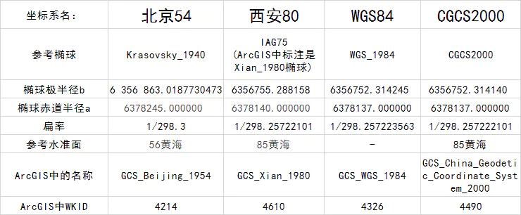

# 坐标系

[TOC]

## 一、基本概念

- 地理坐标系：为球面坐标。 参考平面地是椭球面，坐标单位：经纬度；`WGS84`

- 投影坐标系：为平面坐标。参考平面地是水平面，坐标单位：米、千米等；

- 地理坐标转换到投影坐标的过程可理解为投影。（投影：将不规则的地球曲面转换为平面）

## 二、地理坐标系（大地坐标系）

- 地心基准面：由卫星数据得到，使用地球的质心作为原点，使用最广泛的是 `WGS1984`。
- 区域基准面：特定区域内与地球表面吻合，大地原点是参考椭球与大地水准面相切的点，例如`Beijing54`、`Xian80`。

- 大地坐标系可分为参心大地坐标系和地心大地坐标系
  - 参心大地坐标系：指经过定位与定向后，地球椭球的中心不与地球质心重合而是接近地球质心。区域性大地坐标系。是我国基本测图和常规大地测量的基础。如`Beijing54`、`Xian80`。
  - 地心大地坐标系：指经过定位与定向后，地球椭球的中心与地球质心重合。如`CGCS2000`、`WGS84`。**2000国家大地坐标系**平面坐标投影仍采用高斯-克吕格投影。海图仍采用横轴墨卡托投影（`UTM`）。

## 三、曲面变平面——投影的作用

- 为什么要进行投影？

  - 地理坐标为球面坐标，不方便进行距离、方位、面积等参数的量算。

  - 地球椭球体为不可展曲面。

  - 地图为平面，符合视觉心理，并易于进行距离、方位、面积等量算和各种空间分析。

  - 地球椭球表面是一种不可能展开的曲面，要把这样一个曲面表现到平面上，就会发生裂隙或褶皱。在投影面上，可运用经纬线的“拉伸”或“压缩”（通过数学手段）来加以避免，以便形成一幅完整的地图。但不可避免会产生变形。

- 地图投影的变形通常有：长度变形、面积变形和角度变形。在实际应用中，根据使用地图的目的，限定某种变形。

- 按变形性质分类：

  - 等角投影：角度变形为零（Mercator）

  - 等积投影：面积变形为零（Albers）

  - 任意投影：长度、角度和面积都存在变形

  - 其中，各种变形相互联系相互影响：等积与等角互斥，等积投影角度变形大，等角投影面积变形大。

- 从投影面类型划分：

  - 横圆柱投影：投影面为横圆柱

  - 圆锥投影：投影面为圆锥

  - 方位投影：投影面为平面

- 从投影面与地球位置关系划分为：

  - 正轴投影：投影面中心轴与地轴相互重合

  - 斜轴投影：投影面中心轴与地轴斜向相交

  - 横轴投影：投影面中心轴与地轴相互垂直

  - 相切投影：投影面与椭球体相切

  - 相割投影：投影面与椭球体相割

https://www.jianshu.com/p/ae7c426bbd9d)